### 一、卷积神经网络组成

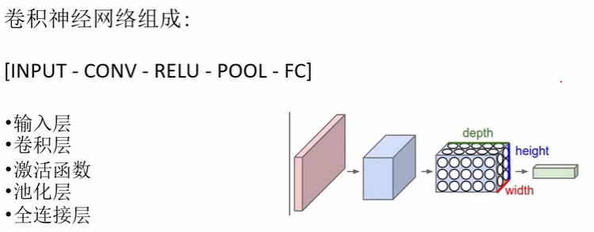

#### 1、卷积层

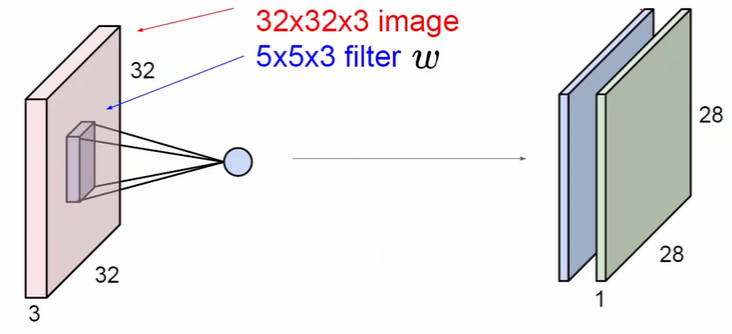
```
·图片上的 3：输入的深度，一般操作的都是三维的

filter的深度一定和它连接输入的深度十保持一致的。
不同filter提取不同特征图，多设置几个filter得到不同的特征图，压缩到一起而完成卷积
```
>**卷积计算流程**

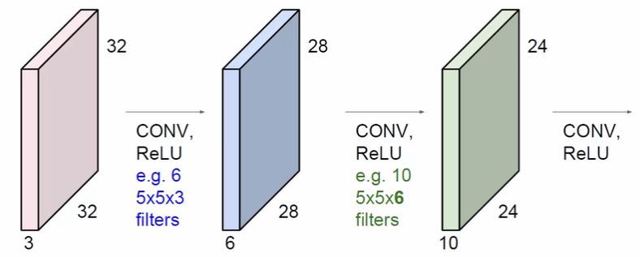
```
卷积操作不止可以在图像输入上，还可以在卷积的结果上操作
输入由 6 个 filters 计算出第一个特征图
再由 10 个 filters 计算出第二个特征图
```

```
在原始的输入上进行提取，得到
第一层特征 -> 中间层特征 -> 高层次特征
```
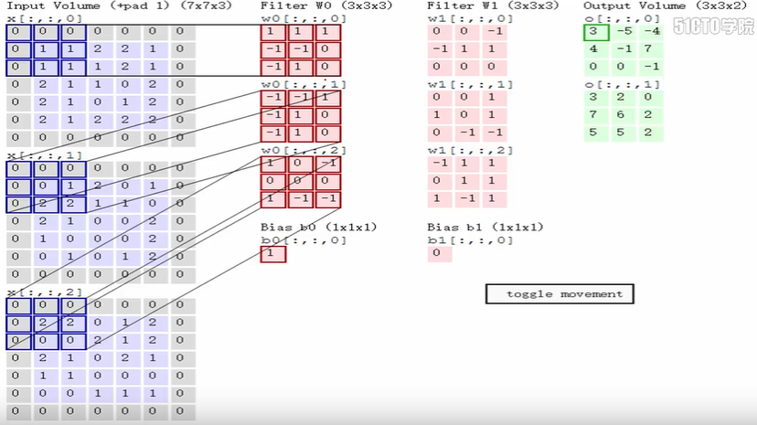
```
自己定义 filters 的大小，对应着输入项，求内积。
原始输入有几层深度，filters 就要算几层深度。
算出的特征值放到 Output Volume 的第一个绿色方框内
```
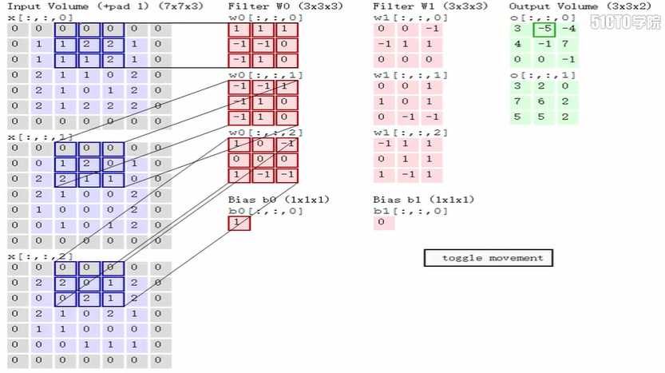
```
一直对应着输入项进行内积求和
每次求和 = Wx + b	放入右边绿色方块内
两个绿色 3x3 矩阵，表示是由两个 filters 进行相乘。
```
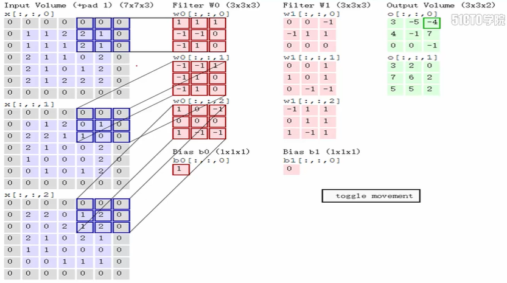

>**卷积核参数分析**

```
stride 步长
需要考虑到时间效率的问题，步长不能定义太大或者太小
比如：
·仅根据当前图中所示
	stride = 1	效率会变低，更具有丰富度
	stride = 2	效率会增高，丰富度较低
	stride = 3	7x7 会有像素点被浪费掉
```
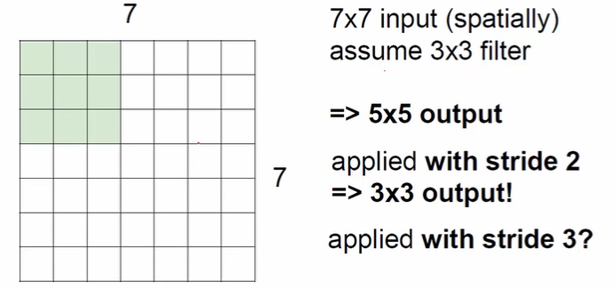

```
pad项
原因：由于在做卷积操作时，边缘上的像素点至多被计算利用了一次，而内部上的点则会被利用多次，为了使得边缘上的点也被多次利用，即需要加上 pad，就是在输入外围加一圈 0，
pad = 1		加一圈 0
pad = 2		加两圈 0
...

为什么非得加 0 呢：加上的 0 不是咱的原始输入，为的是将一些边缘点信息利用上。因为在卷积操作时，0 乘以任何数都是 0，网络（模型）是学不到的。不让网络（模型）去学习这些pad边缘上咱自己添上的东西，本身也没有太大的意义。
```
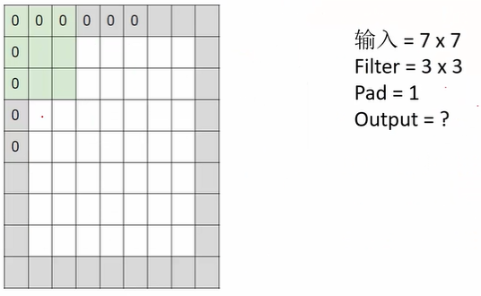
```
output的值怎么计算？
输入 = 7 x 7	即（h * w）
计算 output 的（h * w）
公式：
	hi，wi：输入
	ho，wo：输入
	filters：filter size =  3（自定义）
	pad：一圈 0
	stride：步长
```
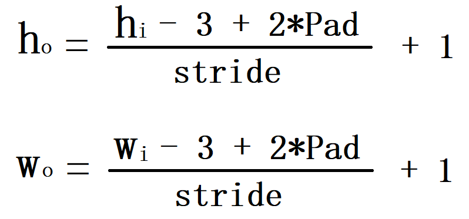
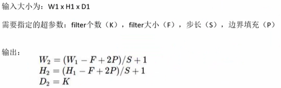

>**特征**
>权重共享

#### 2、池化层

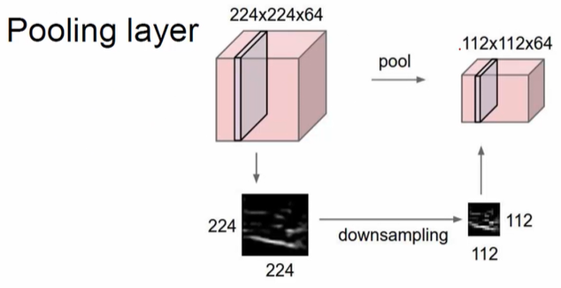
```
Pooling layer一般不是对原始输入的图像操作的，而是对特征图操作
两种方式：
	·MAX POOLING
	·MEAN POOLING
```
>**MAX POOLING**

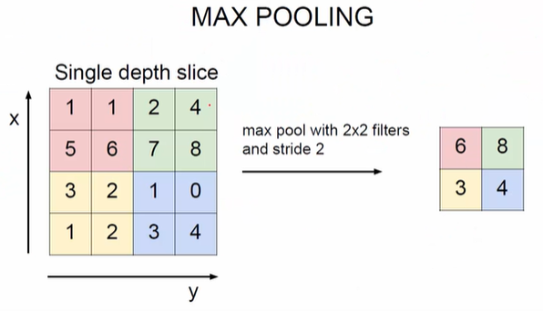
```
filter size: 2
stride: 2
取最大值
```
>**MEAN POOLING**

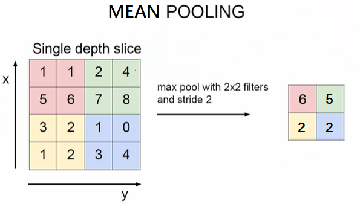
```
取均值
```
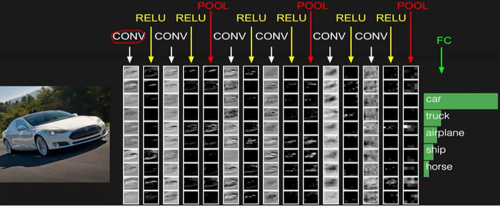

#### 3、反向传播原理

>**前项传播简述**

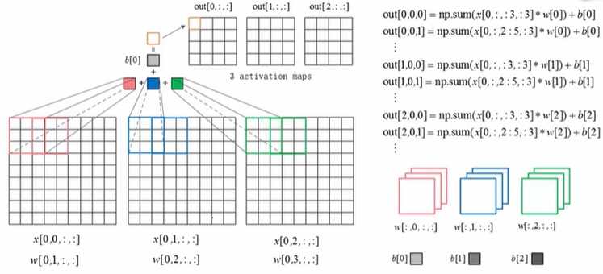
```
·输入项的表示：
x [n, c, h, w]
	n：输入样本的编号（每次是以一个batch输入的，这是这个batch的第一张图像，编号为 0）
	c：表示 channel，彩色图像有 3 个 channel（RGB），灰度图只有一个 channel
	h：输入样本的高
	w：输入样本的宽
----------------------------------------------
·filter表示：
w [f, c, h, w]
	f：定义 filter 的数量
	c：channel
	h：filter 的高
	w：filter 的宽
	自定义 filter size，channel的深度要和前一项（比如原始输入项）保持一致
----------------------------------------------
Wx+b，求内积
```
>**反向传播**

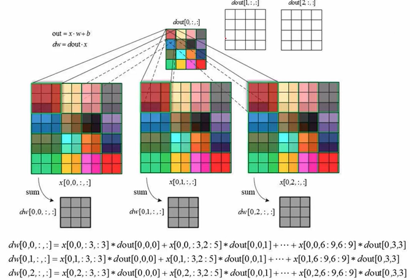
```
根据链式法则
	dw = 等于上一层传过来的梯度 * 自身的梯度
	dw = dout * x
比如：
	前向传播：A * B = C
	反向传播：A = B * C
----------------------------------------------
dw[0,0,:,:]=x[0,0,:3,:3] * dout[0,0,0] + x[0,0,:3,2:5] * dout[0,0,1] + x[0,0,6:9,6:9] * dout[0,3,3]
解释：
x[0,0,:3,:3]：
	第一个 0：输入图像的index，即很多张图像的第一张，索引为 0
	第二个 0：代表零号通道，即 RGB 通道
	(:3,:3)：取的是横竖从 0 到 3 的小区域。
dout[0,0,0]：
	第一个小区域
```
>**池化层 前向&反向传播**

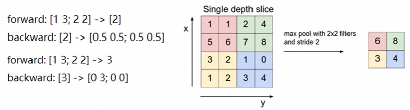
```
池化操作：
·MAX POOLING
	前向传播：求最大值
	反向传播：只在最大值的那个地方有值（原值），其他都为 0
·MEAN POOLING
	前向传播：求均值
	反向传播：把传的值均分到前一层
```
