欢迎使用 **{小书匠}(xiaoshujiang)编辑器**，您可以通过 `小书匠主按钮>模板` 里的模板管理来改变新建文章的内容。

## 一、深度学习与人工智能简介


## 二、
#### 1、图像在计算机中长什么样呢


## 三、K - 近邻
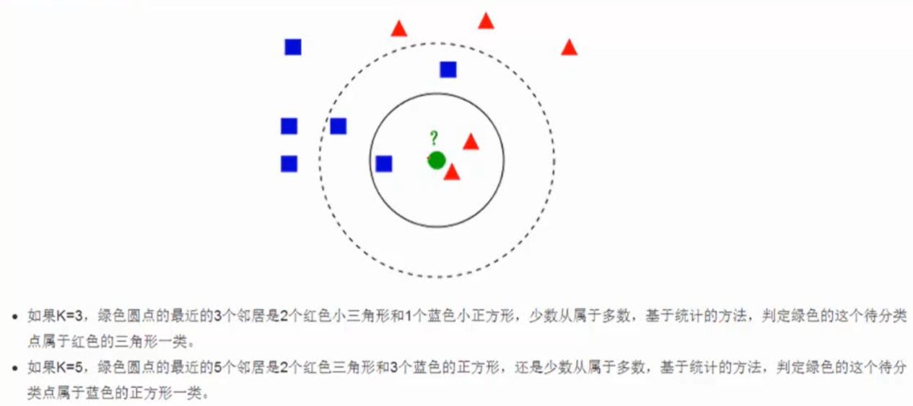

----------
>**概述**
~~~
	KNN 算法本身简单有效，它是一种 lazy-learning 算法,分类器不需要使用训练集进行训练，训练时间复杂度为 0。KNN 分类的计算复杂度和训练集中的文档数目成正比，也就是说，如果训练集中文档总数为 n,那么 KNN 的分类时间复杂度为 O(n)。
~~~
>__对于未知类别属性数据集中的点__
```
	1.计算已知类别数据集中的点与当前点的距离
	2.按照距离一次排序
	3.选取与当前点距离最小的K个点
	4.确定前K个点所在类别的出现概率
	5.返回前K个点出现频率最高的类别作为当前点预测分类
```
## 四、超参数和交叉验证
>**超参数 - distance**
~~~

~~~
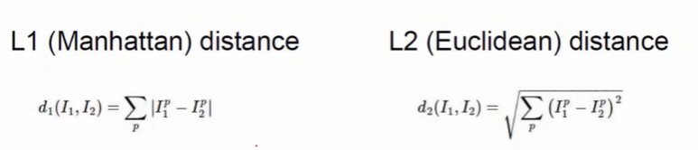

>**交叉验证**
```
测试集非常宝贵，只能在最会的时候用它，当模型确定下来之后再去用测试集，而不是用测试集来调节参数。
先把原始数据切分成`训练集`和`测试集`，在训练集中找一份当成验证集。
```
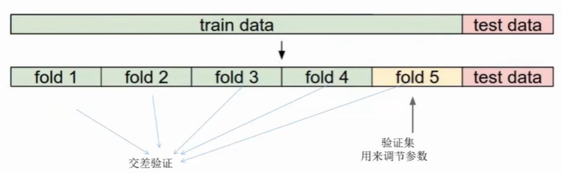

>**k - 近邻**
- **第一部分**
```
1.选取超参数的正确方法是：将原始训练集分为训练集和验证集，我们在验证集上尝试不同的超参数，最后保留表现最好那个.
2.如果训练数据量不够，使用交叉验证方法，它能帮助我们在选取最优超参数的时候减少噪音。
3.一旦找到最优的超参数，就让算法以该参数在测试集跑且只跑一次，并根据测试结果评价算法。
4.最近邻分类器能够在CIFAR-10上得到将近40%的准确率。该算法简单易实现，但需要存储所有训练数据，并且在测试的时候过于耗费计算能力。
5.最后，我们知道了仅仅使用L1和L2范数来进行像素比较是不够的，图像更多的是按照背景和颜色被分类，而不是语义主体分身。
```
- **第二部分**
```
1.预处理你的数据：对你数据中的特征进行归一化（normalize），让其具有零平均值（zero mean）和单位方差（unit variance）。
2.如果数据是高维数据，考虑使用降维方法，比如PCA。
3..将数据随机分入训练集和验证集。按照一般规律，70%-90%数据作为训练集。
4.在验证集上调优，尝试足够多的k值，尝试L1和L2两种范数计算方式。
```
## 五、线性分类
>**描述**

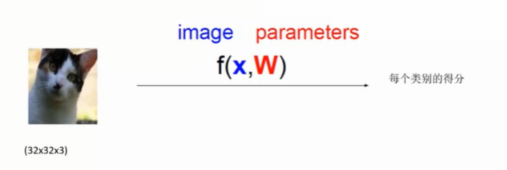
```
上面小猫图片下的数字：
	(32x32x3)：长 x 宽 x 颜色通道
	颜色通道：
		- 灰度图：1
		- 彩色图：3 （RGB）
	images：输入像素
	paramerters：权重参数（不止一个）
```
>**计算**

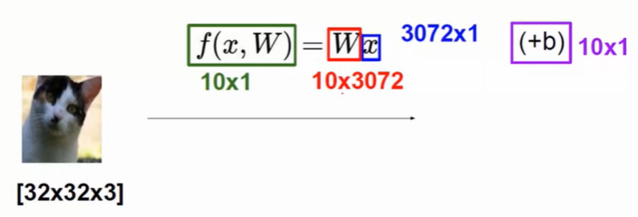
```
矩阵相乘
	W：10x3072	-	矩阵
	x：3072x1	-	矩阵
	b：10x1		-	矩阵
```
>**简述**

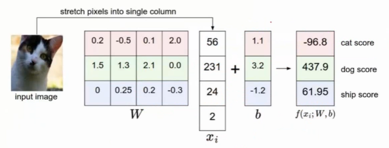
```
从上图可以看出，将小猫图片分为了 4 个像素点。
行和列一对一相乘，然后加起来
	· 0.2*56 + (-0.5*231) + 0.1*24 + 2.0*2 + 1.1 = -96.8
	· 1.5*56 + 1.3*231 + 2.1*24 + 0.0*2 + 3.2 = 437.9
	· 0*56 + 0.25*231 + 0.2*24 + (-0.3*2) + (-1.2) = 61.95
	
得分值高就是结果值，但这里明显不对，需要接下来的补充
```
## 六、损失函数
```
组合完之后相当于完成了一个线性分类的操作。
	W：权重参数，决策边界，倾斜度
	b：通过 b 找到与y轴的焦点值
```
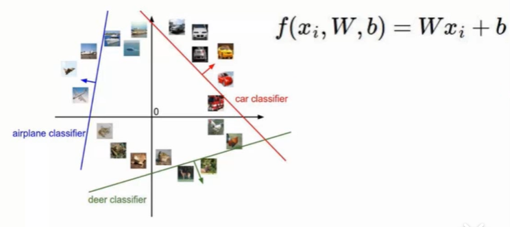

>**损失函数表达式**

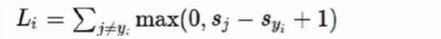
>**计算结果**

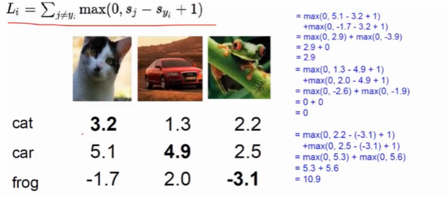
```
最终的损失函数是要将所有的样本都算出来
最终的损失值是跟样本的个数没有关系
```
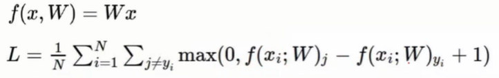

## 七、正则化惩罚项

>**正则化表达式**

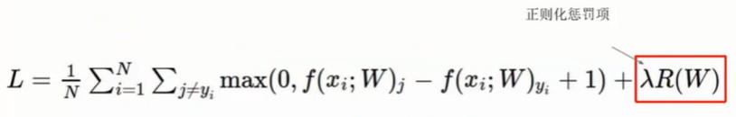
```
损失函数扩展	-	加惩罚项的损失函数
L = 损失函数 + 正则化惩罚项
```
>**损失函数终极版**

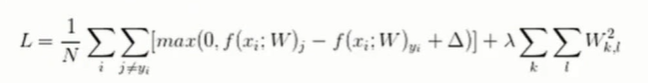

## 八、softmax 分类器

>**Sigmoid 函数**

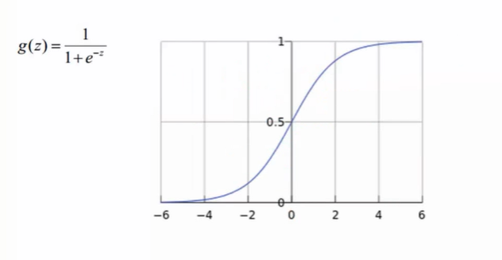
```
在负无穷到正无穷上，任意一个实数值z，得出的结果是某一个类别的概率值
取值范围：0 - 1 可以当成求概率值
```
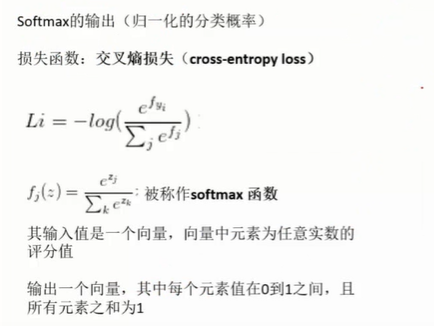

>Softmax 实例

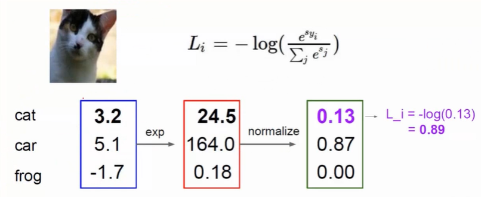
```
映射成概率值之前，先做一个e的x次幂计算，让大的得分值更大，小的得分值更小
	·exp：即 e 的 x 次幂
	·normalize：归一化，将获得的值
归一化：这里是将红色框内的数值求比例计算，得到后面绿框内的比例

对于softmax函数，用什么样的损失函数来衡量概率值呢，可以用`对数`函数
对归一化之后的数求取对数值
	-	0.13
	-	0.87
	-	0.00
	在(0,1)的区间上，任何x传进来之后都会等于一个负值，在结果前面加一个相反号，得到最终当前的输入，它的当前损失值是多少
```
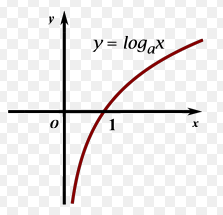

>**SVM和SOFTMAX对比**

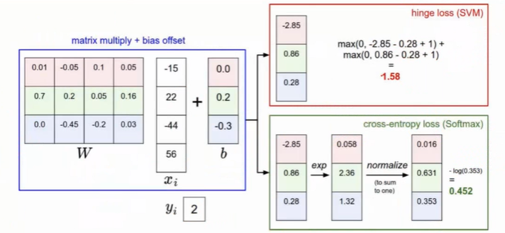

```
SVM没有SOFTMAX区分的精细
```
## 九、梯度下降算法原理
>**最优化**

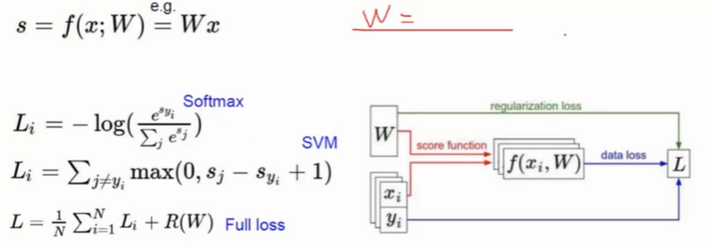
```
	从x开始，通过一组 W 参数得到了一个`得分值`,再将`得分值`f(x)经过 e的x次幂，再作一个归一化，得到一个属于类别的概率值，最后求一个 loss 值。
	前向传播(x-->loss)：从输入数据开始，到最终得到这个loss，这一系列完成的过程兼做前向传播的过程。
	神经网络是由BP算法求解的，BP算法通过前向传播求得loss值，接下来经过一次反向传播去优化这些`权重参数`。
```
>**跟随梯度**

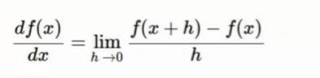

## 十、反向传播
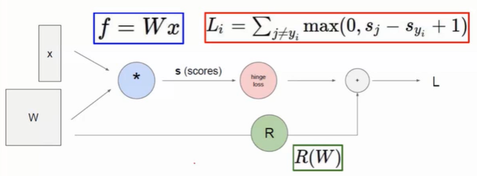
>**神经网络是有两部分组成的**

```
	前向传播：由一个数据得出一个得分值。
	反向传播：由得分值算出loss值之后，由loss值一步一步往回传，来算一下什么样的W(权重参数)该更新，或该更新多大的力度。
```
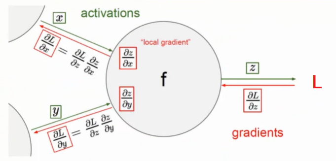
```
计算 x 和 y 对 L 做多大贡献
	如图显示，对x和y求偏导数
```
>**做贡献的简单计算**
-	加法门单元：均等分配
-	MAX门单元：给最大的
-	乘法门单元：互换的感觉

## 十一、神经网络整体架构
>**神经网络是一个层次结构**

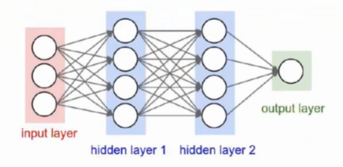
```
由权重参数的组合得出输出值
output layer = W3 * [ W2 * (W1 * X1) ]
```
>**神经网络是一个非线性结构**

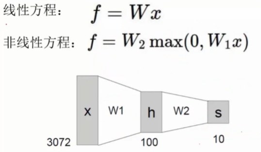
```
神经网络给线性方程加上了一些局限性。
	激活函数：
		
```

>**激活函数**

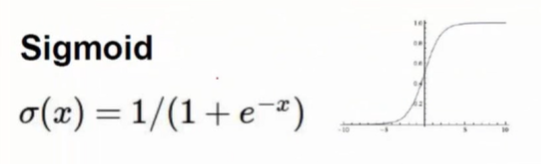
```
非线性函数
正是这些激活函数使得神经网络达到这么强的效果。
```

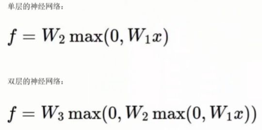

## 十二、Anaconda简单使用
>**conda list**
>查看已经安装的第三方依赖

>**anaconda search -t conda tensorflow**
>查看需要安装的版本

>**anaconda show dhirschfeld/tensorflow**
>让anaconda告诉我们我们想要安装的通过什么样的命令安装

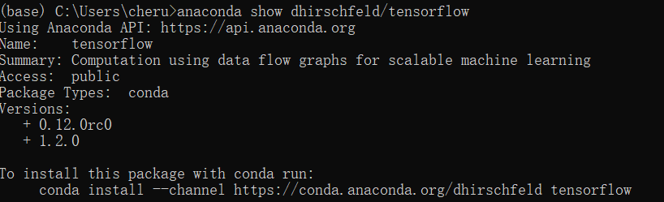

>**conda install --channel https://conda.anaconda.org/dhirschfeld tensorflow**
>通过这条命令安装我们所需要的

>**eclipse中配置python环境**
```
Name：PyDev
Location：http://pydev.org/updates
```

