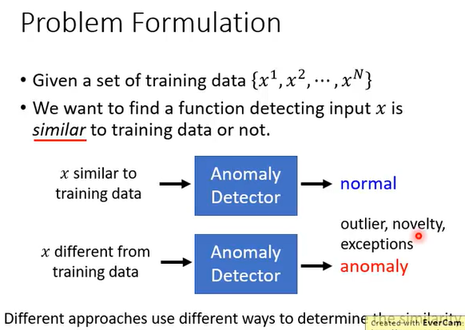
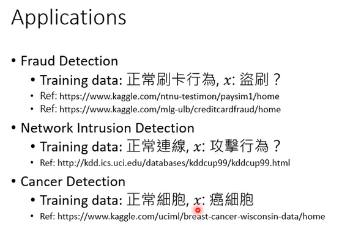
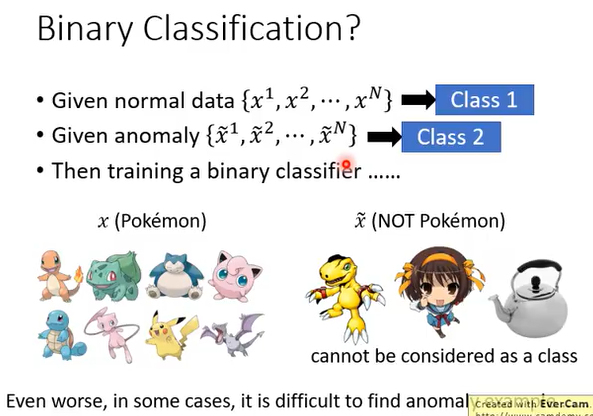
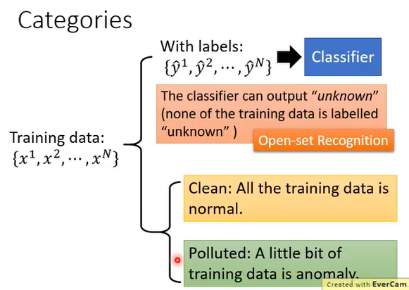
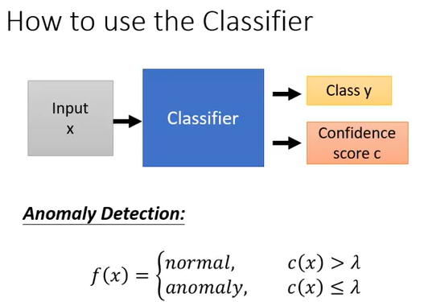
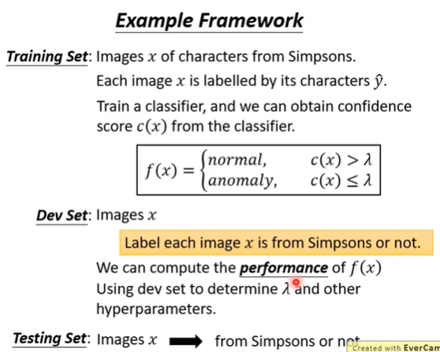
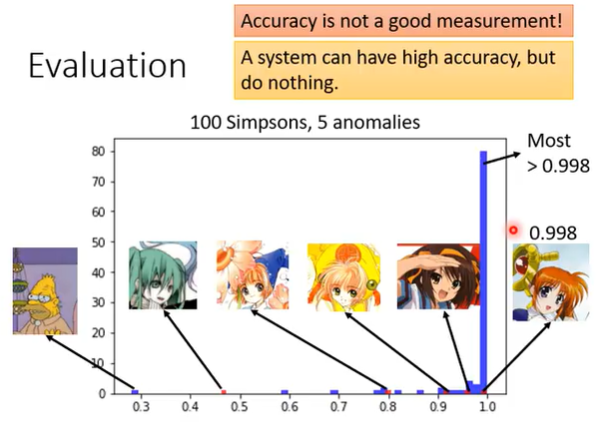
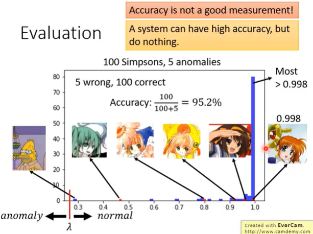
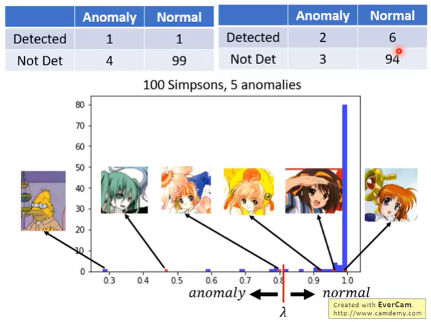
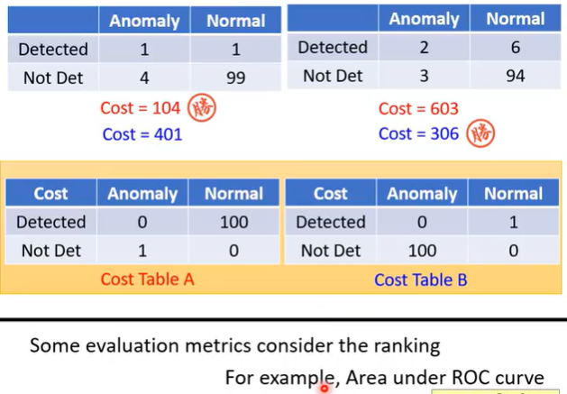

>**Problem Formulation**


```
异常检测，如果 input 的 x 和 training data 相似，就输出 normal，如果不同就输出 anomaly。找的是和训练资料不一样的东西。有可能是特别好的，也有可能是特别坏的。
```


>**Applications**



>**Anormal Detection 可以用 Binary Classifier 解决吗**


```
不能把 Anormal Detection 当成 binary classifier
1、因为不是 normal data 的数据太多了，不能当成一个 Class。
2、收集正常的训练资料比较容易，收集异常的资料不容易。
```

>**Categories**


```
with label
no label
```

> **How to use the Classifier**


```
这个 Classifier 不止可以做分类，还可以给出 Confidence score
Confidence score: 信心分数
threshold: 阈值
如果 c(x) > λ -> normal
		 c(x) < λ -> anormal
```
>**Example Framework**


```
分类器可以对每一张图片有一个‘信心分数’，有了‘信心分数’就可以打造异常检测系统。
需要 development set 才能调节 hyper parameter，调一些训练时模型的参数。
development set 模仿 test set。
有了 development set 之后，就可以计算将‘异常侦测系统’用在 development set 上，计算‘异常侦测系统’在 development set 上的 performance 有多好。
用 development set 来调整‘异常侦测系统’中的 threshold，找出一个可以让系统最后算出来的结果最好的 threshold。
```

>**Evaluation**


```
使用正确率来 evaluate 一个模型的好坏不总是可以的。
```

```
当 threshold < 0.3 时，5个错误，100个正确，但这不是一个很好的‘异常检测系统’，因为这个系统会把所有东西都判断成正常的。所以不能拿正确率来直接当 evaluate manager。
```


```
在异常侦测里面有两种错误:
	- 异常的资料被判断成正常
	- 正常的资料被判断成异常
当 0.5 < threshold < 0.6 时
当 0.8 < threshold < 0.9 时

评审一个系统的好坏，取决于个人觉得 first alone 严重 还是 missing 严重
```


```
根据不同的任务，有不同的 Cost table。
Anomaly Detection 的系统怎么衡量，取决于这个系统要做什么。
```

