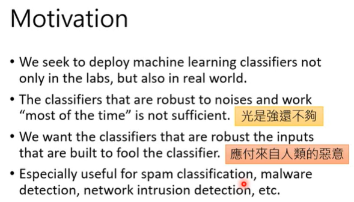
```
ML 必须可以对抗有恶意的攻击。可以对抗有些人制造一些恶意的输入，主要是骗过 ML 的 Model。
```

### Attack

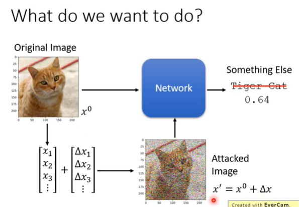
```
本来输入是 x0，输出为 Tiger Cat（0.64）
加上杂讯 △x 之后，输入为 x'=x0 + △x，输出结果就不同了。
```

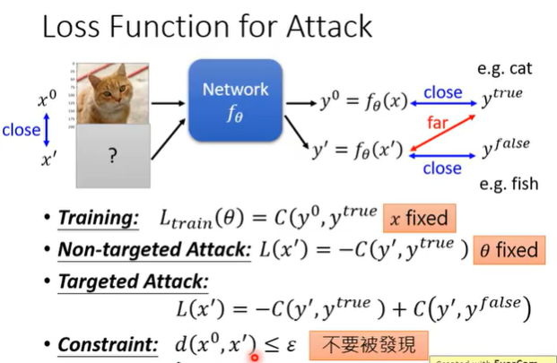
```
如何找出 x'？
minimize the (y0, y'true)的 cross entropy
攻击分为两种
- Non-targeted Attack: 找另外一张新的图片，以 x' 来表示，输出以 y'来表示，然后希望 y'和 y'true 距离越远越好。在训练的过程中，希望 network 的输出跟正确答案越接近越好，但在 Attack 中，做的和一般训练正好相反。

训练中 update 的是 network 中的参数θ，使得输出的 y0 和 y'true 越接近越好
攻击中不 update network 中的参数，而是选一张新的 input x'，使得输出的 y' 和 y'true 越远越好。 

- Targeted Attack: 希望输出的 y' 和 y'true 越远越好，而且是和错误的答案 y'false 越近越好。

- Constraint: d(x0, x') ≤ ε，希望找出的 x' 和原来的 x0 越接近越好。
```

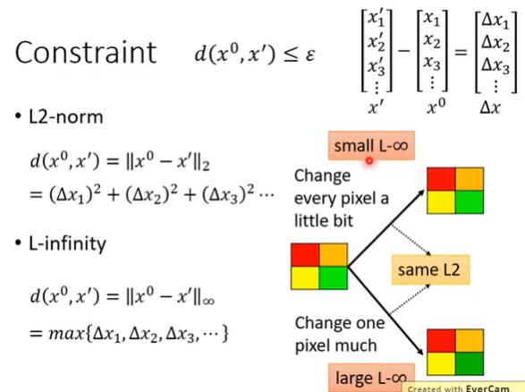
```
Constraint 的两种方式
L2-norm
L-infinity
```
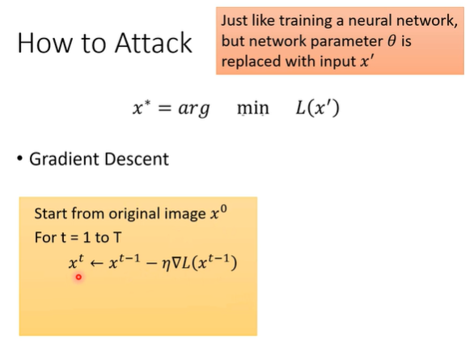
```
找一个 x' 可以让 L(x')的值越小越好，同时 x'也要满足和 x0 的差距不可以太大。满足这两个条件的 x'记为 x*。找一张新的 image x' 可以 minimize 某一个 Loss Functoin。现在是把 x'当成 network 参数，network 原来的参数是固定的，只调 x'，使用 Gradient Descent 的方法来找到一个可以让 loss 最小的 x*。
```

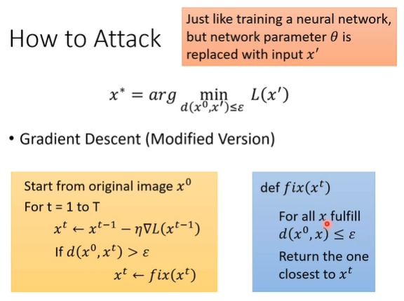
```
此时没有对 x 有所限制，有可能跑了 T 个循环后，和原来的 x0 差很多，不满足限制的条件。
更改 iteration 法。
```

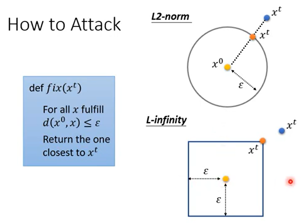
```
L2-norm: x0 在中间，找到的 x 和 x0 的距离不可以超过ε，如果做完 Gradient Descsent 之后，update 的参数不在以 x0 为圆心，以ε为半径的圆中，找到一个和 x't 最近的点，把这个点当成 x't。
L-infinity: 
```

>**Example**

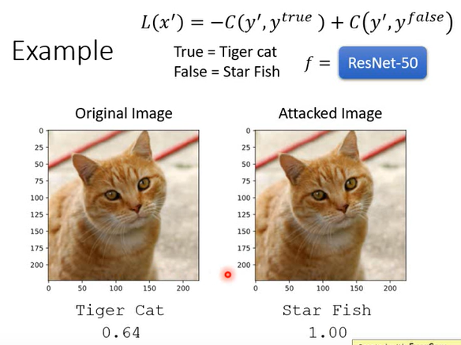
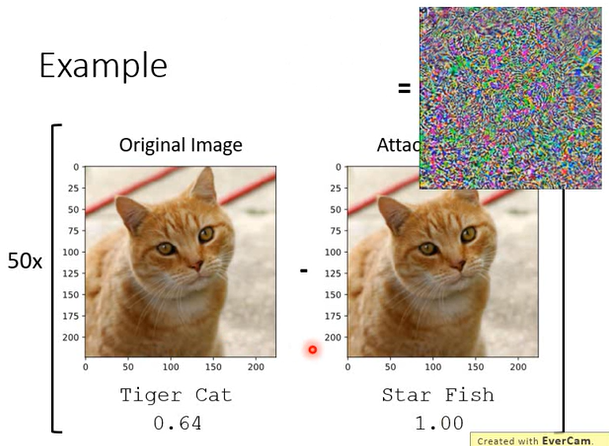

-------------------------------------------

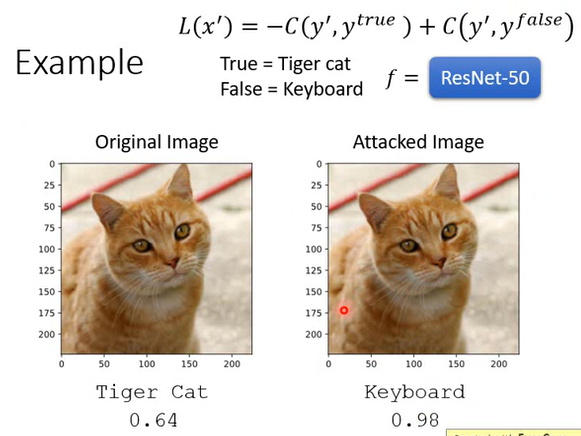

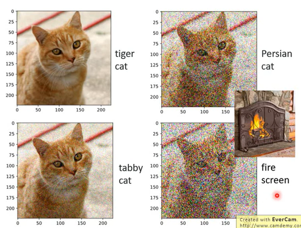
```
不同杂讯带来不同的结果。
```