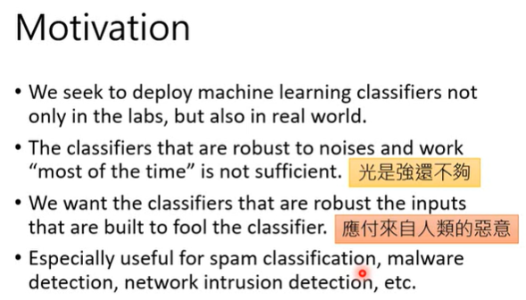
```
ML 必须可以对抗有恶意的攻击。可以对抗有些人制造一些恶意的输入，主要是骗过 ML 的 Model。
```

### Attack

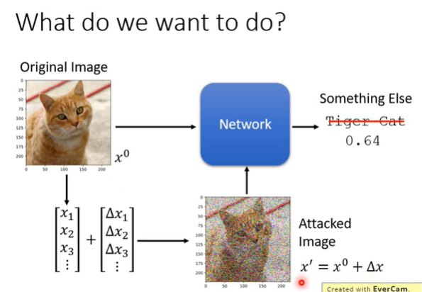
```
本来输入是 x0，输出为 Tiger Cat（0.64）
加上杂讯 △x 之后，输入为 x'=x0 + △x，输出结果就不同了。
```

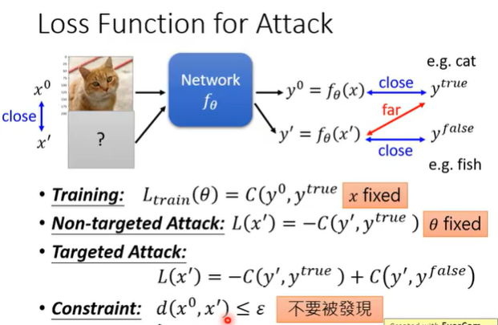
```
如何找出 x'？
minimize the (y0, y'true)的 cross entropy
攻击分为两种
- Non-targeted Attack: 找另外一张新的图片，以 x' 来表示，输出以 y'来表示，然后希望 y'和 y'true 距离越远越好。在训练的过程中，希望 network 的输出跟正确答案越接近越好，但在 Attack 中，做的和一般训练正好相反。

训练中 update 的是 network 中的参数θ，使得输出的 y0 和 y'true 越接近越好
攻击中不 update network 中的参数，而是选一张新的 input x'，使得输出的 y' 和 y'true 越远越好。 

- Targeted Attack: 希望输出的 y' 和 y'true 越远越好，而且是和错误的答案 y'false 越近越好。

- Constraint: d(x0, x') ≤ ε，希望找出的 x' 和原来的 x0 越接近越好。
```

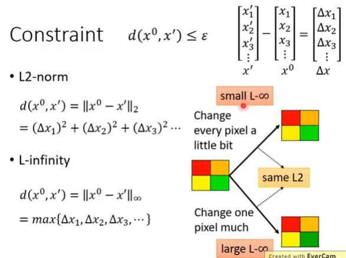
```
Constraint 的两种方式
L2-norm
L-infinity
```
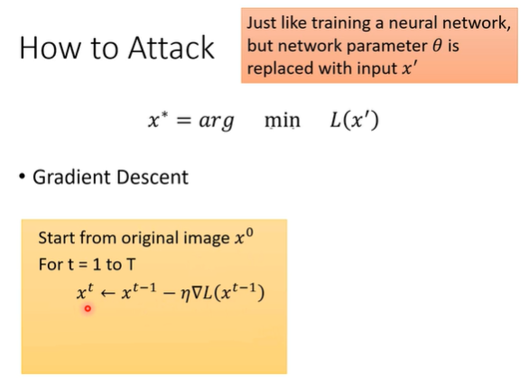
```
找一个 x' 可以让 L(x')的值越小越好，同时 x'也要满足和 x0 的差距不可以太大。满足这两个条件的 x'记为 x*。找一张新的 image x' 可以 minimize 某一个 Loss Functoin。现在是把 x'当成 network 参数，network 原来的参数是固定的，只调 x'，使用 Gradient Descent 的方法来找到一个可以让 loss 最小的 x*。
```

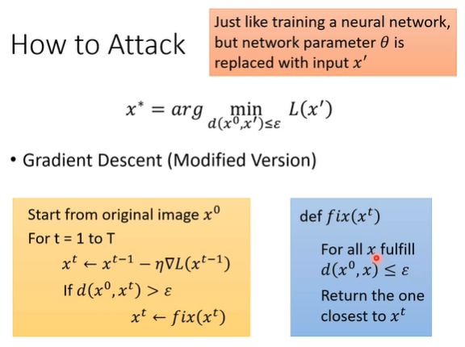
```
此时没有对 x 有所限制，有可能跑了 T 个循环后，和原来的 x0 差很多，不满足限制的条件。
更改 iteration 法。
```

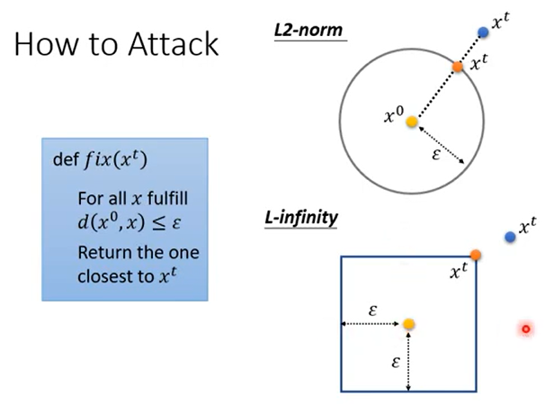
```
L2-norm: x0 在中间，找到的 x 和 x0 的距离不可以超过ε，如果做完 Gradient Descsent 之后，update 的参数不在以 x0 为圆心，以ε为半径的圆中，找到一个和 x't 最近的点，把这个点当成 x't。
L-infinity: 
```

>**Example**

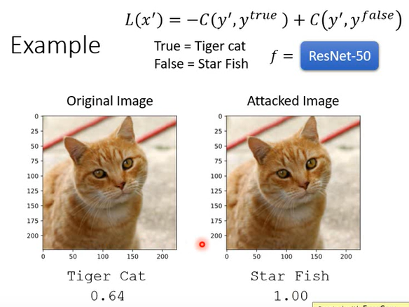
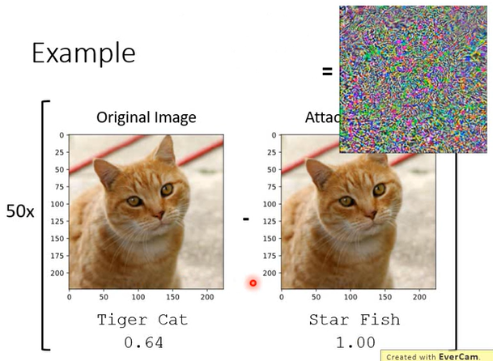

-------------------------------------------

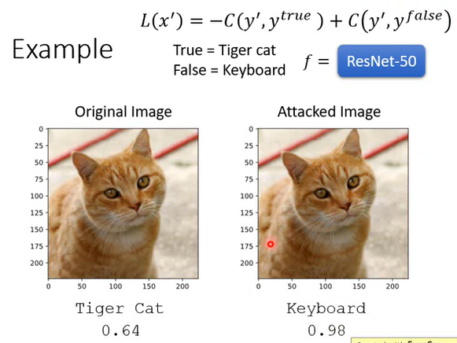

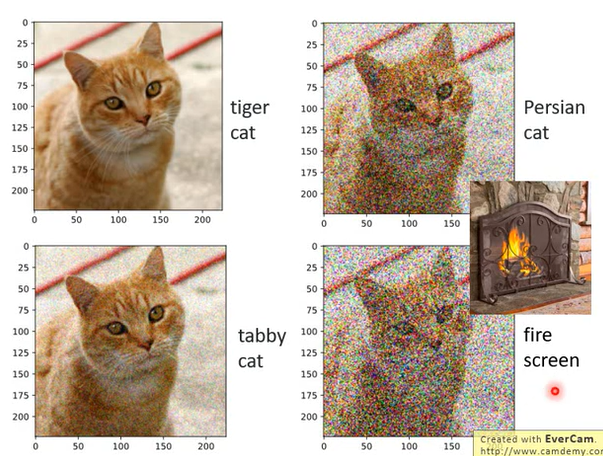
```
不同杂讯带来不同的结果。
```

>**Attack Approaches**

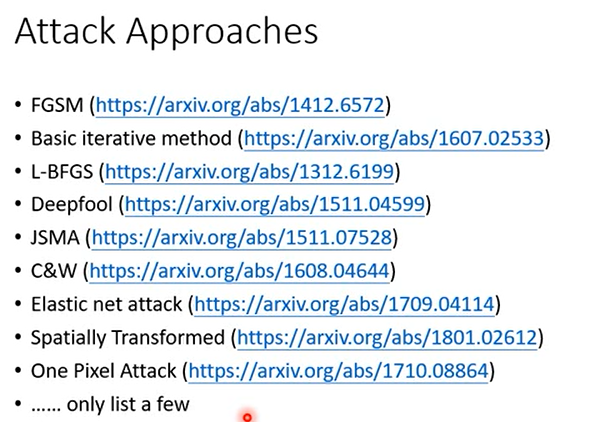
```
FGSM
```

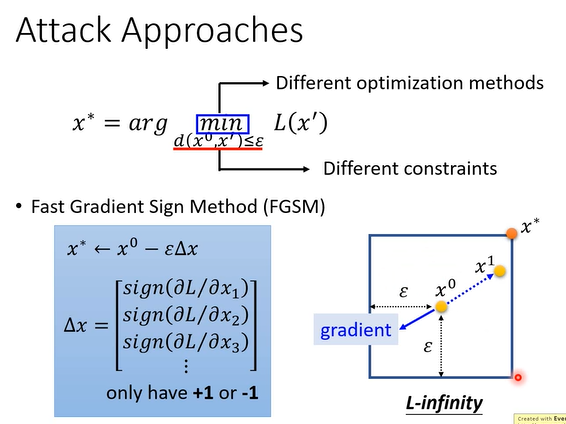
```
x* = x0 - ε△x
先把 x 对 L 的 Gradient 算出来，然后把 Gradient 中的每一个 dimension拿出来，如果这个 dimension 是正的，视为 +1，如果是负的，视为 -1。
先算出来 Gradient 的方向，如果不是用 FGSM，而是用一般的 Gradient descent，是把 -Gradient descent * learning rate 去 update x0 就得到 x1，FGSM 只需要做一次 update，这个 function 并不在意 gradient 的值，而是在意 gradient 的方向。
```

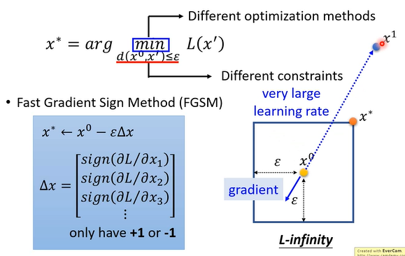
```
原理: 其实是设定了一个很大的 learning rate，这样就可以一次 update 就达到 Attack 这件事。如果 learning rate 设置特别大，得到的 x1 超出了这个范围，就需要把 x1 拉回来，拉到右上角。
```

>**Black Box Attack**

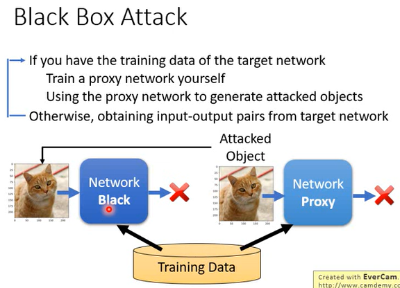
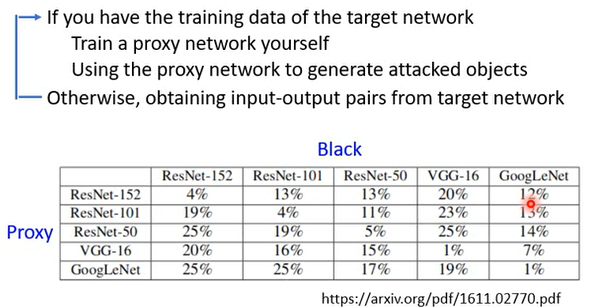
```
如果有了 target network 的 training data，就可以自己训练一个 Network Proxy，自己攻击自己训练的 model，如果攻击成功，往往就可以将 target network 攻破。
```

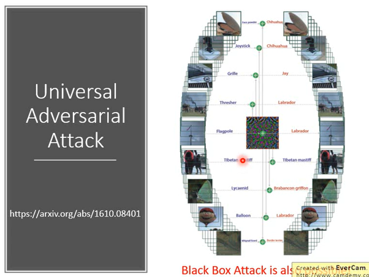
```
Attack 可以是 Universal 的，找到一个 Attack signal 加到 database 里面所有 image 上，多数时候都可以让 database 里面的 image 辨识错误。
```

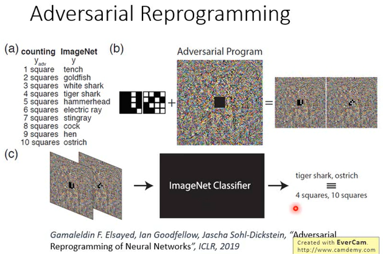
```
一个 network 本来要做的是 A 任务，但是让这个 network 看了一些杂讯，network 就‘发狂’了，解的是 B 任务。
有一个影像辨识的 model，这个 model 可以数我们输入图片中有几个方块，将数方块这个图片放在杂讯上，就可以实现数方块的任务。
```

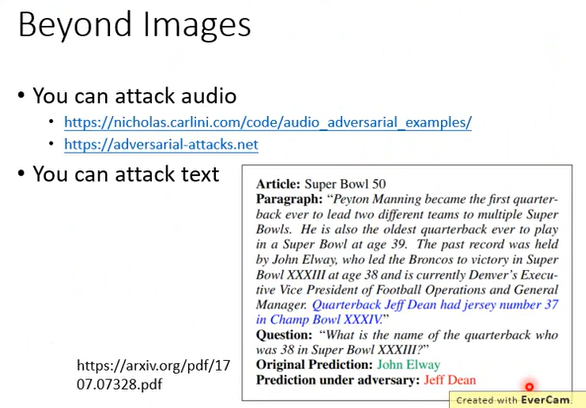
```
可以攻击 audio、text...
```

### Defense

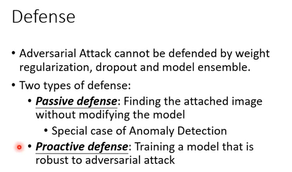
```
Passive defense: 另外加一层防护罩帮它阻挡攻击。
Proactive defense: 训练 model 的时候，就把防御加到训练 model 的过程中。
```

>**Passive Defense**

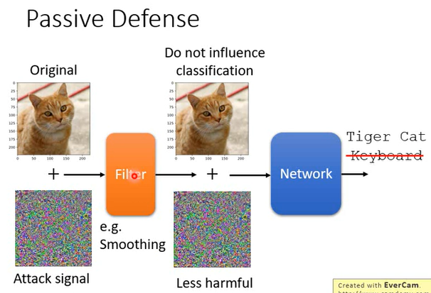
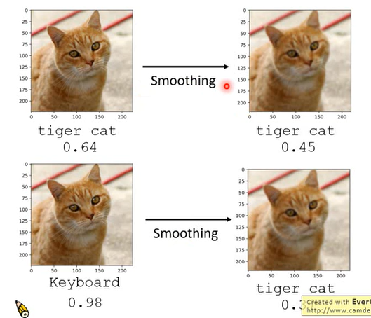
```
filter 就是一个防护罩，一般的图片通过 filter，不作为，杂讯通过 filter，希望它的伤害就会减轻。eg: Smoothing
filter 上加上 Smoothing 并不会伤害原来的图片，所以仍然可以得到正确的结果。
```

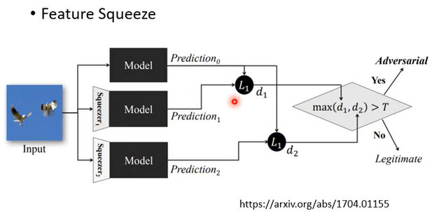
```
输入一张 image
原封不动的做 Prediction0
经过 Squeezer1 得到 Prediction1
经过 Squeezer2 得到 Prediction2
有做 Squeezer 前后相差很大，就可以知道这张图片可能被攻击过。
```

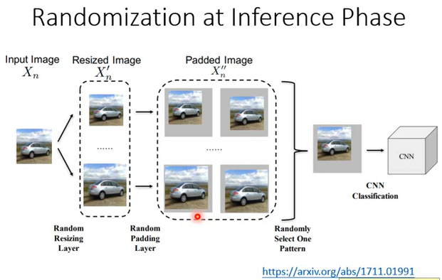
```
类似
```

>**Proactive Defense**

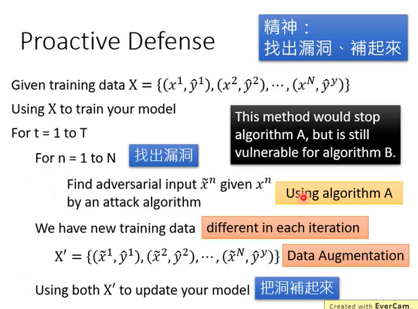
```
在训练 network 的时候，将漏洞找出来，
找出漏洞，再组成新的 training data，把这些 x~ 标上和原来一样的 label，把这些新的 data 进行训练。
但是如果使用 algorithm A 做防护，虽然可以抵挡 A 攻击，但不一定能抵挡 B 攻击。
```