## More than minimizing reconstruction error

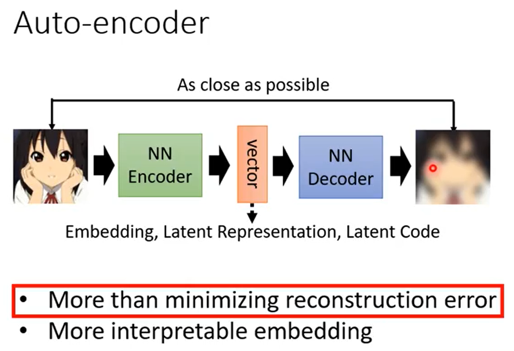
```
image -> encoder -> vector(Embedding、Latent Representation、Latent Code) -> decoder -> new image
在 training 的时候，就是要 minimize reconstruction error，要让 encoder 的 input 和 decoder 的 output 越接近越好。
为什么是要 minimize reconstruction error？有没有其他做法呢？
```
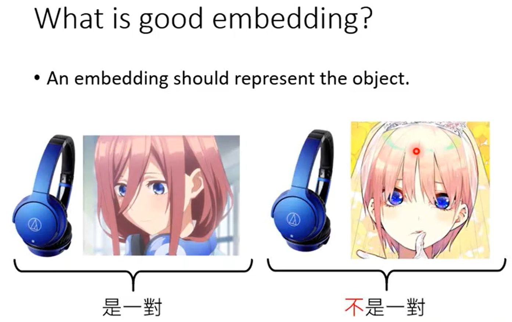
```
期待 Embedding 做到什么事情呢？
期待 Embedding 是具有代表性的，可以代表 encoder 输入的 object，看到 Embedding 就可以想到原来的 object。
```

>**Beyond Reconstruction**

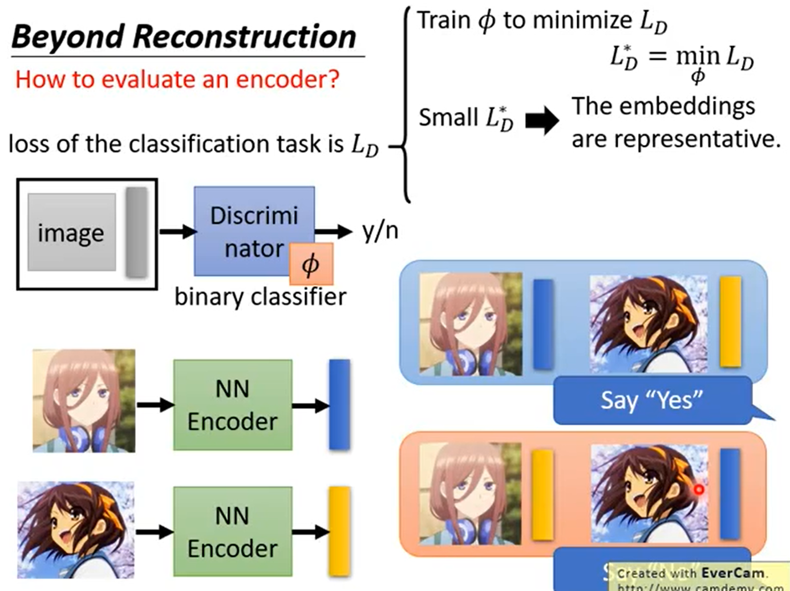
```
给 encoder image 就会产生 Embedding，如何知道 encoder 是好还是不好？
如何知道 encoder output Embedding 对这个 image 是有代表性的，还是没有代表性的？
需要 learn 一个 Discriminator，相当于一个 binary classifier。
image & Embedding -> Discriminator -> 输出 image & Embedding 是否是一对。
learn Discriminator 需要 训练资料。
train 一个 binary classifier，需要定义一个 loss function。binary classifier 常用的 loss function 就是 binary cross-entropy。

binary classifier 的参数是 Φ，定义一个 Loss Function LD，调参数 Φ，希望可以 minimize 这个 loss function。
假设 train 完之后，找到的最好的 Φ，它可以达到最低的 loss function，叫做 L*D，如果得到的 L*D 很小，即训练的结果很好，就代表说这个 Embedding 非常具有代表性。
```
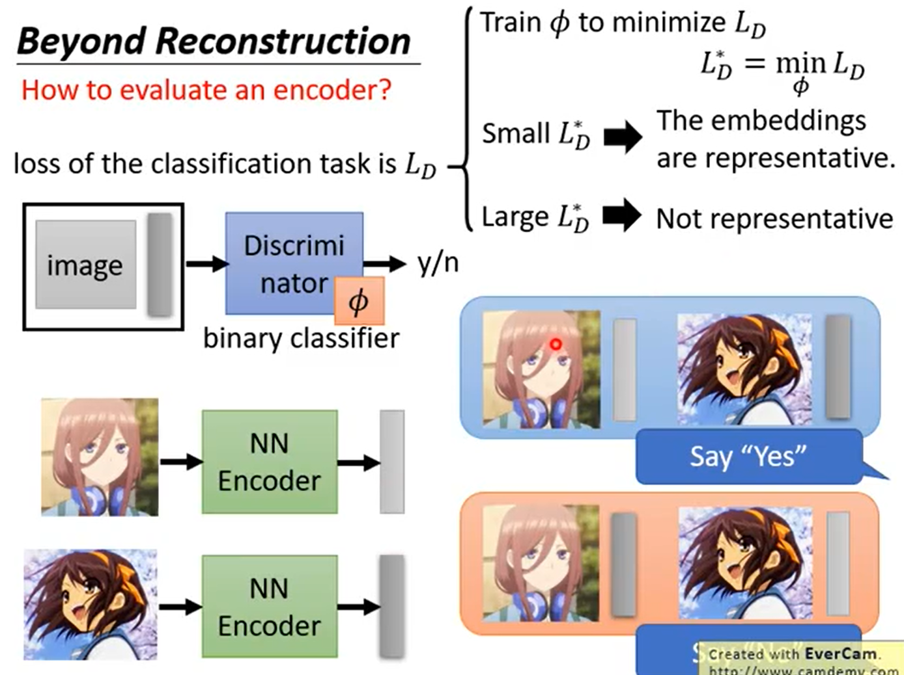
```
如果有一个很差的 encoder，output 出来的 vector 都是灰色的，看起来没有什么不同，这样对 Discriminator(binary classifier) 来说，positive example 和 negative example 看起来没有什么不同。所以 Loss Function L*D 很大。所以 encoder output Embedding 不具有代表性。
```
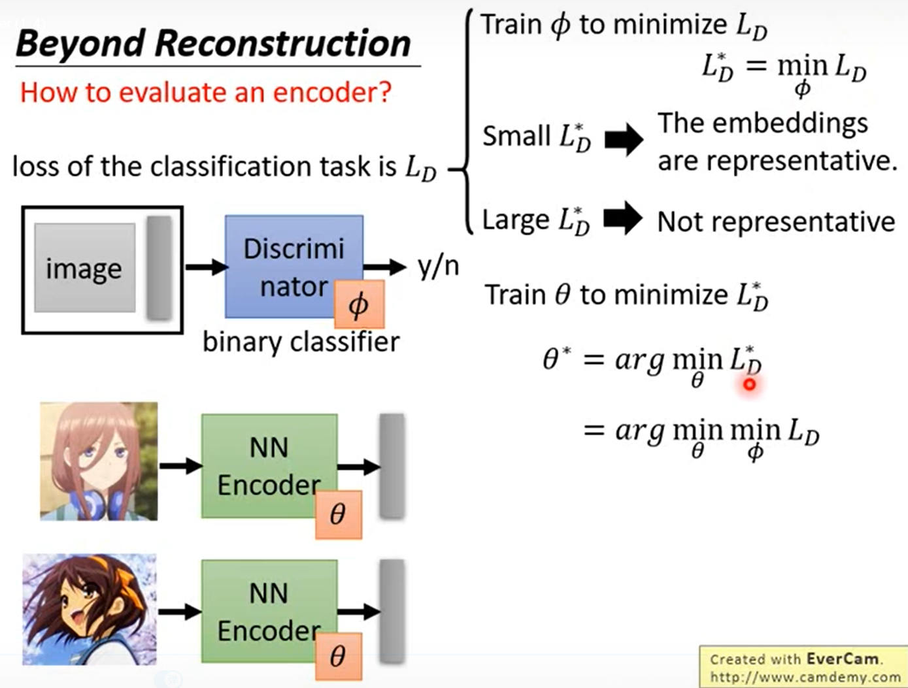
```
L*D samller，Encoder better。
则训练 encoder 的目标变成要去 minimize L*D，假设 encoder 的参数是 θ，找一个 θ 可以让 L*D 的值越小越好。
L*D = minLD		找一个 Φ minimize LD
θ* = arg minL*D = arg min(θ) min(Φ) LD
```

>**Typical auto-encoder is a special case**

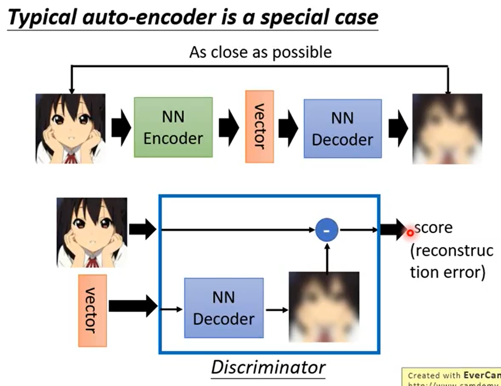
```
(image,embedding) -> Discriminator(binary classifier) -> score
score: 代表 (image,embedding) 是一组的还是不是一组的。

Discriminator 里面有一个 NN Decoder，先把 vector input 进入 Decoder，然后会 output 一张和 input image 大小一样的 image，然后两张 image 相减，计算它们之间的差异，Discriminator 的 output 就是 reconstruction error。
```
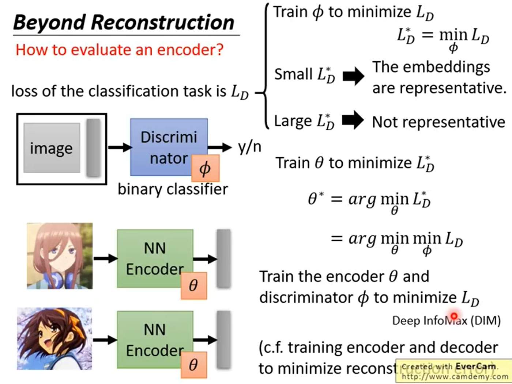
```
同时找到最好的 Encoder，最好的 Discriminator，一起 minimize Loss Function LD。
很像一般一起 train Encoder and Decoder 去 minimize reconstruction error。
```

### Sequential Data

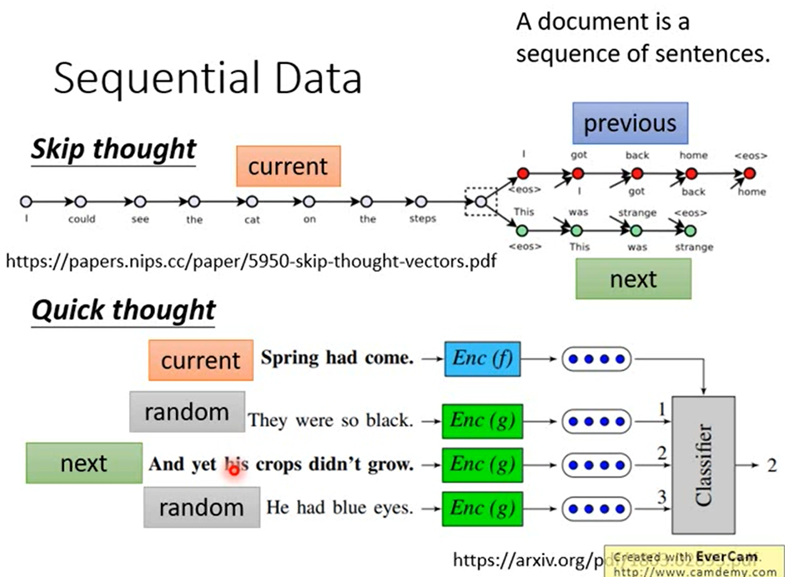
```
如果资料是有序列性的资料，比如一篇文章。
· Skip thought
train 一个 model，input sentence，但是它 predict 的是前一个句子和后一个句子。
和 train word embedding 很像，如果某一个词汇的上下文都很像，那这两个不同的词汇语义是接近的。
· Quick thought
只 learn Encoder，不 learn Decoder，把每一个句子都丢到 encoder 里面，会 output embedding vector。
每一个 sentence 要和他下一个 sentence output 的 embedding vector 越接近越好，如果是随机的句子，和不连续的 sentence output 的 embedding vector 越远越好。
实际上是计算 current vector 和 current sentence embedding vector 和 next sentence embedding vector 越接近越好。
current sentence embedding vector 和 random sentence embedding vector 越远越好，。
```

>**Contastive Predictive Coding(CPC)**

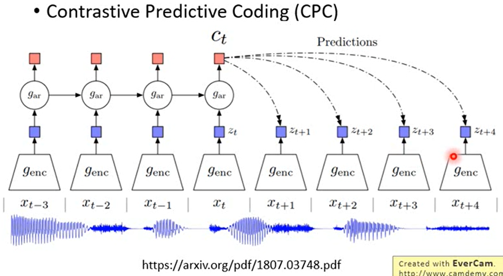
```
train 一个 encoder，input 是声音讯号，声音讯号的每一小段都用 encoder 得到一个 embedding vector。
训练目标：希望 encoder output 出的 embedding 可以拿去 predict 接下来同一个 encoder 会 output 的 embedding。
```

## More interpretable embedding

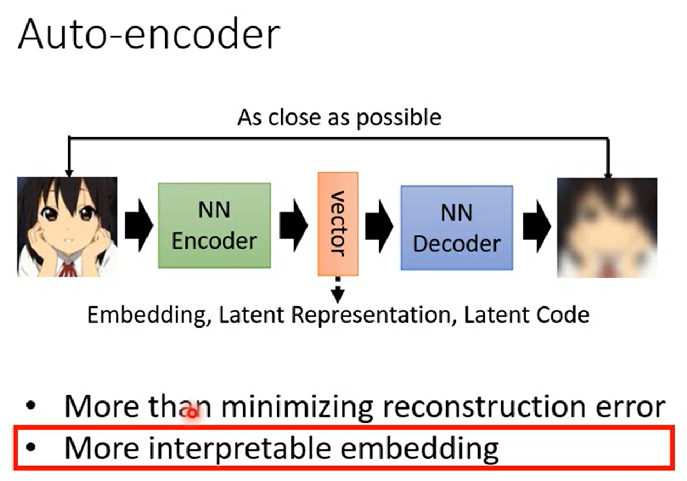
```
怎么让 encoder 的 output 更容易被解释。
```

### Feature Disentangle

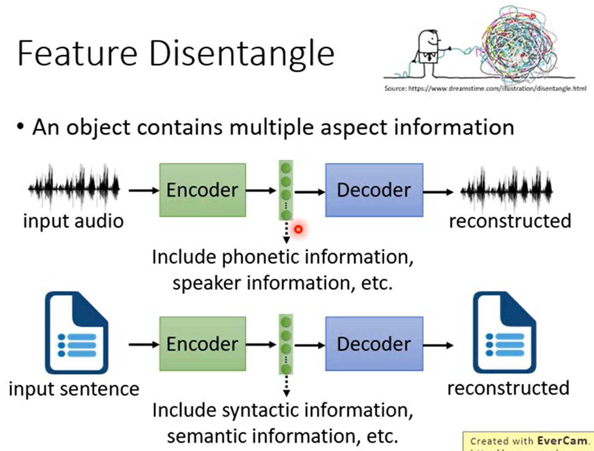
```
在 train auto-encoder 的时候，encoder 的 input object(影像，声音，一段文字)，这些 object 里面包含了各式各样复杂的资讯，比如一段声音里面不止有文字，语音内容的资讯，还包含了说话人的声音的特质。
一个 encoder 的 input 包含了各式的资讯。
不知道向量里面哪些维度是说话人的资讯，哪些维度是声音讯号。
```
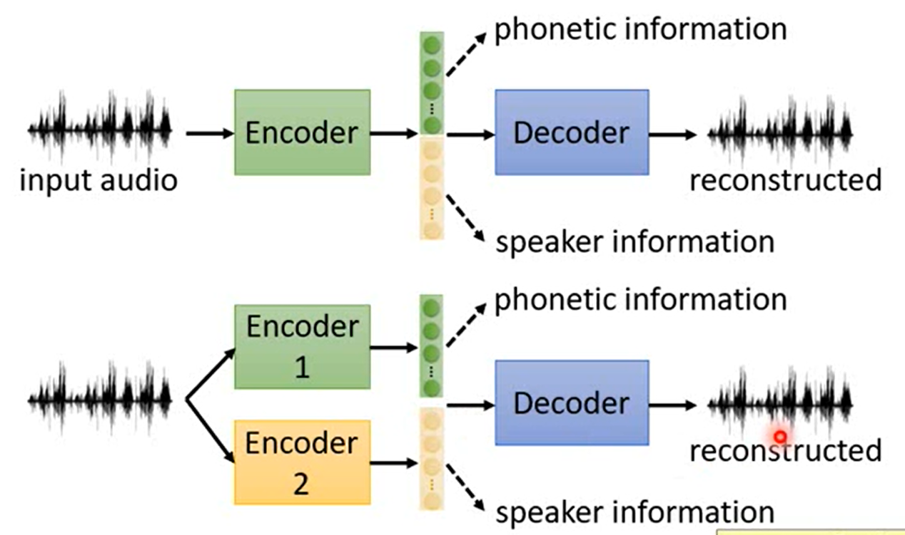
```
encoder 输出一个 vector 之后，vector 可能是 200 维，假设前 100 维是内容的资讯，后 100 维是语者的资讯。
变形后，有两个 encoder，一个 encoder 专门抽出内容的资讯，另一个 encoder 专门抽出语者的资讯。把内容的资讯和语者的资讯拼在一起丢给 decoder，才能还原原来的信号。
```

#### Feature Disentangle - Voice Conversion

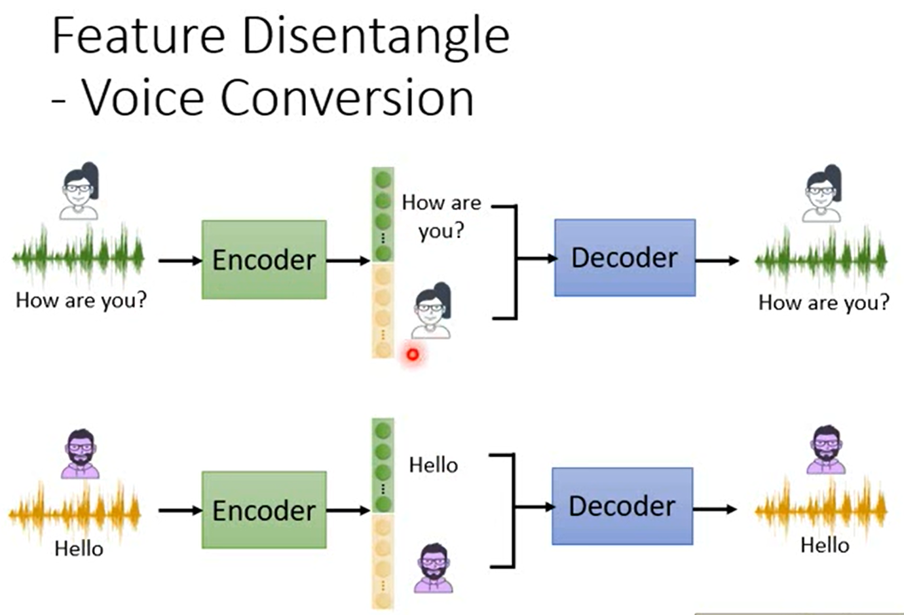
```
将 内容的资讯和语者的资讯 分开。
```
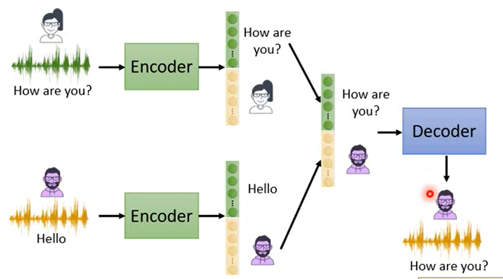
```
可以将女生的 内容的资讯 和 男生的 语者的资讯放在一起，然后男生说出 How are you？
可以做一个变声器。
```
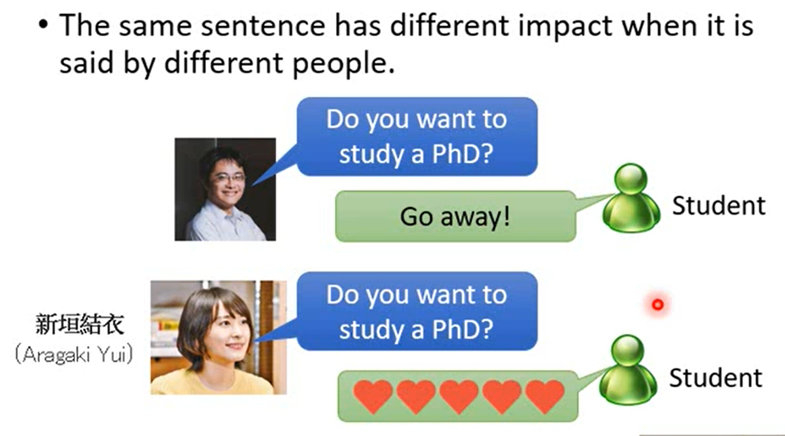

#### Feature Disentangle - Adversarial Training

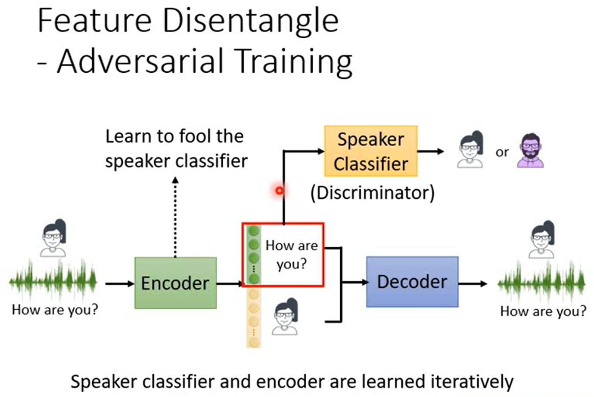
```
用 GAN 的概念，怎么训练一个 encoder，让这个 encoder 前 100 维就是声音内容的资讯，后 100 维是语者的资讯？
训练一个语者的 classifier，这个 classifier 会把 encoder output 的向量 input 进去，根据这个向量判断这个向量它来源哪个语者。encoder 做的事情就是想办法骗过 classifier。想办法让这个语者的 classifier 正确率越低越好。
```

#### Feature Disentangle - Designed Network Architecture

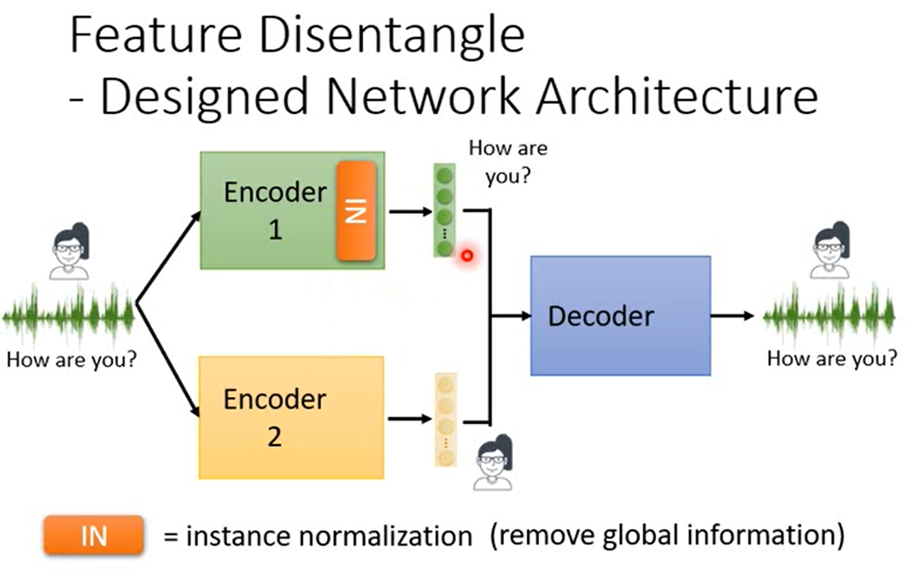
```
代表不同资讯的 embedding 使用不同 encoder output 出来的。
instance normalization：实例规范化
在 NN 里面，设计一种特别的 layer，这个 layer 可以抹掉 global 资讯，可以抹掉整个 object 每一个小部分都有的资讯。 
```
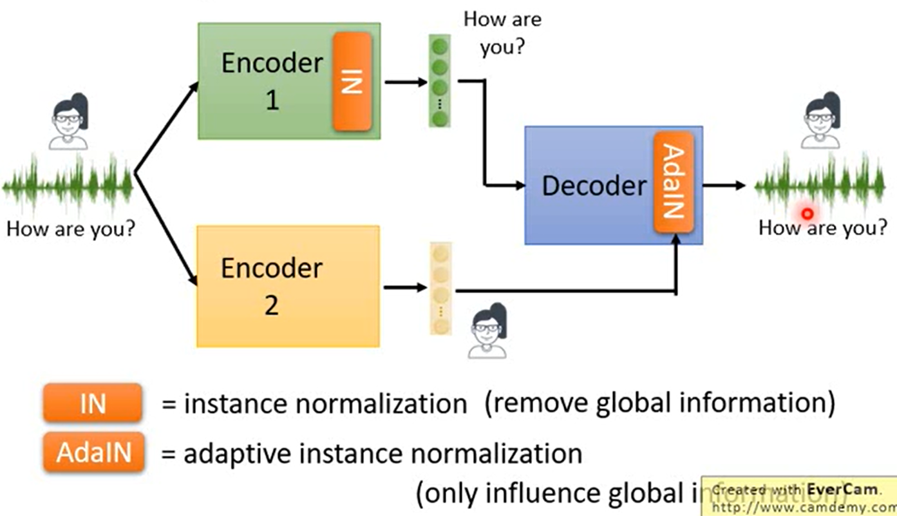
```
同时在 Decoder 上加一个特别的 layer AdaIN。
```

### Discrete Representation

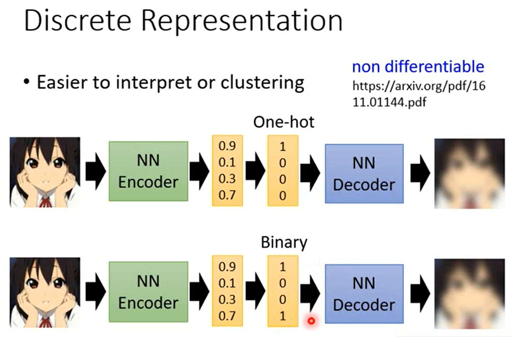
```
在 train auto-encoder 的时候，哪个 embedding 是 continuous vector，是一个向量。
进一步期待说 encoder 能不能够 output discribed 的 embedding。就更容易解读 output 的 vector 是什么意思。就会更容易的做 cluster。
举例：
能不能让 encoder 的 output 就是 One-hot vector，只有一维是 1，其他都是 0。只要同一个维度是 1，那 object 就统统属于同一个 class。
怎么做呢？
· One-hot
现在 encoder 本来的 output 是 continuous vector，看 continuous vector 那一维最大，就把那一维改成 1，其他维都改成 0，得到 One-hot vector。把 One-hot vector 丢给 decoder，然后 decoder 还原原来的 image。
· Binary (比 One-hot 要更好)
train 一个 encoder，output 一个 vector，这个 vector 里面如果值大于 0.5 的话，就在 Binary vector 里面改成 1，值小于 0.5 的话，就在 Binary vector 里面改成 0，然后把 Binary vector 丢给 decoder，让 decoder 还原原来的图片。

中间 vector 的转换是不能微分的，但是有办法可以做到。

Binary 相比 One-hot 要更好。
假设 database 中的 data 可以分成 1024 群，那 One-hot vector 应该要有 1024 维，但是如果是 Binary vector 的话，只需要 10 维。相比之下 Binary vector 需要的参数少。
Binary vector 还有一个好处是它有机会可以处理训练资料里面从来没有看过的 class。
```

>**Vector Quantized Variational Auto-encoder(VQVAE)**

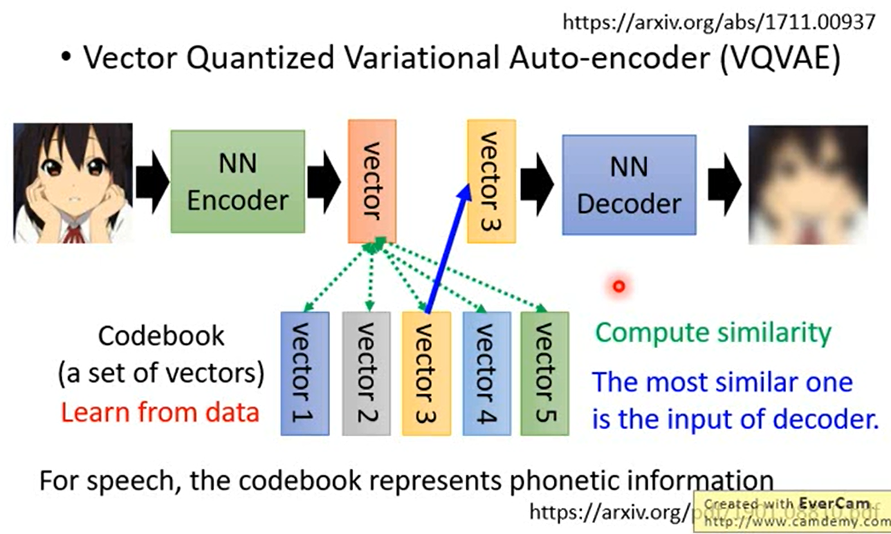
```
Codebook: 里面是一排向量，不是人设置的，是 learn 出来的，里面 5 个向量也是 Network 参数。

image -> encoder -> continuous vector(接下来用这个 vector 和 Codebook 中的每一个向量计算 similarity，相似度高的 vector 用来当作 decoder 的 input) vector3 -> decoder(train 的时候还是 minimize reconstruction error) -> new image。
因为 Codebook 中只有 5 种向量，所以 decoder 的 input 只有 5 种选择。

encoder、Codebook、decoder 合起来是没办法微分的。有可以 train 没有办法微分的 paper。
```

### Sequence as Embedding

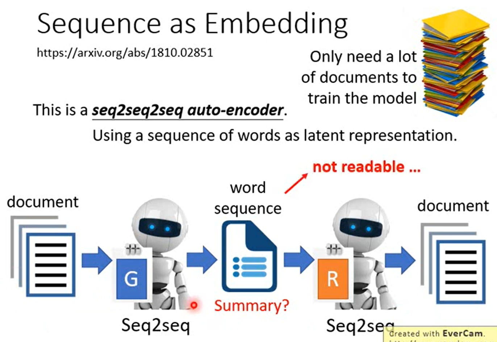
```
可以让 Embedding、latent representation 不再是一个向量，可以是一个 sentence。

seq2seq2seq auto-encoder

document -> encoder -> word sequence(不再是一个向量，这里是一串文字) -> decoder -> 试图还原原来的 document。

中间的 word sequence(文字) 可能是 document 的摘要。
这样是不够的。
```
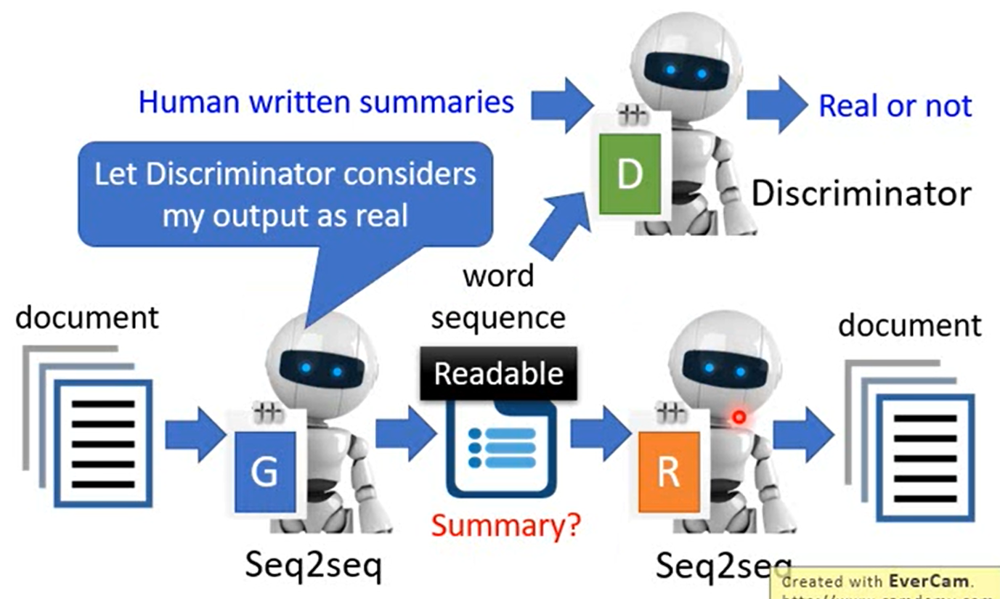
```
怎么让 encoder 输出的文字是可以人看的懂的呢？
需要用到 GAN 的概念。
需要 train 一个 discriminator(或者 binary classifier)，作用是看 word sequence 是人写的，还是不是人写的。
encoder 就要学习去骗过 discriminator。

如果一个 loss function 不能微分，就用 reinforcement learning 硬做就可以了。
```

