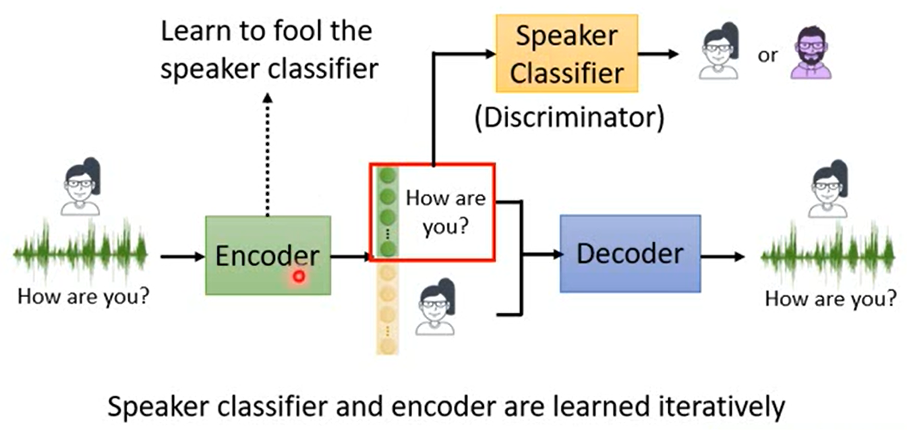

## More than minimizing reconstruction error


```
image -> encoder -> vector(Embedding、Latent Representation、Latent Code) -> decoder -> new image
在 training 的时候，就是要 minimize reconstruction error，要让 encoder 的 input 和 decoder 的 output 越接近越好。
为什么是要 minimize reconstruction error？有没有其他做法呢？
```

```
期待 Embedding 做到什么事情呢？
期待 Embedding 是具有代表性的，可以代表 encoder 输入的 object，看到 Embedding 就可以想到原来的 object。
```

>**Beyond Reconstruction**


```
给 encoder image 就会产生 Embedding，如何知道 encoder 是好还是不好？
如何知道 encoder output Embedding 对这个 image 是有代表性的，还是没有代表性的？
需要 learn 一个 Discriminator，相当于一个 binary classifier。
image & Embedding -> Discriminator -> 输出 image & Embedding 是否是一对。
learn Discriminator 需要 训练资料。
train 一个 binary classifier，需要定义一个 loss function。binary classifier 常用的 loss function 就是 binary cross-entropy。

binary classifier 的参数是 Φ，定义一个 Loss Function LD，调参数 Φ，希望可以 minimize 这个 loss function。
假设 train 完之后，找到的最好的 Φ，它可以达到最低的 loss function，叫做 L*D，如果得到的 L*D 很小，即训练的结果很好，就代表说这个 Embedding 非常具有代表性。
```

```
如果有一个很差的 encoder，output 出来的 vector 都是灰色的，看起来没有什么不同，这样对 Discriminator(binary classifier) 来说，positive example 和 negative example 看起来没有什么不同。所以 Loss Function L*D 很大。所以 encoder output Embedding 不具有代表性。
```

```
L*D samller，Encoder better。
则训练 encoder 的目标变成要去 minimize L*D，假设 encoder 的参数是 θ，找一个 θ 可以让 L*D 的值越小越好。
L*D = minLD		找一个 Φ minimize LD
θ* = arg minL*D = arg min(θ) min(Φ) LD
```

>**Typical auto-encoder is a special case**


```
(image,embedding) -> Discriminator(binary classifier) -> score
score: 代表 (image,embedding) 是一组的还是不是一组的。

Discriminator 里面有一个 NN Decoder，先把 vector input 进入 Decoder，然后会 output 一张和 input image 大小一样的 image，然后两张 image 相减，计算它们之间的差异，Discriminator 的 output 就是 reconstruction error。
```

```
同时找到最好的 Encoder，最好的 Discriminator，一起 minimize Loss Function LD。
很像一般一起 train Encoder and Decoder 去 minimize reconstruction error。
```

### Sequential Data


```
如果资料是有序列性的资料，比如一篇文章。
· Skip thought
train 一个 model，input sentence，但是它 predict 的是前一个句子和后一个句子。
和 train word embedding 很像，如果某一个词汇的上下文都很像，那这两个不同的词汇语义是接近的。
· Quick thought
只 learn Encoder，不 learn Decoder，把每一个句子都丢到 encoder 里面，会 output embedding vector。
每一个 sentence 要和他下一个 sentence output 的 embedding vector 越接近越好，如果是随机的句子，和不连续的 sentence output 的 embedding vector 越远越好。
实际上是计算 current vector 和 current sentence embedding vector 和 next sentence embedding vector 越接近越好。
current sentence embedding vector 和 random sentence embedding vector 越远越好，。
```

>**Contastive Predictive Coding(CPC)**


```
train 一个 encoder，input 是声音讯号，声音讯号的每一小段都用 encoder 得到一个 embedding vector。
训练目标：希望 encoder output 出的 embedding 可以拿去 predict 接下来同一个 encoder 会 output 的 embedding。
```

## More interpretable embedding


```

```





