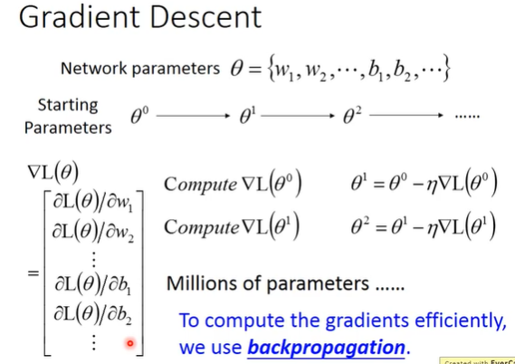

```
选一个初始的参数 θ0，计算 θ0 对 Loss Function 的 Gradient。
也就是计算 Network 中的 每一个 w,b 对 L(θ) 的偏微分。
计算出 L(θ) 之后，它就是一个 vector，然后就可以更新参数。

在 Neural Network 中，和在 Logistic Regression、Linear Regression 使用的 Gradient Descent 方法的时候是没有太多差别的。
但在 Neural Network 中有更多的参数，所以我们使用 Backpropagation。
```
