>**Neural Network 使用的方法**


```
选一个初始的参数 θ0，计算 θ0 对 Loss Function 的 Gradient。
也就是计算 Network 中的 每一个 w,b 对 L(θ) 的偏微分。
计算出 L(θ) 之后，它就是一个 vector，然后就可以更新参数。

在 Neural Network 中，和在 Logistic Regression、Linear Regression 使用的 Gradient Descent 方法的时候是没有太多差别的。
但在 Neural Network 中有更多的参数，所以我们使用 Backpropagation。
```
>**Chain Rule**

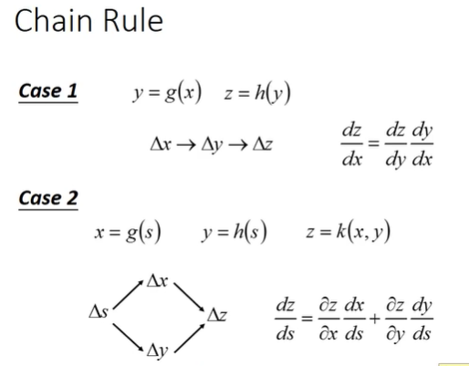
```
链式法则
高数
```

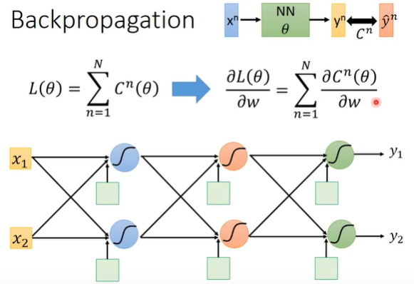
```
 ∂ L(θ)   N  ∂ C(θ)
———— = ∑ ————
   ∂ w 		n=1	 ∂ w
Cn 是 yn 和 y^n 的 summarize	-	Cross Entropy
通过计算偏微分找到最好的 θ*
```
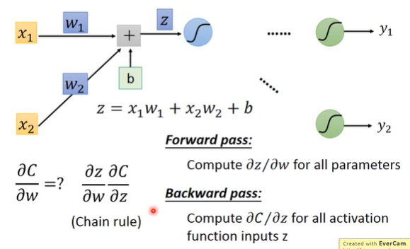
```
计算其中一个 neuron。
使用 w 计算 Cross Entropy 偏微分
```
>**Forward pass**

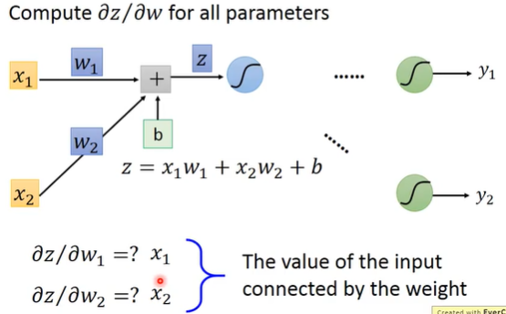
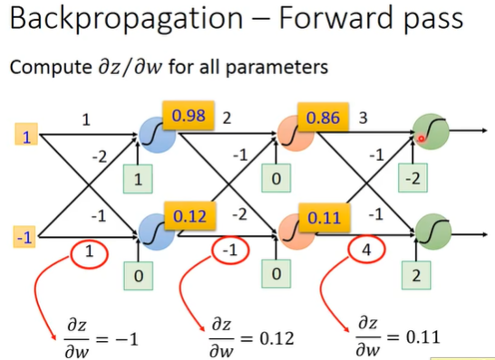
```
计算 w1 & w2 对 Cross Entropy 偏微分
∂z/∂w1 = x1
∂z/∂w2 = x2
```
>**Backward pass**

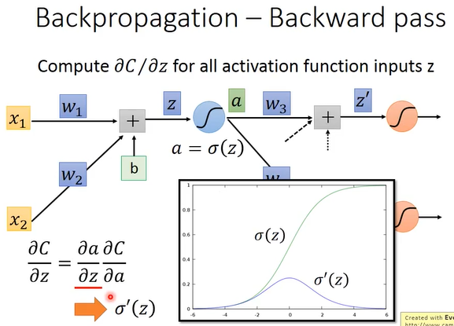
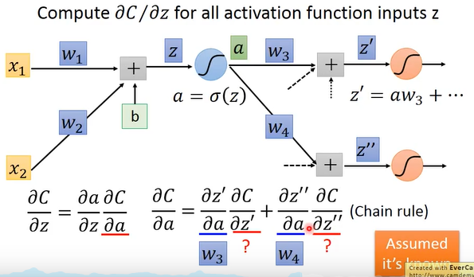
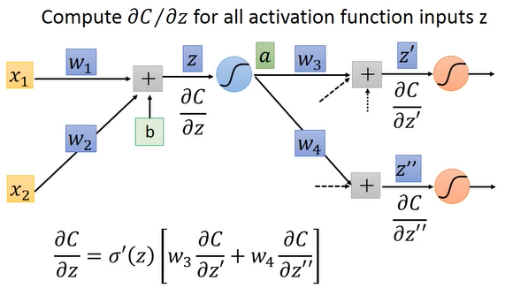
```
计算出 ∂a/∂z
计算出 ∂C/∂a
∂C/∂z = 
```
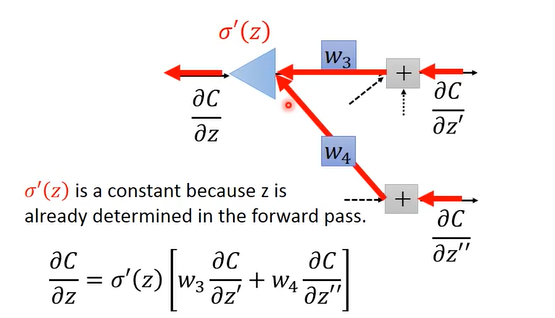
```
从后往前算，z 在 forward pass 的时候就是一个 constant，σ'(z) 也是一个常数
计算的时候是把 input * σ'(z) = output。
```
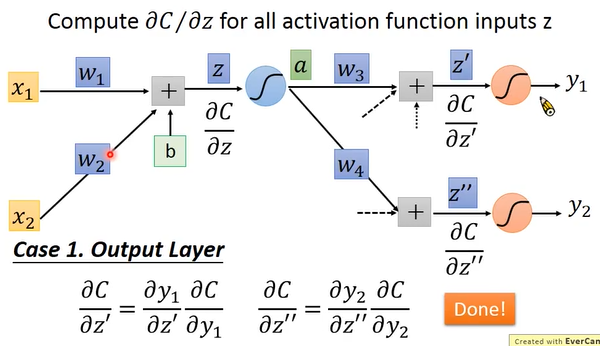
```
Case 1: 假设‘红色’区域的就是整个 output 的 output layer
如果知道 output 和 target 怎么做 evaluate 的，可以用 Cross Entropy、root mean square error。最终是可以把它计算出来。
```

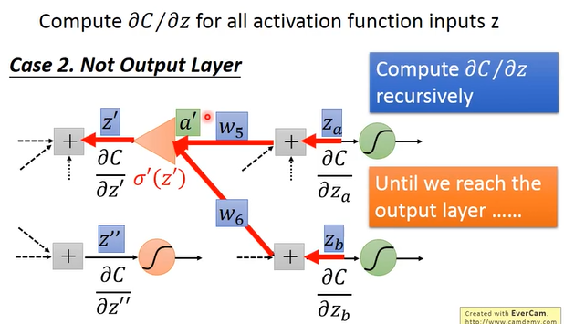
```
Case 2: 不是整个 output 的 output layer
就需要一直往后推，一直推到整个 output 的 output layer，再把计算的结果往前一步一步计算。
实际上，并不是从前往后推理计算
```

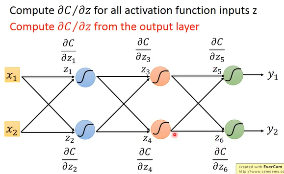
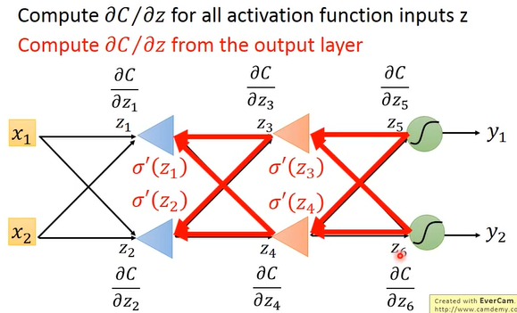
```
如果正向计算，就没有效率，如果反过来计算，就会有效率。
```

>**Summary**

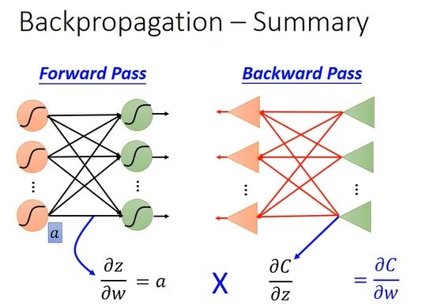