### 1、Probabilistic Generative Model

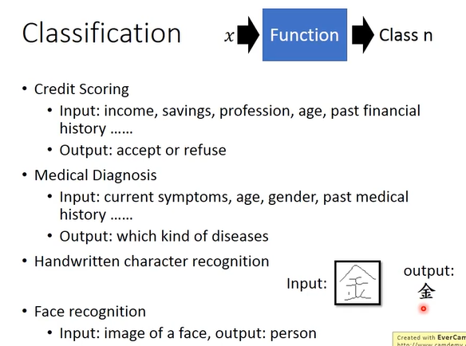
```
Classification 的应用
	- Credit Scoring
	- Medical Diagnosis
	- Handwritten character recognition
	- Face recognition
	...
```
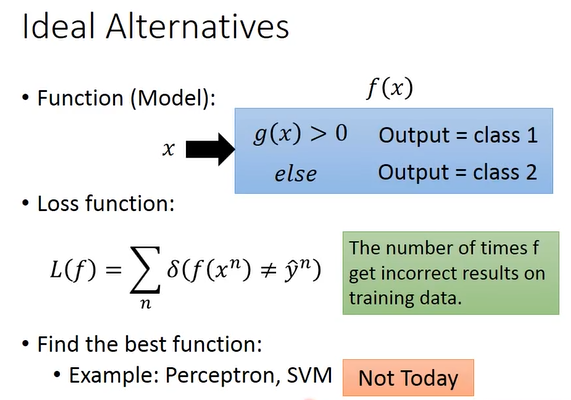
```
寻找一个 function，在这个 function 中再找一个 function 对 input 的 x 进行判断。
```
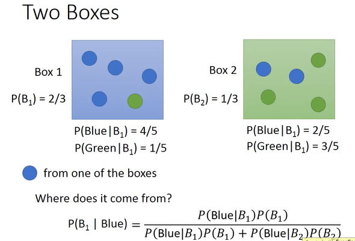
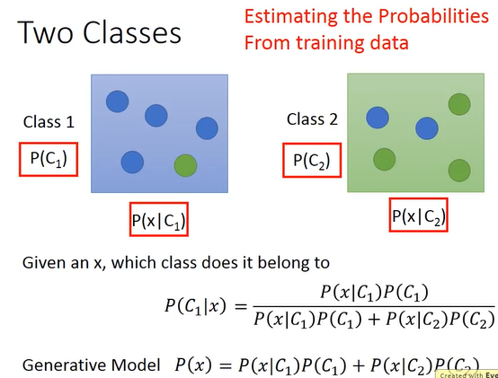
```
概率论
```
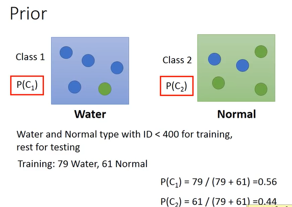


>**Gausian Distribution**

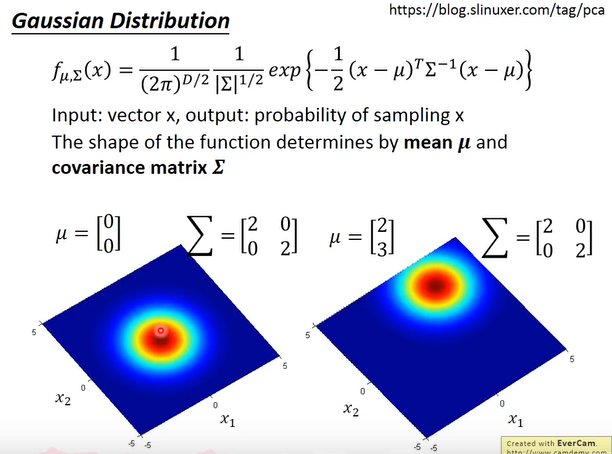

```
同样的 ∑，不同的μ，他们的几率分布最高点是不一样的
同样的μ，不同的 ∑，几率分布最高点一样，但是散的程度是不一样的
```
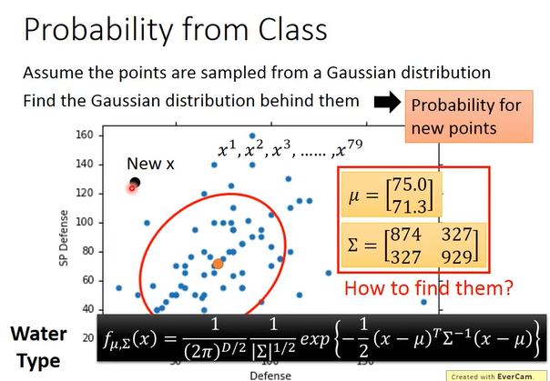
```
根据 79 个点估测出 μ 的位置，∑是红色圆圈的分布范围。
当有一个新的点出现，知道 μ和 ∑就是把 Gausian 写出来，将 x 代进去，可以算出 sample 出来的几率
```
>**如何寻找 μ 和 ∑**
```
利用 Maximum Likelihood 这个概念
```
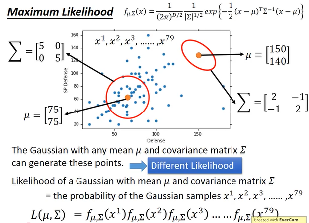

```
任何一个 Gausian 都有可能 sample 出这 79 个点，只是有些点的几率比较低。
从 Gausian 中 sample 出一个 point，这个 point 可以是整个空间上的任意一个点，只是有些几率很高，有些几率很低，但没有一个地方几率等于 0 的。
虽然每个 Gausian 都有可能 sample 出这 79 个点，但这些 point 的 Likelihood 是不一样的。
```
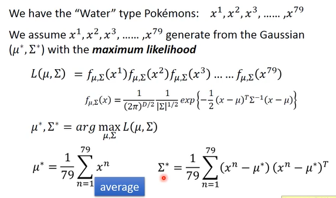
```
找到一个 Gausian，这个 Gausian 是 sample 这 79 个点的几率是最大的，这个 Gausian 就记为 sample 出这 79 个点的最好的 Gausian。
```
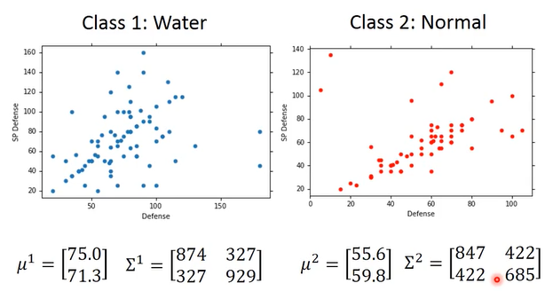
```
结果：μ1，∑1	μ2，∑2
有了这些 μ，∑ 就可以写出 Gausian 了，就可以做分类任务了。
```
>**Do Classification**

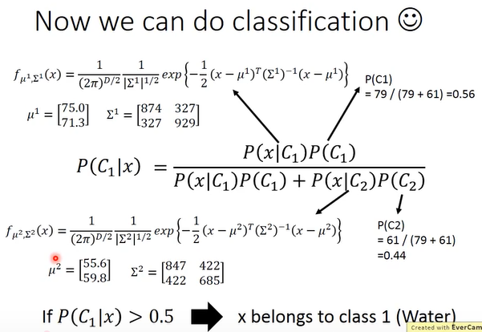

>**Modifying Model**

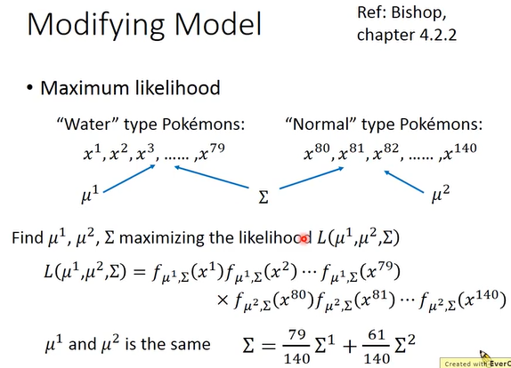
```
共用通一个 ∑
μ1，μ2 取平均值
共同的 ∑ = (79/140)∑1 + (61/140)/∑2
```
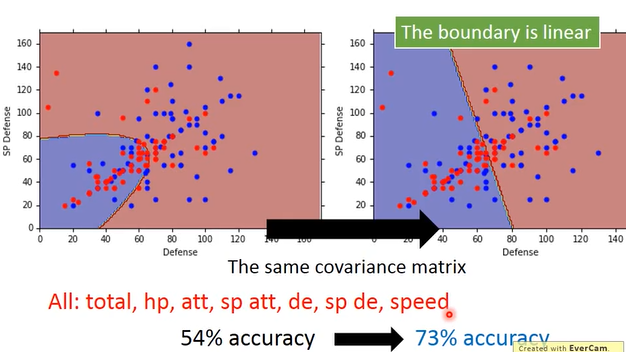
```
使用不同 ∑(convariance)时: 不是 Linear Model
使用同一 ∑时: 是 Linear Model
因为分两个 Class 的 boundary 是 linear 形式的，所以可可以称为是 linear model
```
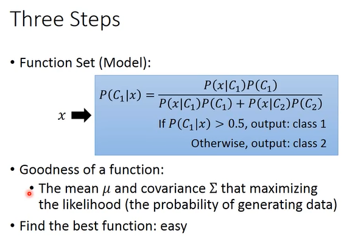

```
三个步骤
·Function Set(Model):
	里面的 function 都是一样的类型
·Goodness of a function:
	evaluate 这 function set 中每一个 function 的好坏，其实就是 evaluate 这 Gausian 中的 参数μ、∑，产生的 likelihood 就是这组参数的好坏，找一个 probability distributiony，它可以最大化产生 likelihood。
·Find the best function:
```
>**Posterior Probability**

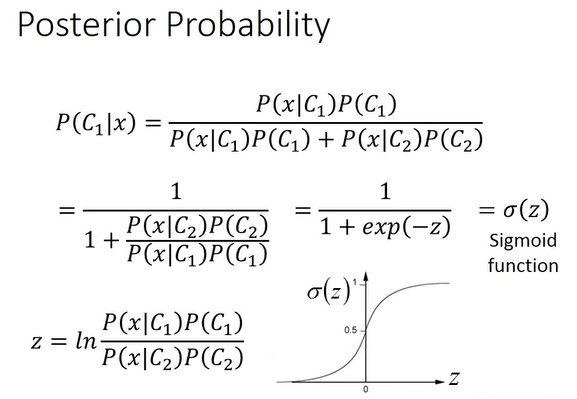
```
sigmod 函数的来源
```
>**Warning of Math**

