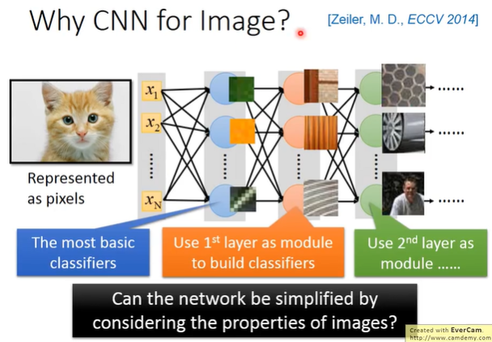
```
在 train 一个 Neural Network 的时候，每一个 neuron 都是一个 classifier。
当我们直接用一般的 Fully Connect Network 做影像处理的时候，往往需要太多的参数。
例如: 这个图像是 100x100x3 的彩色图，把它拉成一个 vector，是一个 30000 维的 input，假如 Layer 1 只有 1000 个 neuron，则需要 30000 x 1000 个参数。
CNN 简化 Neural Network 架构，根据人对影像的理解，某些 weight 是用不上的，就可以先把它抹掉。
```

> **为什么用比较少的参数就可以做影像处理**

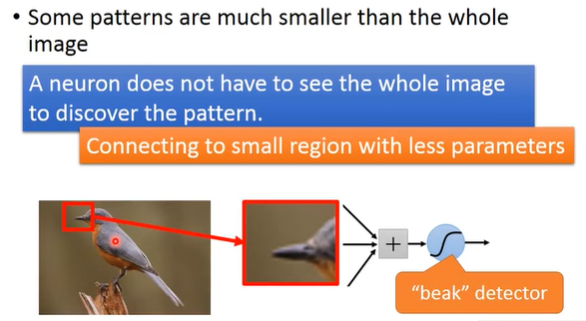
```
假设某一个 neuron 是侦测有没有鸟嘴的存在，它并不需要看整张图，它只需要看图像的一部分。
```
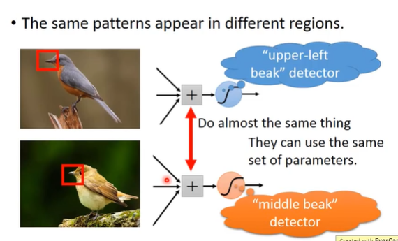
```
同样的 pattern 出现在图像中不同的部分，但代表同样的含义，有同样的形状，用同样的 neuron，同样的参数就可以侦测出来。可以共用一组参数，就可以减少参数的使用量。
```
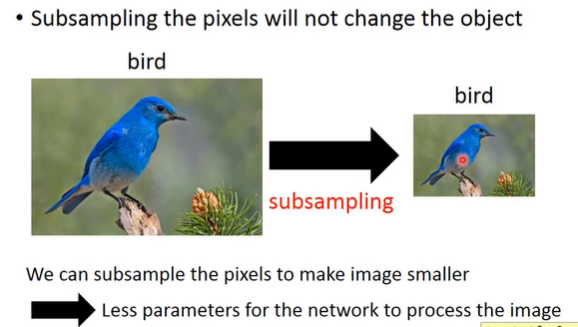
```
可以把 奇数行，偶数列拿掉，不会影响人对这张图像的理解。可以用这个概念使得 image 变小，可以减少参数的使用量。
```

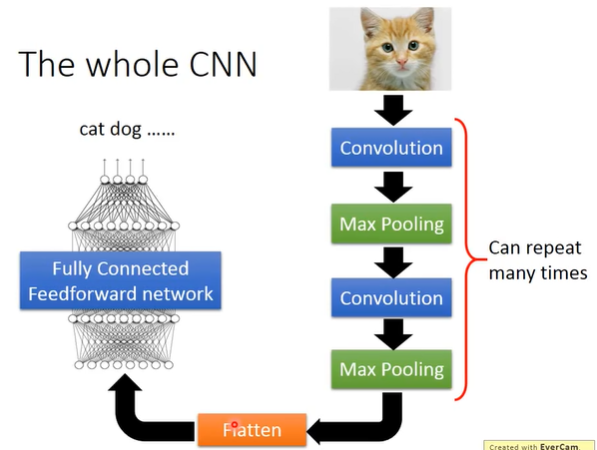
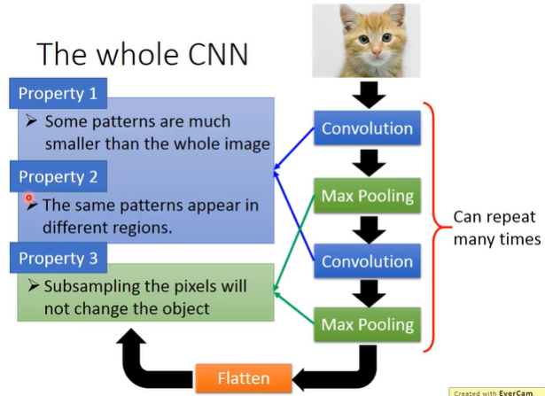
```
p1、p2 使用 Convolution，p3 使用 Max Pooling
```

### Convolution

> **黑白色图**

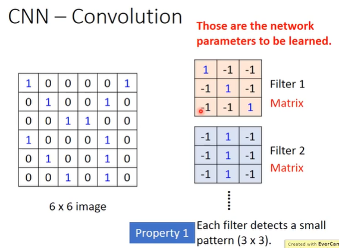
```
每个 Convolution 都有一组 filter，每一个 filter 都是一个 matrix，每个 filter 中的每一个参数就是 network 的 parameter，和 weight、bias 一样，是学出来的，不是自定义的。
```
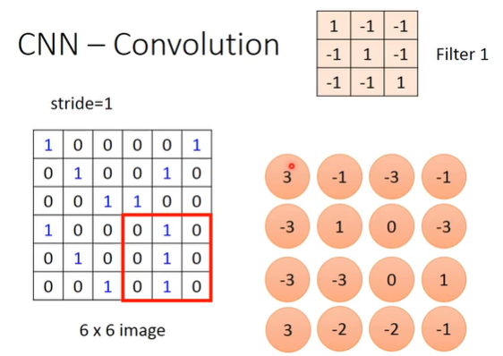
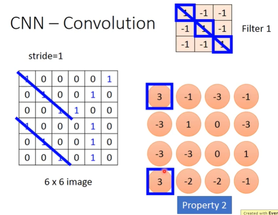
```
内积
图像和 filter 做内积，6x6 变成了 4x4
同一个 pattern 出现在左上角和左下角，是可以用同一个 filter1 侦测出来。
```

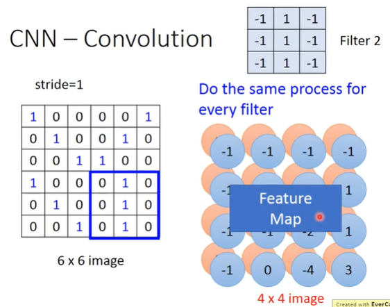
```
把 filter2 和 image 做完 Convolution 之后，得到新的 4x4 的 Matrix，两个合起来叫做 Feature Map。
```
> **彩色图**

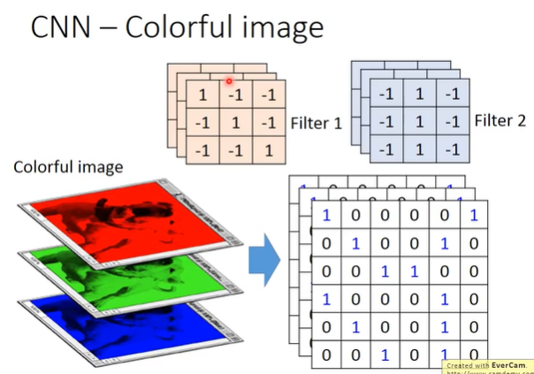
```
此时的 filter 不是一个普通的 Matrix，image 上的每一个 channel 都和 filter 做内积。
```

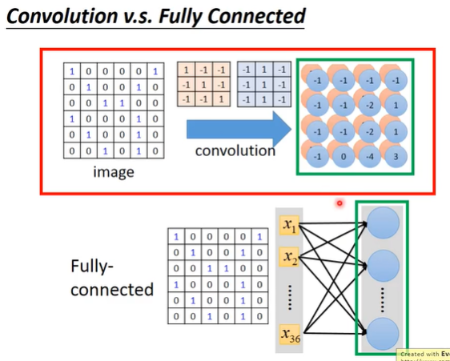
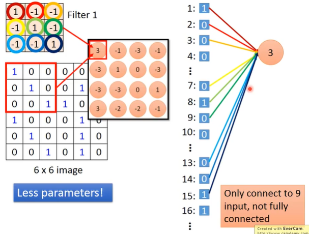
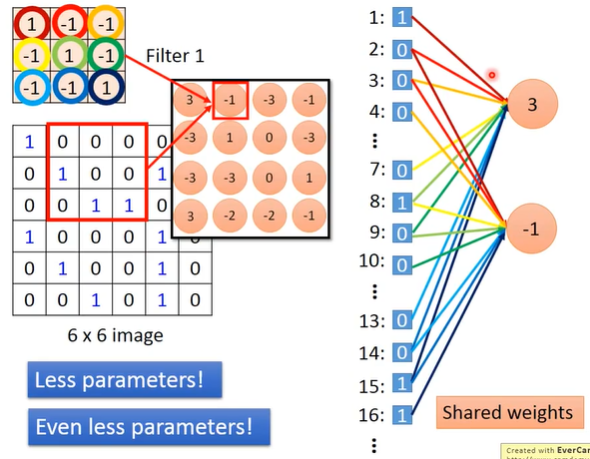
```
Convolution 就是 Fully Connected 拿掉一些 weight 的结果。某些 neuron 要共用同一组 weight。
```

### Max Pooling

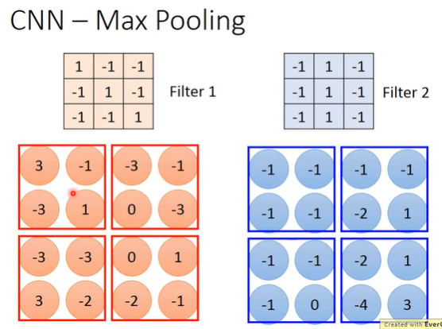
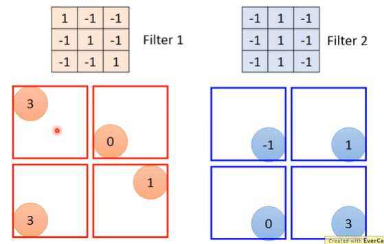
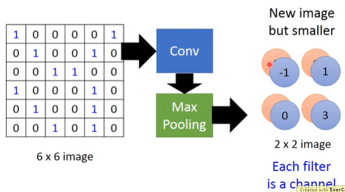
```
选择四个里面最大的保留下来。
做完一次 Convolution 和 Max Pooling 之后，把原来 6x6 的 image 变成一个 2x2 的 image，每一个 pixel 深度是根据 filter 的数量来的。
```
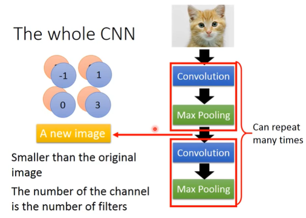

### Flatten

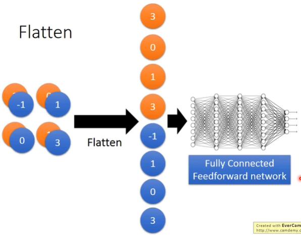
```
把 Feature Map 拉直，然后做 Fully Connected。
```

### Keras

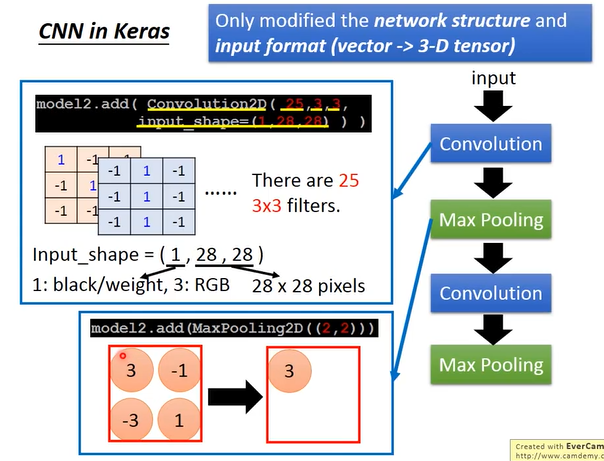
```
Convolution2D(25,3,3): 25个 3x3 的 filter
Input_shape(1,28,28): 黑度图，28x28 pixel
MaxPooling2D(2,2): 2x2 中选取最大的
```
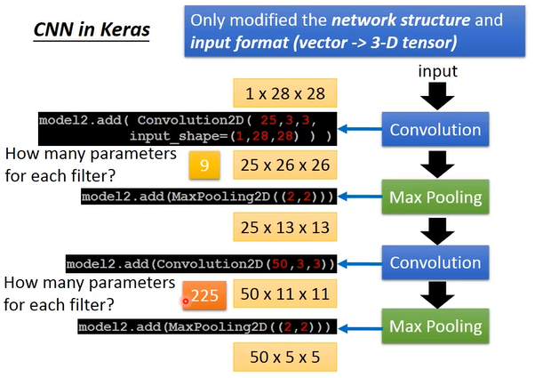
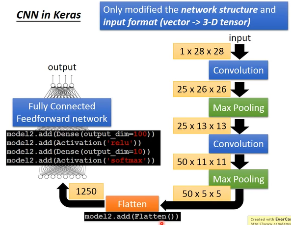


### What does CNN learn?

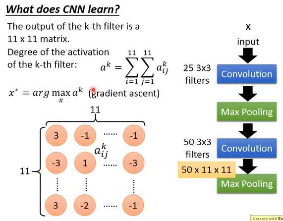
```
怎么分析 filter 做的什么工作呢?

在第二个 Convolution 中，有 50 个 filter，每一个 filter 的 output 都是 11x11 的 matrix，把第 k 个 filter 拿出来。
定义第 k 个 filter 的 Degree of the activation(活化程度)，将 features map 第 k 层的结果加起来作为第 k 个卷积核的激活程度。input 和 第 k 个 filter 有多相近，多 match。
第 k 个 filter 启动的 degree，定义成它的这 11x11 matrix 里面的全部 element 的 summrization。看这个 filter output 的 11x11 个值，把它们都加起来，当作现在这个 filter 被 active 程度。
找一个 input x，使得 ak 最大。model 的参数是固定的，使用 Gradient Descent update 这个 x，可以让 Degree of the activation 是最大的。
```

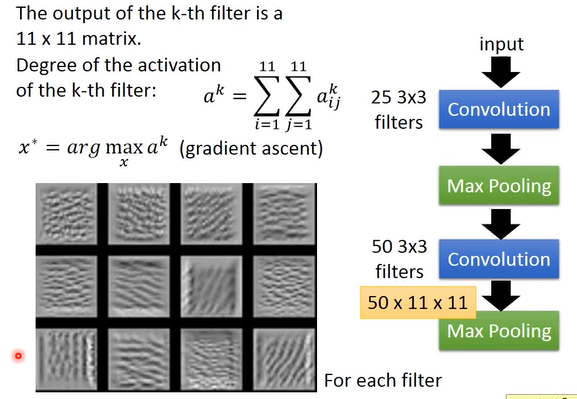
```
每个 filter 找一个 image，使得 Degreeof the activation of the-k-th filter最大。
每个 filter detect 不同角度的线条，如果 input 有不同角度的线条的话，就会让某一个 filter output 的值最大。
```

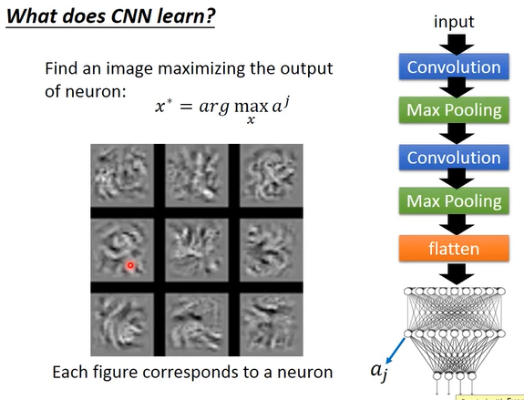
```
在 Neural Network 中每一个 neuron 的工作是什么？
定义第 j 个 neuron，找一张 imges x，把 imges x 放入 Neural Network 中，可以让 aj 的值 maximize。侦测的是比较大的 pattern。
```

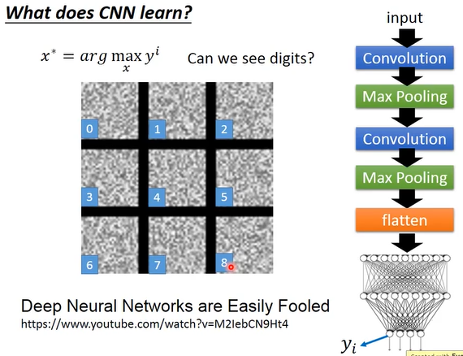
```
如果考虑的是 output?
假如 output 是 10 维的，拿出其中的 一维，找一张 images x 使得这一维最大。
可以找到让 output layer 中的对应到 0（1，2...） 的那个 neuron，它的 output 最大的 image。
```

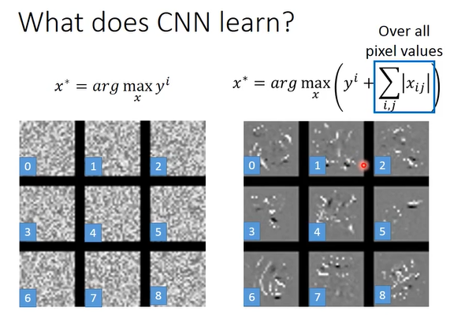
```
如何让上面的黑白点图更像数字呢？
对数字来说，只有一整张图的某一个小部分有笔画，所以需要对 x 做一些限制。
希望找一个 x 可以让 yi 最大时，summiation 越小越好。
```

### Deep Dream

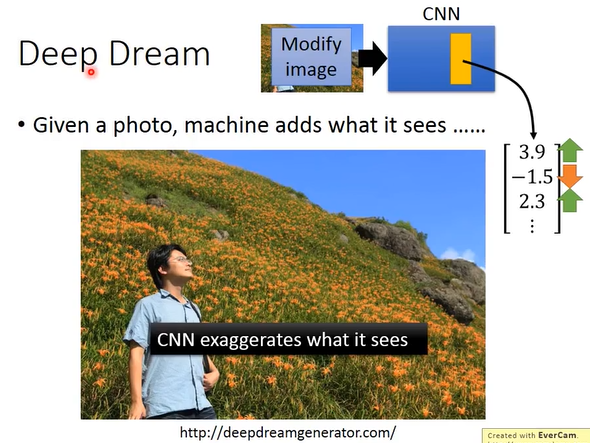
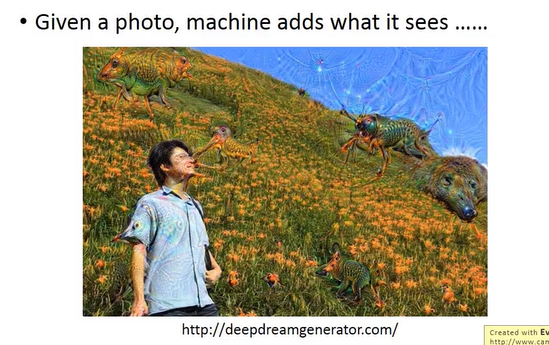
```
把 positive 值调大，把 negative(passive) 值调小。
让 CNN 夸大化它看到的东西。强化它看到的东西，那它就会看到另类的东西。
```
### Deep Style

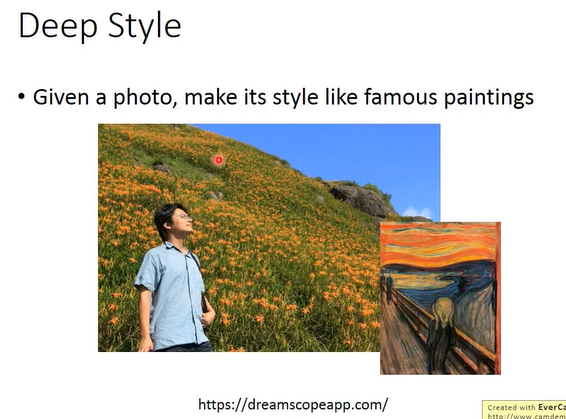
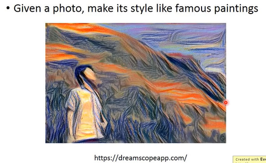
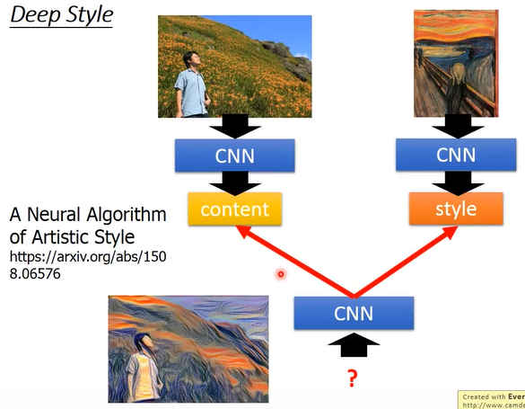
```
让一张图有另外一种图的风格。
把原图丢给 CNN，得到 filter 的 output，CNN filter 的 output 代表这张 image 里面有什么样的 content。
把‘呐喊’这张图丢到 CNN 中，得到 image 的 output 的 filter 之间的 correlation。
用同一个 CNN 找一个 image，它的 content 像左边那张，它的 style 像右边这张。
```

### 什么时候该用 CNN

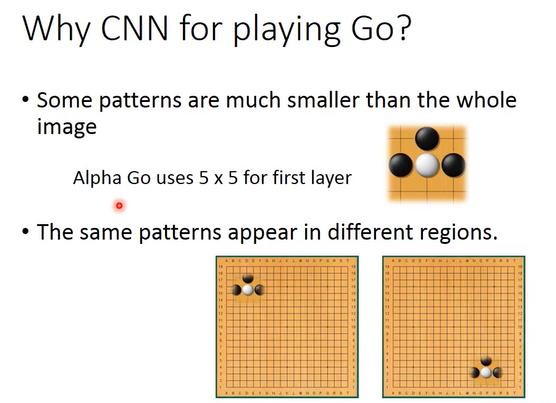
```
需要有 image 该有的特性，CNN 处理 image 时特别有效。
Alpha Go 是有 image 特性的。
对棋盘不能使用 Max Pooling。
```
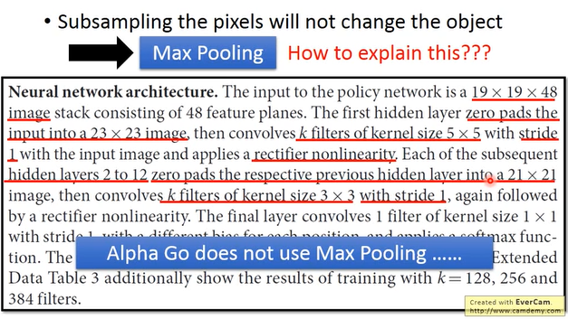
```
Alpha Go 没有用 Max Pooling
```

### More Application
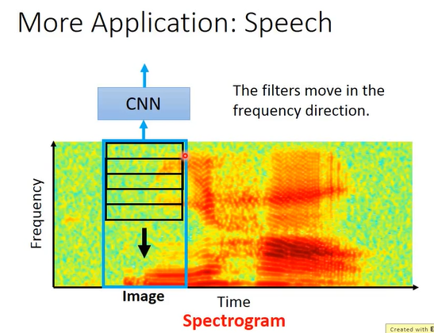
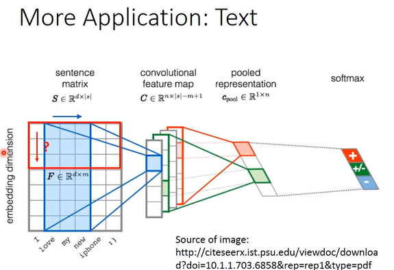
```
Speech: 声音
Text: 文字处理
```
### To learn more

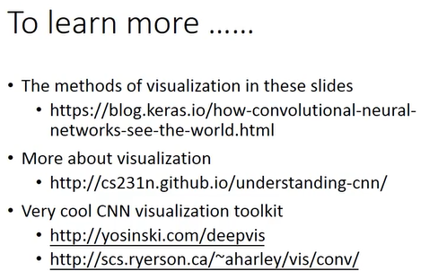

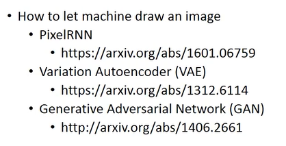