>**Attracts lots of attention**

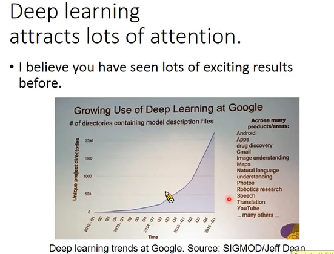
```
谷歌内部应用方面很广
去搜索一下
```
> **Ups and downs of Deep Learning**

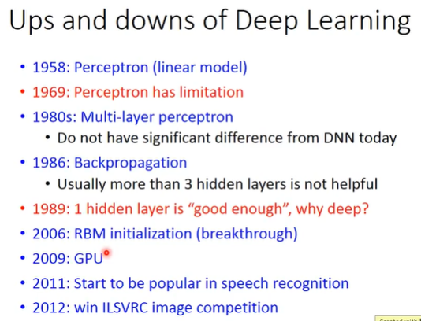

>**Three Steps for Deep Learning**

### 1、Define a set of function

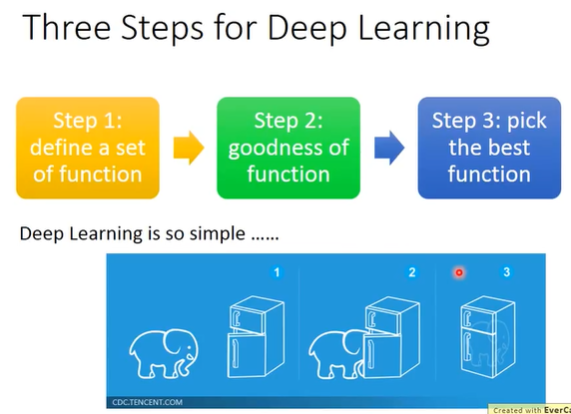

```
每个 Logistic Regression 都有不同的 weights 和 bias。
```
> **Fully Connect Feedforward Netword**

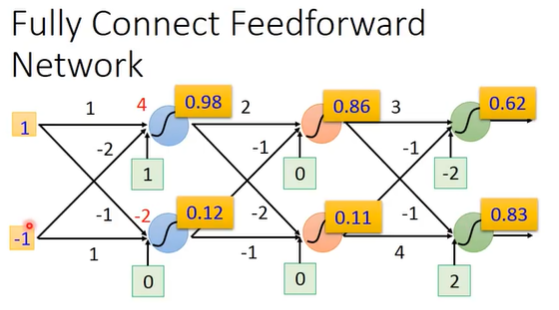
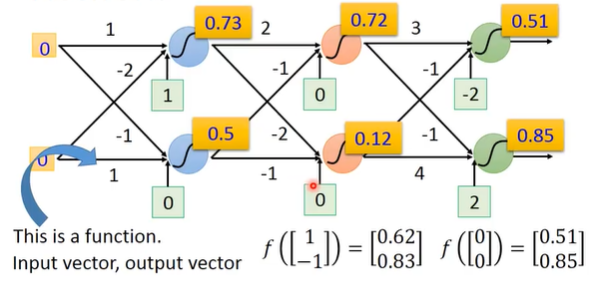

```

```
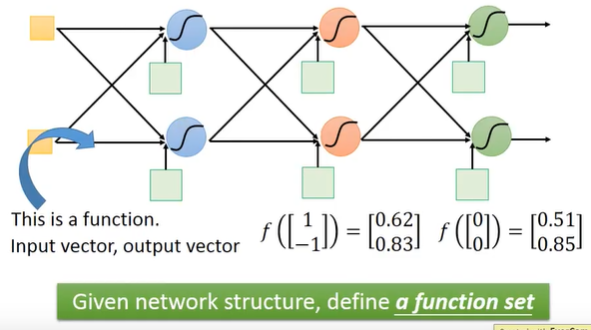
```
一个 network 如果还没使用参数使它架起来，其实它就是一个 function set。
```
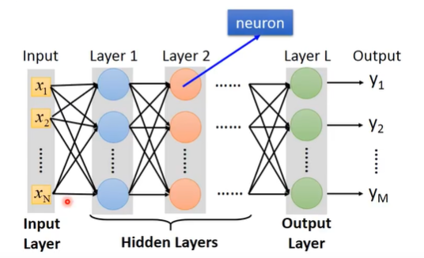
```
整个 network 需要一组 input,对每一个 Layer1 的 neuron 来说，每个 neuron 就是 input layer 的每一个 dimension。
```

>**Deep 的定义**

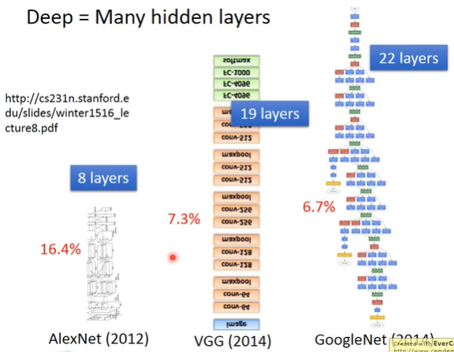
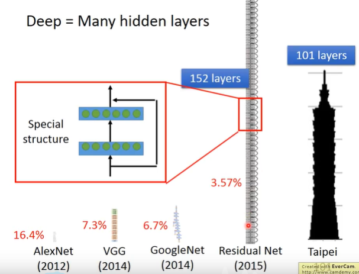
```
Residual Network 不是一般的 Fully Connect Feedforward Netword。
```
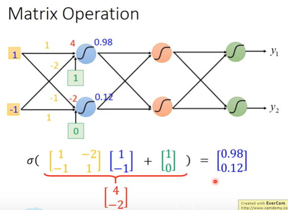
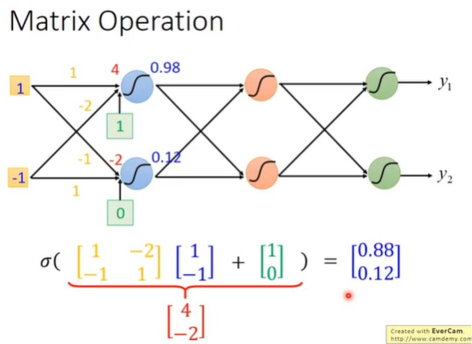
```
使用 matrix（矩阵） 计算
```

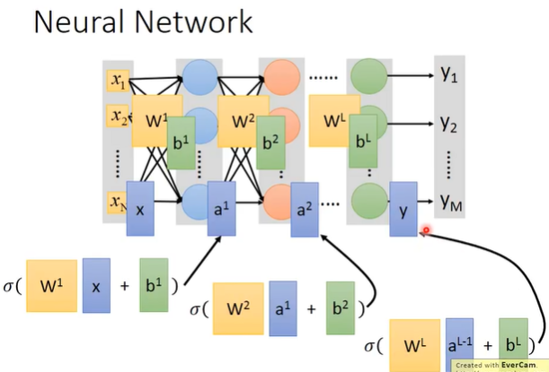
```
将第一层的 weights 集结起来，当成一个 matrix w1，把全部的 bias 集结起来当成 matrix b1，后面依次如何
把 input layer 的 x 集结起来当成 matrix x.
计算结果
```
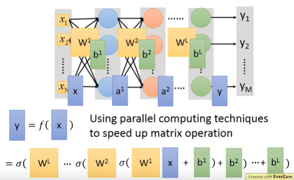
```
matrix operation。
```
> **Output Layer**

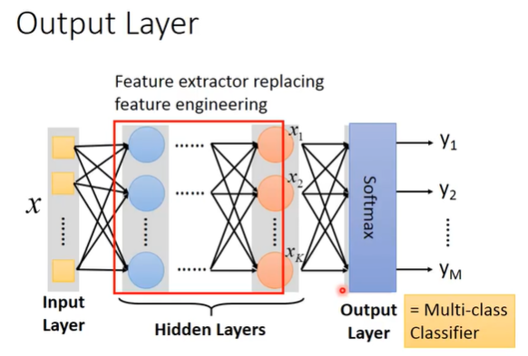
```
Feature extractor 代替 以前的
```

> **Example Application**
 
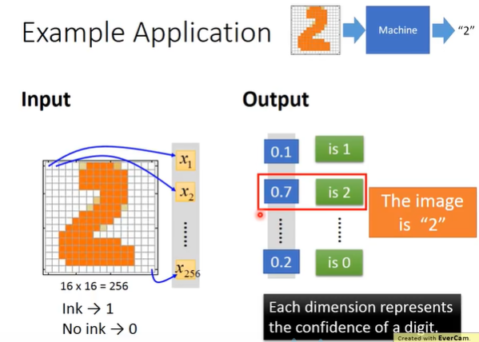
```
手写数字识别，需要一个 function
```
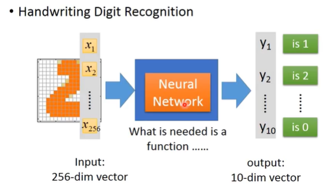
```
需要一个 Neural network
```
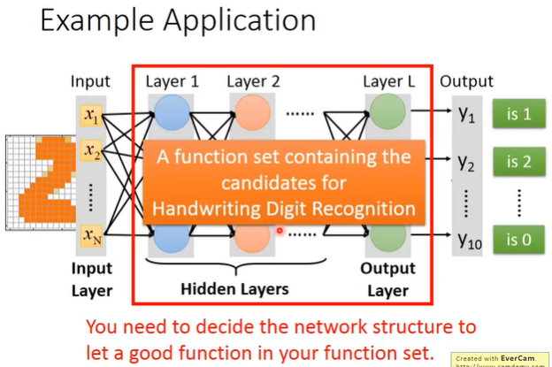
```
intput: 256维
output: 10维
制作一个 function 需要我们自己 design:
自定义 input layer 的维度
自定义 output layer 的维度
自定义 hidden layer 的层数
```
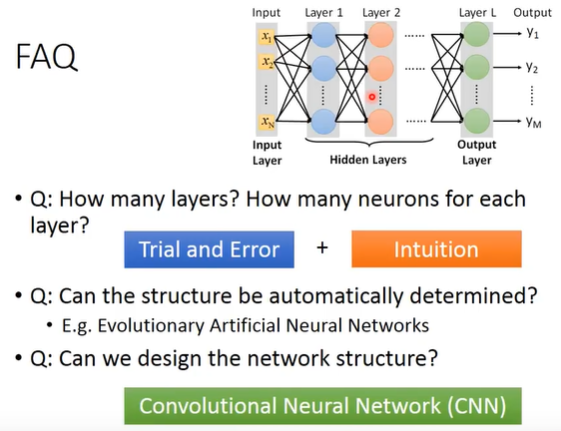

### 2、Goodness of function

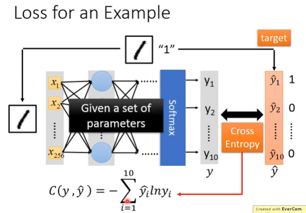
```
input 这个 image，通过 Neural network，得到一个 output，记为 y
然后计算 y 和 y^ 的 cross entropy，调整 Neural network 参数，使得 cross entropy 越小越好。
```
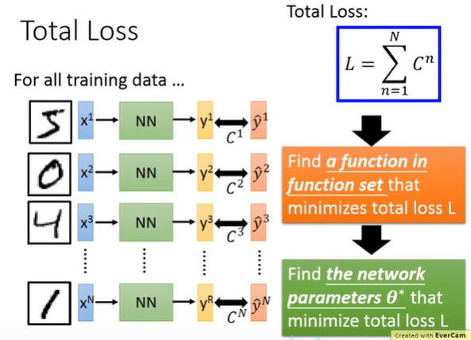
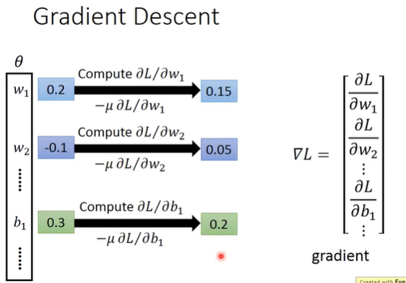
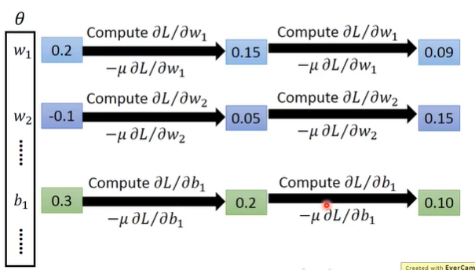

> **计算微分的框架**

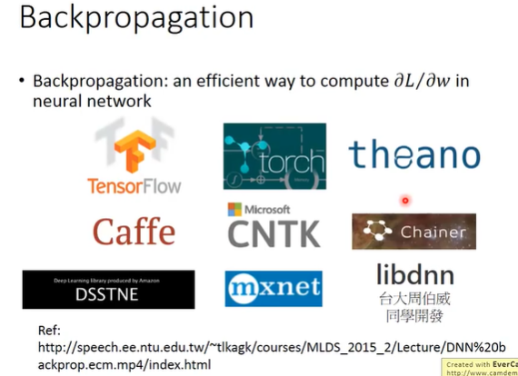

> **视频**

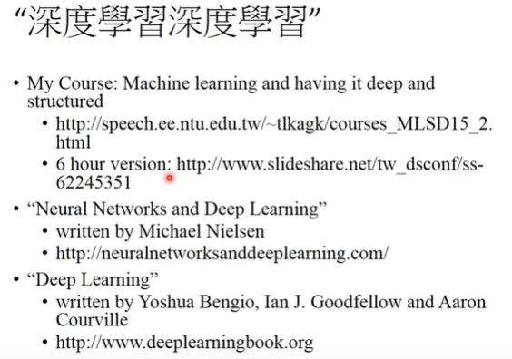