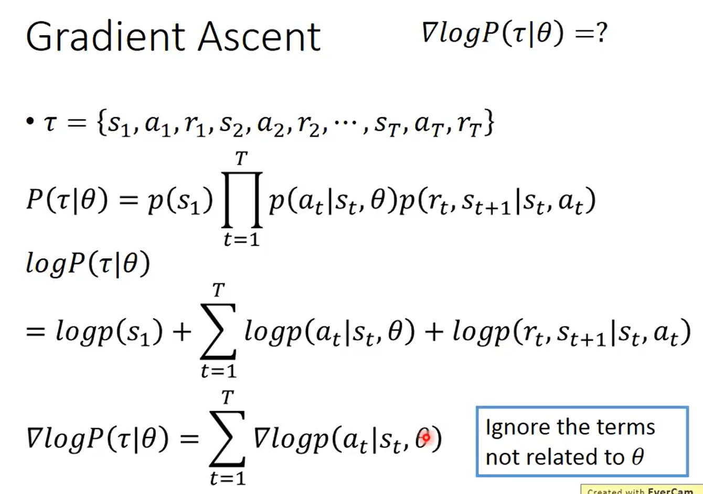
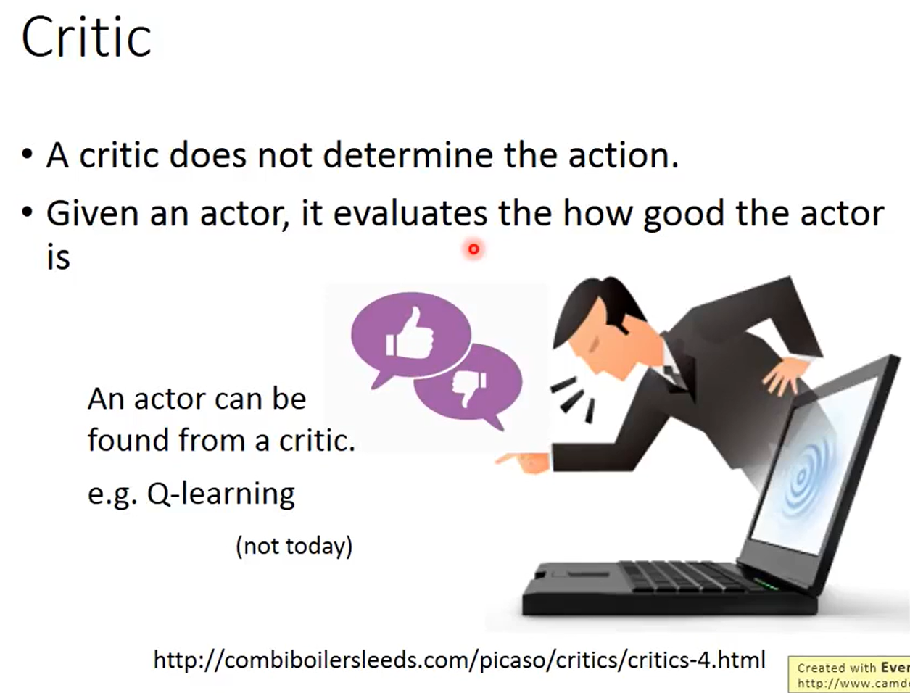
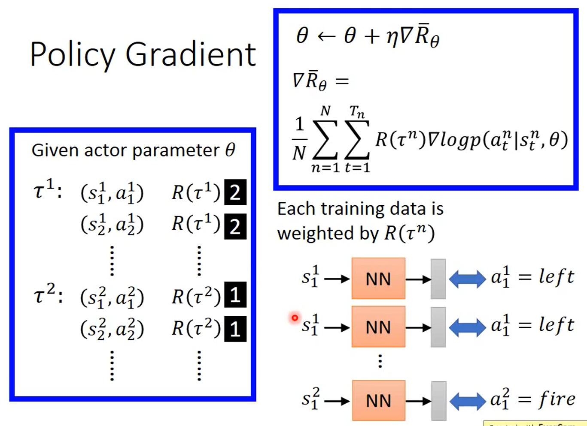

```
pass
```

### Scenario of Reinforcement Learning


```
Agent: 会有 Observation(又叫做 State)，会看事件
State: Environment 的状态，不是系统的状态
Action: 即 machine 做的工作，会影响环境
Reward: 告诉 Agent 是好的还是不好的

抽象举例：
machine 看到一杯水，然后 machine take a action，action 是把水打翻。Environment 就得到一个 negative reward，在 reinforcement learning 里面这些发生的事情都是连续的。接下来 machine 看到的 Observation 就是水被打翻了。 
```

```
接下来 machine 看到的 Observation 就是水被打翻了，然后 take a action，然后 machine 要把它马上擦干净，Environment 就得到一个 positive reward。
```

>**Learn to play Go**


```
一开始 machine 的 Observation 就是一个棋盘(19x19)，take a action，action 是放一个棋子到棋盘上。Environment 就是对手下棋的位置。 
```

```
接下来看到新的 Observation 之后，会决定一个新的 action，machine 新再放一个棋子到棋盘上。
```

>**Learn to play Go - Supervised v.s. Reinforcement**


```
· Supervised
Supervised Learning 可以 learn 一个会下棋的 Agent，但是不是最厉害的 Agent。
是通过老师学习。
· Reinforcement
找人下围棋，if win，就得到 positive reward。
if fail，就得到 negative reward。
是从过去的经验中学习。

Alpha Go is supervised learning + reinforcement learning
```

>**Learning a chat-bot**


```
Reinforcement Learning 也可以用在 chat-bot 上。
之前是 learn 一个 sequence-to-sequence model，input 是一句话，output 是机器的回答。
```

```
· Supervised
有 label 的 training，即有人对 chat-bot 说 "Hello"，chat-bot 就要回答 "Hi"。
· Reinforcement
让 machine 胡乱跟别人讲话，自己判断结果。
```

>**Learning a chat-bot - Reinforcement Learning**


```
learn 两个 Agent。
```

```
需要定义一些 rules to evaluate 对话的好或不好。
可以用 GAN 做 chat-bot。
```

### More applications


>**Example: Playing Video Game**


### Dfficult of Reinforcement Learning


```
· Reward delay
· Agent's actions affect the sunsequent data it receives
```


### Policy-based Approach


```
learn a Actor
这个 Actor 通常写成 π，input 就是 machine 看到的 Observation，output 就是 machine 采取的 action。通过 reward 找出 Actor（有些文献是叫 policy）。
```

### Three Steps for Deep Learning


#### Neural Network as Actor


```
这个 NN 的 input 就是 machine 看到的 Observation，这个 Observation 是一个 pixels，可以把它表示成 vector or matrix。output 就是可以采取的 action。output 只需要三个 neuron，(left,right,fire)。
这个 NN 怎么决定这个 Actor 采取哪一个 action 呢？
通常做法是把 image 丢到 NN 中，然后 output 出的 dimension 会有对应的 score。
在做 Policy Gradient 的时候，会假设 Actor 是 ，Policy 是 
NN 是 generalization 的。
```

#### Goodness of Actor


```
假设有一个 Actor，这个 Actor 是一个 NN，假设它的参数是 θ，所以 actor 会用 πθ(s) 表示，input 就是 s，s 就是 machine 看到 Obversation。
怎么知道一个 actor 是好还是不好呢？
通过一个 video game。
玩完之后得到的 Total Reward 可以写成 Rθ，Rθ 才是需要 maximize 的。
即使用的听一个 actor 玩的这个 game，得到的 Total Reward Rθ 也是不一样的。
Rθ 是 random 的。所以做的是不是去 maximize 某一次玩游戏得到的 Rθ，希望 maximize 的 Rθ 的期望值。
```

```
期望值要怎么计算出来呢？
假设一场游戏就是一个 trajectory τ，τ 是一个 sequence，R(τ) 是这个 trajectory τ 在这场游戏里面最后得到的 Total Reward。
当用某一个 actor 玩这个游戏的时候，每一个 τ 都有一个出现的几率，τ 是随机过程，当选择 actor 的时候，只有某一些 τ 特别容易出现，即某一些游戏过程容易出现，每一个游戏出现的过程可以用一个几率表示。
P(τ|θ)：当 actor parameter 是 θ 的时候，τ 这个过程出现的几率。
实际上穷举所有的 τ 是不可能的，而是让 actor 玩这个游戏 N 次，得到{τ1,τ2,...τN}，这 N 场就像 N 笔 training data。
玩 N 场游戏就好像从 P(τ|θ) sample 出 N 个 τ 出来。
```

#### Pick the best Actor


```
通过 Gradient Ascent 找到最好的 Actor。目标是最大化 Rθ拔。
随机找一个初始 θ0，初始的 actor。
```


```
R(τ) do not have to be differentiable It can even be a black box.
```




#### Add a Baseline


```
有问题。
```

```
加一个 bias。有正有负。
```



#### Policy Gradient


```
首先 random initial 一个 actor θ，用 initial θ 玩 N 次游戏，就会收集到 N 个 trajectory τ。
τ1：(s11,a11) R(τ1)
		(s12,a12) R(τ1)
		...
τ2：(s21,a21) R(τ2)
		(s22,a22) R(τ2)
		...
有了这些 data 之后，就可以用这些 data update 参数 θ。update 参数以后，就会有一个新的 actor，再次玩游戏  N 次。
```

>**Considered as Classification Problem**


```
有一个 actor，把这个 actor 当成 classifier，这个 classifier 做的事情是 Given 一个画面 S，它分类说应该采取哪一个 action(left,right,fire)。
minimize cros-entropy。
```


