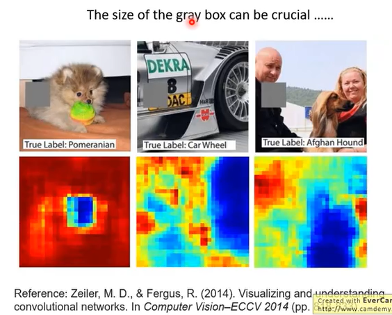

### Local Explanation

> **Basic Idea**


```
假设有一个 Object x，将 x 分成 pixel 或者 segment。

Local Explanation 想要达成的目标是，我们希望机器可以告诉我们说在这个 object 里面，这些 component 里面哪一个 component 对它现在判断出的结果是重要的。哪一些对判断出的结果是不重要的。
如何做这件事呢？
即把某一个 component 拿掉，或者是做一些改动，如果发现对机器的判断，对它分类的结果造成非常大的影响的话，及
Large decision change -> Important component
```

>**Example**


```
在图片上贴上灰色的方块，这个方块可以贴在图片上所有的位置，蓝色区域对它判断是很重要的。
```

> **Saliency map**


```
另一种方法
假设有一张图片，它的 pixel 是 {x1,...,xn,...xN}。
把这张图片丢到 影像辨识器中，它会给我们一个答案 yk。
对机器而言，这张图片为什么是只狗呢？
就把 input 的某一个 pixel 加上 Δx，看加上 Δx 对 output yk 有多大扰动。
如果加上的 Δx 对输出的  Δy 造成很大的影响，就可以知道现在进行扰动的 pixel xn 是很重要的 pixel。
做 | Δy/Δx | 的偏微分 |∂yk/∂xn|，知道偏微分值的大小，根据偏微分的绝对值，知道某一个 pixel xn 对现在的 yk 而言是否重要。

可以做 saliency map
在 saliency map 上面每一个点的亮度都代表了 |∂yk/∂xn|，亮度越大，|∂yk/∂xn|越大。
```

>**To Learn More**


>**Limitation of Gradient based Approaches**


```
Integrated gradient
DeepLIFT
```

>**Attack Interpretation**


```
可以加一些 noise，让机器觉得说看到了这朵云才看到卡车。
```

### Globle Explanation


```

```