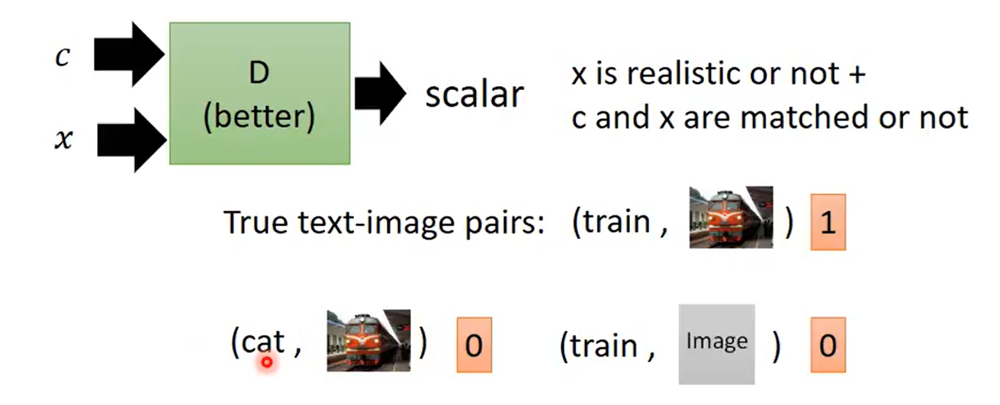

```
你可以输入比如文字，产生对应那个文字的图片。可以操控输出的结果。
```

### Text-to-Image


```
输入文字产生对应的图片，可以当作单纯的 supervised learning problem 来看，需要一大堆的图片，每一张图片都有对应的文字的描述。
输入一段文字，输出一张图片，希望输出的图片和目标越接近越好。
```

>**Conditional GAN**



```
在原来的 GAN 中，input 一个从 normal distribution sample 出来的 z 到 generator 里，根据这个 z 产生一张 image。
在 Conditional Generation 里，generator 不止需要 input z，同时还有 input Conditional c。
在原来的 discriminator 里，input image x，然后 discriminator 告诉你 x 的 quality 好不好。
希望机器按照我们输入的 condition，产生不同的 image。
在作 Conditional GAN 的时候，不可以只看 generator 的 output，要同时看 generator 的 input 和 output。input condition c 和 object x 到 discriminator，然后产生一个 scalar，这个 scalar 做两件事情
	1、x 是不是真实的
	2、x 和它的 condition c 合起来是不是可以凑成一对

有两种 case 要给低分的
	1、输入一段文字给 generator，generator 产生一张模糊的图给低分
	2、给一张清晰的图，但随便给它加上随机的文字，给低分
```
>**Conditional GAN - Algorithm**


>**Conditional GAN - Discriminator**


```

```
>**Stack GAN**


### Image-to-Image


>**Patch GAN**


>**Speech Enhancement**


>**Video Generation**


[小精灵](https://github.com/dyelax/Adversarial_Video_Generation)