```
有一些客观的方法来衡量说产生出来的 object 是好或者不好。
```
>**Likelihood**

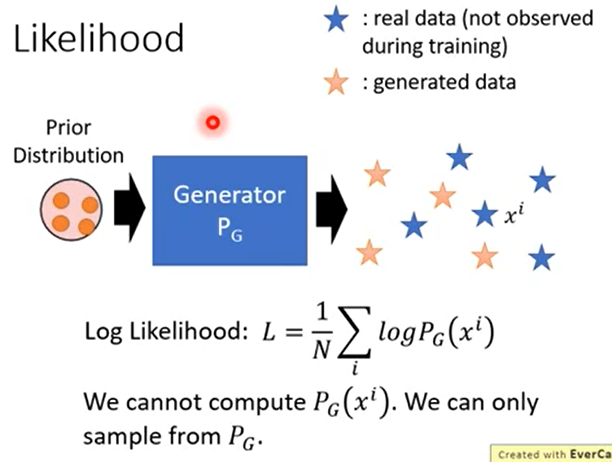
```
传统上衡量 generator，计算 generator 产生 data 的 likelihood，计算 PG Generator 产生 xi 这张 image 的几率，计算所有的再平均，就是 Likelihood，Likelihood 就代表了 generator 的好坏。
假设 Generator 是一个 network 用 GAN train 出来的话，无法计算 PG(xi)，这个 network 可以通过一些 vector 产生一些 data，但无法算出产生某一笔 data 的几率。
```

>**Likelihood - Kernel Density Estimation**

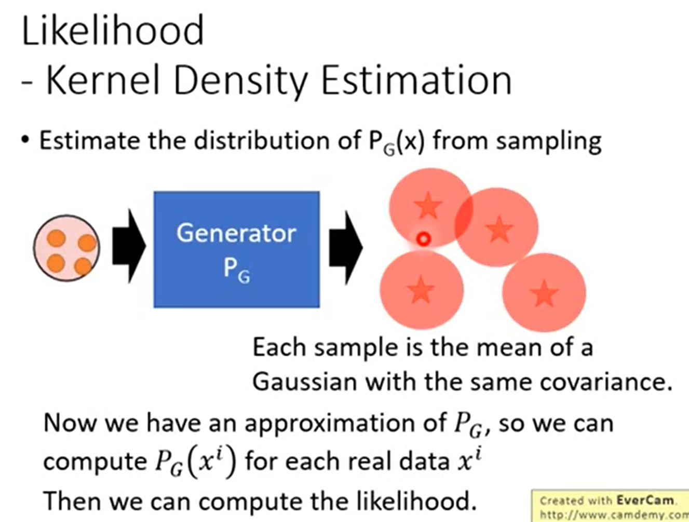
```
让 Generator 产生很多的 data，接下来再用一个 Gaussian distribution 逼近产生的 data。
假设有一个 Generator，让他产生一大堆的 vector 出来，如果是做 image generation 的话，产生的 image 就是 high dimension vector，把这些 vector 当作 Gaussian Model 的 mean，每一个 mean 有一个固定的 varince，然后再把这个 Gaussian 叠在一起，就得到了一个 Gaussian Model，
Gaussian Model 计算产生 real data 的几率，就可以估测出这个 generator 产生出 real data 的 likelihood。
```
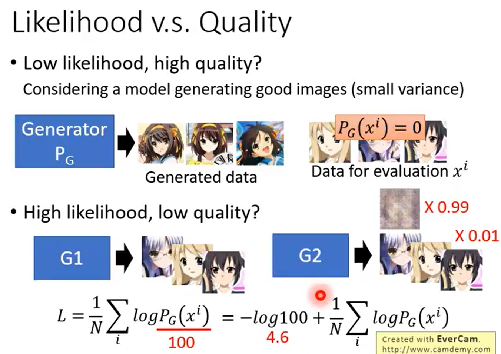

>**Objective Evaluation**

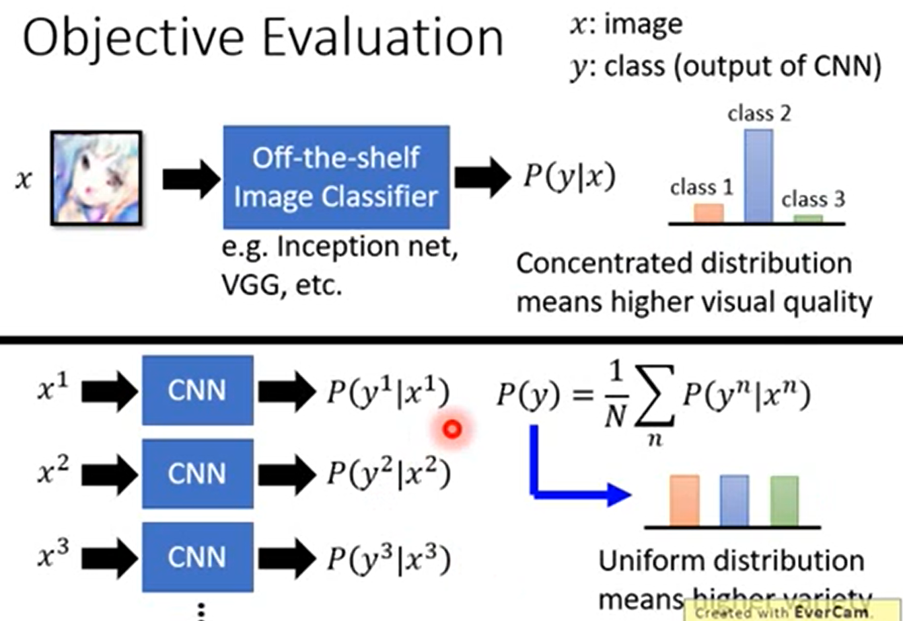
```
常常看到的一种 Evaluation function，是拿一个已经 train 好的 classifier 来评价产生的 object。可以是 VGG、Inception net。
1、input 一张 image 给 image classifier，它会产生一个 class distribution，给每一个 class 一个几率。如果产生出来的几率越集中，表示产生出来的图片的品质越高。它可以轻易判断出 image 的内容。
2、需要考虑 Mode Collapse 的问题，还需要从 diverse 的方向衡量，让机器产生一堆图（举例为 3 张 image），让这 3 张图丢到 CNN 里面，然后产生 3 个 distribution，把这 3 个 distribution 平均起来。如果平均后的 distribution 很 uniform，那就意味着说每一种不同的 class 都有被产生到，代表说产生出来的 output 是 diverse。如果平均后某一个 class score 特别高，mode 倾向于产生 x 的东西，就代表它的 output 不够 diverse。
```

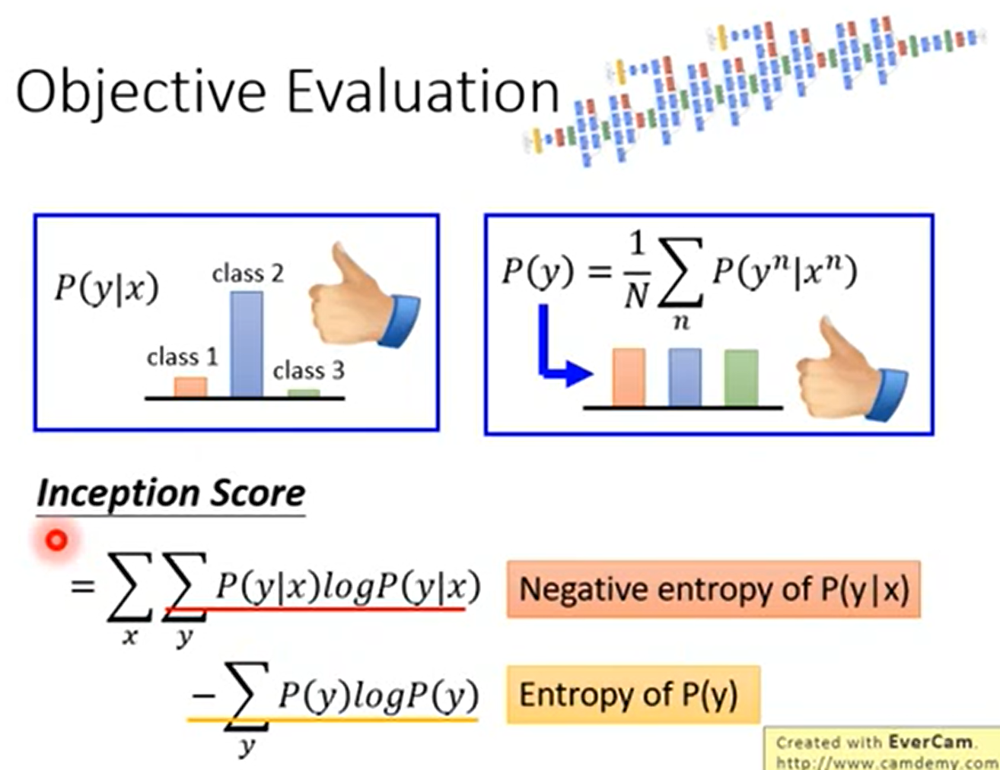
```
定义出来一个 score，常用的 score 是 Inception Score，因为使用 Inception net evaluate 的。
怎样的 generator 叫做好？
好的 generator 产生的单一的图片丢到 Incepting net 里面，某一个 class 的 score 越大越好。把所有的 output 丢到 classifier 里面，产生一堆 distribution，把所有 distribution 作平均，越平滑越好，即越平均越好。
```
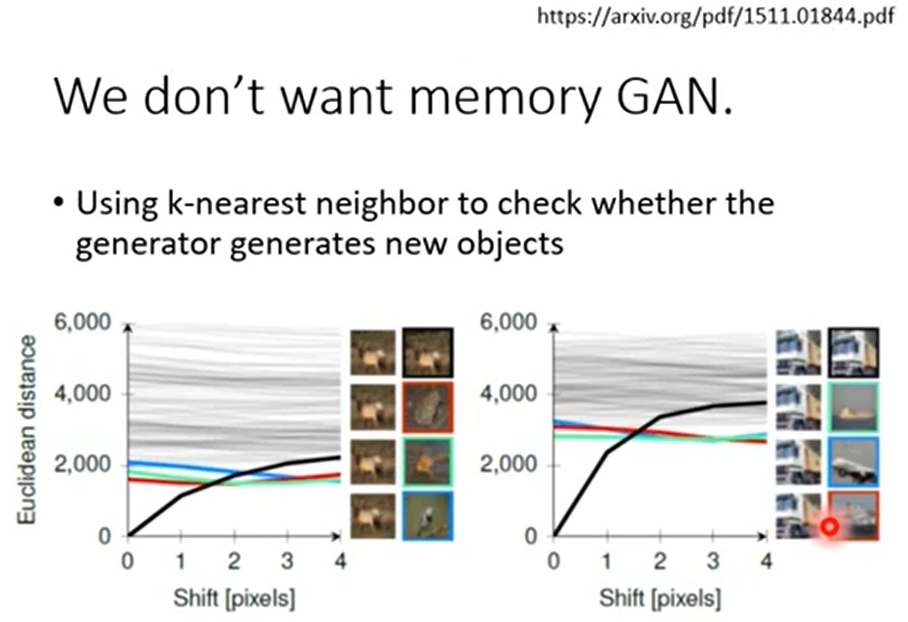
```

```

>**Mode Dropping**

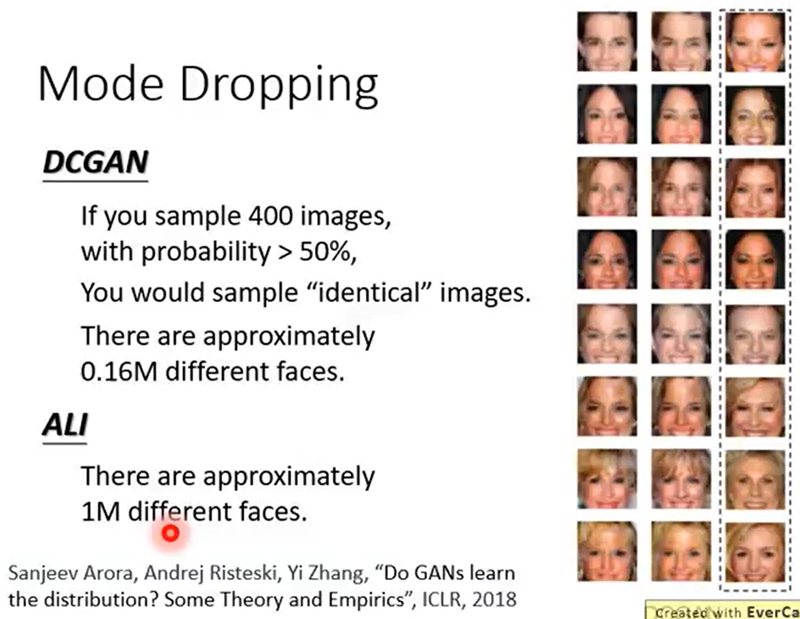

>**Minni-batch Discrimination**

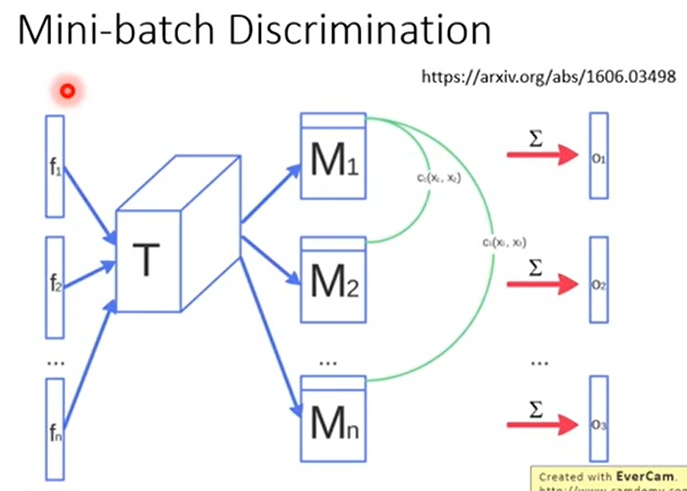
```

```

>**Optimal Transport GAN（OTGAN）**

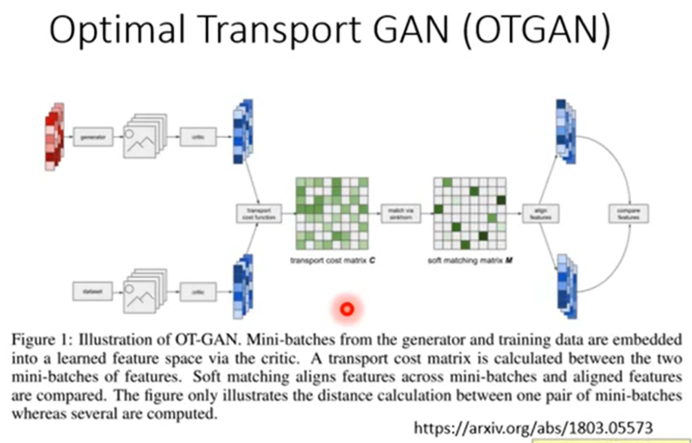
```
pass
```


### Concluding Remarks

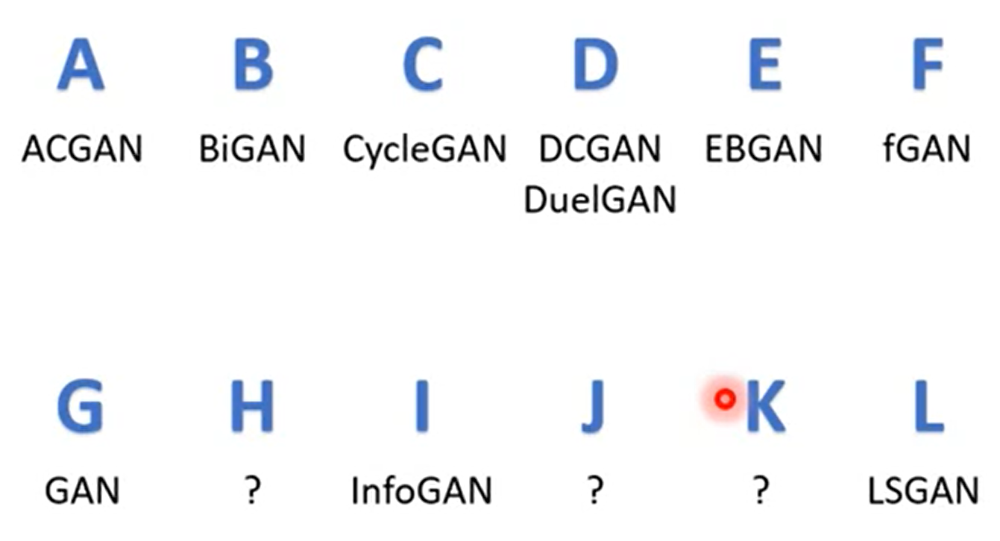
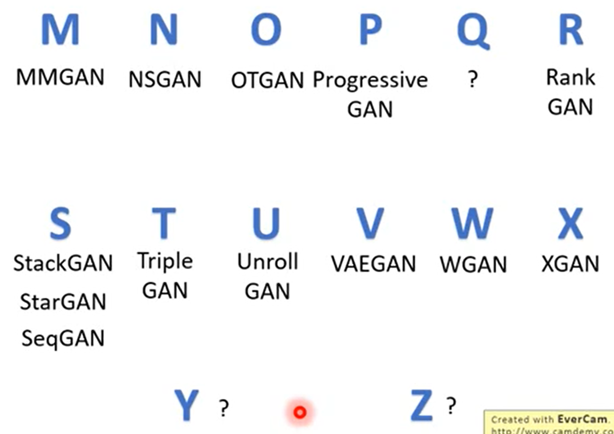