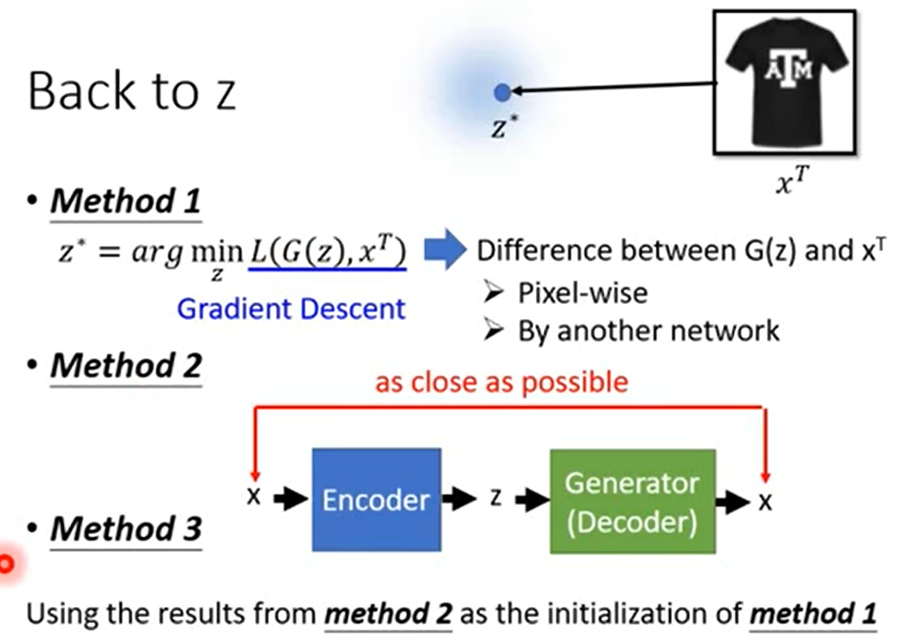

>**InfoGAN**


```
GAN 会 input 一个 random vector，就 output 一个 object，期望 input 的 vector 每一个 dimension 代表了某种 specific characteristics，改了 input 的 dimension，output 就会有一个对应的变化，就可以知道每一个 dimension 做的事情是什么。
假设二维平面代表 generator input 的 random vector space，期望在这个 letter space 上面，不同的 characteristic object 的分布是有某种规律性的，但实际上它的分布是不规则的。
期待是改变了 input vector 的某一个维度，它就会从 绿色->黄色->橙色->蓝色，有一个固定的变化，但实际上不是那样。
```

```
InfoGAN 就是来解决这个问题。
在 INfoGAN 里面，会把 input vector 分成两个部分(假设 input vector 是 20 个 dimension，前 10 维叫做 c，后 10 维叫做 z')，在 InfoGAN 里面，会 train 一个 classifier(作用：看 generator 的 output，然后决定根据 generator 的 output 去预测现在 generator input 的 c 是什么)
将 classifier 视为 decoder，将 generator 视为 encoder，generator 和 classifier 合起来就是 "Auto-encoder"，但和传统的 Auto-encoder 做的事情相反
	传统的 Auto-encoder：给一张 image，把它变成一个 code，再把 code 解回原来的图片
	InfoGAN：给一个 code 通过 generator 产生一张 image，classifier 根据 image 决定原来的 code 的样子。
Discriminator 一定要存在，Discriminator 检查这个 image 像不像 real image，如果 generator 为了 classifier 猜出 c 是什么，而刻意的把 c 原封不动的贴在 image 上，Discriminator 就会发现不对，所以 generator 并不能把 c 放在 image 里面透露给 classifier 知道。
InfoGAN 在实作上，Discriminator 和 Classifier 会 share 参数，因为 input 是同一个 image，只是 output 不一样，一个是 scalar，一个是 code vector。
```

```
加上 classifier 的好处
需要解决的问题是 input 的 feature 对 output 的影响不明确。
为了使 classifier 可以成功的从 image x 里面知道原来 input c 是什么，generator 要做的事情是，必须让 c 的每一个 dimension 对 output x 都有一个明确的影响，如果 generator 可以学到 c 的每一个 dimension 对 output x 都有一个明确的影响，那 classifier 就可以轻易的根据 output image 反推出原来的 c 是什么。
input 中的 c 代表了 image 的某些特征，对 image 有明确的影响
input 中的 z' 纯粹代表了随机的东西
input 中定义的 c 不是代表了image 的某些特征而被归类为 c，而是它被归类为 c，所以代表了 image 的某些特征。
```


>**VAE-GAN**


```
可以看作是 VAE 强化 GAN，也可以看着是 GAN 强化 VAE
在 train VAE-GAN 的时候，一方面 encoder、decoder 让 reconstruction  error 越小越好。Decoder 希望它的 output image 越 realistic 越好。
	从 VAE 的角度来看，原来在 train VAE 的时候，希望 input 和 output 越接近越好，但是对 image 来说，单纯只让 input 和 output 越接近越好，VAE 的 output 不见得会变得 realistic，通常产生的 image 是很模糊的，因为不知道怎么算 input 和 output x 的 loss，那就加一个 discriminator，迫使 Auto-encoder 在生成 image 的时候不是 minimize reconstruction error，同时还要产生比较 realistic image 让 discriminator 觉得是 realistic。
	从 GAN 的角度来看...

Encoder：Minimize reconstruction error，同时希望 z 分布接近 normal distribution
Generator：Minimize reconstruction error，同时 Cheat discriminator
Discriminiator：将分辨 image 是 real image 还是 generated image。
```
>**VAE-GAN - Algorithm**


```
初始化 Encoder，Decoder，Discriminator
在一个 iteration 中：
	sample M 个 real image
	再产生 M 个 image codes，把 code 写作 z~
	把 image codes 丢到 Decoder 里面，再产生 reconstructed image，写作 x~
	从 normal distribution sample 出 M 个 image codes z
	把 image code z 丢到  Decoder 里面产生 image x^
	Encoder 的目的是希望原来的 image 和 reconstructed image，||x~ - x|| 越接近越好，希望 x 产生出来的 z~ 和 normal distribution 越接近越好
	Decoder 的目的是 Minimize reconstruction error，希望它产生出来的东西可以骗过 discriminator，希望 discriminator 给它高的分数，Decoder 会产生两种东西，1、reconstructed image x~，2、mechine 自己 generated image
	Discriminator 的目的是如果是一个 real image 就给高分，如果是 fit image 就给低分，fit image 分为两种：reconstructed image、generated image
	
注：Discriminator 其实也可以是 3 个 class 的 classifier，鉴别一张 image 是 real、generated、reconstructed 的，generated、reconstructed image 还是挺不像的。
```

>**BiGAN**


```
VAE-GAN 是去修改了Auto-encoder
BiGAN 也是。
BiGAN 并不会把 Encoder 的 output 丢给 Decoder
加上一个 Discriminator，把 Encoder 和 Decoder 的 input image x 和 output code z 当成 Discriminator 的 image x 和 code z，鉴别 x 和 z 的 prior 是从 Encoder or Decoder。
```

>**BiGAN - Algorithm**


```
Initialize encoder En, decoder De, discriminator Dis
In each iteration:
	sample M 个 real image
	把 image 丢到 Encoder 里面，Encoder 会 output code，得到 M z~
	从 normal distribution 中 sample 出 M 个 code
	把 code 丢到 Decoder 里面，得到 x~
	learn 一个 Discriminator，给 Encoder 的 input 和 output 高分，给 Decoder 的 input 和 output 低分。
	Encoder 和 Decoder 联手起来，让 Discriminator 给 Encoder 的 input 和 output 低分，给 Decoder 的 input 和 output 高分。
```

```
Discriminator 做的事情是 evaluate 两组 sample 出来的 data 到底接不接近
把 Encoder 的 input 和 output 合起来当成 join distribution，P(x,z)
把 Decoder 的 input 和 output 合起来当成 join distribution，Q(x,z)
Discriminator 来衡量这两个 distribution 的差异，P 和 Q 越接近越好。
如果 P 和 Q 的 distribution 一摸一样
就会 En(x') = z' -> De(z') = x'...
```

```
让 Encoder 和 Decoder 的 input 和 output 越像越好
BiGAN learn 的 optimum 结果和同时 learn 一个 Encoder/Decoder optimum 结果是一样的，但是它们的 error surface 是不一样的。
BiGAN 如果跟 Auto-encoder 比起来，它们 optimum solution 是一样的，但特性是不一样的，BiGAN 的 Auto-encoder 比较能够抓到语义上的资讯。
```
>**Triple GAN**


```
Triple GAN 就是一个 Conditional GAN，是一个 supervised learning 做法，再 Triple GAN 里面，假设有少量的 label data，有大量的 unlabel data。
```

>**Domain-adversarial training**


```
Training data 和 Testing data 不 match，通过 generator 抽出 feature，在 Training data 和 Testing data 算它们的 domain，透过 domain 抽出的 feature 有同样的 distribution，是 match 的。
```

```
learn 一个 generator，就是 feature extractor，input a image 就 output a feature，Domain classifier 就是 discriminator，discriminator 判断这个 feature 来自哪个 domain(假设有两个 domian x、y)，同时也要有另外一个 classifier，这个 classifier 的工作是根据这个 feature 判断它属于哪一个 class。
```

>**Feature Disentangle**


```
learn 一个 encoder，把发音有关的部分丢到语音辨识系统进行辨识，把语者资讯丢到声纹比对去。
learn 两个 encoder
	一个 encoder 的 output 是 发音的资讯
	一个 encoder 的 output 是 语者的资讯
```


```
加一些额外的 constraint，对 Speaker Encoder 来说，给同一个人的声音讯号，output 的 vector 越接近越好，
```

```
再 train 另外一个 classifier
作用：对两个 vector，判断这两个 vector 是同一个人说的，还是不同人说的。
```


>**GAN + Autoencoder**


```
怎么反推出现在 input vector 每一个 dimension 对应的特征是什么？
先 train 好一个 generator，这个 generator 可以根据一个 vector z，会产生一个 image x，做一个逆向的工程，去反推如果给了一张现成的 image，什么样的 z 可以生成这现成的 image。
再 learn 另外一个 Encoder，这个 Encoder 和 Generator 合起来就是 Auto-encoder，在 train Auto-encoder 的时候，input 一张 image x，把 x 压成 vector z，把 z 丢到 Generator 以后，它 output 是原来那张 image，在 train 的过程中，Generator 的参数是固定不动的，在实作中，Encoder 和 Discriminator 很像，可以用 Discriminator 的参数初始化 Encoder 的参数。
```

>**Attribute Representation**


```
将短发的人脸的 code 反推出来，平均就会得到短发人脸的代表
将长发的人脸的 code 反推出来，平均就会得到长发人脸的代表
再相减得 zlong
Short Hair x -> En(x) + zlong = z' -> Gen(z') Long Hair
```

>**Basic Idea**


```
首先 train 一个 GAN，train 一个 Generator，，在 space 上随便 sample 一个点(vector)，丢到 generator 中，就会产生一个 image。
将 短袖图片 反推出它在 code space 的位置，然后在 code space 做小小的移动，就会产生一张新的图。
```
>**Back to z**


```
怎么做从一张 image 反推出原来的 code 样子？
1、
```

```
找一个 z，一方面把 z 丢到 generator 里产生一张 image，要符合 constraint，希望新的 z 和旧的 z0 越接近越好。
```

>**Image Completion**


```
修复
```