```
对某种 objective function 就是在量 JS Divergence，能不能量其他的  Divergence，fGAN 告诉我们怎么量其他的 Divergence，用不同的 f-divergence 量 generate example 和 real example 之间的差距。
其实不止用 JS Divergence，任何 f-divergence 都可以放到 GAN 的架构里面去。
```

>**f-divergence**

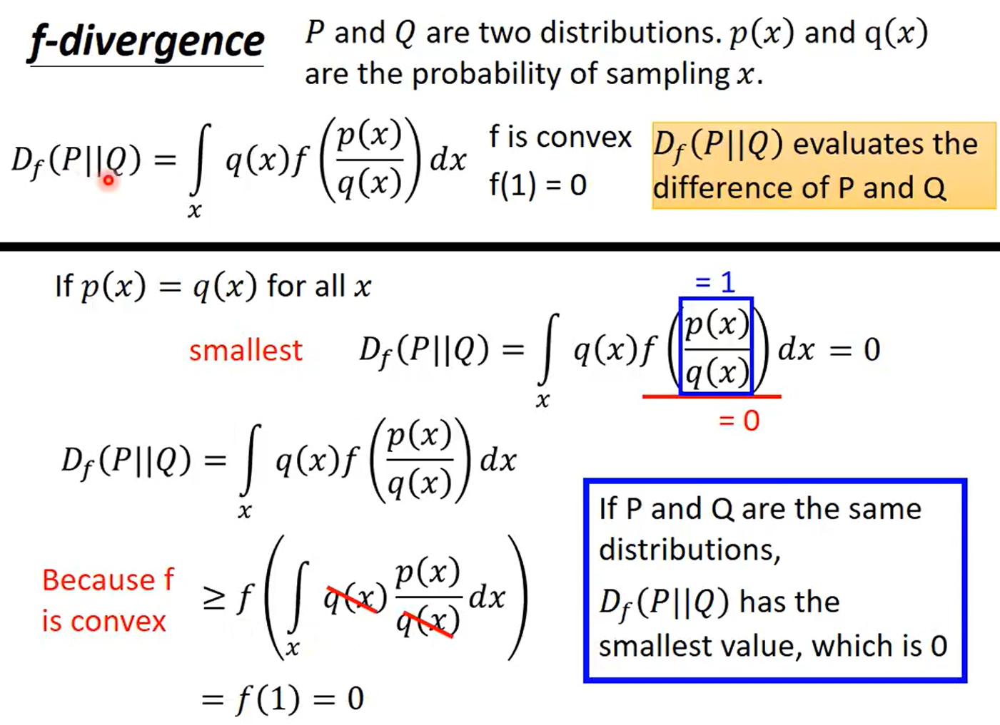
```
p(x): 从 P 的 distribution sample 出来的几率
q(x): 从 Q 的 distribution sample 出来的几率
Df(P||Q) 的是某一种 f-divergence 的条件
	f is convex 凸函数
	f(1) = 0
f 放不同的 function，就是不同的 divergence。

为什么这个方程式可以看作是在衡量 P&Q 的差异呢嗯？
	if p(x) = q(x)，Df(P||Q) = 0，0 是这个方程式可以达到的最小距离，也就是说，P&Q 有些不同，算出来的 f-divergence 就会大于 0。
```
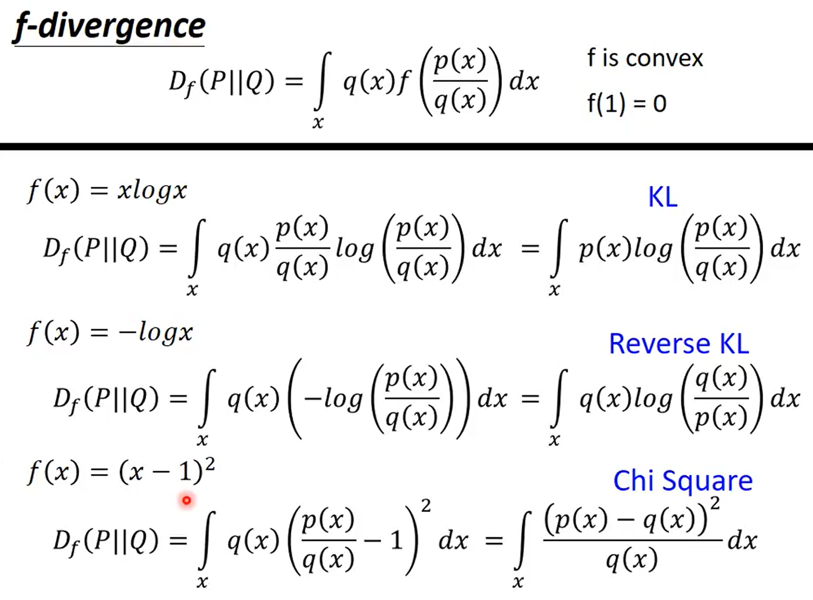
```
if f(x) = xlogx，就是 KL-divergence
if f(x) = -logx，就是 Reverse KL-divergence
if f(x) = (x-1)2，就是 Chi Square Divergence
f 不同，就会得到各式各样的 divergence
```

>**Fenchel Conjugate**

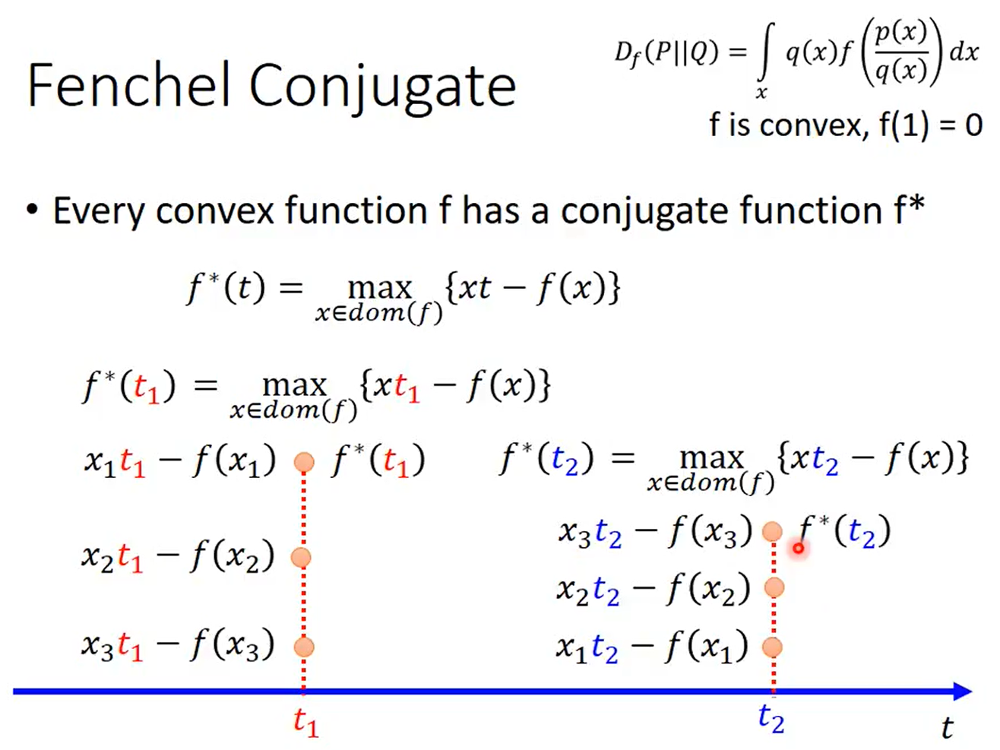
```
每一个 convex function f 都会有另一个 conjugate function f*
穷举所有的 t，看哪一个 max{xt-f(x)} 最大
假设 f*(t1) 是多少，将 t1 代进去，穷举各种不同的 x 值，看哪一个 x 值可以让 t1 最大。
x1t1 - f(x1)
x2t1 - f(x2)
x3t1 - f(x3)
...
这种方式比较麻烦
```
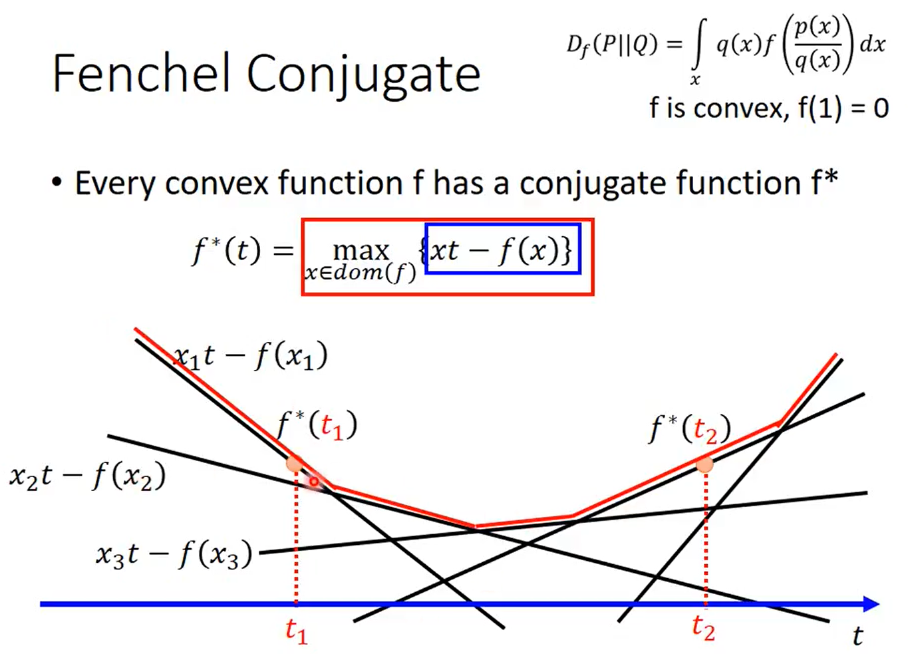
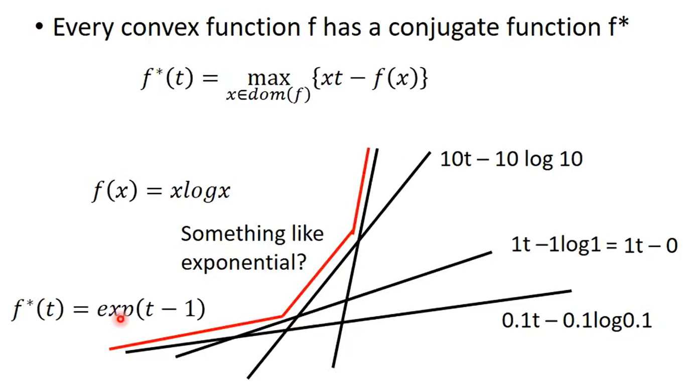
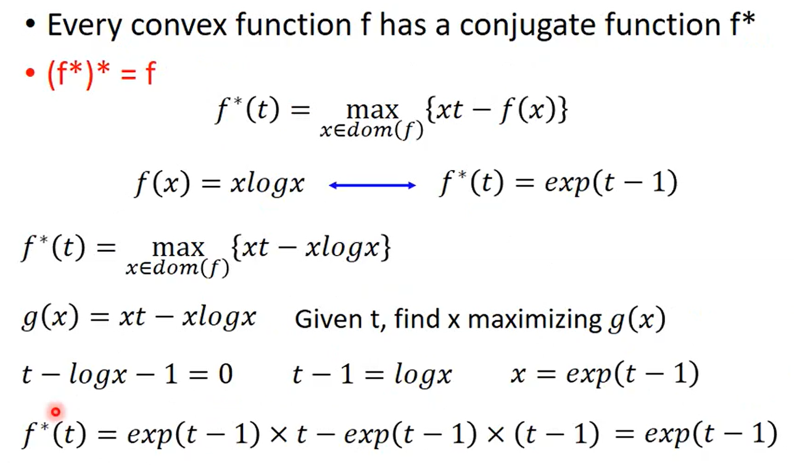
```
xt-f(x) 是直线，t 是变量，代不同的 x 值进去，就是不同的直线。
把所有 x 值造成的直线画出来，再取 upper bound，所以 f*(t) 是 convex。

f(x) = xlogx，把所有的 upper bound 连起来，f*(t) = exp(t - 1)
```

>**Connection with GAN**

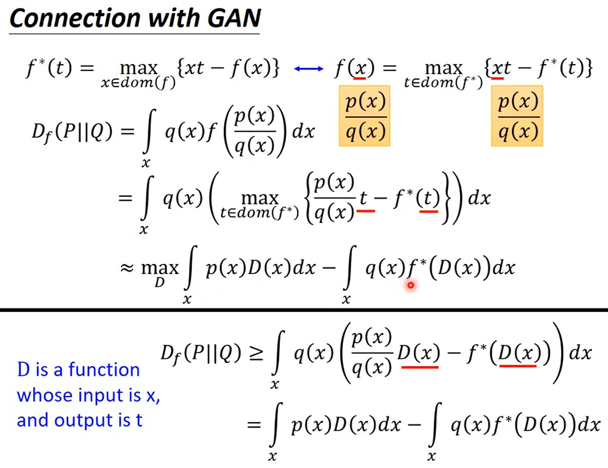
```
f(x) 和 f*(t) 互为 conjugate 的。
假设有一个 convex function 叫做 f(x)，就可换成 max{xt - f*(t)}
假设有一个 f-divergence function Df(P||Q)，f(p(x)/q(x)) 是一个 convex function，将 x =  p(x)/q(x) 代入 max{xt - f*(t)}。
learn 一个 Discriminator，就是 input 一个 x，output 出一个 scalar，这个 scalar 就是 t，t 就用 D(x) 代表，代入之后的方程式是 f-divergence 的 lower bound。
```
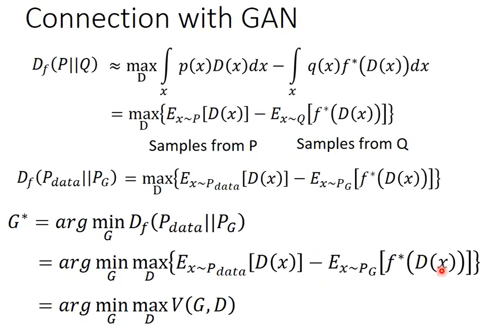
```
V(G,D) 定义不同，就是在量不同的 divergence，
```
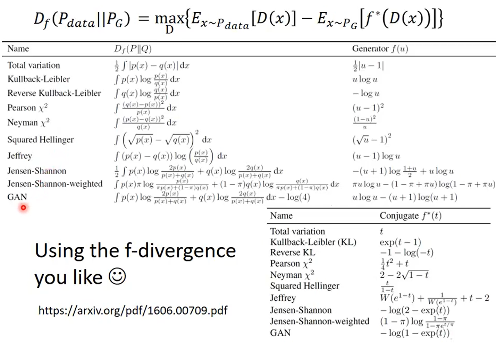

>**Mode Collapse**

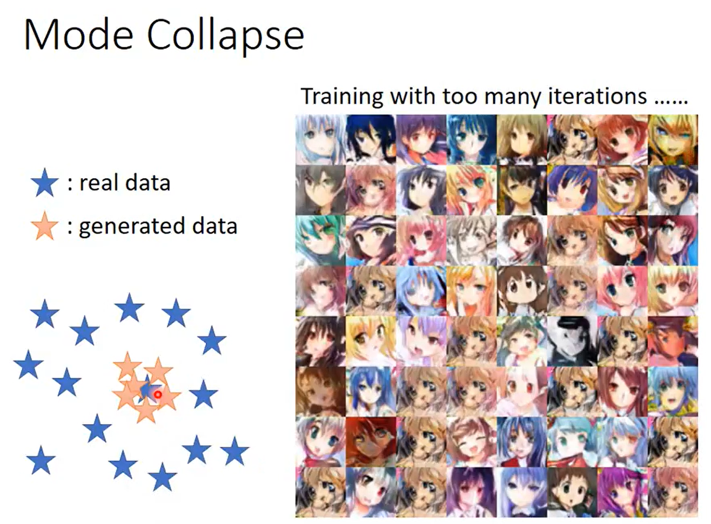
```
update 不同的 divergence 的厉害之处
什么是 Mode Collapse？
	real data 的 distribution 是比较大的，
	generated data 的 distribution 是比较小的。
产生出来的 distribution 会越来越小。
```

>**Mode Dropping**

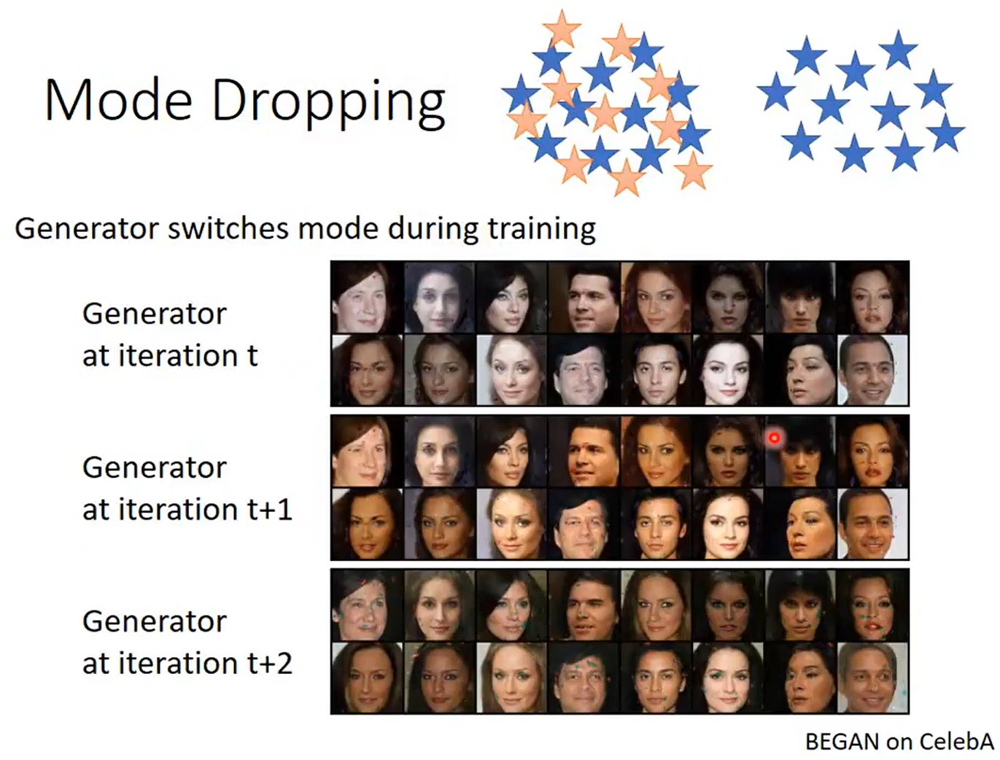
```
distribution 有很多的 mode，但 generator 只能产生同一群，没有办法产生两群不同的 data。
```

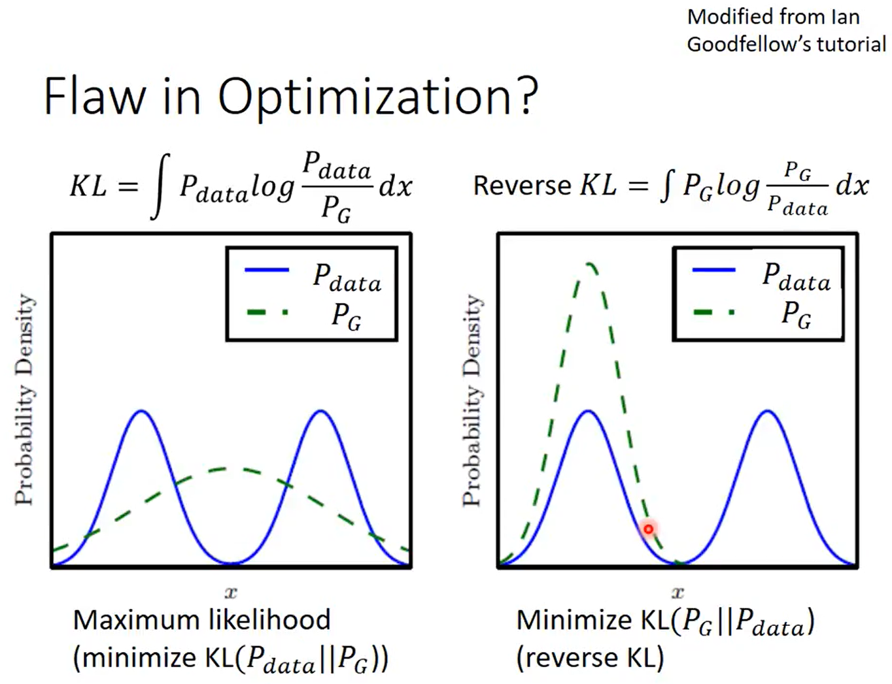

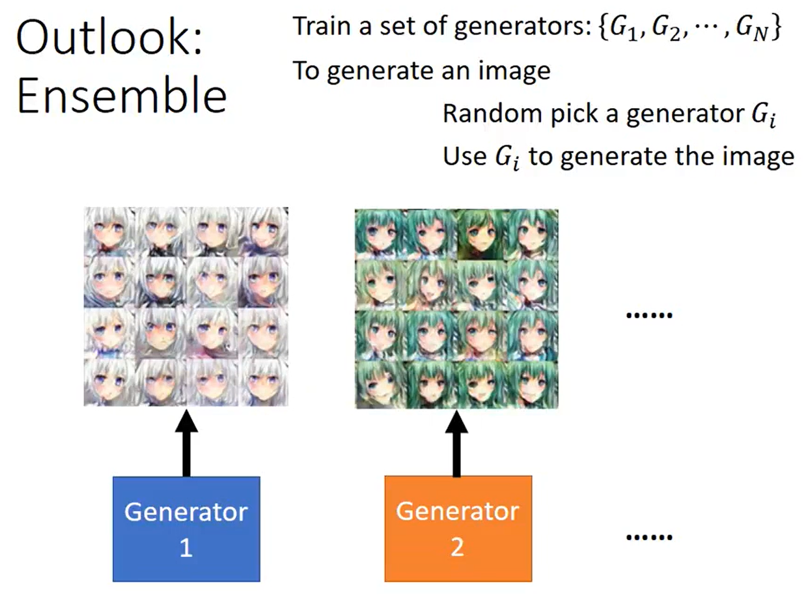
```
为了避免 Mode Collapse，可以 train 多个 generator。
```