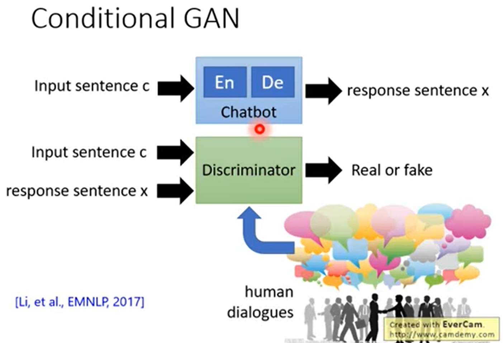

```
GAN 可以做 Unsupervised Conditional Generation
```

### Conditional Sequence Generation


```
只要是产生 Sequence 的 task，就是 Conditional Sequence Generation。
语音辨识
翻译
Chatbot
```

>**Review:Sequence-to-sequence**


```
Chat-bot 是一个 Sequence-to-sequence model，有一个 encoder 和 decoder，input sentence c 到 encoder，从 decoder output x，需要收集 training data(人的对话)，likelihood 越大越好，如果正确答案是 I'm good，那么 decoder 在产生句子的时候，第一个 text 产生 I 的几率越大越好，依次类推。
train classifier 的时候，Maximize likelihood = Minimize cross entropy，一摸一样。
```

### Improving Supervised Seq-to-seq Model

#### Reinforcement Learning


```
RL 可以看作是 GAN 的 special case。
```

```
使用 Maximize likelihood 的方法 train sequence-to-sequence 有问题
用 Reinforcement Learning 的方法，人说一句话，Chatbot 回应一句，人给 Chatbot 一个分数。
Chatbot 做的事情是希望通过互动的过程学习怎么 Maximize 它可以得到的分数。
```

```
问题描述：有一个 Chatbot，input 一个 sentence c，output response sentence x。就是一个 sequence-to-sequence model。
和 Conditional Generation 很像，绿色框就像是一个 discriminator，它的 input 是 generator 的 input & output。
```

```
input 是 c，output 是 x，Encoder 和 Generator 合起来是 sequence-to-sequence model，要调 Encoder 和 Generator 的合起来的参数 θ，就是要调 θ 去 Maximize Human 这个 function 的 output。
Rθ：给定某一组参数 θ 的时候，假设 θ 固定起来后，这个 sequence-to-sequence model Chatbot 会得到的 Expected Reward 有多大。

Rθ = ∑P(c)∑R(c,x)Pθ(x|c)，算出来的结果就是 reward 的期望值。
先 summation over 所有可能的 input c，乘以所有 c 出现的几率，summation over 所有可能的 response x，
Pθ(x|c)：当有一个 input c 的时候，参数 θ 已经知道的时候，就可以算出在 Given c，Given 这组参数的情况下，Chatbot 会回答某一个答复 x 动嗲东几率有多少。
当 Chatbot 回答一个 x 的时候，接下人就会给一个 reward R(c,x)。

调参数 θ，让期望值越大越好。
```

```
期望值怎么计算，在实作上，是无法穷举所有 input，output。
实作上就是 sample，sample N 笔的 c 和 x 的 pair，计算每一笔的 reward，把 N 笔 reward 平均起来。
要找一个 θ 做 optimation，让 R拔θ 越大越好。要拿 θ 对 R拔 做 gradient。R拔θ = 1/N ∑R(ci,xi) 中没有 θ，
```
>**Policy Gradient**


```
gradient 那一项去 sample N 个 pair 的 (ci,xi)。
这个 gradient 代表的意思
如果 reward 是 positive 的，就增加 Pθ(x|c) 出现几率
如果 reward 是 negative 的，就降低 Pθ(x|c) 出现几率
```

>**Policy Gradient-Implemenation**


```
有一个 Chatbot，它的参数是 θt，然后和人对话
当人说 c1，Chatbot 说 x1，会得到 reward R(c1,x1)
(c1,x1) R(c1,x1)
(c2,x2) R(c2,x2)
...
(cN,xN) R(cN,xN)

update θ 以后，就要回去重头 sample data。
update θ 是很宝贵的，因为走错就得重新开始和人互动。
```

>**Comparison**


```
Reinforcement Learning：每一笔 training data 都是有 weight 的，而且是不一样的。
Maximize Likelihood：每一笔 training data 的 weight 都是一样的。
```

```
这种方式有极限。
```

#### GAN


>**Conditional GAN**


```
有一个 Chatbot，input 是 sentence c，output 是 sentence x，有一个 discriminator，这个 discriminator 取代了 Human 的角色，它的 input 是 Chatbot 的 input 和 output，吐出一个分数。
要给 discriminator 大量人类的对话，这个 discriminator 就学着鉴别说 (c,x) 的 pair 是来自于人类，还是来自于 Chatbot。
```

>**Conditional GAN - Algorithm**


```
这个 discriminator 的 output 就可以当成 Human 给 reward，但不是完美的，是需要更新参数的。
和传统的 Conditional GAN 是一样的，training data 是一大堆的正确的 (c,x)。
Initialize generator G and discriminator D
In each iteration:
	从 training data 里面 sample 出正确的 (c,x)
	从 training set 里面 sample 出 c'，丢到 generator(Chatbot) 里面，然后 response 一个 x~，这个 x~ 是一个 negative example
	看到正确的 D(c,x) 给它比较高的分数，看到错误的 D(c,x) 给它比较低的分数(可以用 WGAN)
	train generator 的目标：update 参数，generator 所产生出来的 (c,x) 能让 discriminator 的 output 越大越好
```

```
Chatbot 的 network 架构 是一个 sequence-to-sequence model，是一个 RNN generator，Chatbot 在 generate sequence 的时候，一开始先给一个 condition(可能是从 attention model 来的)，output 一个 distribution，根据这个 distribution 做 sample，就 sample 出一个 word，把这个 word 当成下一个 text 的 input，依次类推。
把 generator 的 output 丢给 discriminator，discriminator 就 input 一个 word sequence，接下来就 output 一个 score。
没有办法微分
因为在整个 network 里面，有 sampling process。
```

##### Three Categories of Solutions

```
解决上述不能微分的问题。
```
###### Gumbel-softmax


###### Continuous Input for Discriminator


```
如果问题在 sampling process，那就避开 sampling process，discriminator 的 input 不是 word sequence，而是 input word distribution，然后串在一起就是可以微分的 network。
```

```
如果给 discriminator 一个 continuous input 的时候，会发生什么样的问题？
当给 discriminator word distribution 的时候，real data 和 fake data 本质上就是不一样的
对 real data 来说，它是 discount token，用 one-hot vector 来表示，所以一个 real sentence 对 discriminator 来说，就是如图片所示
对 generated 来说，它每次只会 output word distribution，把它丢给 discriminator 的时候，就是如图片所示
所以对 discriminator 来说，要分辨 input 是 real 还是 fake，很容易。
不需要管句子的语义，根据 input 是不是 one-hot vector。
如果直接用这个方法 trian GAN，会遇到 generator 很快会发现 discriminator 判断 input 是 real 还是 fake 的准则，是看每一个 output 是不是 one-hot vector。所以 generator 唯一会学到的事情是迅速的将 output 变成 one-hot，就会随便选一个 element，也不在意语义了，把它的值变成 1，其他的变成 0。

直接将 discriminator 的 input 是 continuous input 是不够的。
可以使用 WGAN，因为 WGAN 在 train 的时候会给 model 一个 constraint，是 constraint discriminator 是一个 1-Lipschitz function。
```

###### Reinforcement Learning


```
Discriminator 就相当于 Human function，它的 output 的 scalar 就是 reward，Maximize Discriminator 的 output，本来人的 output 是 R(c,x)，只把它换成 Discriminator 的 output D(c,x)。
```


```
把人换成另外一个 Discriminator，本来人 output reward，现在是 Discriminator 给 reward，把 R(c,x) 换成 D(c,x)。
怎么 train Discriminator？
给 Discriminator 很多人真正的对话，给很多现在 generator 产生出来的对话，Discriminator 就会学着分辨这个对话是 generator 产生的还是真正人讲的。
在 train Discriminator 以后，再回头 train Generator。反复进行。
```
>**Tips**


```
这个方式和 Reinforcement Learning 是一样的，只是把 R(c,x) 换成 D(c,x)
假设 ci = "What is your name?"，xi = "I don't know"
不是一个很好回答，所以 discriminator 给的 score 是 negative，所以希望调整参数 θ 让 logPθ(xi|ci) 的值越小越好。
x1 = I，x2 = don't，x3 = know

Pθ(xi|ci) = Pθ(x1i|ci) * Pθ(x2i|ci,x1i) * Pθ(x3i|ci,x1:2i)
logPθ(xi|ci) =logPθ(x1i|ci) +logPθ(x2i|ci,x1i) +logPθ(x3i|ci,x1:2i)
Pθ(x1i|ci): 是 Given condition ci 的前提下产生 x1i 的几率
Pθ(x2i|ci,x1i): 是 Given condition ci,x1i 的前提下产生 x2i 的几率
Pθ(x3i|ci,x1:2i): 是 Given condition ci,x1i,x2i 的前提下产生 x3i 的几率
实际上让 logPθ(xi|ci) 几率下降，就是让方程右边的每一项下降。
```

```
希望当 input "What is your name?"，output "I don't know" 的时候，虽然 "I don't know" 整体是不好的，但造成 "I don't know" 不好的原因不在开头 "I"。
本来是对一整个句子 Given ci，产生一个完整的句子 xi，会有一个分数 D(ci,xi)
现在是给每一个 generation 的 step 不同的 score。
```

>**RankGAN**


>**Experimental Results**


>**More Applications**


### Unsupervised Conditional Sequence Generation


#### Text Style Tranfer


```
可以做 image style 的 transformation
可以做 text style 的 transformation
```


```
把 image 换成 text，
positive text 算是一个 domain，negative text 算是一个 domain
用 CycleGAN 的方法 train 下去。
如果 generator 的 output 是 discrete，就没有办法直接做 training。
```

```
假设 output 是一个 句子，句子是一个 discrete 的东西，只有 sampling process 才能产生这个句子。当把上面两个 generator 和 discriminator 串在一起的时候，就没办法去 train，有 3 个解法：
	Gumbel-softmax
	Continuous Input for Discriminator
	Reinforcement Learning
在实验中是用 Continuous Input for Discriminator，把每一个 word 用 word embedding 替代，每一个 sentence 就是一个 vector sequence，word embedding 不是 one-hot，它是一个 continuous 的东西。
```


>**Projection to Common Space**


```
把 image 换成 sentence。
产生文字，文字是 discrete，所以这个 discriminator 没有办法把 discrete 当成 input
解法：discriminator 不要把 decoder 的 output word 当成 input，把 decoder 的 hidden vector 当成 input，因为 decoder 也是一个 RNN。hidden vector 是 continuous 的。
```
#### Unsupervised Abstractive Summarization


>**Abstractive Summarization**


```
learn 一个 Seq2seq 的 model，收集一大堆的文章，每一篇文章都有人标的摘要，硬 train 下去，就可以了。
但需要很多 training data。
```

>**Review: Unsupervised Conditional Generation**


```
把文章(document)视为一种 domain，把摘要(summary)视为另一种 domain，有了 GAN 的技术，在两个 domain 间直接用 unsupervised 方法互转。
```


```
和 CycleGAN 很像，learn 一个 generator，这个 generator 是一个 Seq2seq 的 model，这个 Seq2seq model input document，output word sequence，假设 generator 不知道 output 是什么样的 word sequence 当作 input document 的摘要。
需要 learn 一个 discriminator，这个 discriminator 看过很多人写过的摘要，知道人写的摘要是什么样的，接下来 discriminator 就给 generator feedback，让 generator output 的 word sequence 看起来像是摘要的样子。
但是不够，因为 generator 可能会学到产生像是 summary 的句子，学到产生一个简短的句子但是和输入是完全没有关系的。
和 CycleGAN 一样，加一个 reconstructor，将 x domain 的 output 当成 y domain 的 input，learn 一个 generator 把 y domain 的东西转回来，这样就迫使 x domain 和 y domain 的东西是长得比较像的。
```


```
document -> generator -> word sequence -> reconstructor -> document
如果 reconstructor 可以把简短的句子变成原来的文章，代表 word sequence 有原来文章的重要资讯，因为这个句子有原来文章重要的资讯，所以就可以把它当成摘要，可以看成 seq2seq2seq auto-encoder。
一般的 auto-encoder 都是有 latent vector 表示资讯，这儿是用句子来表示资讯，希望是人可以读的。
````


```
为了使 generator 产生的句子是人可以看懂的，加一个 discriminator，这个 discriminator 就会强迫 generator 产生的句子一方面要是个 summary，可以被 reconstructor 解回原来的文章，同时 generator output 的句子也要使 discriminator 可以看的懂的，觉得像是人类写的 summary。
在 training 的时候，generator 的 output 是 discrete，可以用 reinforce algorithm。
```


```
unsupervised learning 的意义何在。
可以用少量的 summary fit to unsupervised learning 的 model，就是用 unsupervised learning 的 方法把 model 练的很强，再用少量的 label data 去 fit to，它进步就会很快。可以用 500k 的 training data 得到的结果就已经跟 supervised learning 的结果一样。
```

#### Unsupervised Translation


```
将 english 当成 domian x，将 chinese 当成 domain y。
```


#### Unsupervised Speech Recognition


