### 1、Review
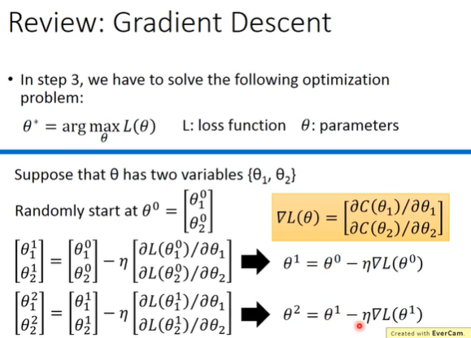
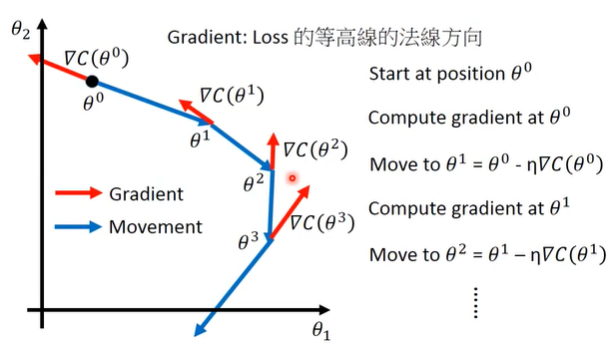
```
计算出 Gradient，然后和 η：learning rate 相乘取负值，再和 θ相加计算出新的 θ再计算 Gradient。
```

### 2、Tuning learning rates

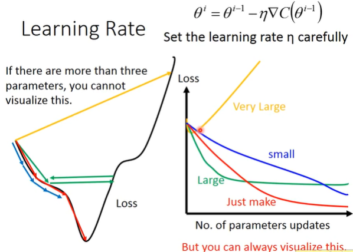
```
蓝色箭头：η过小，梯度下降的比较慢
红色箭头：η调整适度刚好
绿色箭头：η过大，没有办法走到特别低的地方
黄色箭头：η太大，update 参数以后，loss 会越来越大

右边的坐标图显示的是 参数的调整对 Loss 的变化，所以在做 Gradient Descent 的时候应该把这个图画出来，这样就能实时观测到 Loss 的变化，从而适度调整 η的值
```
>**Adaptive Learning Rates**

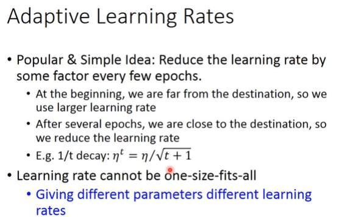
```
在起始的时候，离最低点最远，所以η比较大，经历了几次迭代之后，离最低点就比较近了，所以就将η调小一点。
```
### 3、Adagrad

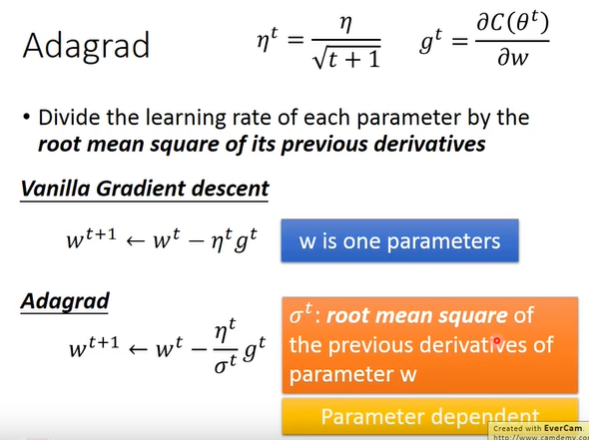
```
Adagrad: 每一个参数的η都除以之前算出的 微分值的 root mean square(均方根)。

在做 Adagrad 的时候，每一个参数都有不同的η，所以要把每一个参数都分开来考虑

g: 是偏微分的值
σ:是过去所有微分值的 root mean square(均方根)，都每一个参数而言都是不一样的
```
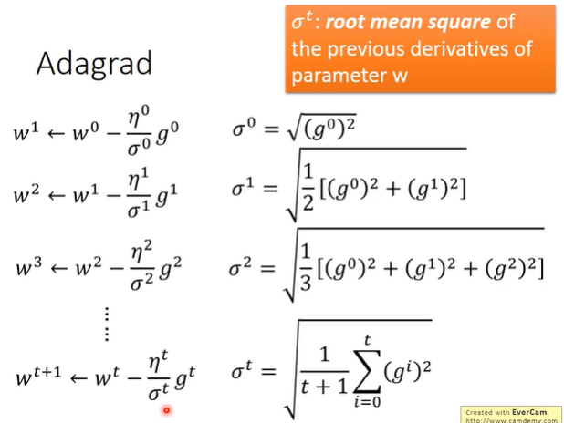
```
每一次计算参数的值的时候，σ的结果都是不一样的，σ是过去所有微分值的 root mean square(均方根)
```
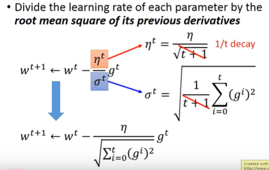
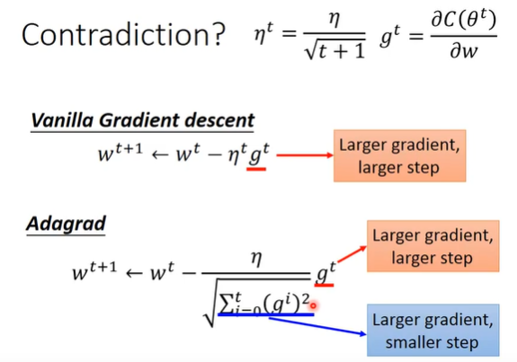
```
Vanilla Gradient descent
	- Larger gradient Larger step
Adagrad
	- Larger gradient Larger step
	- Larger gradient Smaller step
当 Adagrad 中的 gradient 越大，σ(前面所有微分值的 root mean square)越大，参数 update 的步伐就越小
```
>**Intuitive Reason**

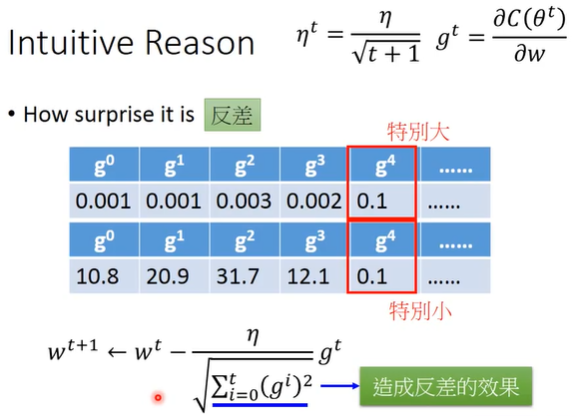
```

```
>**一个参数**

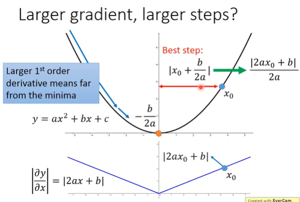
```
随机选取一个点x0，计算 Gradient descent，
Best step: |x0 + b/2a| = |2ax0 + b|/2a
|2ax0 + b| 是在 x0 这一点的微分，计算出来的微分值越大，就离原点越远，距离与微分值成正比。

```

>**二个参数**

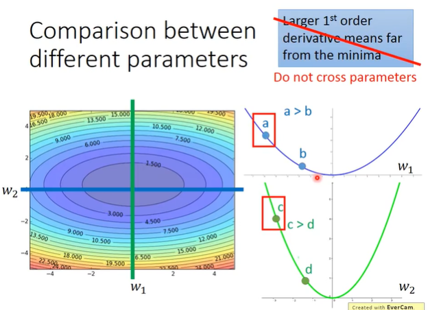
```
update 的参数是和微分值成正比这样的论述是在没有考虑跨参数的条件下才成立的，当同时考虑好几个参数的情况下，这样的情况就不成立了。
```
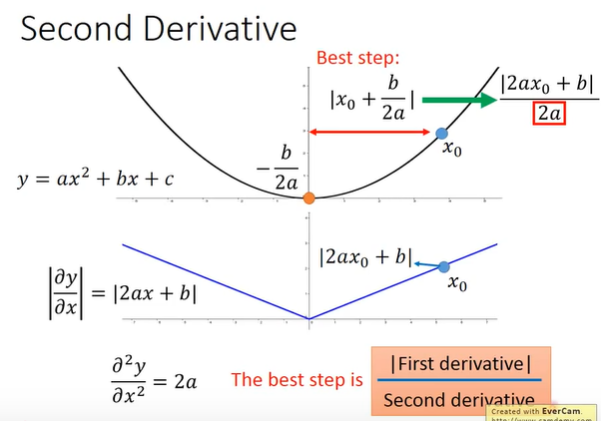
```
The best step is 正比于一次微分，同时反比于二次微分，二次微分比较大，参数的 update 就比较小，二次微分比较小，参数的 update 就比较大。
```
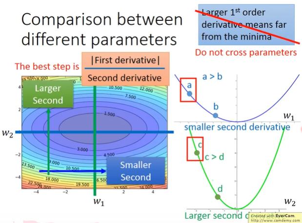
```
a 的微分值/ a 的二次微分 和 c 的微分值 / c 的二次微分
跨参数比较微分值，将二次微分的值考虑进去，然后进行平减，调整。
```
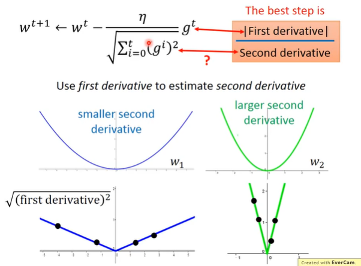
```
利用一次微分的值来估测二次微分的值
在一次微分上 sample 多个点，在平滑的峡谷中，它的一次微分通常是比较小的，在比较尖的峡谷中，它的一次通常是比较大的
```
### 4、Stochastic Gradient Descent

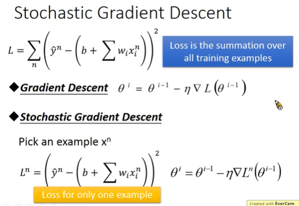
```
Gradient Descent 和 Stochastic Gradient Descent 的区别

Gradient Descent: 计算所有 Loss Function 之和
Stochastic Gradient Descent: 随机选取一个 example，update 参数的时候只考虑那一个 example 计算出它的 Loss Function，看一个 example 就 update 一个参数。
```
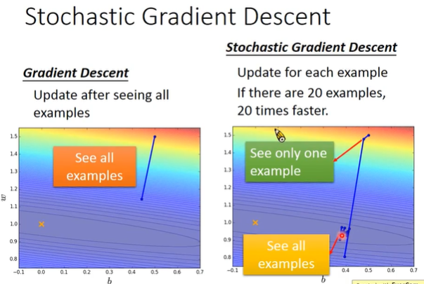

### 5、Feature Scaling

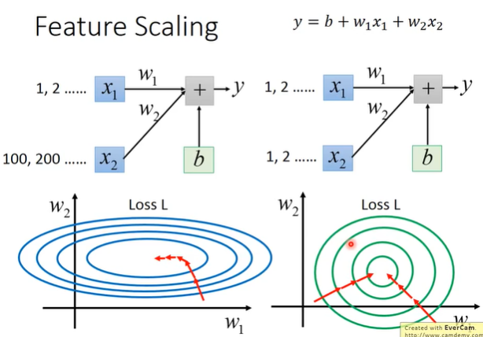
```

```
### 6、Warning of Math


>**Toylor Series**

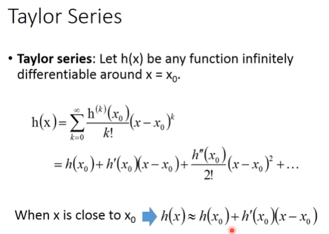

>E.g : Taylor series for h(x)=sin(x) around x0 = π/4

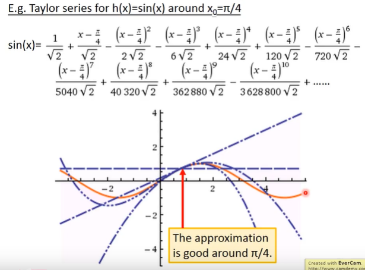

>**Multivariable Toylor Series**

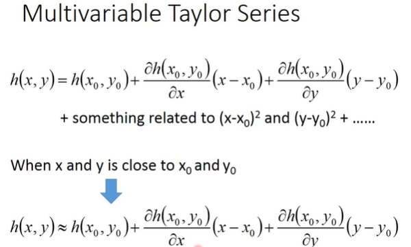
```
当 x = x0, y = y0 的时候，即有该算式
```

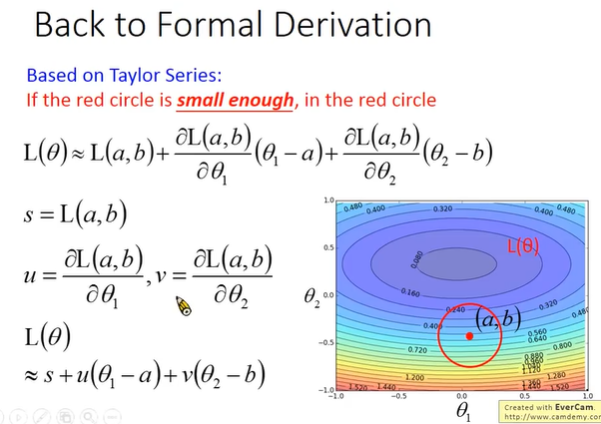
```
一个中心点，在红色圆圈范围之内，Loss Function 可以用 Toylor Series 简化。
```
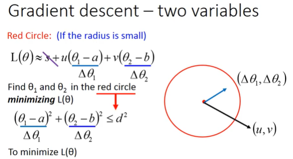
```
Δθ1 = θ1 - a, Δθ2 = θ2 - b
L(θ) = (Δθ1, Δθ2)*(u, v)
两个向量相乘得出结果，为了使得 L(θ) 有最小值，如何找到一个向量 (Δθ1, Δθ2)

即:
```
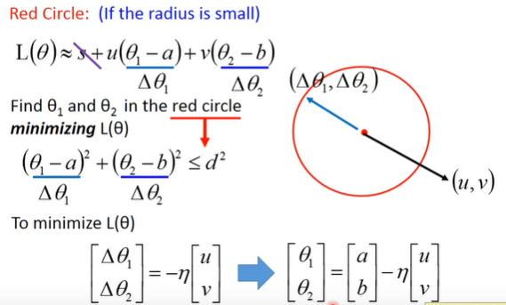
```
找到一个和 (u, v) 相反的向量 (Δθ1, Δθ2)，并且将向量 (Δθ1, Δθ2) 延长到红色圆圈的边缘，所得结果为负值。
找到 θ1, θ2 的最小的值，
```
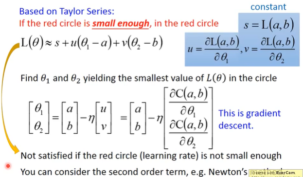
```
将 u 和 v 的值代入到方程式中。
gradient descent: 找到一个初始值，计算每一个参数初始值的地方的偏微分把它排成一个 vector(向量)就是 gradient。
利用这个方面找到一个最小值，前提是 L(θ) ≈ s + u(θ1 - a) + v(θ2 - b) 成立，Toylor Series给出的方程式是得够精确的。
如果想让每一次 update 参数的时候，Loss Function 越来越小，理论上η要无穷小才能保证成立。
```