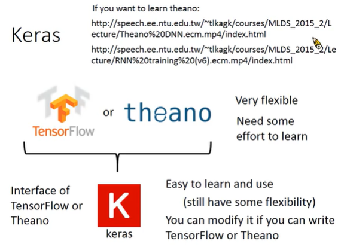
[theano 视频1](http://speech.ee.ntu.edu.tw/~tlkagk/courses/MLDS_2015_2/Lecture/Theano%20DNN.ecm.mp4/index.html)

[theano 视频2](http://speech.ee.ntu.edu.tw/~tlkagk/courses/MLDS_2015_2/Lecture/RNN%20training%20(v6).ecm.mp4/index.html)
```
Keras 是 TensorFlow 和 theano 的接口。
```
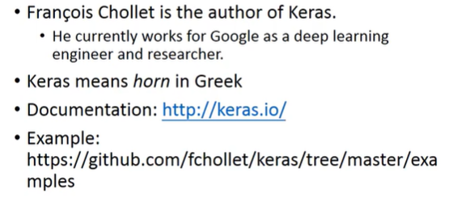
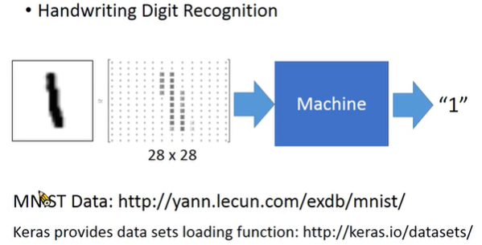
```
Keras 有提供数据集下载的 function。
```
>**define a set of function**

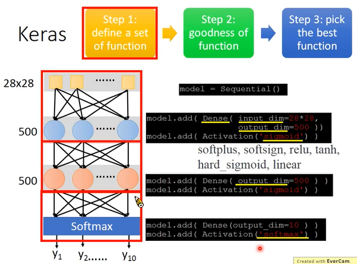
```
Step 1: define a set of function
Step 2: goodness of function
Step 3: pick the best function

先寻找一个 model
加一个 Fully Connected Layer，可以用 Dense() 表示，加上 activation function，output layer 是数字识别，分为 10 个 Class，使用 softmax 分类。
```

>**goodness of function**

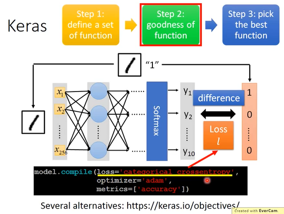
```
loss="crossentropy"
```

>**pick the best function**

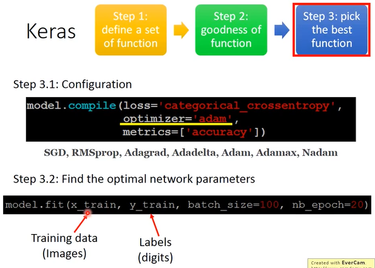
```
找最好的 function 使用什么的方式，optimizer(优化器)有: Adam、Adamax、Nadam
有一些方法是不需要自定义 learning rate，machine 自己会决定 learning rate 是多少。
最后给 model: Training data、Labels
```

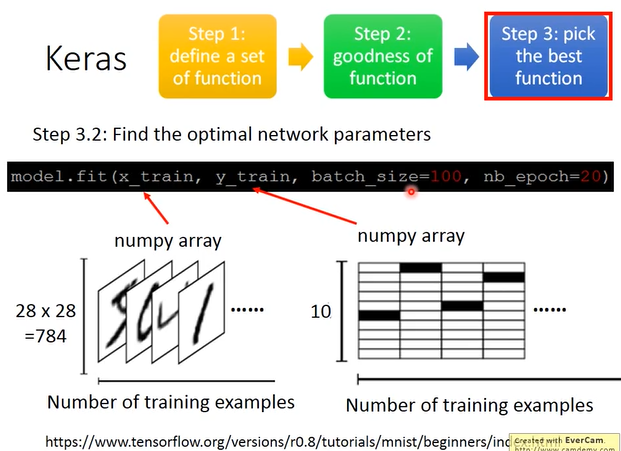
```
x_train: numpy array 是 two dimension 的，是一个 two dimension 的 matrix，它的第一个 dimension 代表多少个 example，第二个 dimension 表示 image 有多少个的 pixel 比如（28 x 28 = 784）pixel，就代表 image 有多大。
y_train: 第一个 dimension 表示有几个 training example，有多少个 example 就有多少维，第二个 dimension 是 10，因为 output 是 10 维的，Label 是有 10 个可能。
```


```
在做 Gradient descent 时，并不会真的去 minimize total loss，我们会把 training data 分成一个一个的 Mini-batch，batch 是要随机的分配。
	- 从所有随机分配一个一个的 batch
	- 随机选取一个 batch
	- 计算对第一个 batch 的 element 的 total loss，根据 l' update 参数。
	- 计算对第二个 batch 的 element 的 total loss，根据 l" update 参数。
	- ...
	- 直到把所有的 batch 通通选过一次
把每一个 batch 看过以后，就叫做 one epoch，重复以上的 process，可能需要好几十个 epoch。
```

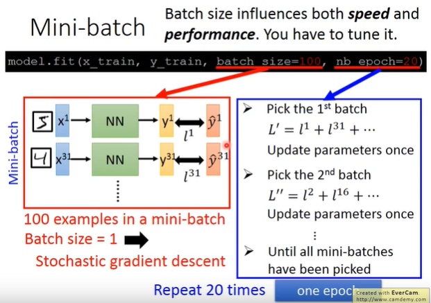
```
batch_size: 是将 100 个 examples 放入一个 batch。
nb_epoch: 当所有的 batch finish 一次后，就是一个 epoch。在一个 epoch update 很多次参数了，给一个 batch 就 update 一次参数。
```

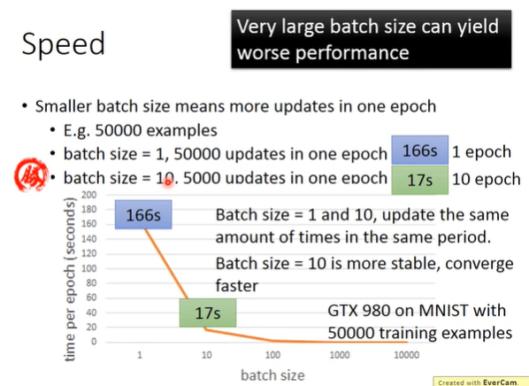
```
最主要使用 Mini-batch 的理由，是实做上。
平行运算
batch size 不能设置太大，deep learning 的时候，会卡住。
```

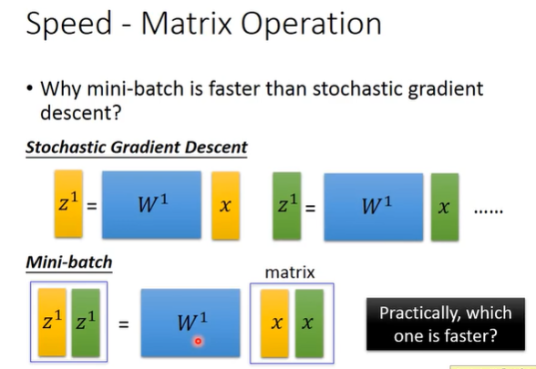
```
当有 batch 的时候，GPU 是怎么平行计算的？
运算理论上是一样多的。
下面比较快。
```

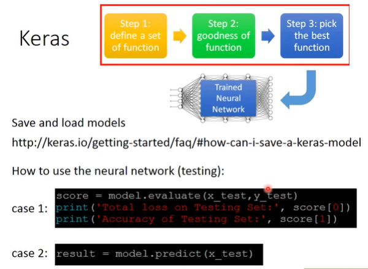

-----------------------------------------------------------------------------------------

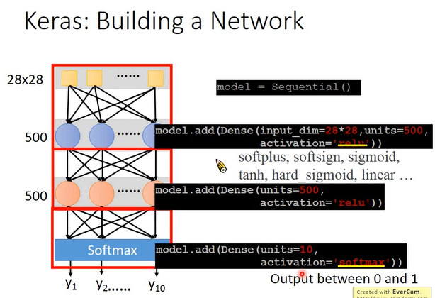
```
Step 1: 
定义一个 model
input layer: 定义 input_dim，neuron 的数量，activation = 'relu'
hidden layer: 定义 neuron 的数量，activation = 'relu'
output layer: 定义 neuron 的数量，activation = 'softmax'
```
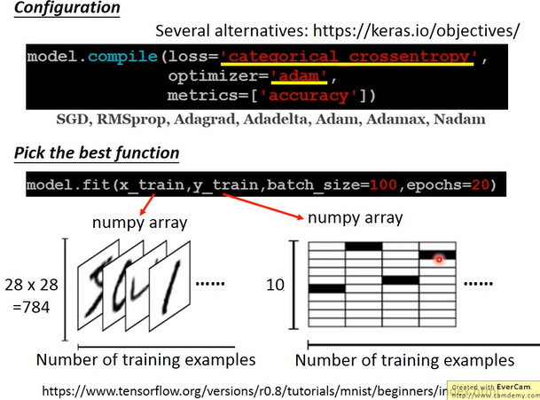
```
Step 2:
定义一个 Loss Function，loss = 'categoriacl_crossentropy'，opimizer = 'adam'
开始 train 这个 network，如果是 10 dimension 的，只有一个维是 1，其他维都是 0。
```

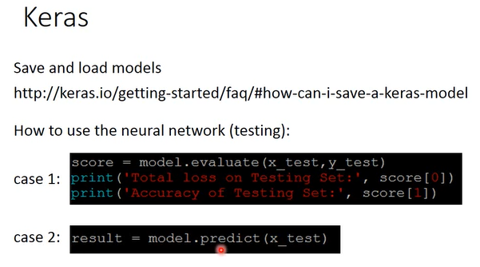
```
使用
case 1: evaluate 出 model 的正确率，有两个 dimension，一个是 loss，另一个是 accuracy。不同的方式，loss 和 accuracy 都是不一样的。
case 2: predict 的结果
```