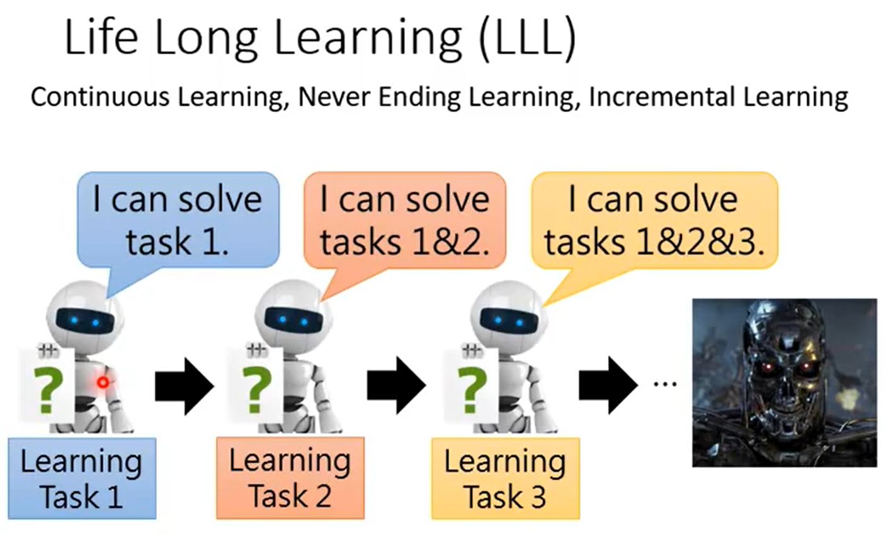
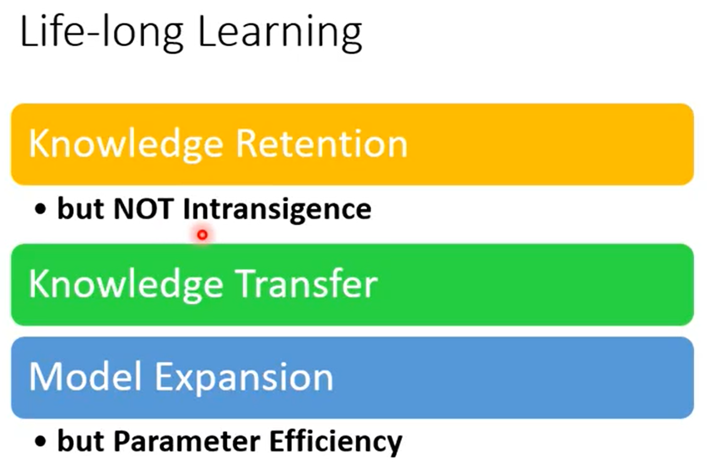
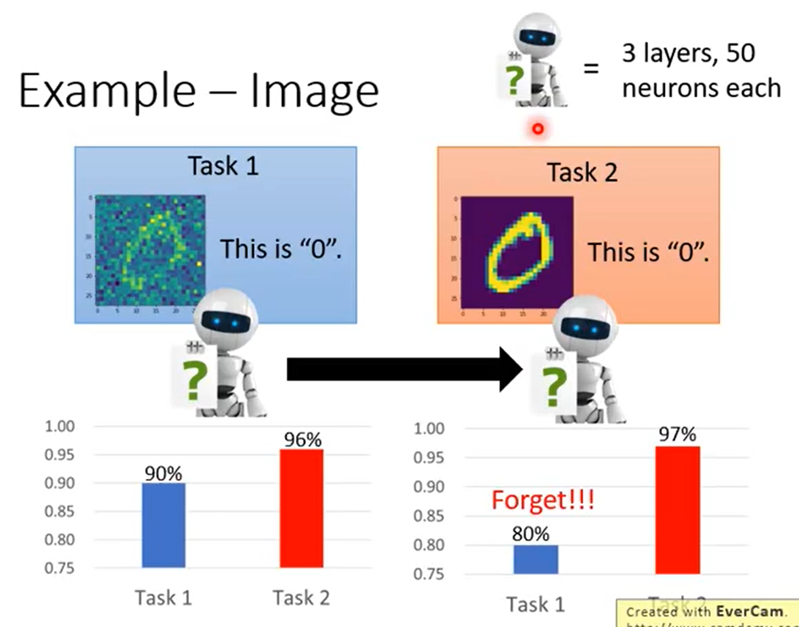
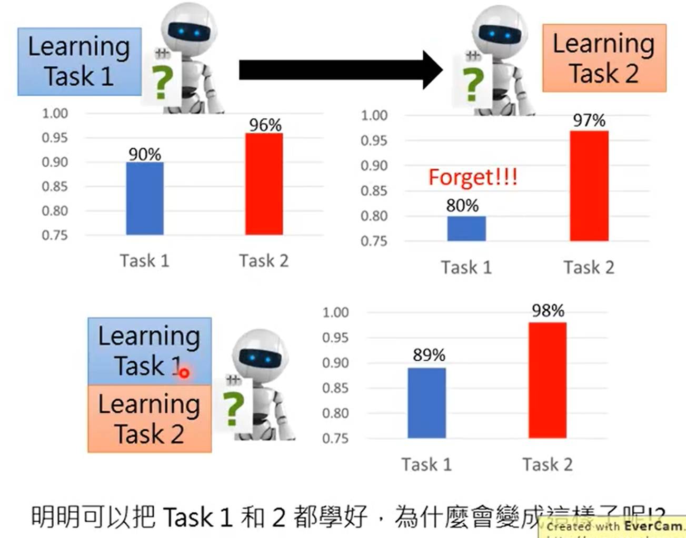
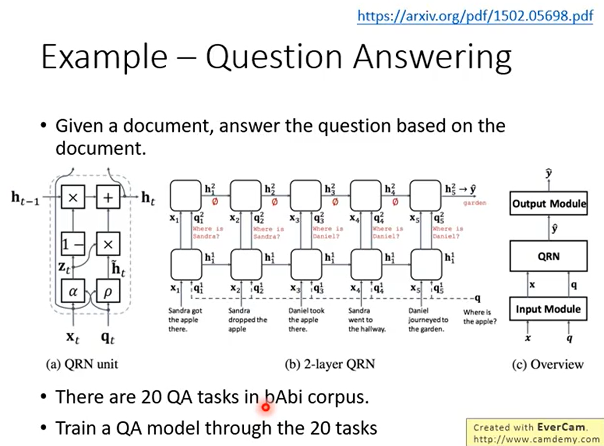
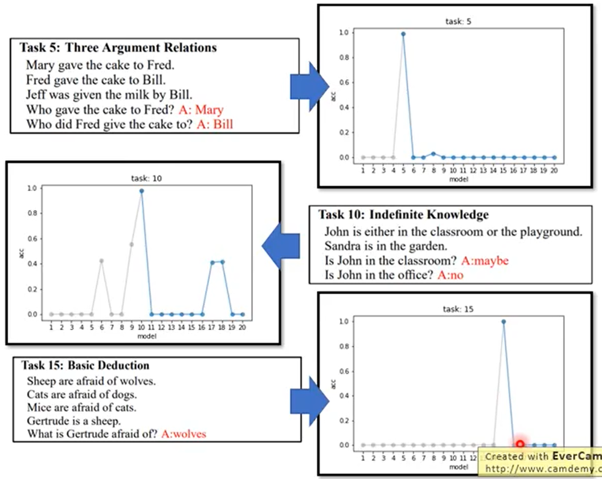
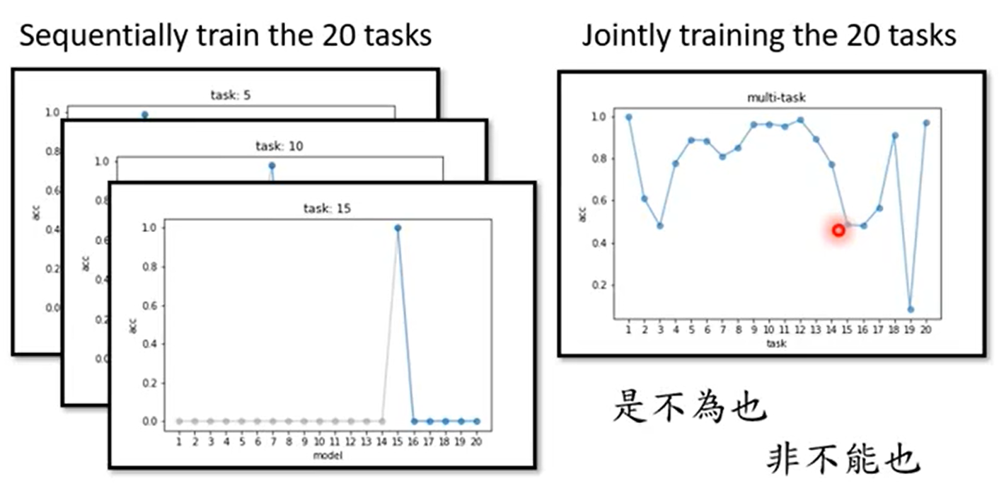

```
知识保留，但不是不妥协
```

>**Example - Image**


```
3 layers，50 neorons，
先 train task1，再 train task2，将训练完 task1 的 model 作为 task2 的 initial paramter。结果是对 task1 的辨识率降低。
```

```
同时 train task1 和 task2，得到的结果还是可以的。
```
>**Example - Question Answering**


```
1、训练一个 model 去解 20 种不同的题型
2、20 种题型分别训练 20 个 model 去解 20 种不同的题型
```


```
分别学习，train 出来的 model 会把之前学的遗忘掉
同时学习，虽然达不到 100%，但是遗忘的较少。
``