### 1、Funcion Set

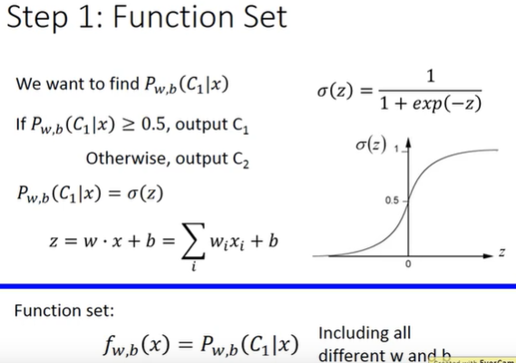
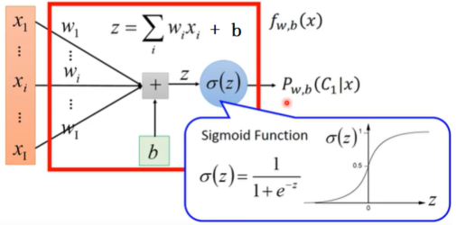
```
所有 w & b 集合起来就是 function set
posterior probability
x 属于 C1 的几率
```

### 2、Goodness of a Function

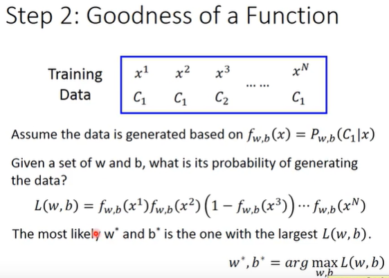
```
其中 L(w,b) 是由线性方程的概率计算的
找到最好的 w*,b*，则需要使得 L(w,b) 最大
```
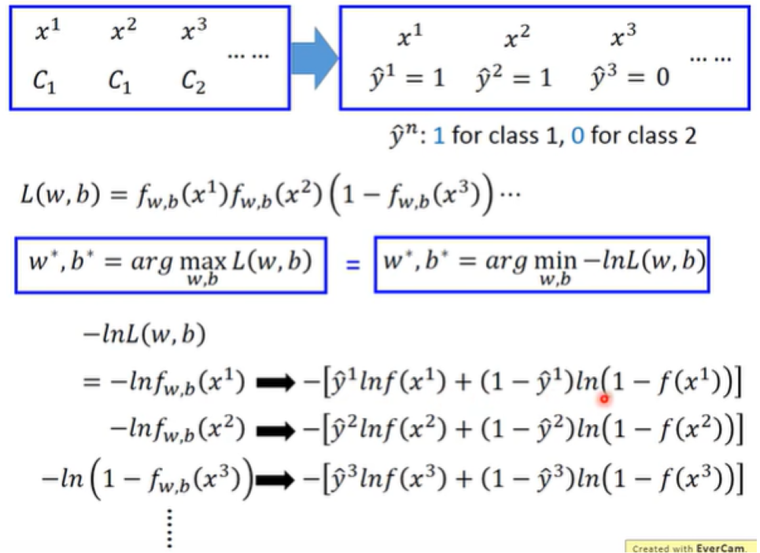
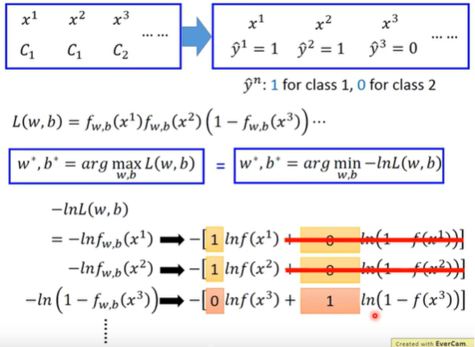
```
找到 w*,b*，使得L(w,b)最大化，等同于找到 ln L(w,b)，取 L(w,b) 的 ln，order是不会变的，找到 w*,b* 最小化 -ln L(w,b)
左边方程和右边方程是相等的，找到的是同一个 w*,b*。
```
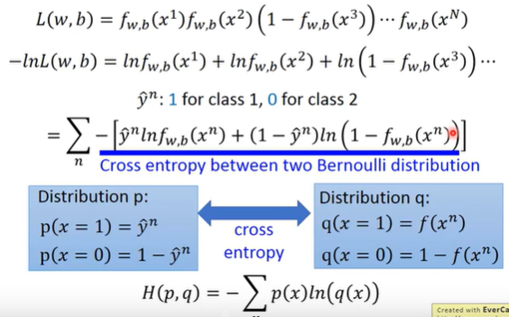
```
伯努利方程
```
### 3、Find the best function

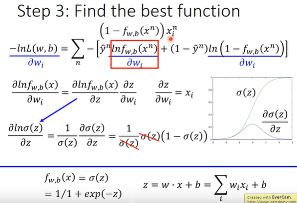
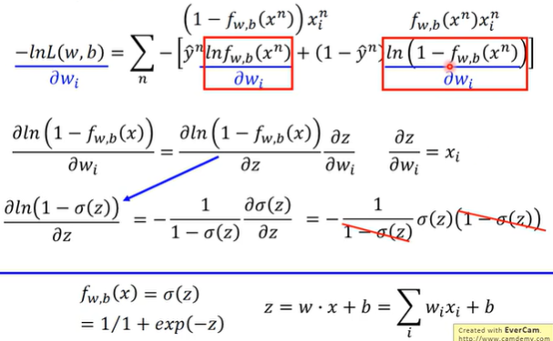
```
划减之后结果
```
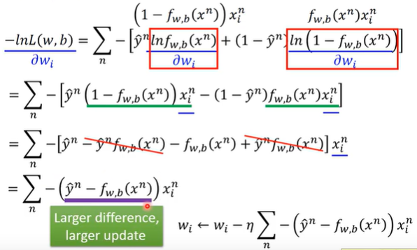
```
w 的 update 取决于三部分
·η：Learning rate 自定义的
·xi：来自于 training data
·(y^n - f(xn))：代表现在的 output 和理想的目标的差距有多大
```

>**Logistic Regression 和 Linear Regression 的对比**

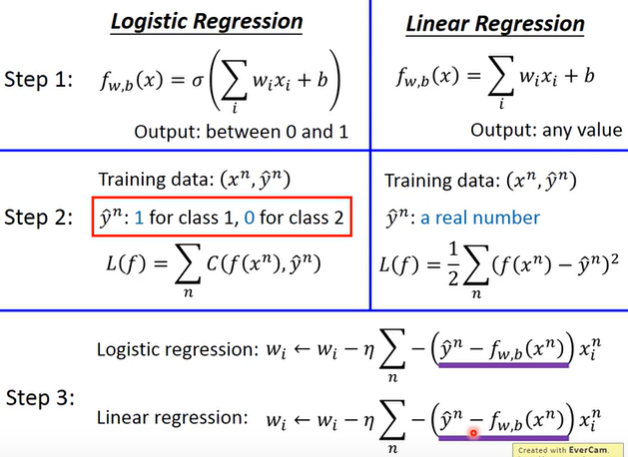

>**解释为什么 Logistic Regression 不能使用 Square Error**

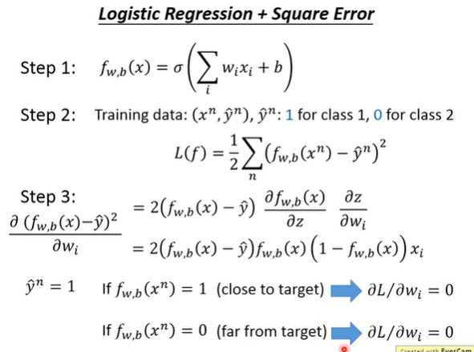
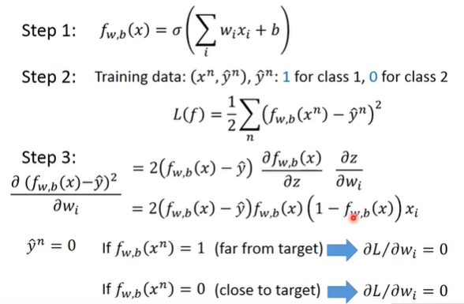
```
y^n = 1 
y^n = 0
```
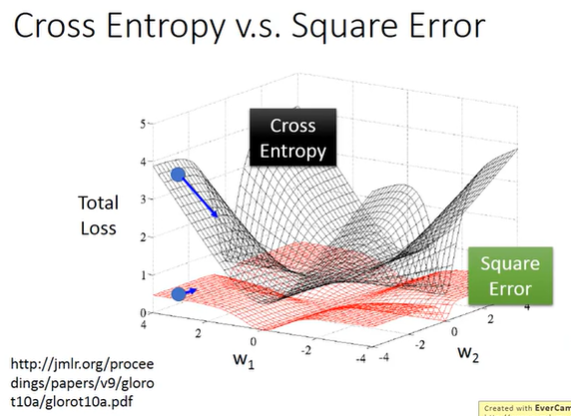
[内容来自于 PDF 文档](http://proceedings.mlr.press/v9/glorot10a/glorot10a.pdf)
```markdown
Cross Entropy: 当独立目标值很近的地方，微分值很小，当距离目标值很远的地方，微分值很大
Square Error: 距离目标值很近或者很远的地方，微分值都很小

当随机选取一个初始值时，如果使用 Square Error 时，距离远的初始值和距离近的初始值的微分值都很小，无法确定 Gradient Descent 计算出来的微分值小的时候距离目标值的距离。
```
>**Discriminative VS Generative**

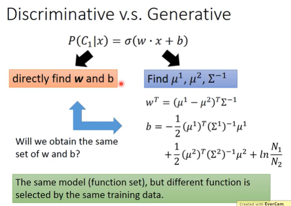
```
左边和右边找出来的 (w,b) 不是同一组
```
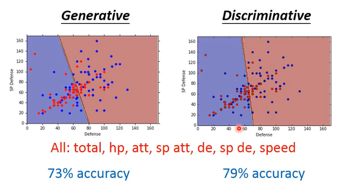
```
Discriminative 要比 Generative 好
```
>**Example**

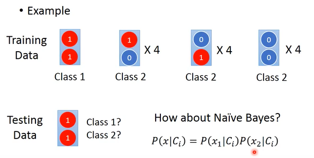
```
使用 Naive Bayes :朴素贝叶斯;朴素贝叶斯算法;朴素贝叶斯方法;
```
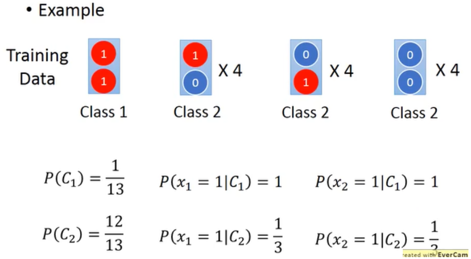
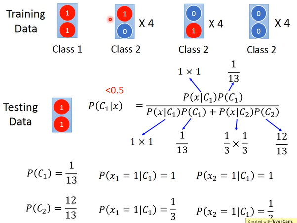
```
使用 Naive Bayes 计算出来的结果属于 Class2
```

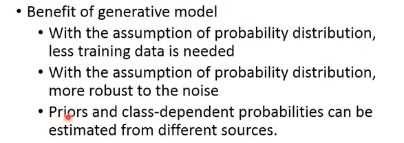
```
Discriminative 不是总是比 Generative 好
Discriminative 会由于 data 的数量影响，data 越多，它的 error 越小
```

> **Multi-class Classification**

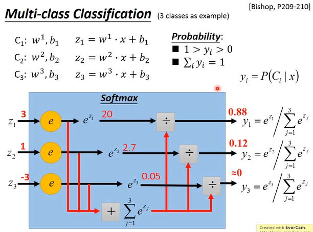
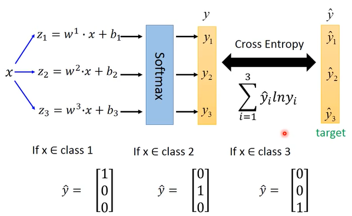
```
归一化
概率论
```
>**Limitation of Logistic Regression**


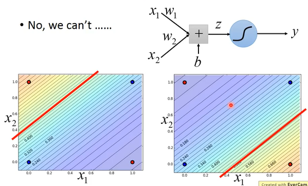
```
Logistic Regression 有一定的局限性
```

>**解决方法**

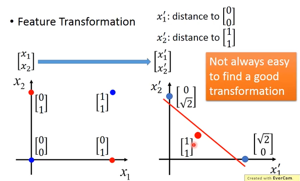
```
将不好区分的映射到另外一个好区分的空间，进行 boundry 划分
```
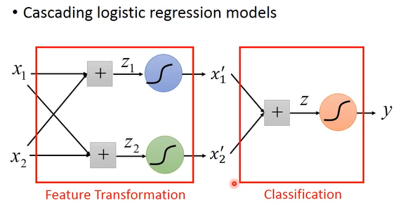
```
可以把很多个 Logistic Regression 连接起来
两个 input, x1、x2,通过 sigmod 函数输出为 x1',x2'，如果在新的 transform 上面是可以用一条直线划分的，那么最后只要再接另一个 Logistic Regression Model。
```
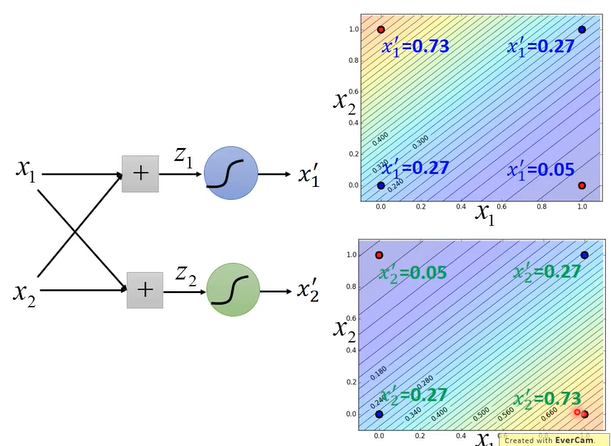
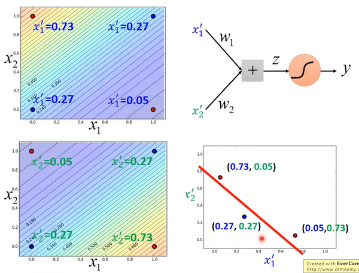
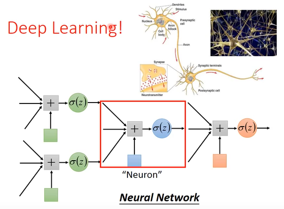