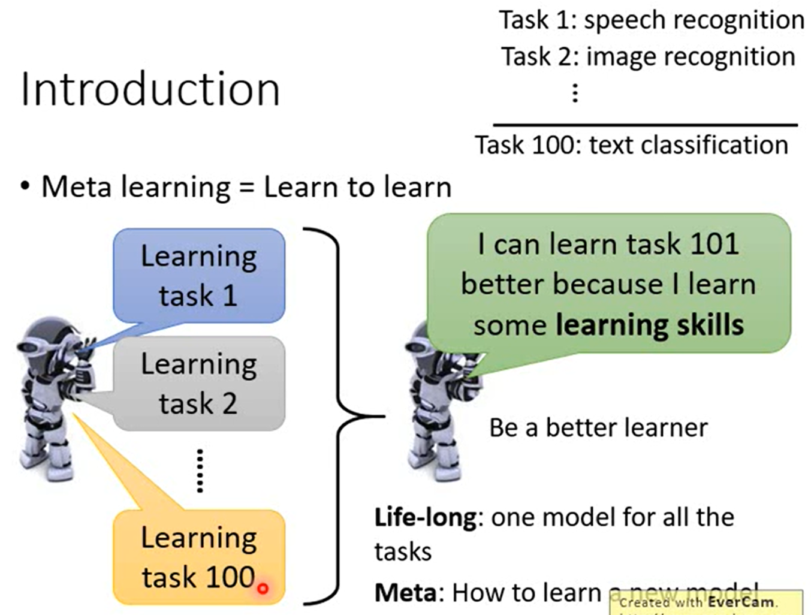
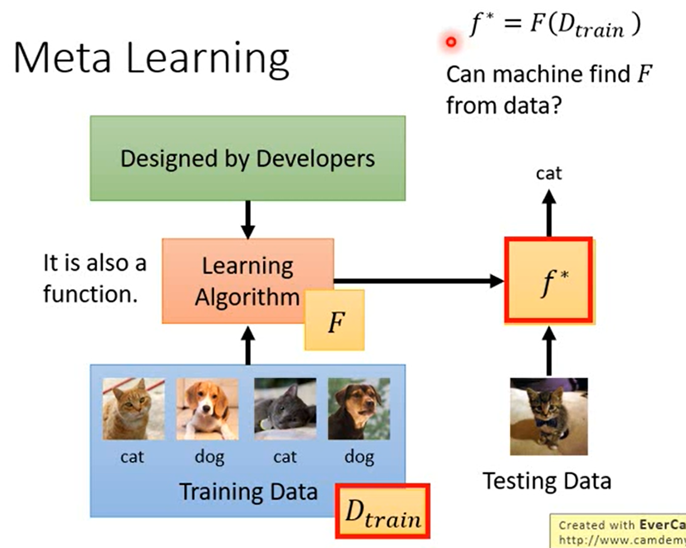
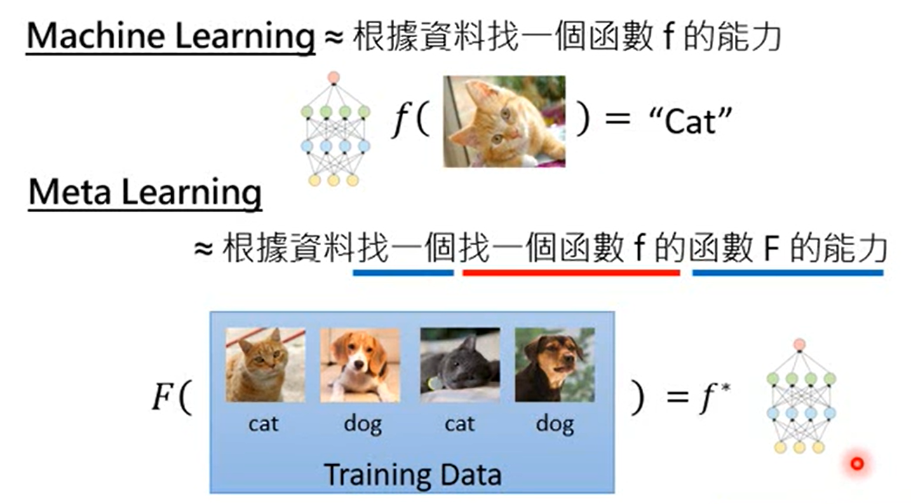
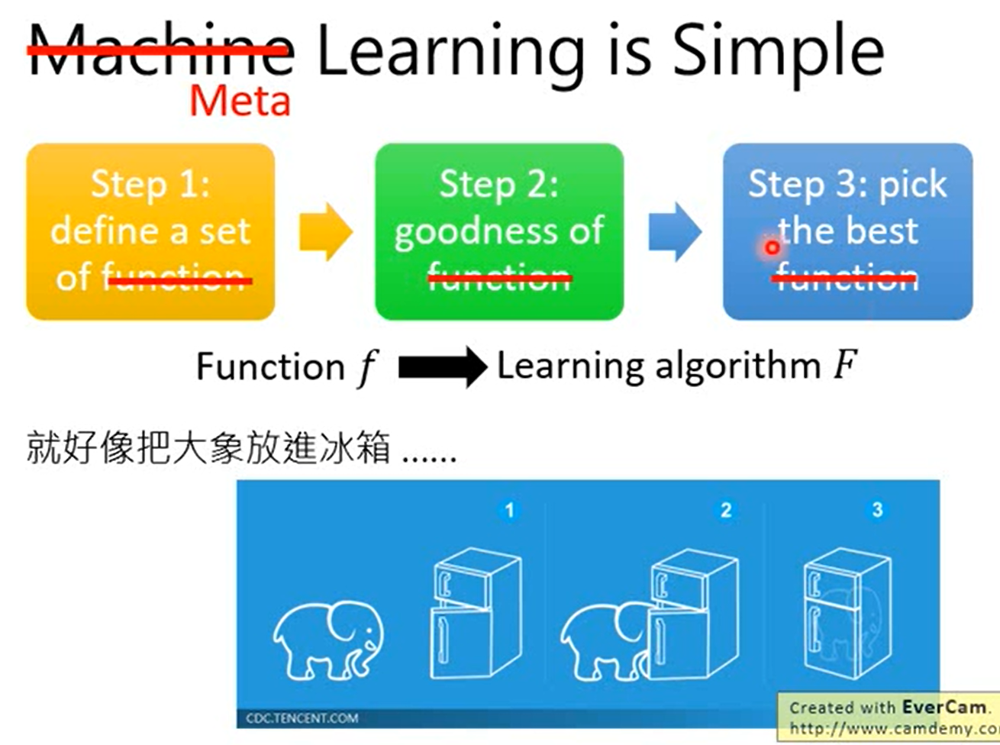
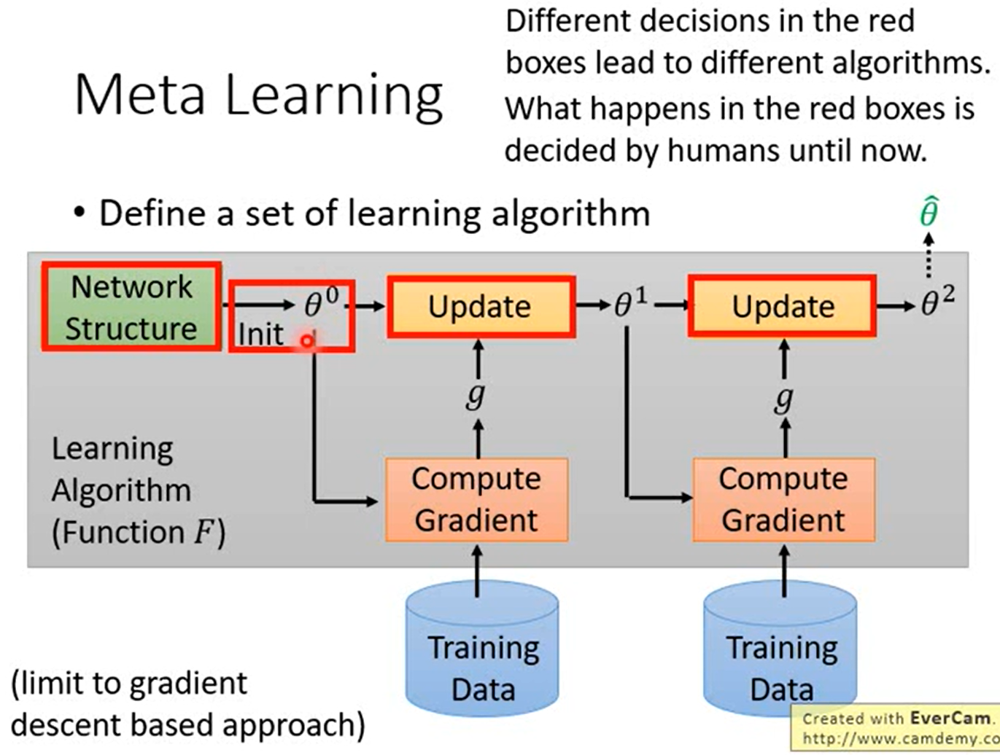
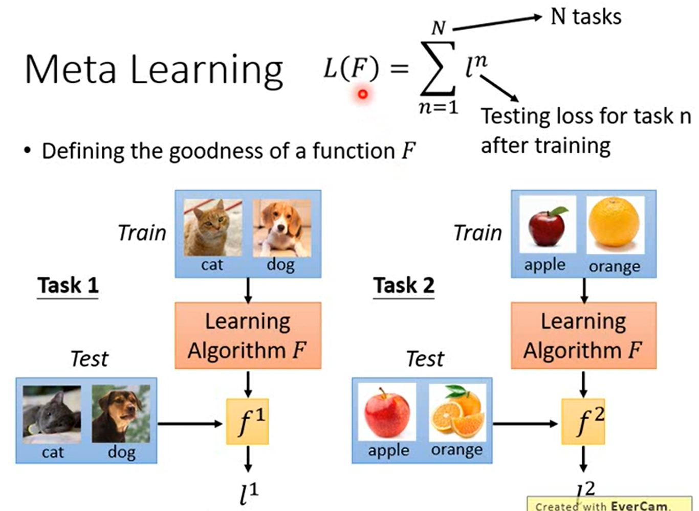
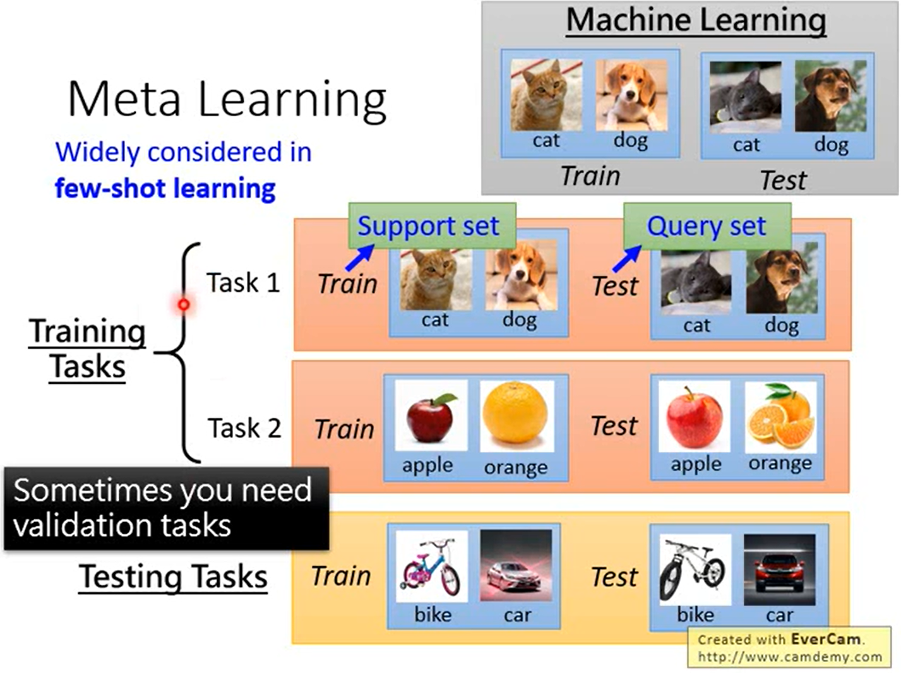
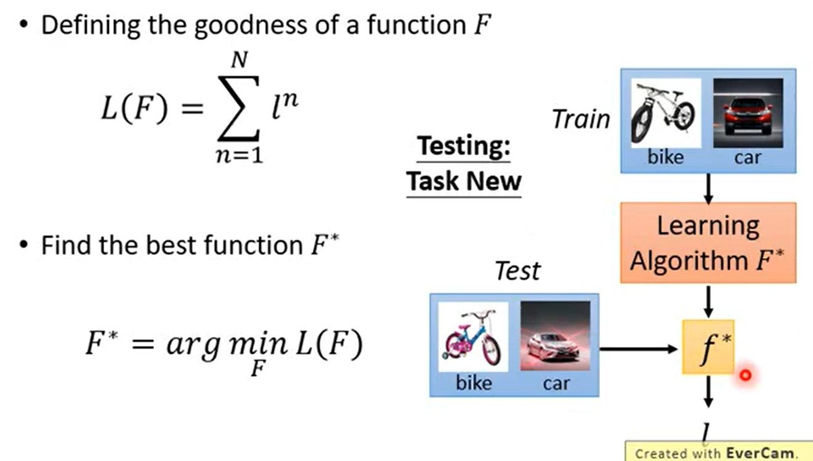

```
让机器学习如何做学习这件事。
机器学过一大堆任务以后，根据过去任务所汲取的经验，变成了一个 learner，往后有一个新的任务，它可以学习的更快。
例如：
在过去学习了 speech recognition，image recognition，那在做 text classification 会做的更好。
Life-Long: 不断的用同一个 model 来做学习，同一个 model 学习很多技能。
Meta: 不同的任务有自己的 model，机器可以从过去的学习经验里面学到一些东西使得未来要去 train 一个新的 model 的时候，可以训练的更快更好。
```

```
让机器自动的找出 learning algorithm，找出生成 function 的 function。
```

```
Machine Learning: 找出一个函数 f 的能力
Meta Learning: 找出一个可以生成 function 的函数 F 的能力。
```

```
1、define a set of Learning algorithm
2、goodness of Learning algorithm
3、pick the best Learning algorithm
```

### Define a set of Learning algorithm


```
准备一组 learning algorithm，在将 Deep Learning 的时候，当定出 Neuron Network 的时候，就有了 function set，
```

### Defining the goodness of Learning algorithm


```
f1、f2 表示 task1 学习出来的结果，task1、task2 的 Test data 放入 f1 中得到结果 l1、l2。
假设有 N 个 task，每个 task 都能算出一个 loss 值，loss 值全部加起来得到L(F)，用 L(F) 来评估 Learning algorithm 好坏。
```
>**Meta Learning 和 Machine Learning 的区别**


```
Machine Learning 需要准备 train image 和 test image。
Meta Learning 需要准备 train task 和 test task，每一个 task 中都有 train image 和 test image。
在 Meta Learning 中训练资料叫做 train task，测试资料叫做 test task。
Support set		Query set
```

### pick the best Learning algorithm


```
最好的 learning algorithm 就是待入这个 Loss Function，算出来最小的 leanring algorithm。
```
