```
把 Learning Algorithm 当成 RNN。
```
>**Review - RNN**

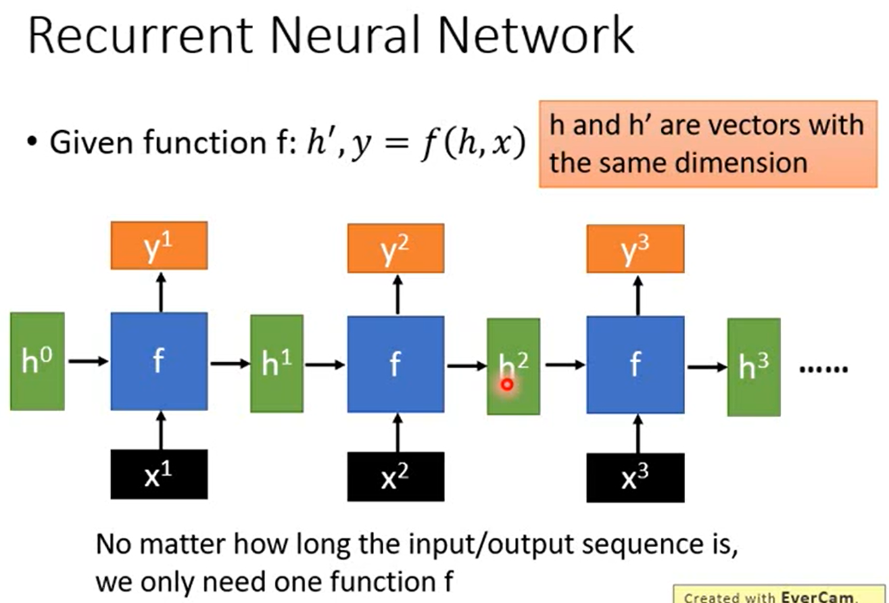
```
RNN 擅长处理 input 是一个 Sequence 的状态。
```
>**Review - LSTM**

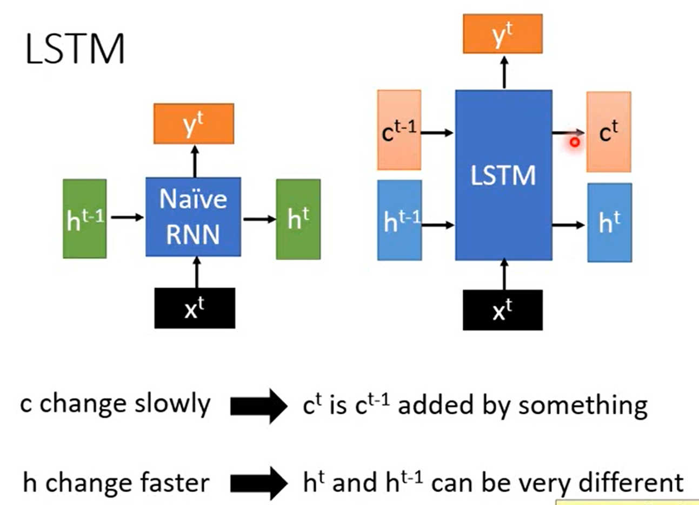
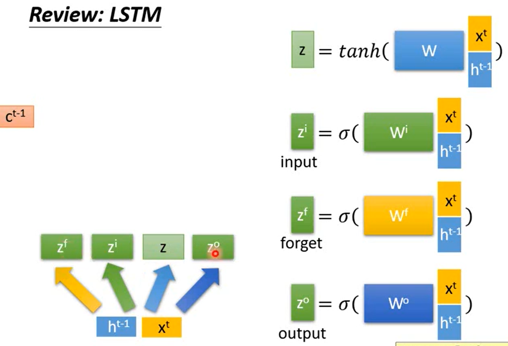
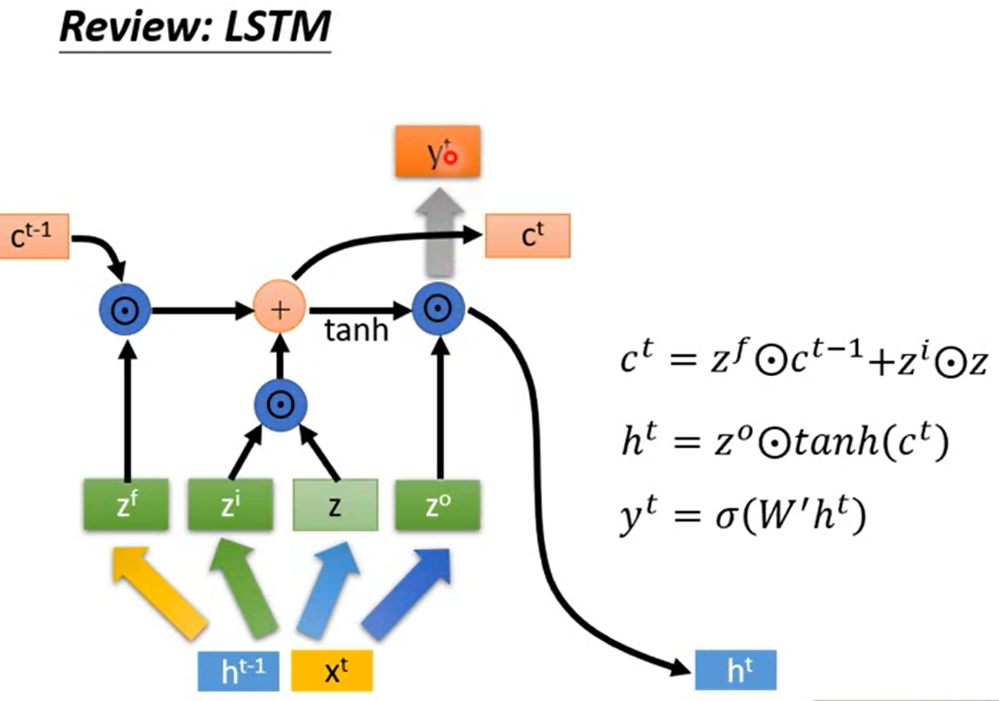
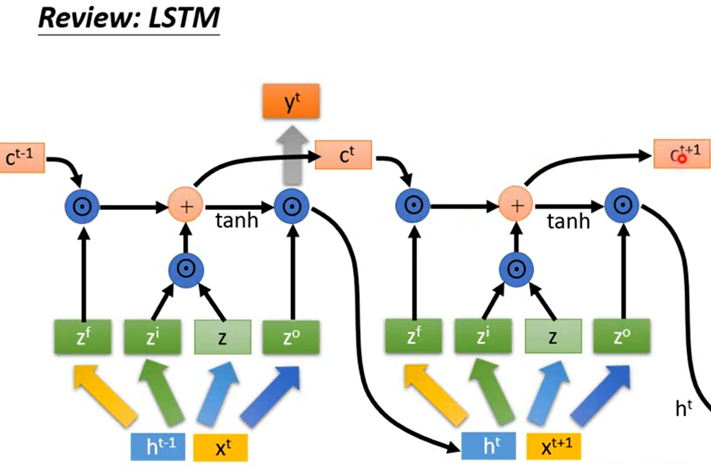

>**Similar to gradient descent based algorithm**

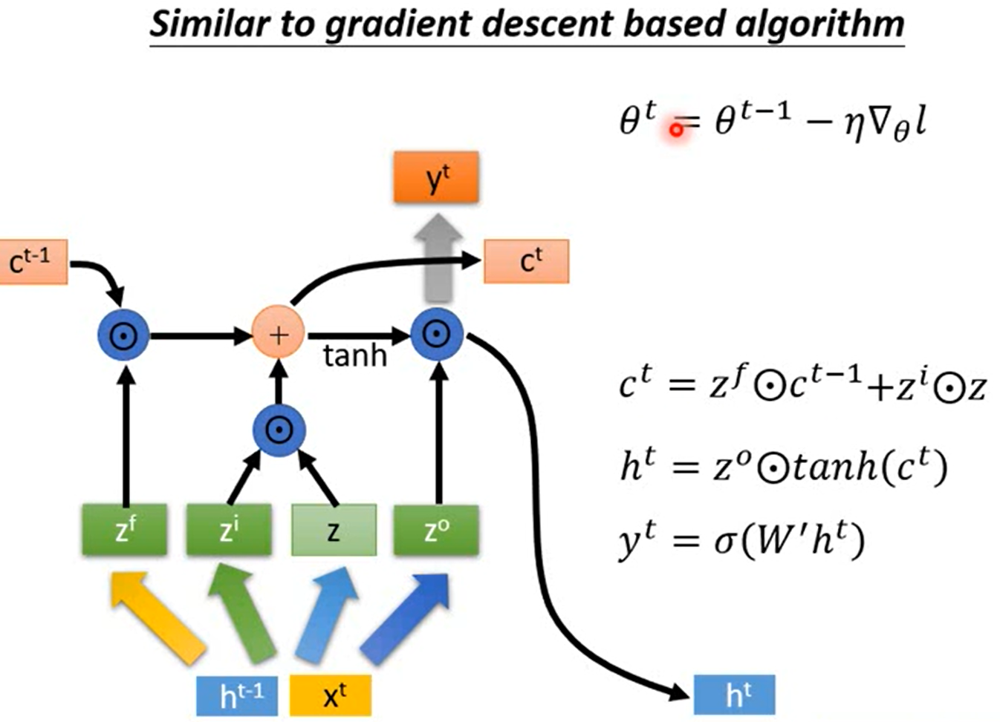
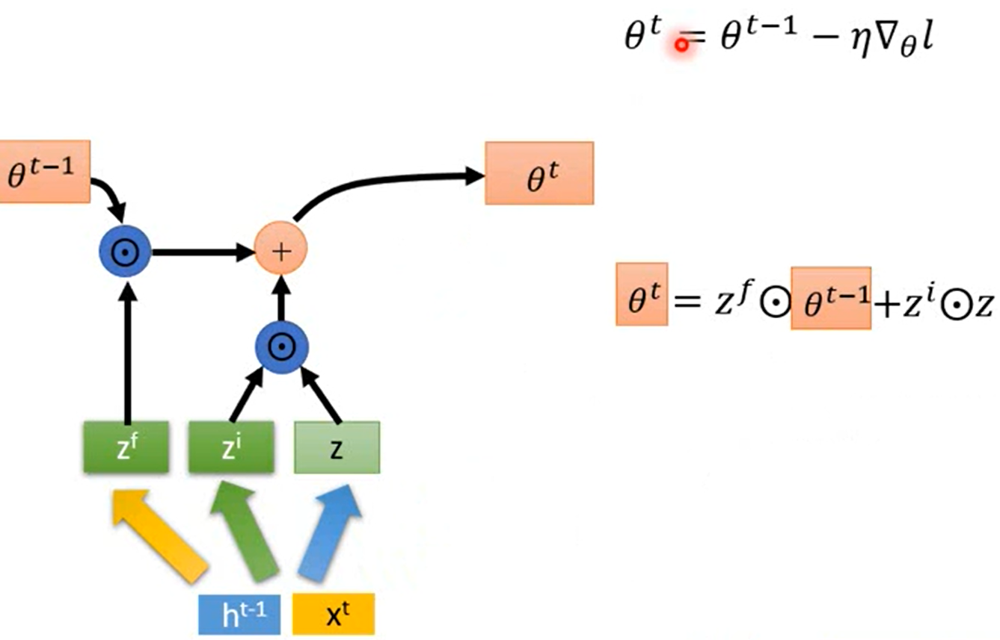
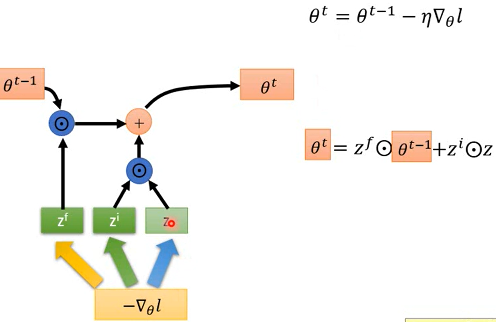
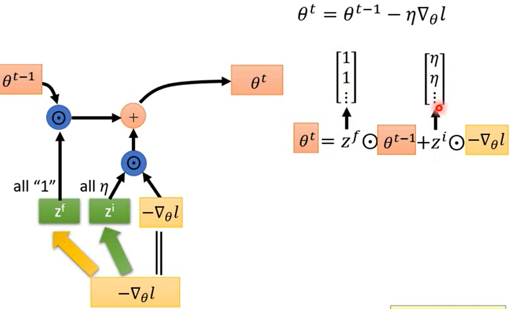
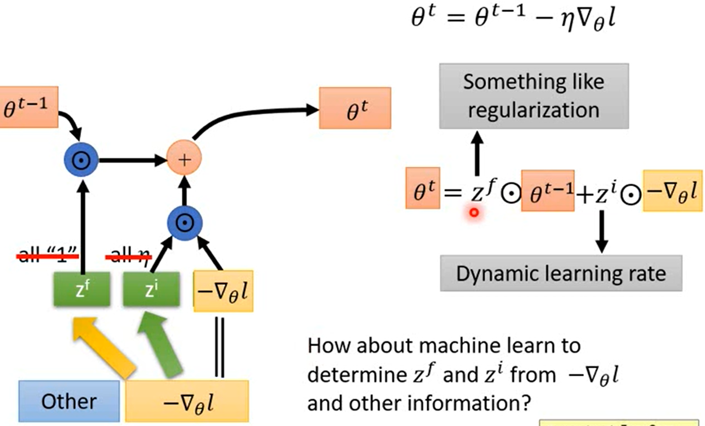
```
将 ct-1 当成 θt-1 来看，将 ht-1，xt 换成 -△θl
zf 这个 vector 中的每一个 dimension 都是 1,
zi 这个 vector 中的每一个 dimension 都是 η,
可以说 Gradient Descent 就是 LSTM 的简化版。
```


```
为了减少更改 code，假设 θ 和 input 的关系不存在。当成一般的 LSTM 硬 train 下去。
```

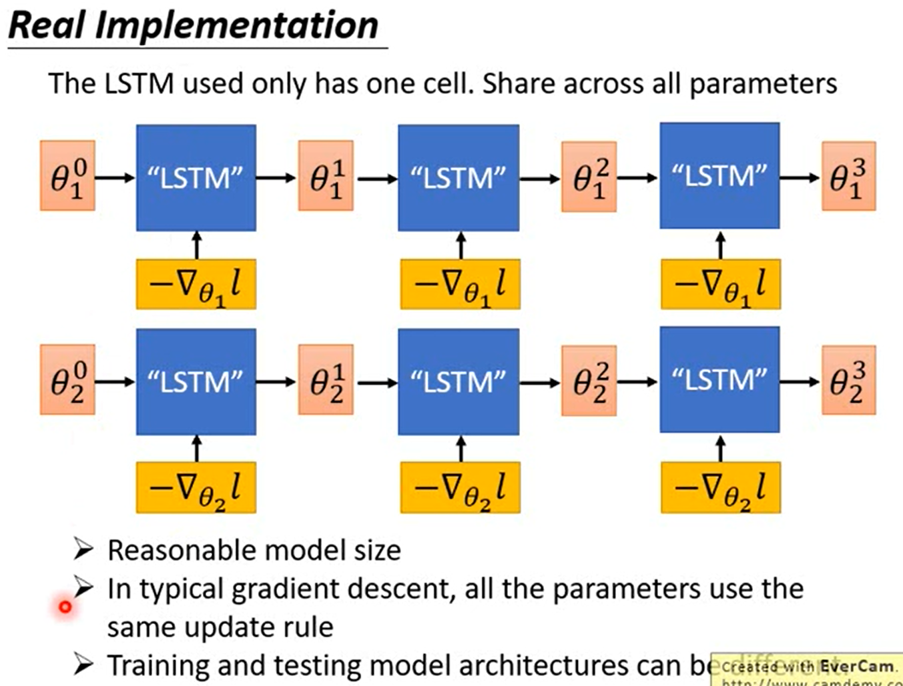
```
所有的参数共用同一个 LSTM，LSTM 只能出一个参数，同样的 LSTM 被用在所有的参数书上。
θ 的处理方式是一样的。不用担心会算出同样的值。
初始从参数 θ 不一样，gradient 算出的结果也不一样。
```
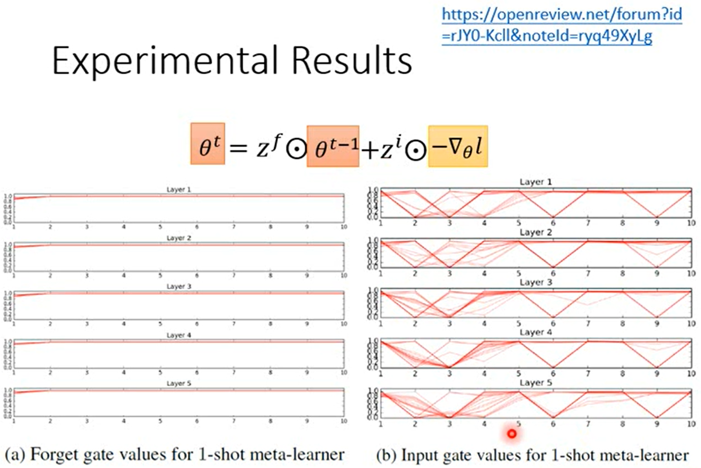
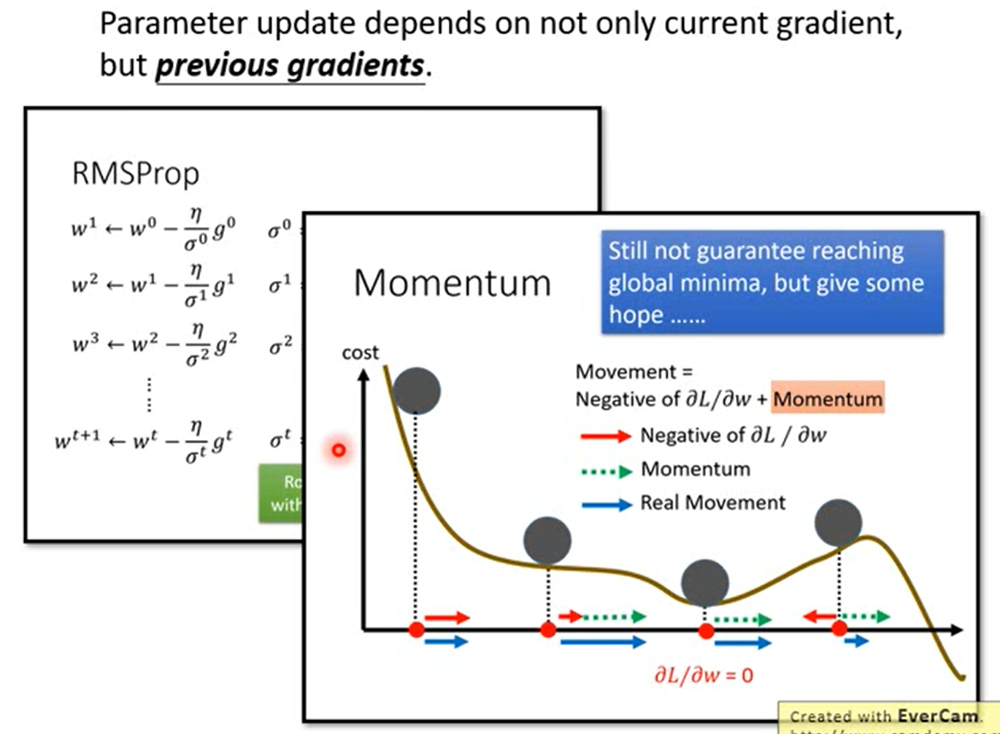
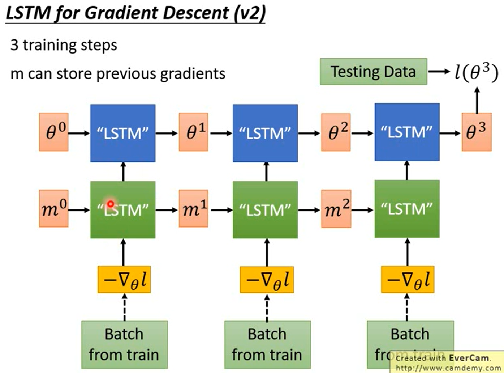
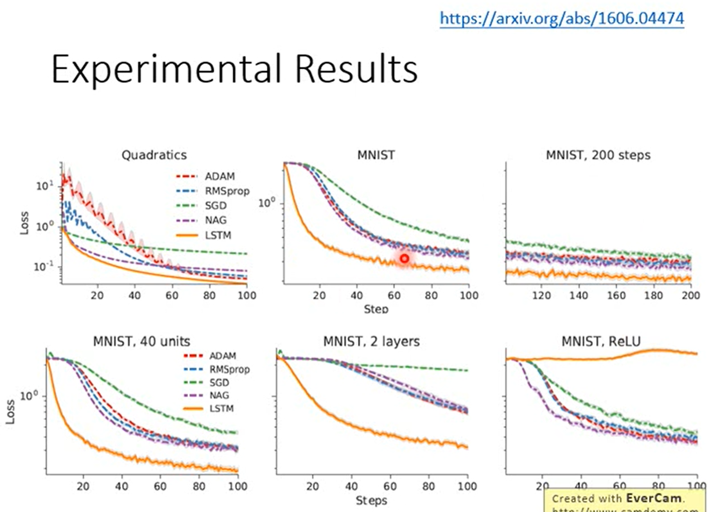