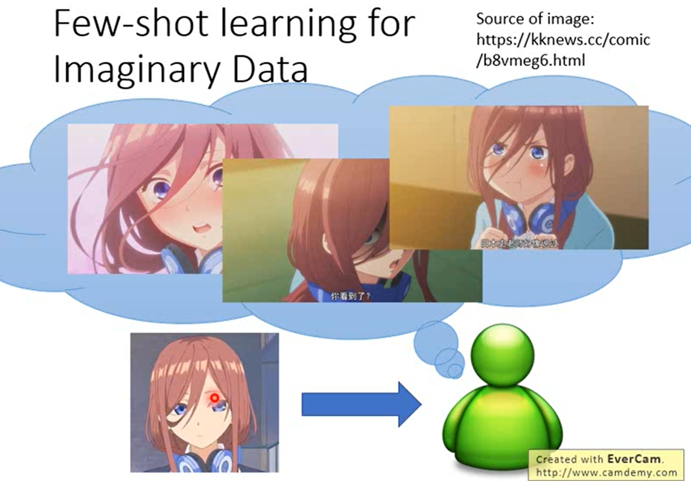

```
既做了 learning，又做了 testing。
Face Verification：Training & Testing
```


>**Siamese Network**


```
Train 的图和 Test 的图都通过 CNN，得到两个 embedding，CNN 的参数通常是一样的，计算两个 embedding vector 的 similarity。
Train 资料和 Test 资料是同一个人，output 出的 score 越大越好。
Train 资料和 Test 资料不是同一个人，output 出的 score 越小越好。
```

>**Siamese Network Intuitive Explanation**


```
Siamese Network 就是一个单纯的 Binary classification problem，每一个 train tas 就是 training 的一笔资料，每一笔资料都有两张 images。
用 CNN 将所有的人脸投影到一个空间上，同一个人的脸就比较接近，不同人的脸就比较远。
```


>**N-way Few / One-shot Learning**


```
5-ways 1-shot: 有 5 个 classes，每一个 class 都只有一个 example，
```

>**Prototypical  Network**


>**Matching  Network**


>**Relation  Network**


>**Generate Data**


