```
为什么这么在意 Network Compression？
未来我们可能希望把 Deep model 放在很多 mobile devices 上面，但很多 device 上面的资源是有限的，可以储存的空间是有限的，所以就不能存太深，太多的 network，network 不能有太多层，不能有太多的参数。
```

### Outline

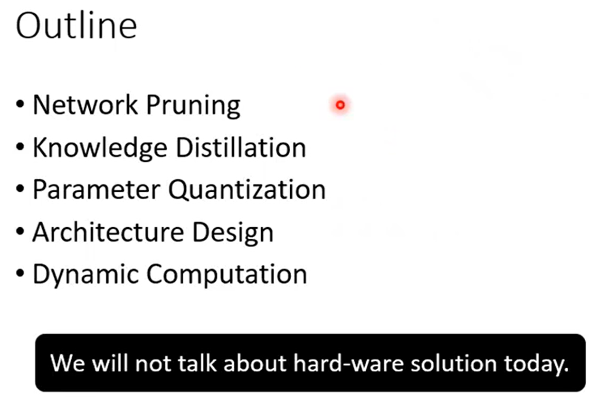

### Network Pruning

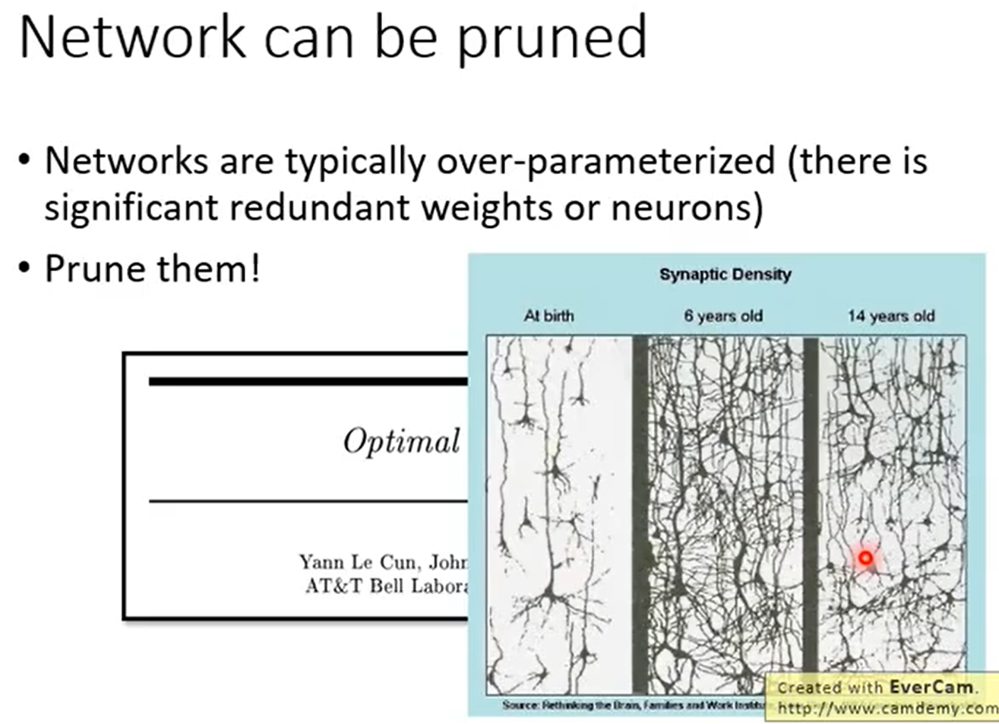
```
为什么可以做 Network Pruning 这件事呢？
因为 train 出来的 Neural Network 它是 over-parameterized 的，里面有很多参数是没有用的，
```
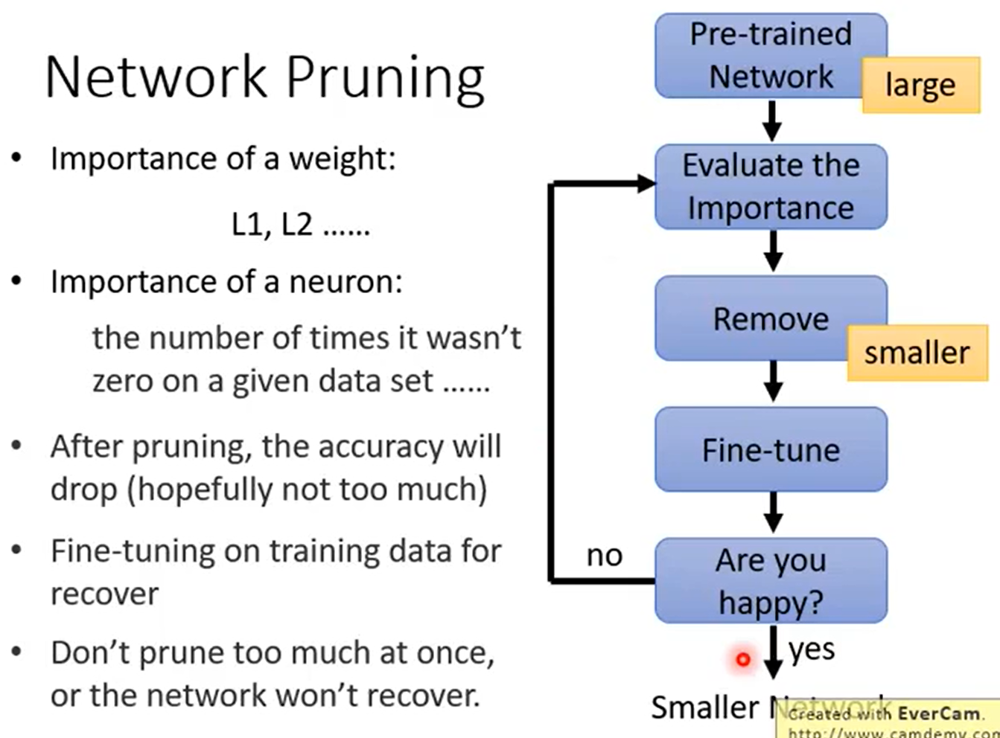
```
首先使用 training data train 好一个大的 Network，接下来就去 evaluate 这个大的 Network 的每一个 weight or neuron 的重要程度。

怎么评价 weight 重要不重要？
可以直接看 weight 的数值，如果那个 weight 很接近 0，那可能就是一个比较不重要的 weight，如果那个 weight 非常的正，或者是非常的负，它可能就是一个非常重要的 weight。

怎么评价 neuron 重要不重要？
如果给定一个 dataset，某一个 neuron 的 output 几乎都是 0 的话，这个 neuron 可能就是一个不重要的 neuron。

把所有的 weight 和 neuron 按照它的重要性做排序，移除不重要的 weight 和 neuron，然后把本来比较大的 Network 变得比较小。
移除一些 weight 和 neuron 之后，performance 就会掉一点，可以把掉的 performance recover 回来，把新的 network 拿去原来的 train set 上，再去 fine-tune 一下，update 一次参数，往往就可以复原回来。就可以把损伤移除。

通常再做 remove 的时候，不会一次 remove 太多东西，如果一次 remove 太多东西，可能损失太严重，就有可能 recover 不回来。
```

#### Why Pruning

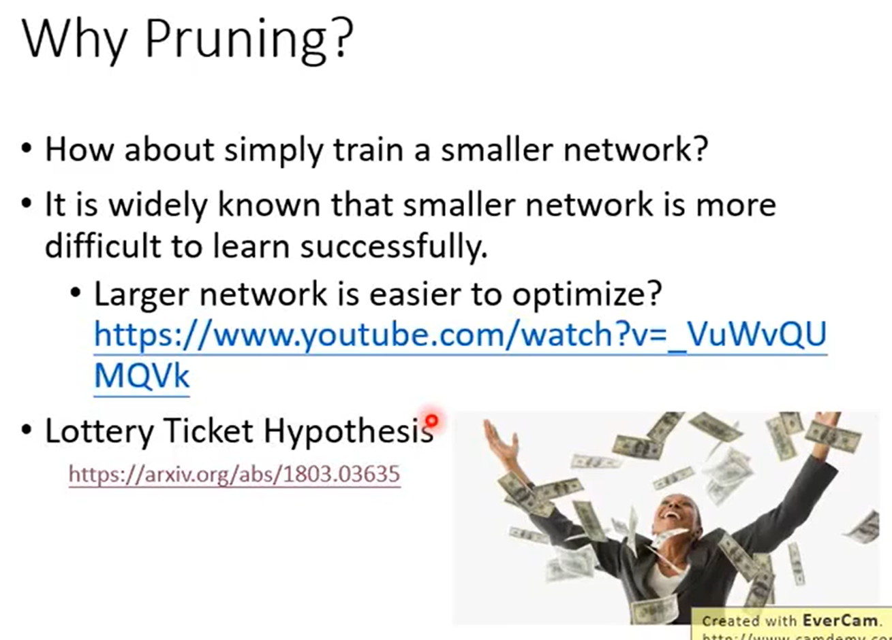
```
既然我们要一个比较小的 network，为什么一开始不 train 一个比较小的 network？
因为小的 network 比较难 train，大的 network 比较容易 optimize，在 train network 的时候，会有很多 local minimum、saddle point 的问题，但是如果 network 够大，这些问题就比较不严重，只要 network 够大，用 gradient descent 就可以找到 xxx 的 solution。
```
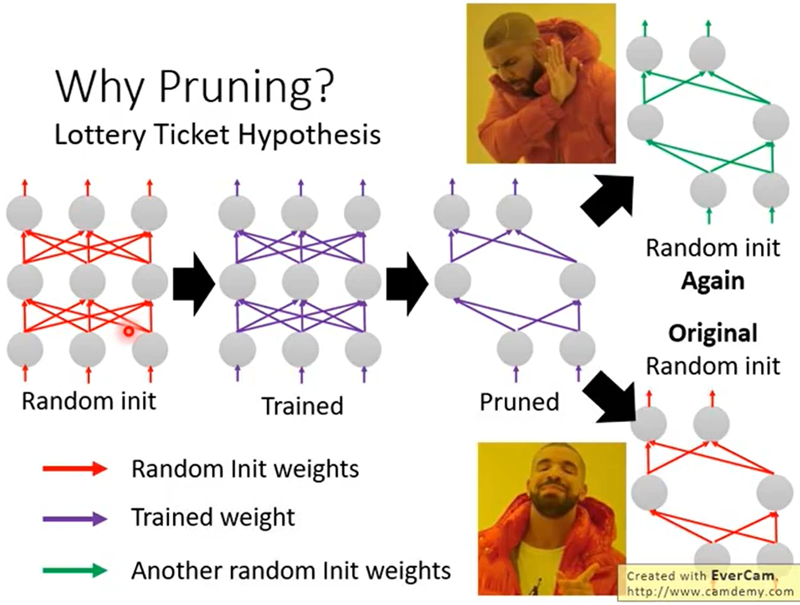
```
train 一个大的 network，train 下去，然后 prune 一些不要的 weight

```
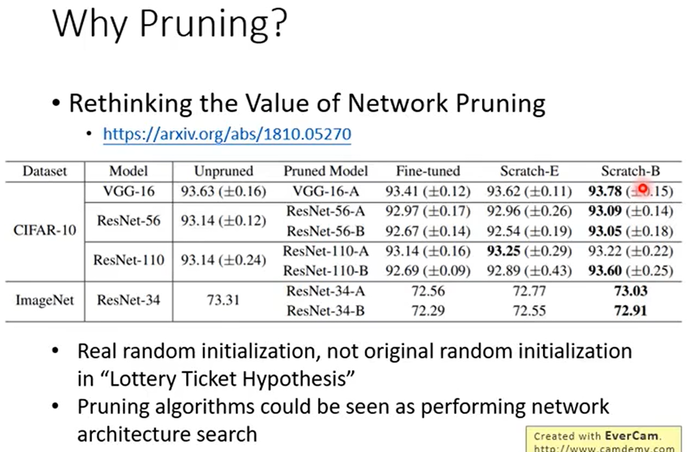

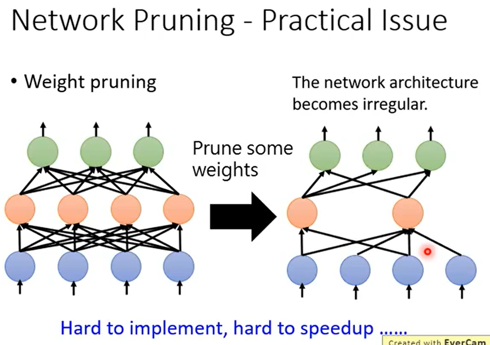
```
Network Pruning 有一些实作上的问题。
weight pruning 有什么样的问题？
prune somae weights 之后，The network architecture becomes irregular。
在 weight pruning 的时候，比较常见的实作方法是并没有把 weight prune 掉，而是把要 prune 的值设成 0。
```
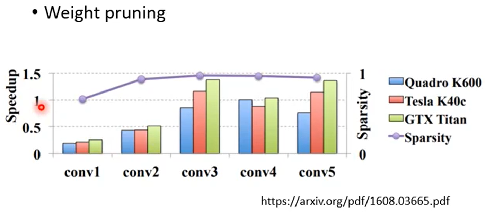


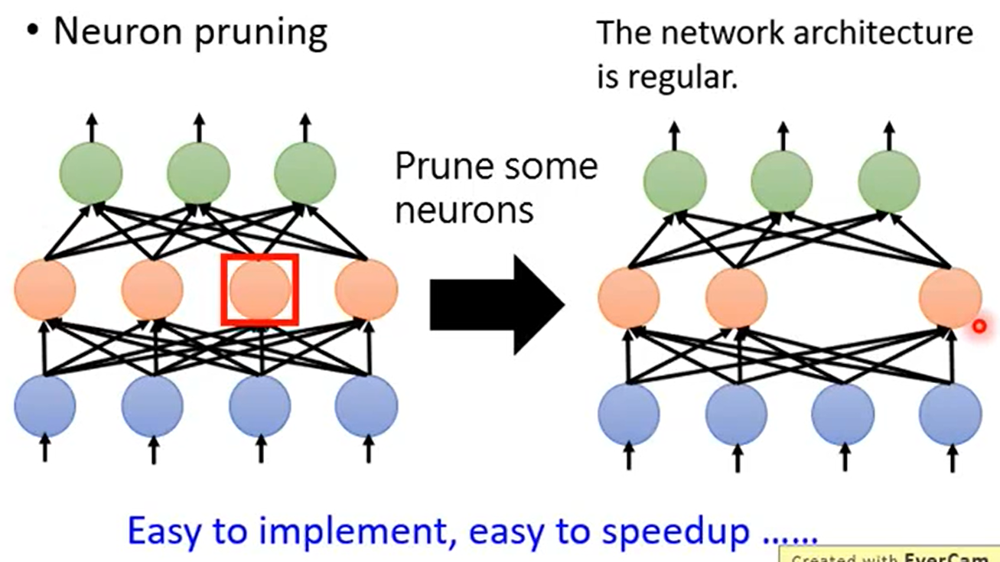
```
neuron pruning 有什么样的问题？
prune neuron 也许是比较好的方法
如果某一个 neuron 不重要，就把这个 neuron 前面的 weight 和 后面的 weight 拿掉。
```

### Knowledge Distillation

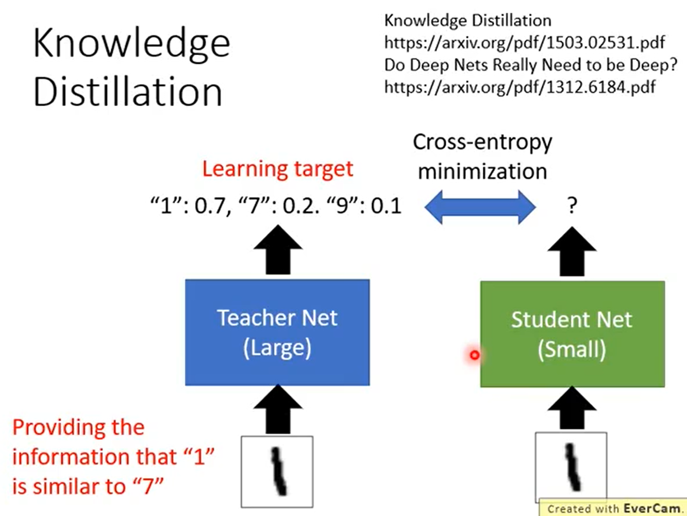
```
可以先 train 一个大的 network，再 train 一个小的 network 去学习大的 network 的行为。
为什么 Student Net 跟着 Teacher Net 去学可能会有比较好的结果？
因为 Teacher Net 提供了比 label data 更丰富的资料。
```
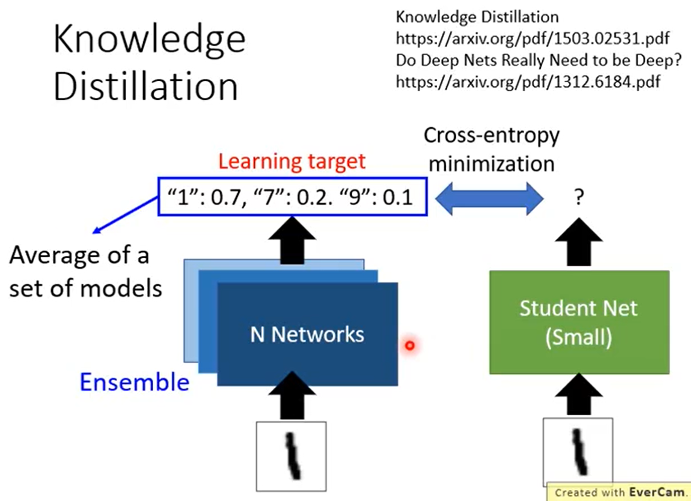
```
Knowledge Distillation 的有用的地方，在做 machine learning 的时候，往往会做 Ensemble，Knowledge Distillation 可以把 Ensemble 的 model 统统并起来，变成一个 model。
假设现在在做 Ensemble 这件事，有一大堆的 network，把这些 network 的 output 做平均得到的答案，接下来让 Student Net 去学 Ensemble Network 的 output，希望 Student Net 的 output 和 Ensemble 的结果一样，到时候只需要一个 model，它就可以达到类似 Ensemble 的效果。达到类似 Ensemble 的 performance。
```
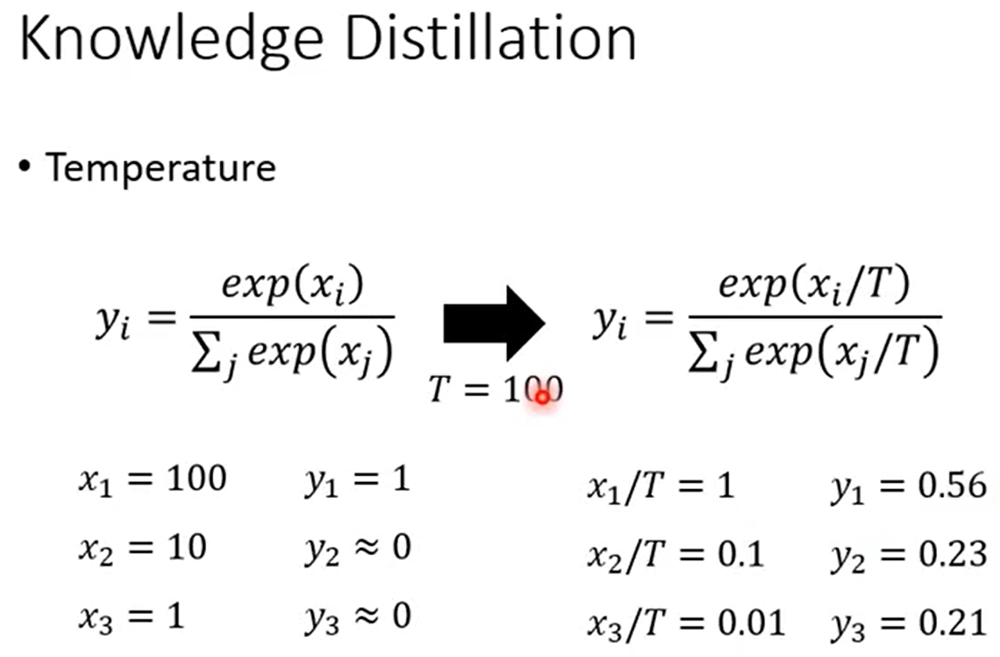
```
在实作 Knowledge Distillation 的时候，有一个常用的 track，一般在做 classifier 的时候，最后会有一个 softmax layer，softmax layer 怎么实作的呢？
假设最后一次 output 的值叫做 xi，把 xi 取 exp(xi)，再做 normalize，得到最终的输出 yi，那在做 Knowledge Distillation 的时候，在取 exp(xi)之前，可以把这些值 xi/T，这个 T 是 Temperature，Temperature 通常大于 1。
Temperature 的用途。
为了 Teacher Net output 的 distribution 可以更轻易的让 Student Net 学到，会让不同 label 间的分数拉近一点。
```

### Parameter Quantuzation

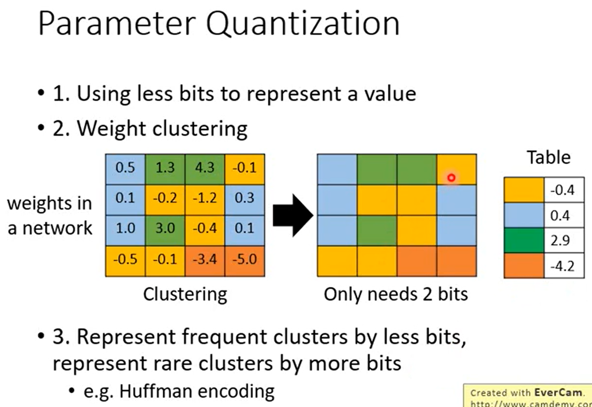
```
假设有 16 个 weight，把这个 weight 分群，假设分成 4 群，每一群用不同的颜色表示，之后在记录存这些 network 的时候，就不需要存这些真正的数值，就存这些 class id 就好。
```
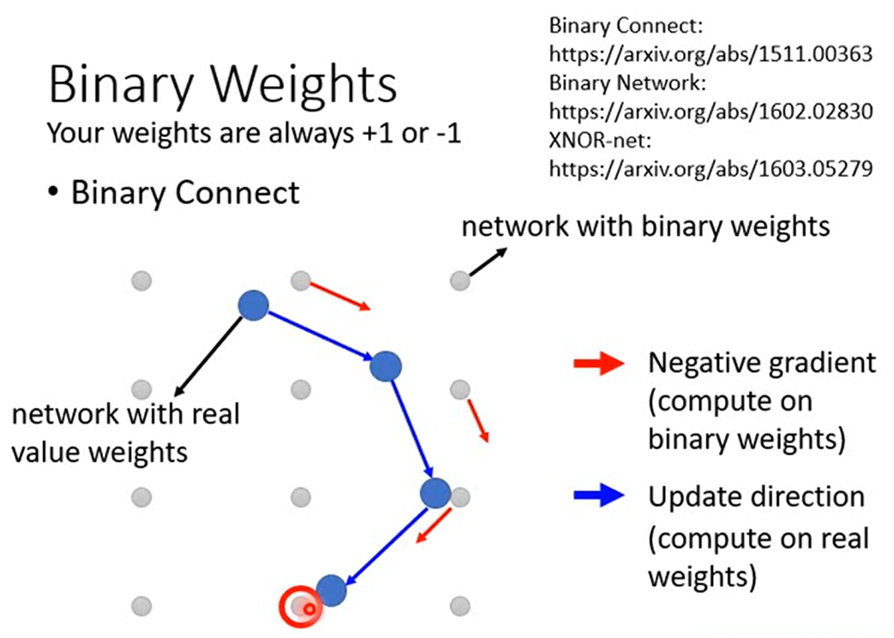
```
图片的点是参数的 space，参数的某一点代表某一组参数，灰色的点代表这一组参数的每一个数值都是二元化的，+1 or -1。
在找 Binary Weights 的同时，keep 一组 real value 的参数
Binary Connect 的训练其实和一般的 network很像，先 random initial 一组参数，这组参数可以是 real 的，在 Binary Connect 不是拿这一组参数计算它的 gradient，去找跟着一组参数最接近的一个有 Binary Weights 的 network，然后根据这个 Binary Weights 的 network 去计算它的 gradient，把这一组参数根据红色箭头的方向来继续 update。
```
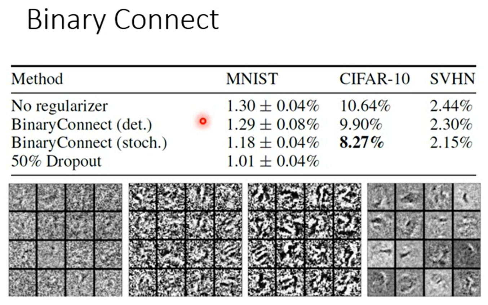

### Architecture Design

```
调整 Network 的架构设计，让它变得只需要比较少的参数
```
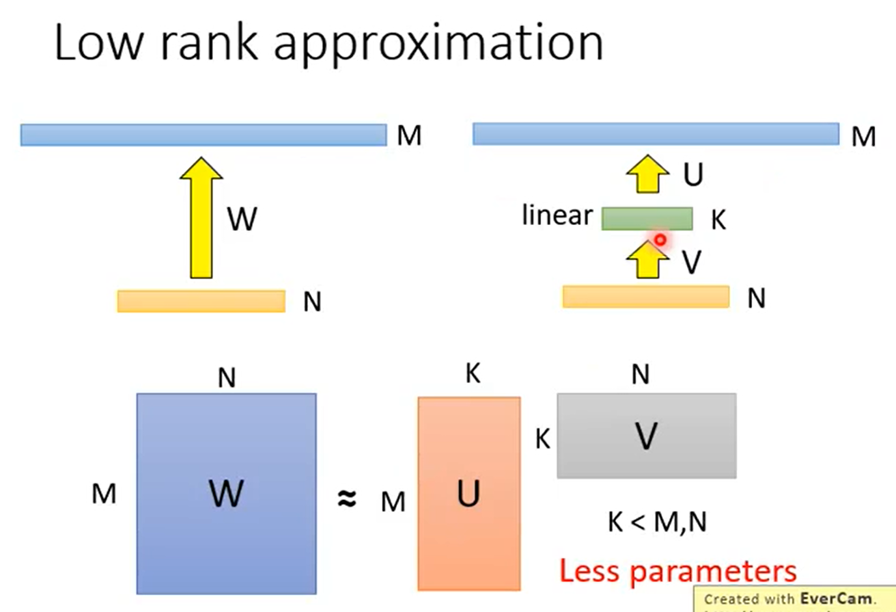
```
假设有一个 kuli connect network，前一层有 N 个 neuron，后一层有 M 个 neuron，W 代表 network 的 weight。
在 前一层 N 个 neuron 和 后一层 M 个 neuron 之间插一层 hidden layer，这个 hidden layer 有 K 个 neuron，没有 activation function，是 linear。
参数变少了
变化前：W = M * N
变化后：K * M + K * N
让 K 的值不要太大，就可以减少 network 的参数量。
```
>**Review: Standard CNN**

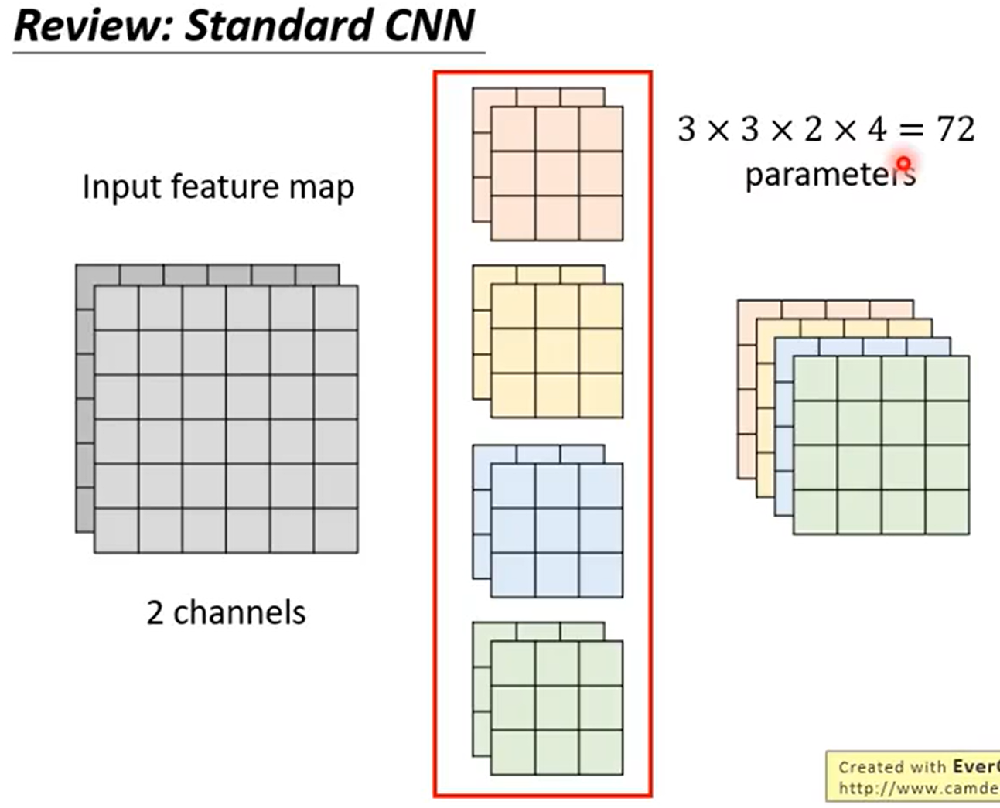
```
input feature map 有 2 channels，6x6 的 matrix。filter 的高也是 2。
4 个 filter，得到一个 4 个 4x4 的 matrix。
需要 3 x 3 x 2 x 4 = 72 个 parameters。
```
>**Depthwise Separable Convolution**

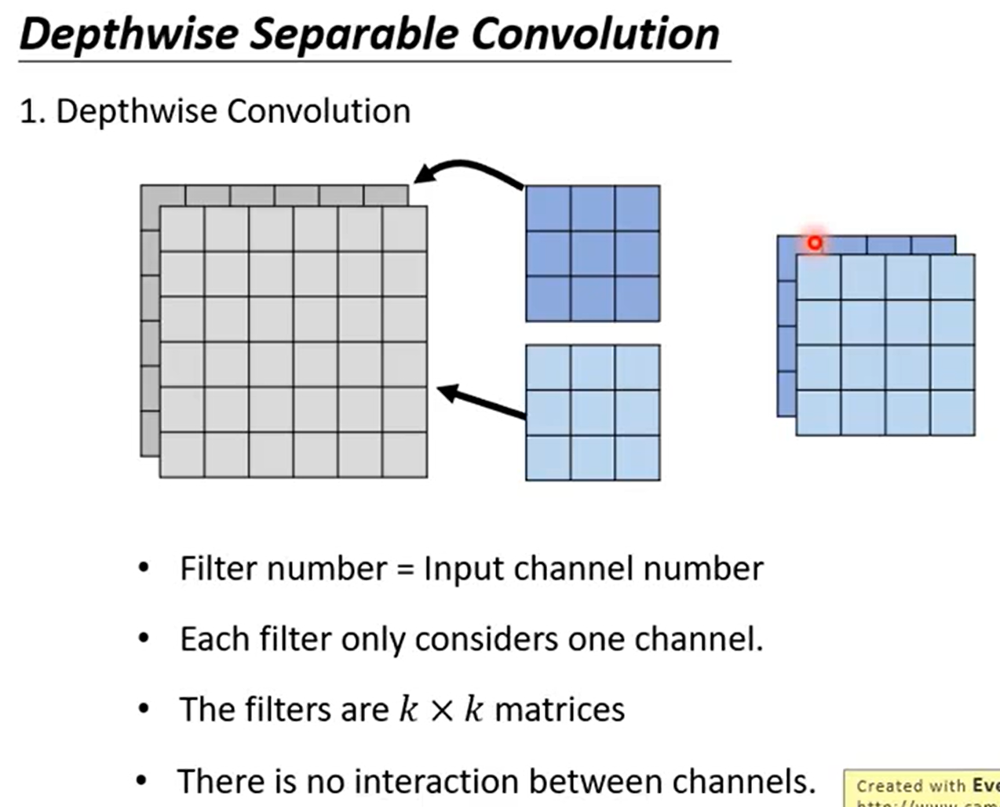
```
把 Convolution 拆成两个步骤。
Step 1: Depthwise Convolution
	filter 仍是一个 matrix，2D 的。它的限制是 input 有几个 channel，就设几个 filter，每一个 filter 只负责一个 channel。不同的 channel 之间没有交集。
```
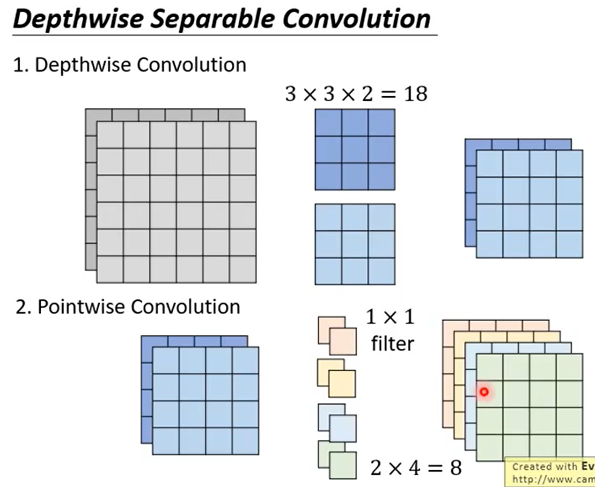
```
Step 2: Pointwise Convolution
	把他们之间的关系考虑进来。
	使用固定是 1x1 filter 来处理不同 channel 间的关系，得到一个 4x4 的 matrix，有几个 1x1 filter。就得到几个 4x4 的 matrix。
现在做的 input 和 output 和一般的 Convolution 的 input 和 output 是一样的。
需要 3 x 3 x 2 + 2 x 4  = 26 个 parameters。
```
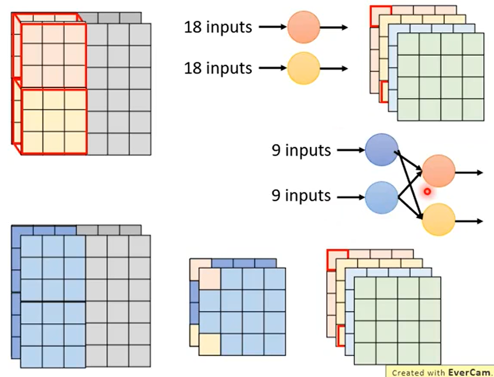
```
原来的 Convolution 和 Depthwise Separable Convolution 的关系。
Depthwise Separable Convolution 得到的值来自一个中间产物。
feature map 的 channel 和 input feature 的 channel 是一样的。
```
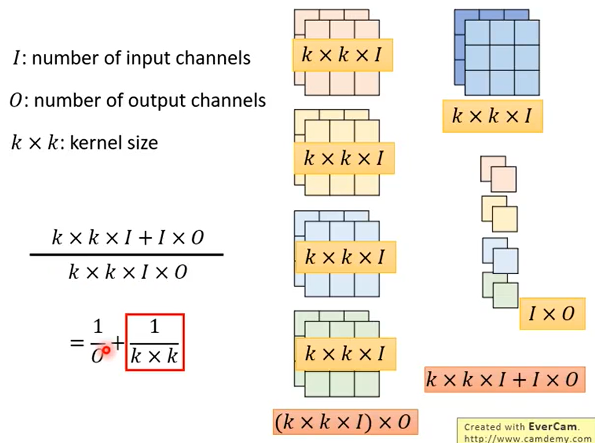
```
I: number of input channels
O: number of output channels
设 I = 2，O = 4
k: filter 的 size
一般 Convolution：(k * k * I) * O
Depthwise Separable Convolution：k * k * I + I * O
```


### Dynamic Computation

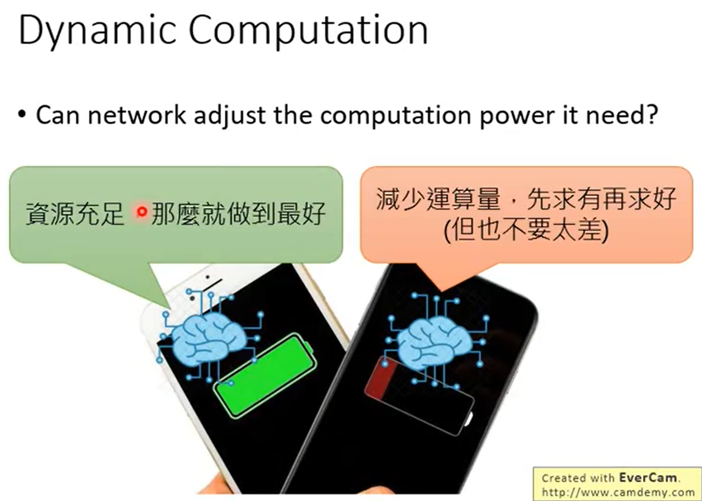

>**Possible Solutions**

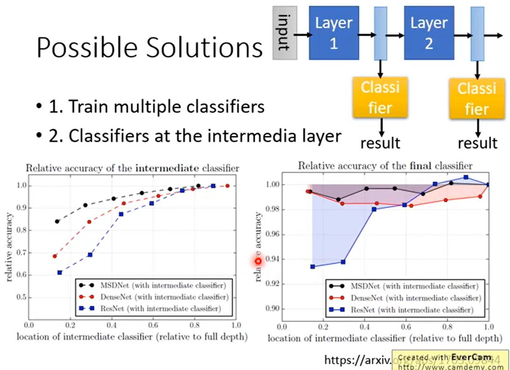
```
train 一把 network，从最深的到最浅的，根据 device 的行径，选择一个设当的 network
坏处：需要存一大堆的 network，占储存空间。
```
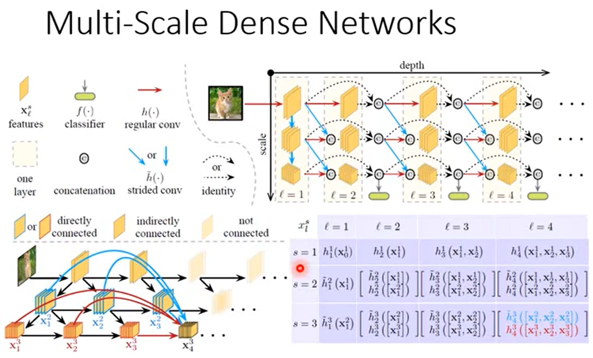

