### 1、Example

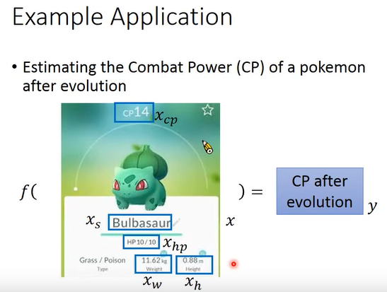
```
用 x 来表示一只‘宝可梦’，用带下标的 x 来表示一个完整事物的一个 component
	x: 一个宝可梦
		xcp: 战斗点数
		xs: 物种
		xhp: 生命值
		xw: 重量
		xh: 身高
	y: output 是进化后的 cp 值，是一个数值，是一个scalar
```
>**做 machine learning 需要三个步骤**

 1. 找一个 model
 2. 定义 function sets 中的某一个 function，拿一个 function 可以 evaluate 它的好坏
 3. 找到最好的 function

### 2、Model

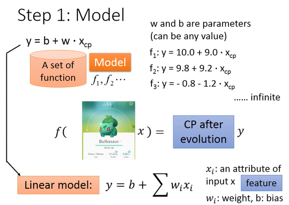
```
y = b + w * xcp
	xcp: 进化前‘宝可梦’的 cp 值
	y: 进化后‘宝可梦’的 cp 值
	w & b: 可以为任何参数

如果 w & b 可以带任何值的时候，这个 function set 中有无穷无尽的方法

Linear model: xi: 指的是 input 的‘宝可梦’各种不同的属性，比如说身高，体重等
```
### 3、Goodness of Function

>**寻找 Training Data 来找这个 function**

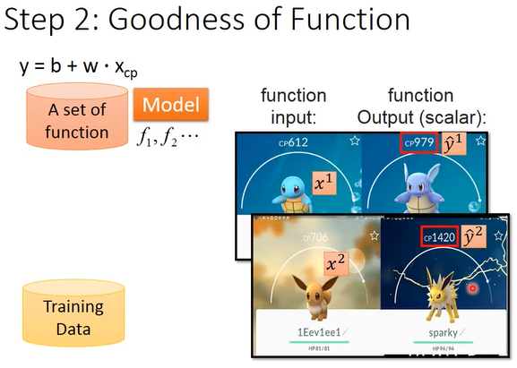
```
因为是 regression 的 task,所以 output 是一个 scalar

x1 & x2: 用上标表示一个完整的 object 编号
yˆ1 & yˆ2: 表示一个完整的 object 的 output，是一个数值。
```
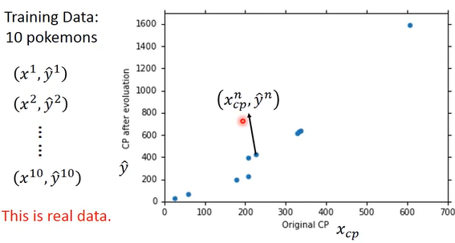
```
图上的每一个点（坐标）就是第 n 只宝可梦的原始 cp 值和它进化后的 cp 值。

有了这些 Training data 之后，我们就可以判断 function 的好坏，就可以知道 function sets 中的每一个 function 是多好或者多不好。
```
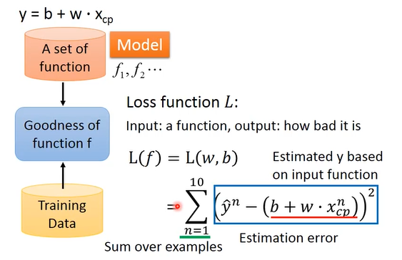
```
定义一个 Loss function: 衡量 function 的好坏
Loss function 是 function 的 function，判断 input 的 function 是好或者多不好。
Loss function 可以随自己的意愿定义一个合理的 function，这个是用比较常见的做法。

L(f) = L(w,b) = (y^n - (b + w*xcpn))2
	y^n: 真实的数值
	b + w*xcpn: 预测的数值
	
估测的误差 = 真实的数值 - 预测的数值
将 data 中 10 只‘宝可梦’估测的误差都和起来就得到了这个 Loss function

估测的误差越大: function 越不好
估测的误差越小: function 越好
```
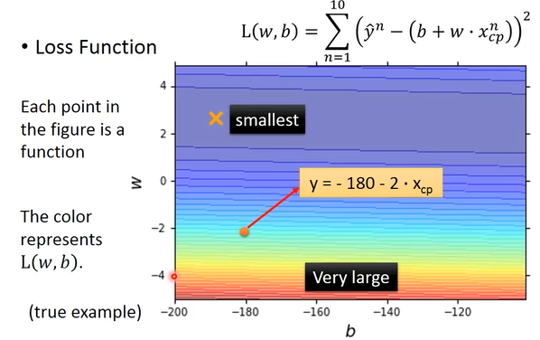
```
L(w,b)对 w & b 作图显示：
	纵轴: w
	横轴: b
坐标上的每一个点都代表一个组的(w,b)，也就是代表了某一个 function。

颜色代表我们使用 function sets 中的 function 根据我们定义的 Loss function 计算出这个 function 有多不好。
	颜色越偏红色：数值越大，这个 function 越不好
	颜色越偏蓝色：数值越小，这个 function 越好
```
### 4、Best Function
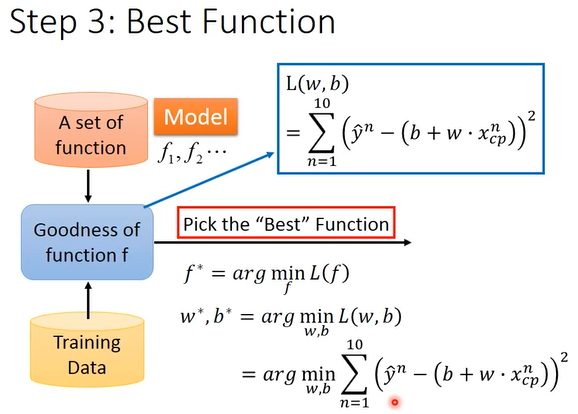

>**寻找最优的 function**
```
f* = arg min L(f)	-	可以让 L(f) 的值最小的 function，将这个 function 就记为 f*。
w*,b* = arg min L(w,b)	-	穷举所有的(w,b)，看哪一个(w,b)能使 L(f) 的值最小，那么这个 (w,b) 就是最好的 (w,b)，记为 w*，b*。
```
>**Gradient Descent**
>只要 function 是可微分的，Gradient Descent 就可以处理这个 function

**1、一个参数**

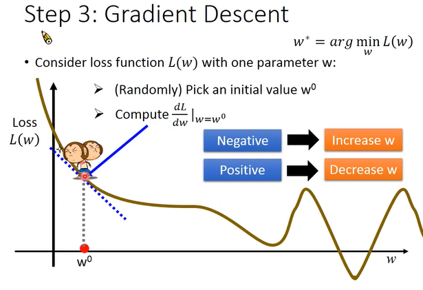
```
找到一个 w 使得这个 L(w) 最小。

 1. 随机选取一个初始的点 w0
 2. 计算在 w=w0 这个点参数 w 对 L(w) 的微分（计算的结果是 w=w0 这个点的切线斜率）
		 - 切线斜率为负：左边高右边低，要找 loss 值比较低的 function，即增大 w0 的值
		 - 切线斜率为正：右边高左边低，即减小 w0 的值，把参数 w 往左边移动
 3.参数 w 移动的 size 取决于两件事
 		- 现在的微分值有多大，如果微分值越大，代表现在在越陡峭的地方，移动的距离就越大，反之就越小。
		- 一个常数项 η：learning rate，这是一个事先就定好的数值。

参数更新的幅度越大，学习的效率、速度就比较快，反之比较慢。
```
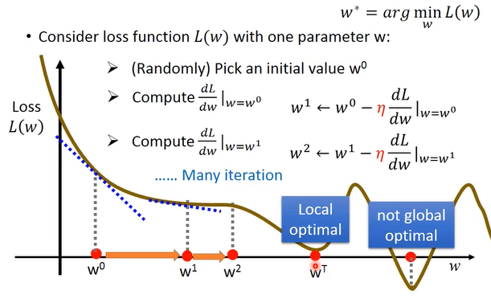

**2、两个参数**

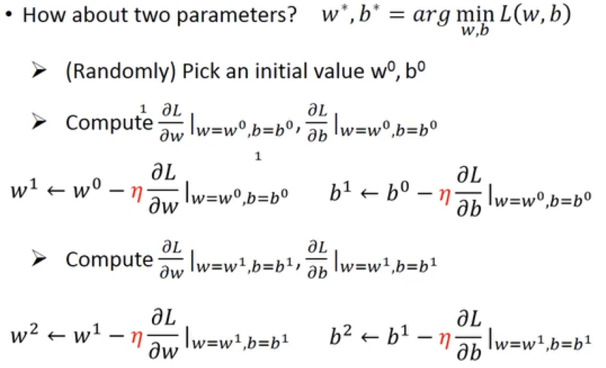
```
和只有一个参数没有什么不同
学习高数、线代、概率论
```
>**(w,b) 对 L(w,b) 的偏微分表示**

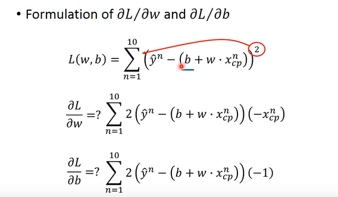