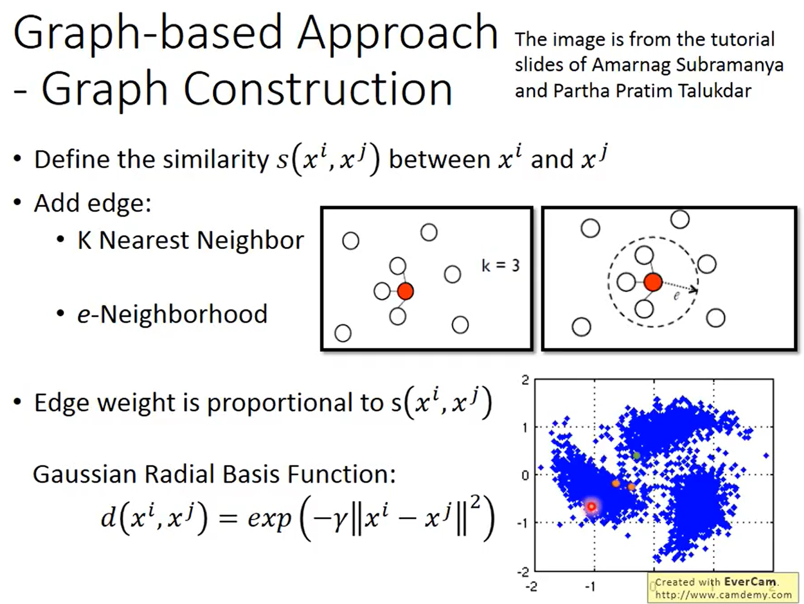
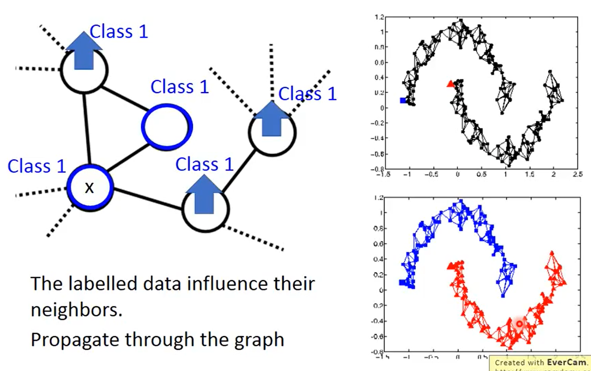
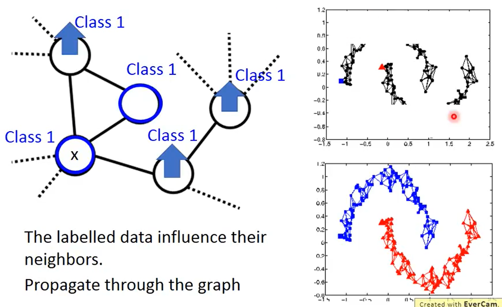
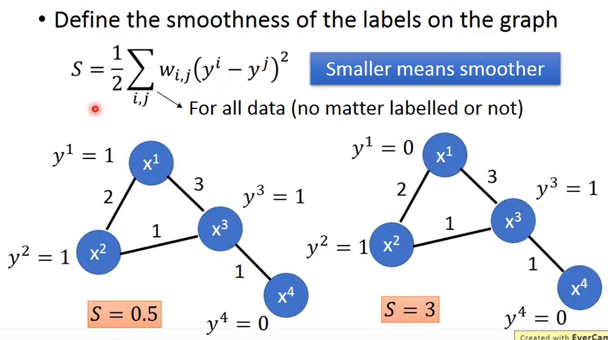
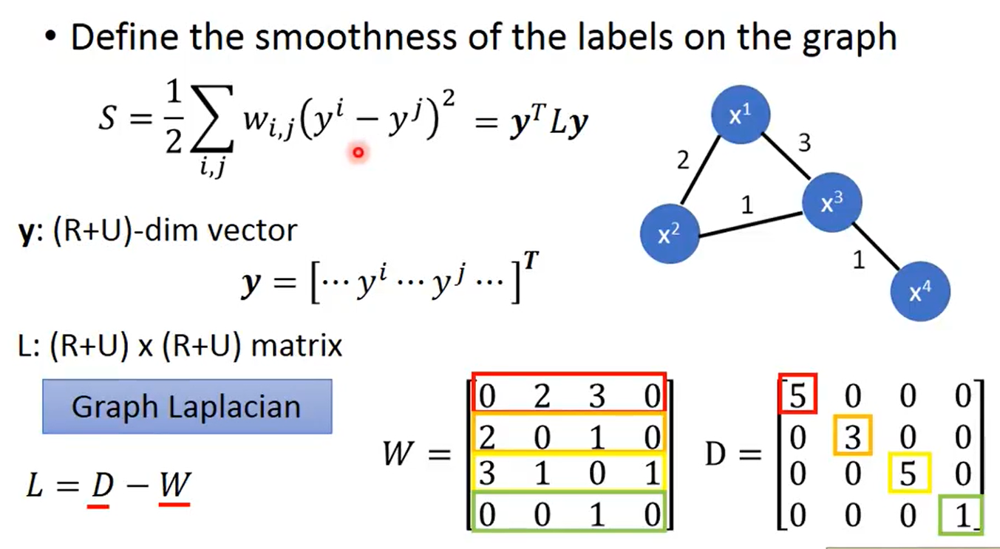
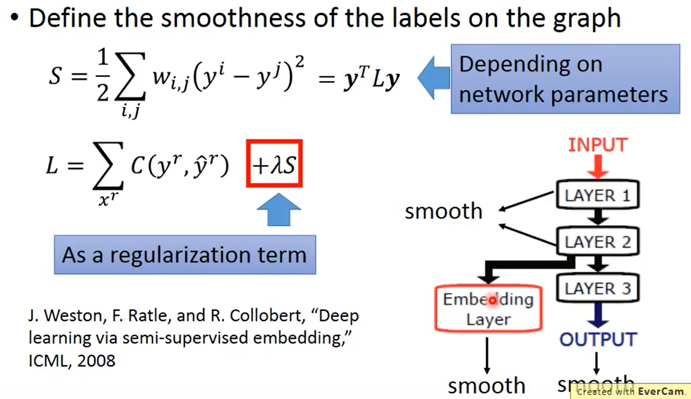
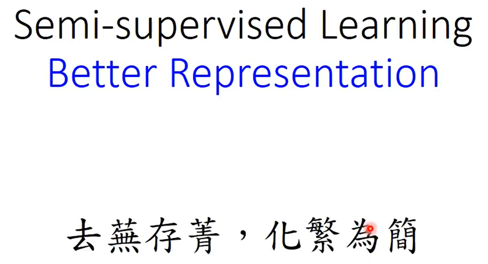
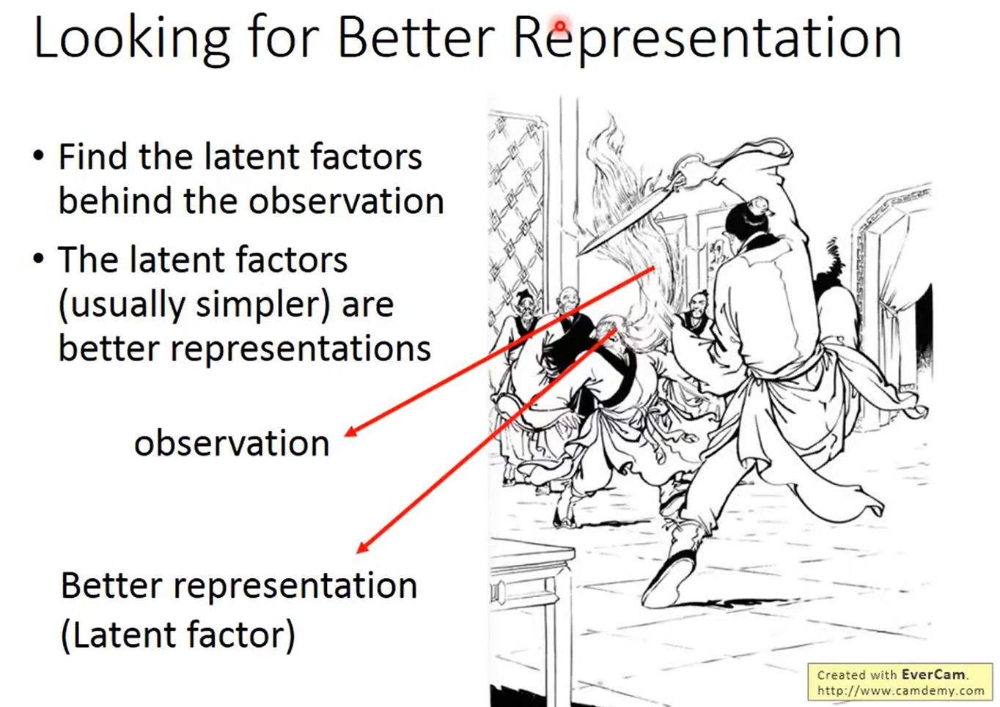

```
Semi-supervised：半监督学习
在 label data 中有一批 unlabel data，usually U >> R
Why semi-supervised learning?
因为收集数据容易，但收集 "labelled" 的数据难。
```
>**Why semi-supervised lerning helps?**


###  outline


#### Semi-supervised Learningg for Generative Model

>**Supervised Generativee Model**


```
假如都是 Gaussion 分布
Class1 是由 μ1，Σ 估测出来的
Class2 是由 μ2，Σ 估测出来的
就可以估测一个新的 data 属于 C1 的 posterior probility，就可以决定 Boundary 的位置在哪。
```

>**Semi-supervised Generativee Model**


```
绿色的是 unlabel data，两个 label data 是一样多的，但 class2 的 data 是比较多的，所以 class2 的 paramerter probability 是比较大的。。
```

```
1、先初始化一组参数 θ = {P(C1), P(C2), μ1，μ2，Σ}
2、根据现有的 θ 估算每一笔 unlabel data 属于 Class1 的 posterior probability
3、计算出几率以后，就可以 update model
	- 如果不考虑 unlabel data，P(C1) = N1/N，μ1 的计算结果是所有属于 C1 的 label data 都平均起来。
	- 如果考虑 unlabel data，C1 出现的次数是所有 unlabel data 是 C1 的posterior probability 的和，μ1 的计算结果是 unlabell data 的每一笔 data xu 根据它的 posterior probability 做 ...，再除掉所有 weight 的和。
4、update 几率。
```


#### Semi-supervised Learning Low-density Separation


>**Self-Training**


```
有 label data 和 unlabel data
先用 label data train 一个 model，叫做 f*。(方法有 Neoron Network，其他 ML 等)
根据 f* 去 label 这些 unlabelled data，做法就是把 xu 放入 model f* 中，看 output data。
将一些 unlabelled data 放入 labeled data 中。
labeled data 从 unlabelled data 得到额外的 labeled data，再去 train model f*。
```

```
做 Self-training 的时候，用的是 Hard label
做 generative model 的时候，用的是 Soft label
```
>**Entropy-based Regularization**


```

```
>**Outlook: Semi-supervised SVM**


#### Semi-supervised Learning Smoothness  Assumption


```
1、假设 "similar" 的 x，就会出现有 "same" 的 y。
2、如果 x 分布不平均，如果 x1 和 x2 是由 high density region 连接，那么 y^1 和 y^2 是一样的。。
```
>**Example**


```
Classify astronomy vs. travel articles
```

```
橙色：Class 1
绿色: Class 2
蓝色：unlabelled data
```
>**Graph-based Approach**



```

```






```
S 越小，越 smooth。
y: 是一个 (R+U) dim 的 vector
L = D - W	Graph Laplacian
```


#### Semi-supervised Learning Better Representation


