### Outline

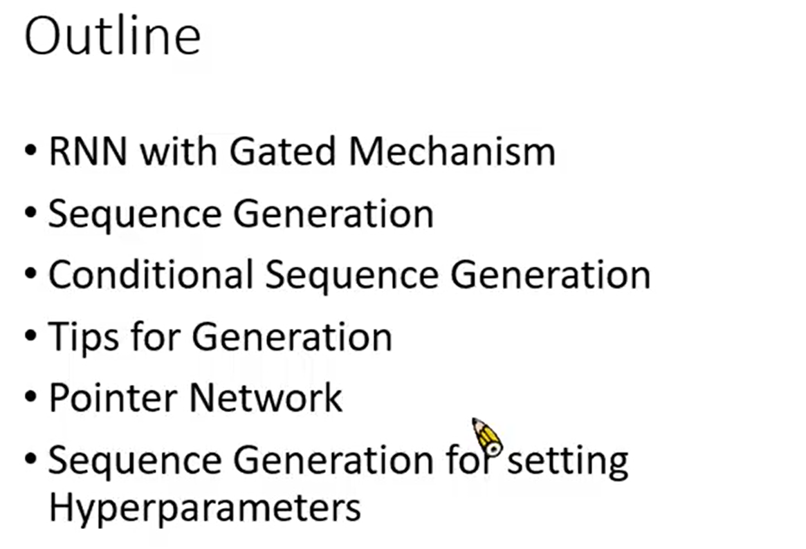

### RNN with Gated Mechanism

#### Recurrent Neural Network

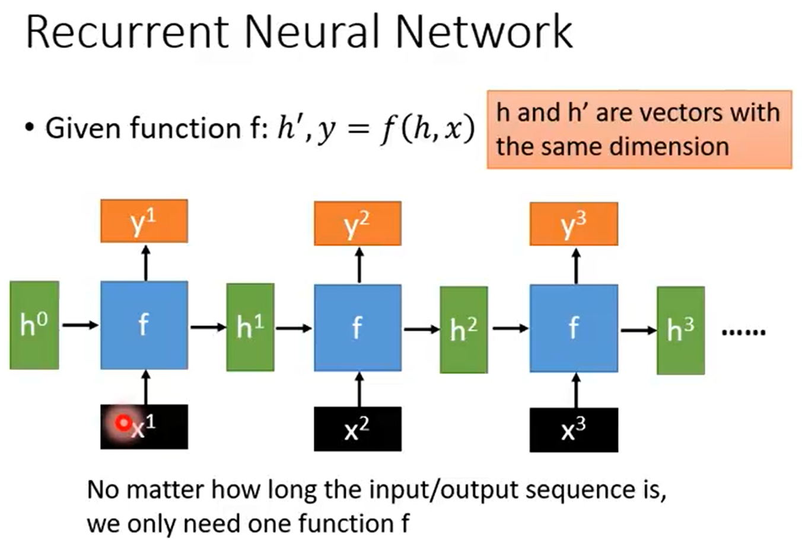
```
RNN 特别的地方是里面有一个 basic function，这个 basic function 是 f 表示。在 RNN 里面会被反复的使用，input 是两个 vector (h,x)，output 是另外两个 vector (h',y)，处理 RNN 使用的情景是 input 是 vector sequence。
现在这个 vector sequence 用 x1,x2,x3 表示。
f 是把 (x1,h0) 当成 input，generate 两个 vector (h1,y1)，新的 x2 进来，同样的 f 会被反复的再用一次。
假设要反复使用 function f，function f 所有的 h0、h1、hi dimension 是一样的。
比较 powerful 的地方，不管 input sequence 有多么长，他都是可以的。RNN 都只有一个 basic function。RNN 的参数量完全不会随着 input sequence 的长度而改变。
```

#### Deep RNN

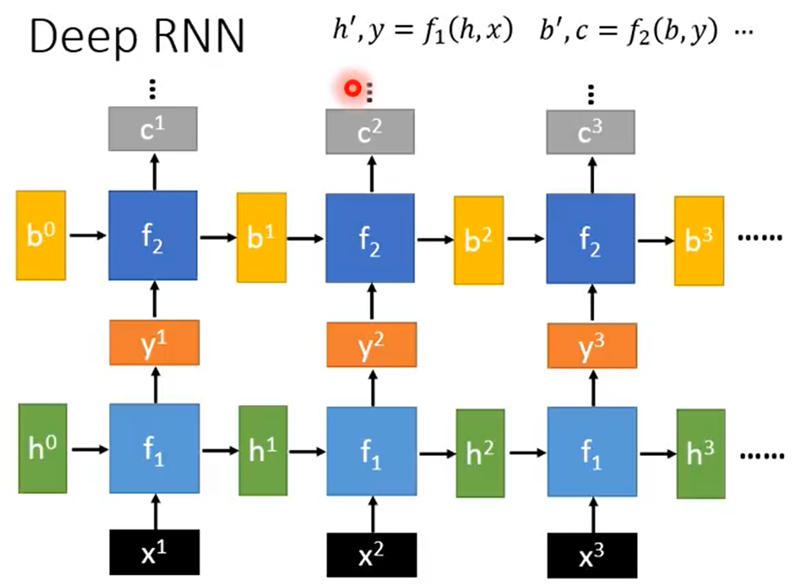
```
本来有 basic function f1，再加一个 basic function f2，f2 的 input 是 f1 的 output y1 和 initial vector b0，output 就是 (x1, c1)
```

#### Bidirectional RNN

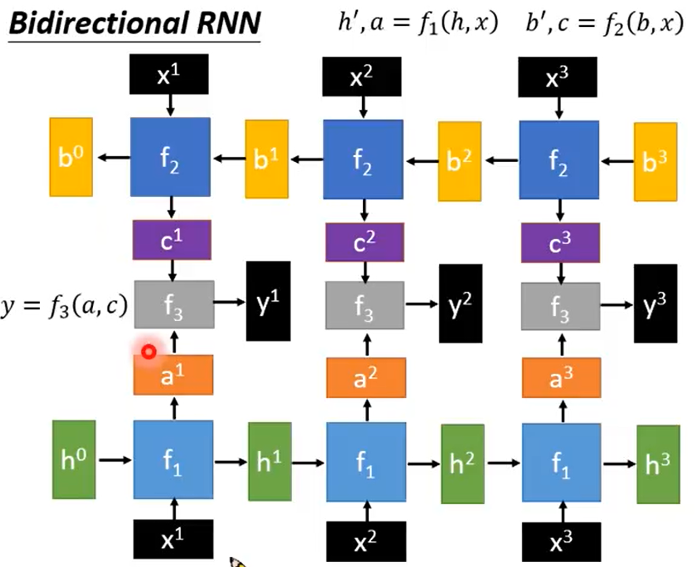
```
有两个 function，f1 和 f2，f2 的 input sequence 的方向 f1 不一样。
f1 先 input x1、x2、x3，产生一排 vector
f2 先 input x3、x2、x1，产生一排 vector
需要有另外一排 function f3，把生成的 vector input 进去，得到 network 最终的 output。
```

####  Naive RNN

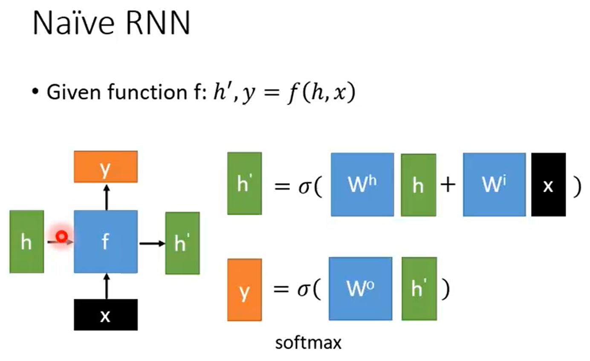

#### LSTM


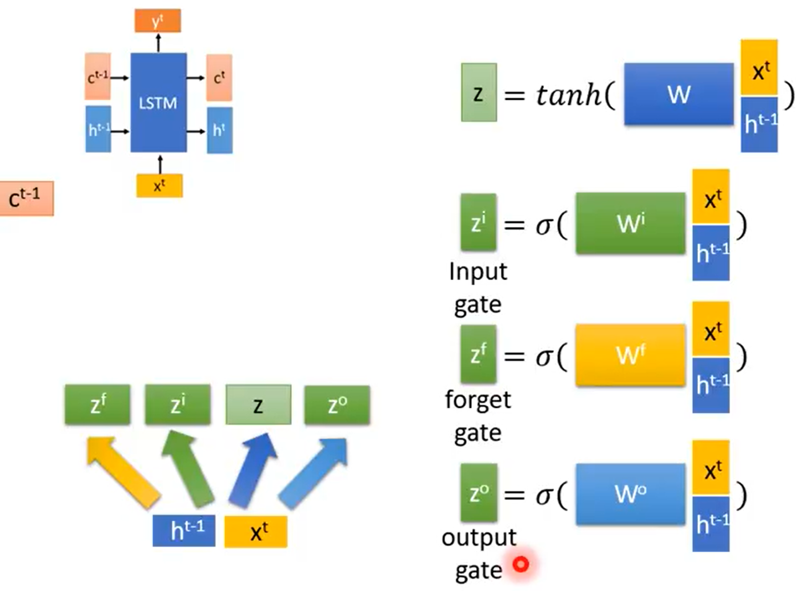
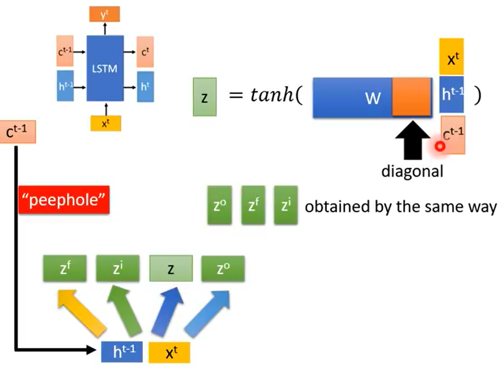
```
要想做的更好，可以使用 peephole，本事是把 x 和 h 串在一起，现在是把 x、h、c 串在一起，合成一个更长的 vector。乘以一个更长的 matrix，通过 tanh，得到 z。
因为 input vector 变长了，所以 W 的参数变多了，实际上这样做 performance 并不会比较好。参数变多容易 overfitting，在实作上强迫 matrix  的一部分是 diagonal。
x * W 的前 1/3
h * W 的中间 1/3
c * W 的 diagonal 部分
这样可以减少参数的使用量
```
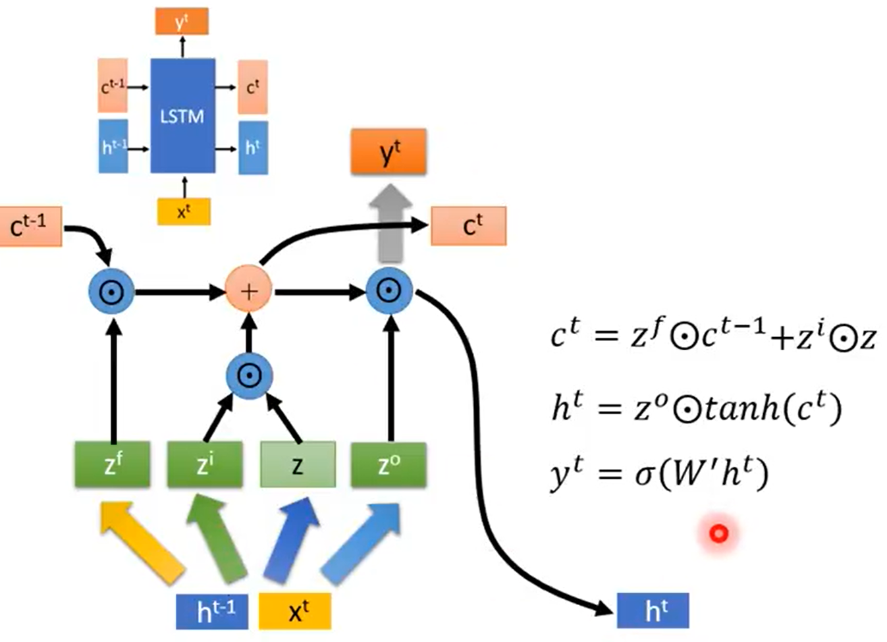
```
input 的 ct-1 和 output 的 ct 有什么关系？
ct = zf⊙ct-1 + zi⊙z，变化比较小。有一些不太想要改变的资讯可以放在里面。之间没有 activation function。
ht = zo⊙tanh(ct)
yt = σ(W'ht)
```
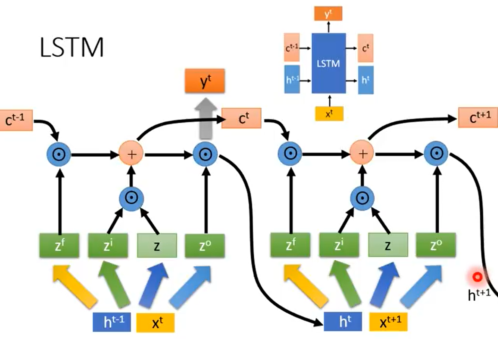
```
同样的 block 会重复使用，RNN 的特殊之处就是 function 会被反复使用。
```

#### GRU

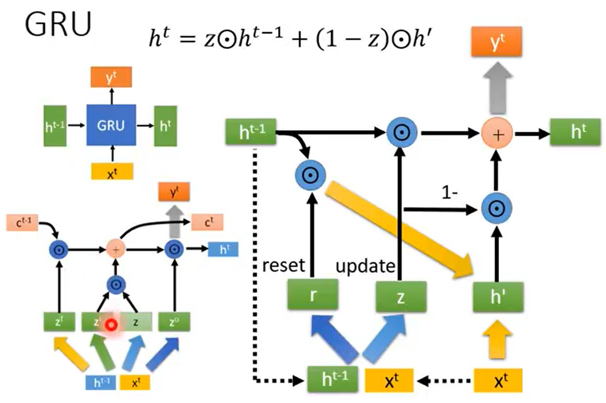
```
GRU 和 LSTM 挺像的，在 GRU 里面，h 的角色较像 LSTM 里面的 c。
input x、h，将 x 和 h 接起来，乘以一个 transform。
```

>**LSTM: A Search Space Odysey**

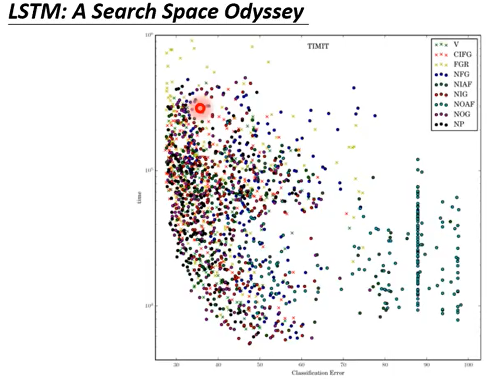
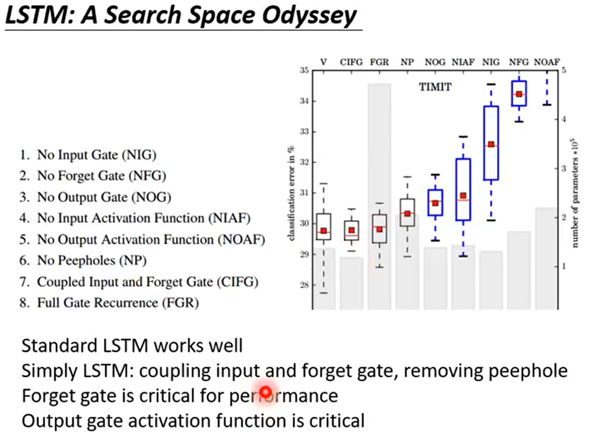


### Sequence Generation


```
怎么让机器产生一个 sentence？
要做 generation 的话，写一个句子的话，可以用 character 为单位，也可以用 word 为单位。
RNN 是一个 basic function，input (h,x)，output (h',y)，在做 generation 的时候，x 是前一个时间点所产生的 token(不管是 character 还是 word)
怎么把 word 或者 character 描述成一个 vector，最简单的方法就是 1-of-N encoding，就是假设知道英文有 10万 个word，就开一个 10万 维的 vector，这个 vector 只有一维是 1，其他维是 0。这个 vector 的每一个 dimension 都对应一个 word。比如某一个对应 apple，那 apple 那个值是 1，其他是 0。

input token 之后，y 是现在 machine 要产生出来的 token 的 distribution(y 不是一个 token，而是 token 的 distribution)，但是让机器产生的不是 token distribution，而是某一个 token，某一个 word or character。

最后实际上会做的事情是从 y 的 distribution 里面做 sampling，在这个 distribution 里面 sample 出 token。 
```

```
machine 实际上是怎么产生一个完整的句子。
在一开始的时候，在产生句子的第一个 character 的时候，前面没有产生任何东西，这时候会给机器一个特殊的字源，只有在句子的开头才会发生，通常第一维就代表 <BOS> Begin Of Sentence，对应这个 vector 的第一个 dimension，把这个 token input 进去，就会告诉在句首的时候应该放哪一个 character。
y1:P(w|<BOS>)：给定句首这个 token 的时候，某一个 character 出现的几率，或者换句话说，某一个 character 被放在句首的几率。

什么时候停止呢？
会设置一个特别的符号 <EOS> End Of  Sentence
```
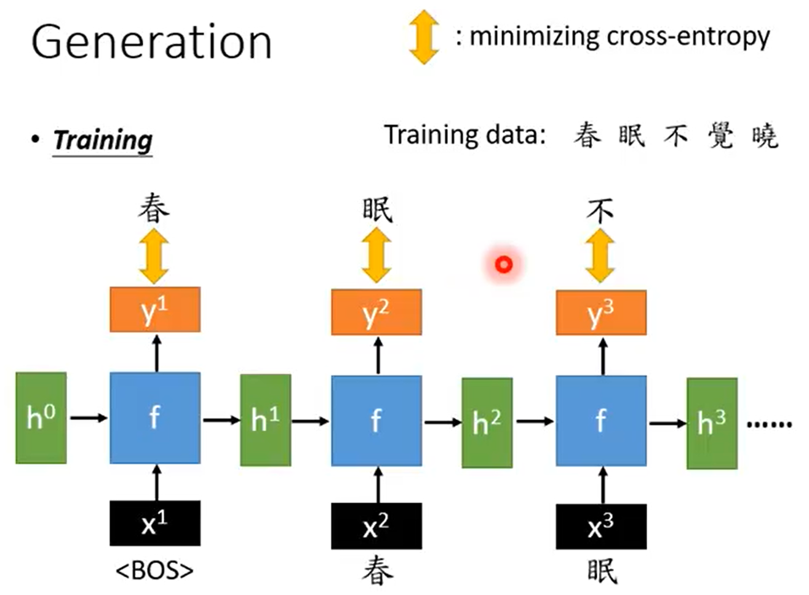
```
怎么找出这个 basic function f 呢？
首先给 f 训练资料，当给 basic function f <BOS> 这个 token 时，它第一个 word distribution 和春越接近越好，会 minimize y1 和'春' 的 cross-entropy。
和分来问题是一样的，分类中 model 的 output 是一个 distribution，正确答案是 1-of-N encoding。
```
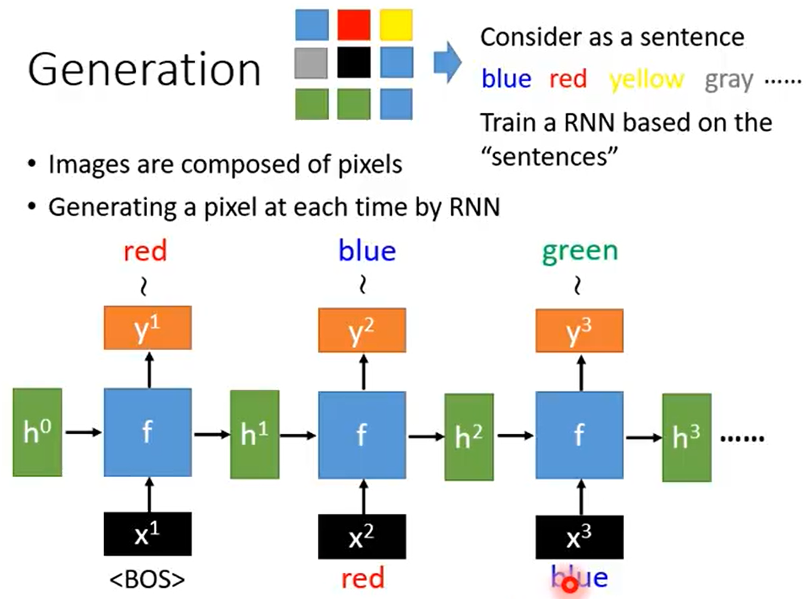
```
可以让机器画个图。
image 是由一大堆的 pixels 组成的。可以把每一个 pixel 看成一个字，image 就看做一个 sentence。
```

>**PixelRNN**

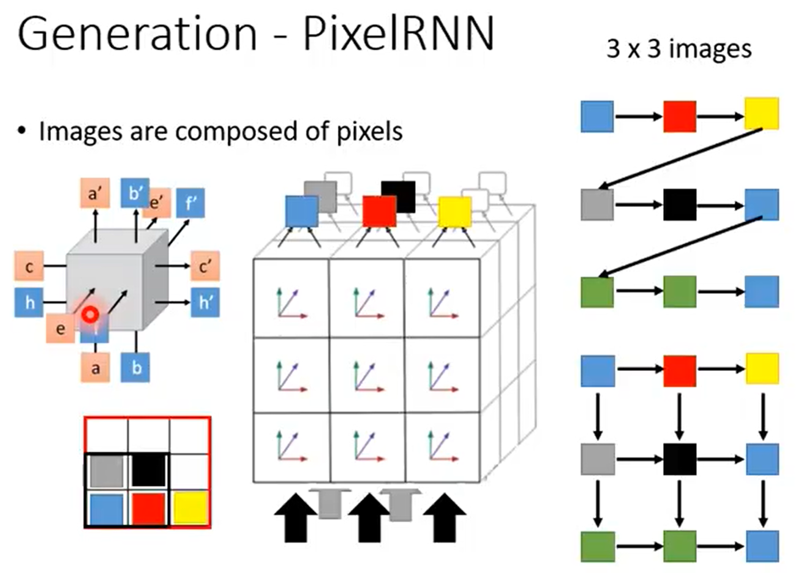
```
pass
```

### Conditional Sequence Deneration


```
到刚刚为止 train 出来的 RNN，只能写出一些随机的诗，没有办法即景生情。
```
>**Image Caption Generation**


```
给机器看一张 image，然后告诉你 image 中有什么东西。
不是要机器随便说一句话，而是根据输入说一句话。
怎么影响机器根据 input image 说一句话呢？
需要把 image 的资讯 input RNN 中。
把 image 通过 CNN 变成一个 vector，把这个 vector 在每一个 text step 也丢到 RNN 里面去。
```
>**E.g.: Machine translation**


```
在 Machine translation / Chat-bot 中，input 是一个 sentence，把 sentence 变成一个 vector，就和 Image Caption Generation 中间的过程一样。
怎么把 sentence 变成一个 vector？

机器学习 -> RNN -> Machine Learning
只要最后一个时间点 output 的 y。最后一个时间点 output 的 y 可能包含了 input 所有的 information。有的时候不见得会取 y，可能会取 h、c、(h,c) 的 connect。都可以。

将得到的红色的 vector 丢到 generator 里面，每一个 text step 都 input 一次。希望可以产生 machine learning.。

在 training 的时候，
前面部分叫做 Encoder：把 sequence 变成 vector
后面部分叫做 Decoder：把 vector 变成 sequence
这种方式叫做 Sequence-to-sequence learning，Sequence-to-sequence model

Sequence-to-sequence 的技术应用非常广，语音合成，
```

>**E.g.: Chat-bot**

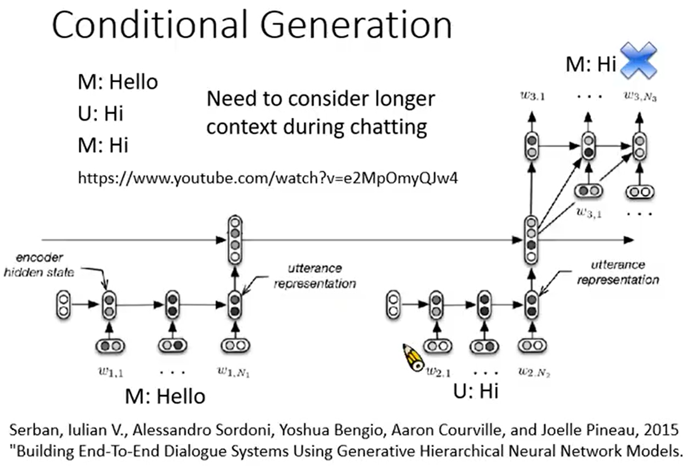

#### Dynamic Conditional Generation


```
Encoder：把 sequence 变成 vector
Decoder：把 vector 变成 sequence


会遇到问题：也许 Encoder 没有足够的能力把所有的东西都压到一个 vector 里面去。Decoder 在每一个 text step input 都是同样的 vector。
Dynamic Conditional Generation 想要做到的事情是 Decoder 在每一个 text step input 的 information 是不一样的。

h1,h2,h3,h4 表示 RNN 的 output，把 h1,h2,h3,h4 想成一个 database，把 h1,h2,h3,h4 这 4 个 vector 存在 database 里面。

在每一个 text step，Decoder input 的 conditional representation 都是不一样的。至于要 input 什么样的资讯，由 Decoder 自己取去看 Encoder 所存的 database，自己决定。
```

#### Machine Translation


```
Attention-based model 怎么做的呢？
input 一个中文的 character sequence，每一个 character 依序 input RNN 里面，RNN 的每一个 text step 都会产生一个 vector，(h1,h2,h3,h4)，RNN 把 (h1,h2,h3,h4) 存起来，形成了一个 database。
z0：它是搜寻这个 database 的关键字。
z0 是怎么搜寻 database 的呢？
z0 和 (h1,h2,h3,h4) 每一个 vector 算一个匹配程度。

match 是什么？
方式1：计算 h 和 z 的 inner product(内积)，然后得到 α。
方式2：把 match 当成一个小的 NN，
方式3：α = hTWz

假设 match 里面是有参数的(比如方式2，match 是个 NN)，不需要把 match 额外的参数找出来，match 是和整个 NN 合在一起学的。
```

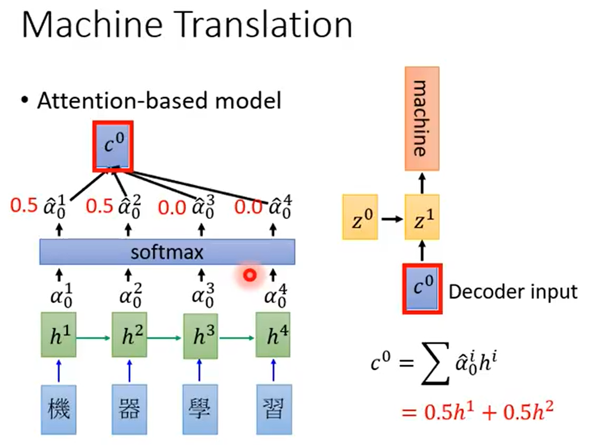
```
(α01,α02,α03,α04) 可以做一个 sofemax，(做一个 normalization，让它们和是 0，可做可不做)。
得到 (α^01,α^02,α^03,α^04) 值以后，c0 = ∑a^0i*hi。
把 c0 当成 Decoder 的 input，Decoder 每一个 text step 都会 input 不同。
根据 z0 c0，Decoder 就会 output 一个 word。
```

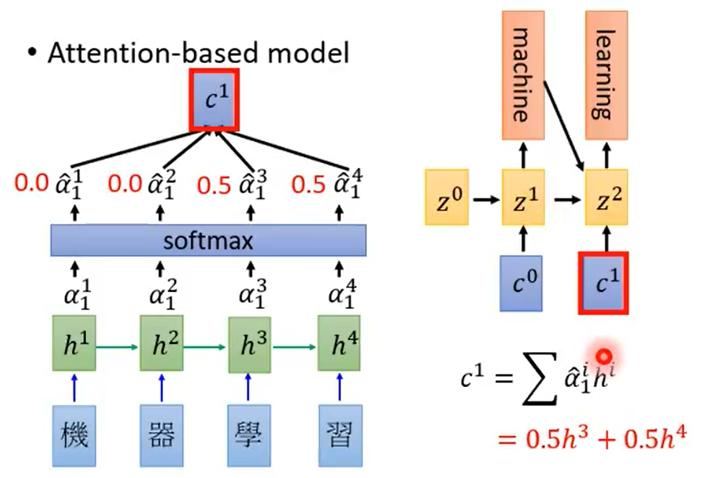
```
z1 和 h1 计算一个 match，得 α11
z2 和 h2 计算一个 match，得 α12
z3 和 h3 计算一个 match，得 α13
z4 和 h4 计算一个 match，得 α14

然后再和第一步一样计算下去。
```


#### Image Caption Generation

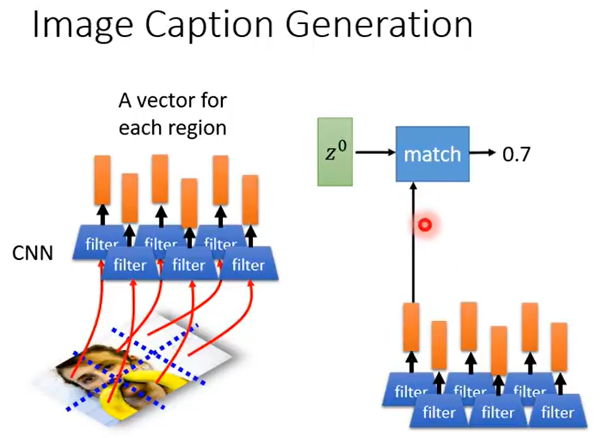
```
有一张 image 进来，一整张 image 用一个 vector 来表示，input 给 decoder，但这样太粗了，decoder 没有办法把一整张 image 里面各个细节统统存在一个 vector 里面。把 image 切成一块一块的。现在一张 image 就是一把 vector。
```

```
z0 和这一把每一个 vector 都计算 match 的 score，计算的结果不一样，每一个 vector 都乘以计算出来的 score，把他们 weighted sum(加权和) 起来，input 到 decoder 里面，就会告诉产生的 word 是什么。
```
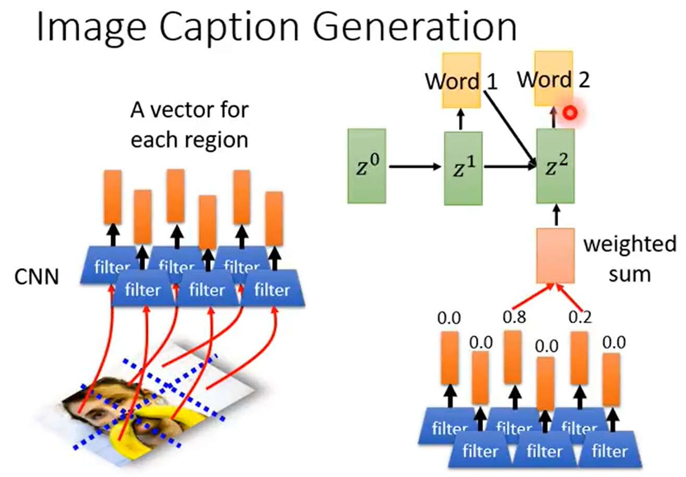
```
以此类推
```

#### Example


```
有的时候 machine 会犯错。
```

### Tips for Generation

#### Attention

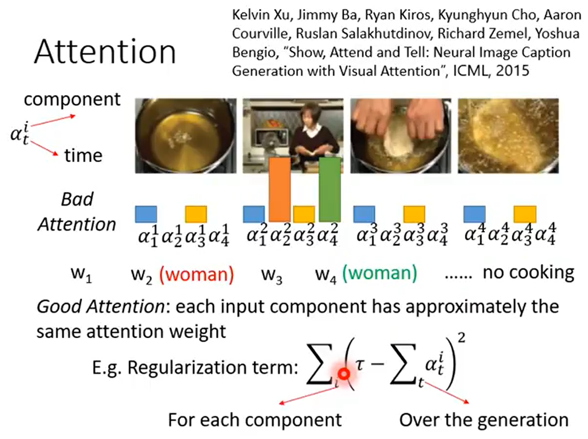
```
有什么样的 tip 呢？
对 match 的 score 做一些限制。
希望 machine 在看一篇影片的时候，在看 input 的时候，它的 attention 是平均的。
对 attention 下一个 Regularization weight，下一个 constraint，summarization over t 对同一个 friend，不同时间点的 attention 的总和。
比如，把 (a11,a21,a31,a41) 和起来，希望跟某一个值 τ 越接近越好。
```

#### Mismatch between Train and Test

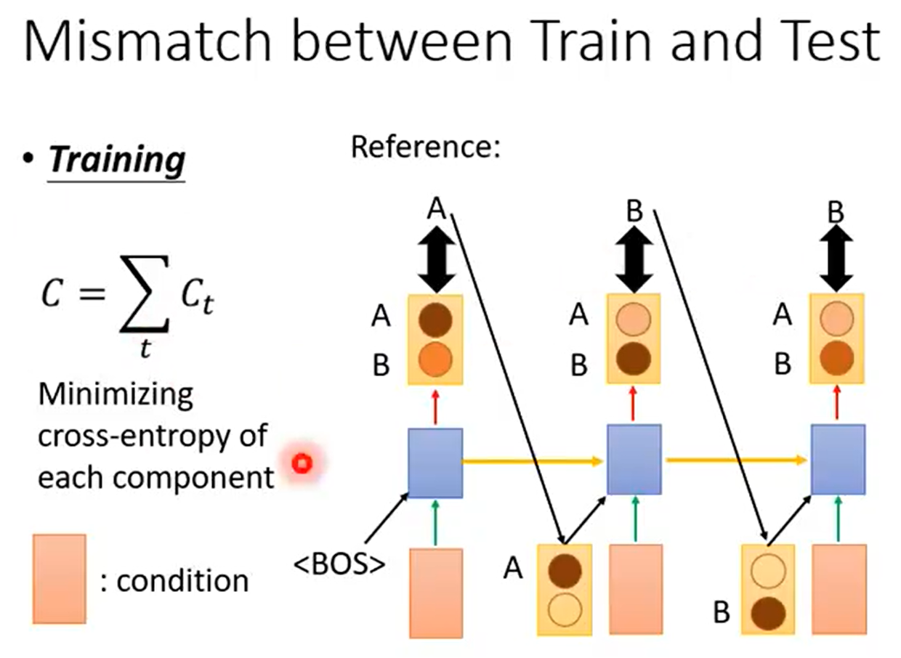
```
Train and Test 不一致。
· Training
假设 Training 的状况要产生的 target output 是 A B B 这三个 word，怎么让 machine 学的呢？
看到一个 condition，input condition，machine 产生一个 distribution，希望这个 distribution 跟 A 越接近越好，distribution 中 A 的几率越高越好。
Minimize cross-entropy of each component。
```

```
· Generation
有一个 condition，产生一个 distribution，根据 distribution 做 sampling，假设 sample 出来的是 B，接下来会把 B 当成下一个时间点的 input。
在 Testing 的时候，machine 的 input 是自己生成的，有可能有错的东西
在 Training 的时候，machine 的 input 是正确的东西
这个问题叫做 Exposure Bias(曝光偏差)
```
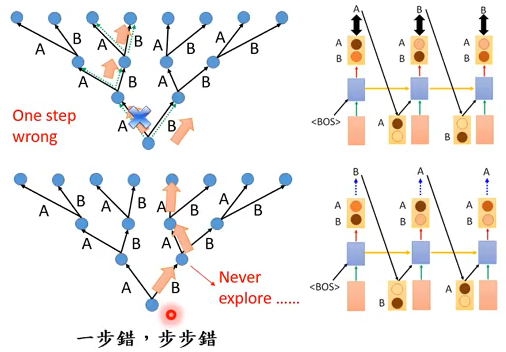
```
怎么解决 Exposure Bias？
· Training
假设 θ 只有两个词汇，machine 全部可 output 的可能性有 8 种，在第一个 text step 告诉 machine 说产生 A，在第二个 text step 告诉 machine 在已经产生 A 的前提下，在 (A,B) 里面选对的那个。
· Testing
在 test 的时候，这个树的每一条支路 machine 都是可以产生的。
一步错，步步错，因为 machine 在 training 的时候，它从来没有看过开头应该放 B 的时候，没有看过这个 case。
```
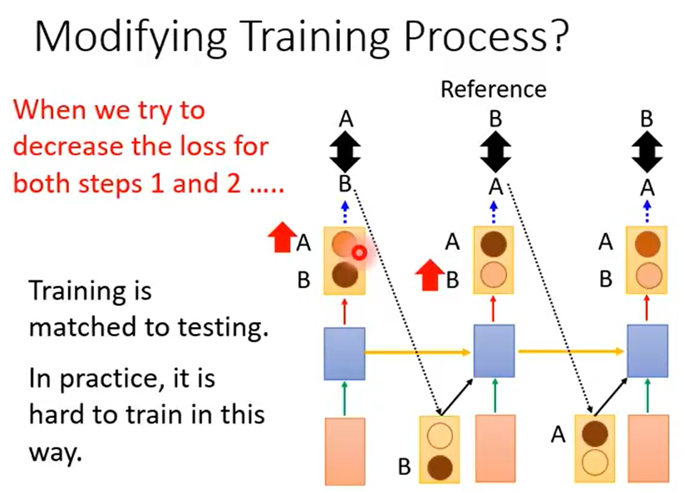
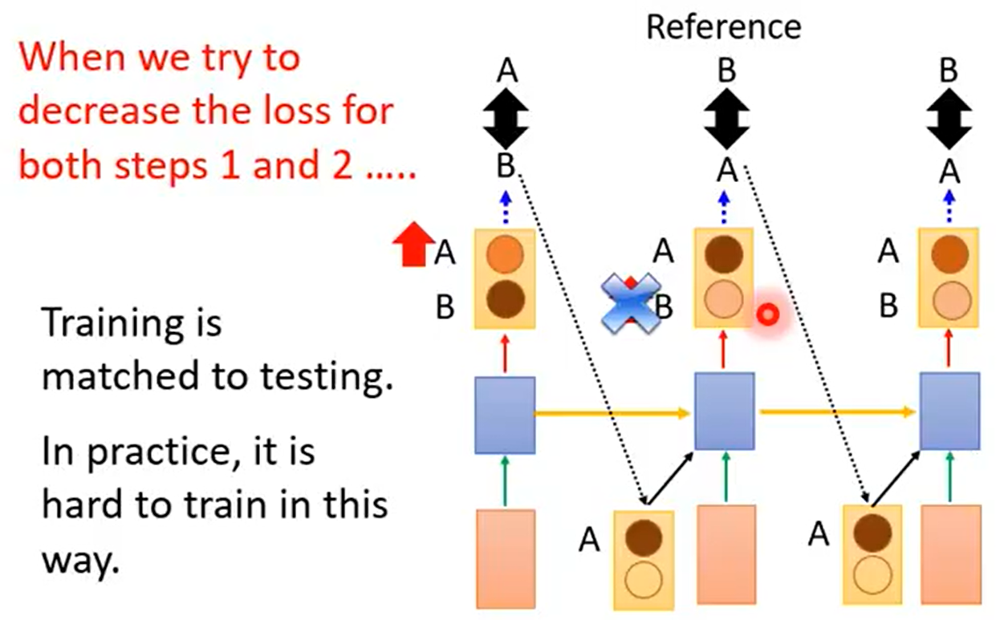

>**Scheduled Sampling**


```
给机器看自己生成的东西会变得很难 train，给机器看正确的答案 training 和 testing 会变的不一致，去两者之间的折中。
在下一个 text step 会把拿什么当成 input，可以拿一个'筛子'决定。
调'筛子'的几率，dynamic 决定的。
```

#### Beam Search

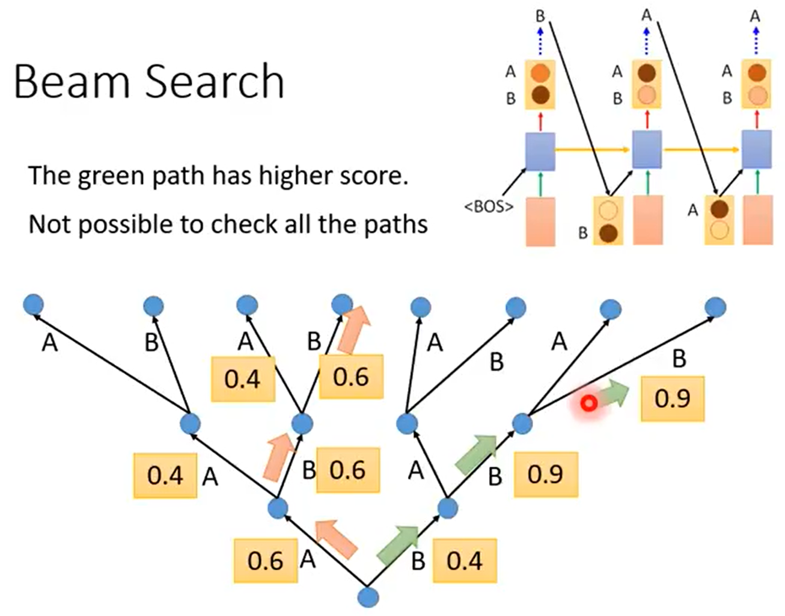
```

```

```
每一次在做 sequence generation 的时候，都会保留前 N 个 score 最高的可能。
假设保留两个 score 最高的。 Beam size = 2。
在 Training 的时候用不到，在 Testing 的时候用的到。
```

```
先 input <BOS>，output 一个 distribution，假设保留 3 个 score 最高的 tip，在第一个 distribution 做三个选择(W,Y,X)，使用(W,Y,X) 各自输入得到的结果都是不一样的，将 (W,Y,X) 分别丢到 RNN 里面，得到 3 个不同的 distribution。
分数 score：第一个 distribution 中 (W,Y,X) * 各自生成的 distribution 中的每一项得到几率。
```
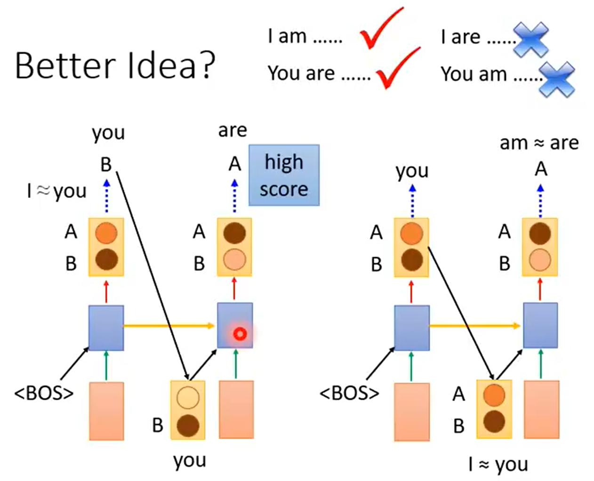
```
如果把前一个时间点生成的 distribution 丢到下一个时间点的 input，会有问题。
```

#### Object level v.s. Component level

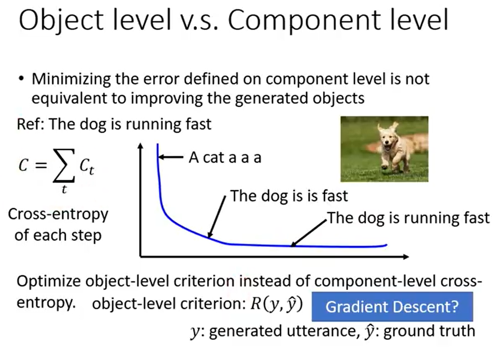
```
通常 training 在做 Evaluation 的时候，minimize 的是 each step 的 cross-entropy。
output "A cat a a a" 的 loss 就很大，然后会把一些词修正，一直 train 下去，对 machine 来说，loss 变化很小，但是对人的观感提高了。
Evaluation 的时候要对整个句子做 Evaluation
在 training 的时候定义一个 manager R，
y：input 整个 sentence
y^：正确的句子
R(y,y^)：评估 y 和 y^ 的差距，但没办法微分，就用 reinforce learning 硬 train 一发。
```

#### Reinforcement learning


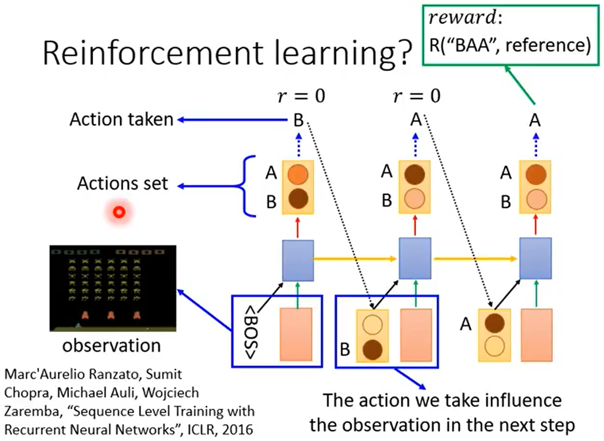


### Pointer Network

### Sequence Generation for setting Hyperparameters