>**Tensorflow 基本概念**

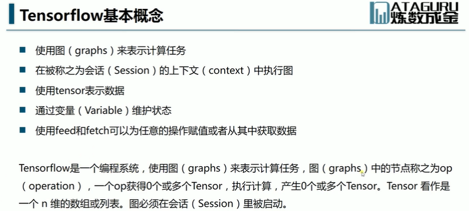

>**Tensorflow 结构**

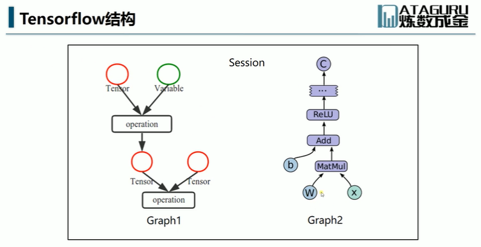
```
图代表一个计算过程，图在 Session 中进行。
```

>**激活函数**

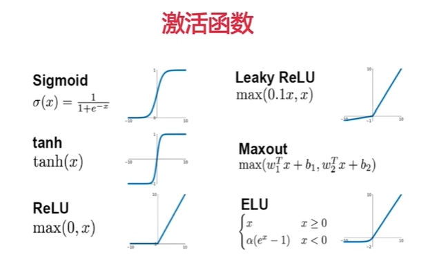

```
思考问题
为什么要用激活函数？
```

>**归一化与批归一化**

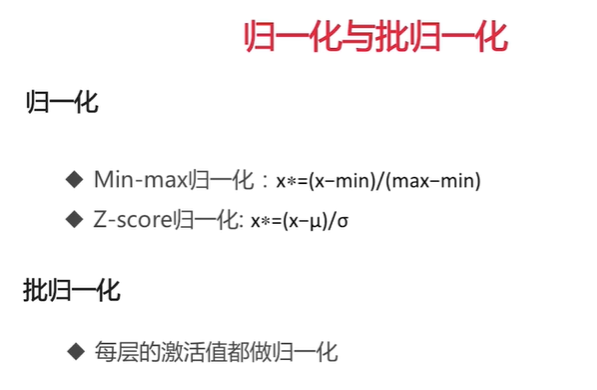
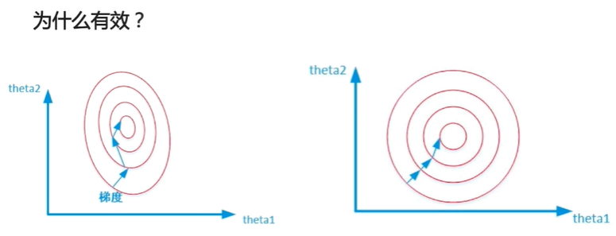

```
经过归一化的是一个正圆，法线方向是圆心。归一化之后训练速度会加快。
思考问题
为什么归一化有效？
```

>**Dropout**

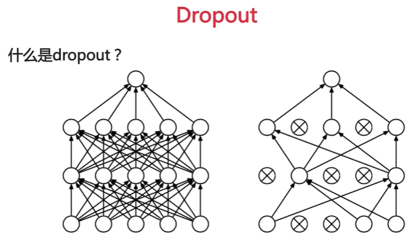
```
把一些 neuron 弃用掉。弃用是随机的，训练模型的时候，这次弃用的单元数和下次弃用的是不一样的。
```
>**这样随机的丢弃 neuron 有什么作用？**

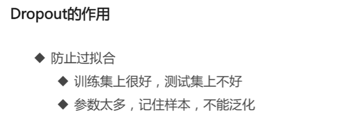
```
思考问题
为什么 Dropout 有效？
1、selu 这个激活函数的实现方式？
2、Dropout 的实现方式？
```

>**访问 Tensorboard 界面**
>**tensorboard --logdir=callbacks**

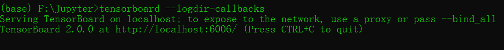

>**127.0.0.1:6006**

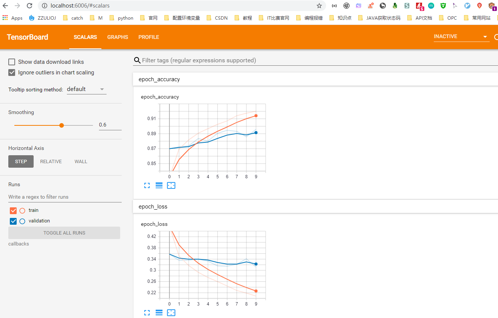

>**Wide & Deep 模型**

[Wide & Deep 模型](https://arxiv.org/pdf/1606.07792v1.pdf)

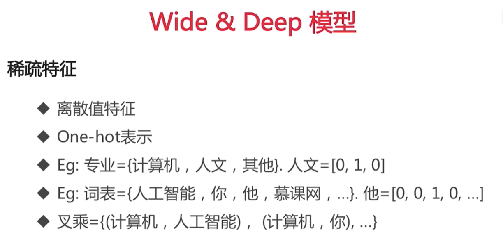
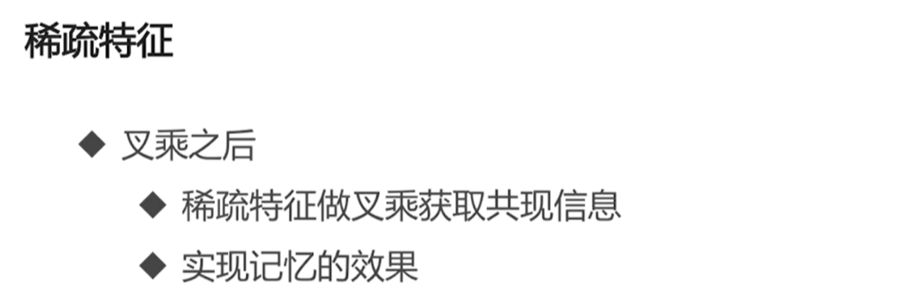
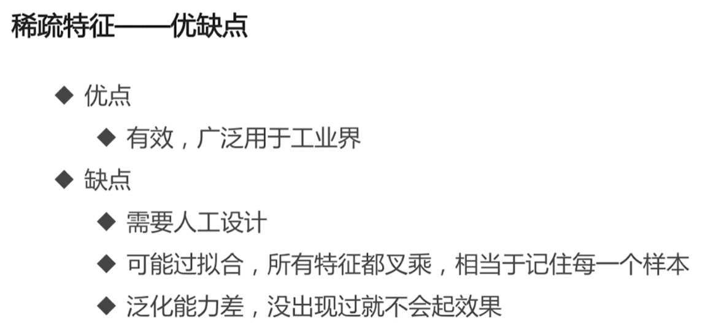
```
稀疏特征
	离散值特征：比如性别。就是从 n 个值中选择一个。
	One-hot 编码表示
	叉乘：在图片中的专业中的每一个字段和词表中的每一个字段进行组合。
叉乘是可以刻画一个样本的。假设一个物体的所有特征都表示成离散特征，就可以用叉乘的方式精确的刻画一个样本，用叉乘的方式可以精确的刻画到所有样本的所有可能性。
```
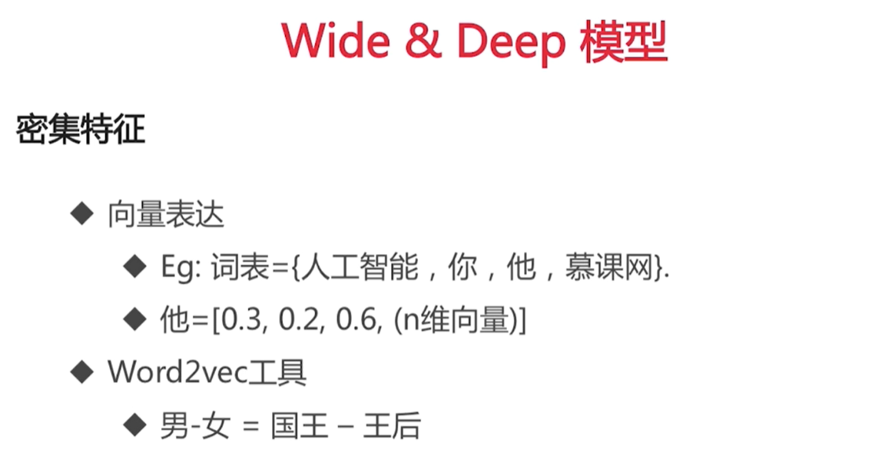
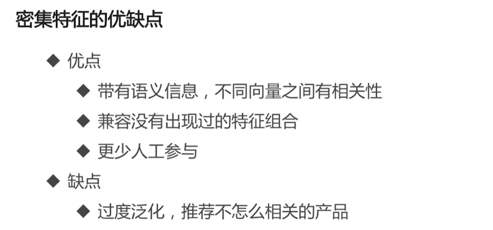
```
密集特征：就是用向量表达的特征
	向量表达：每个词都是用向量来表达的，因而可以用向量之间的距离来表达这两个词对应的距离。通过向量之间的差距来衡量信息之间的差距。
```

>**Wide & Deep vs. Wide 模型结构**

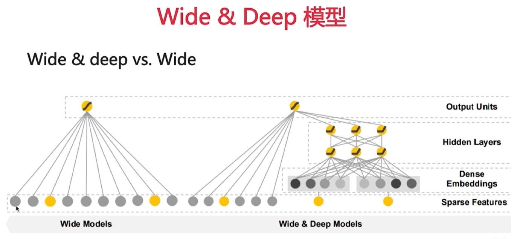
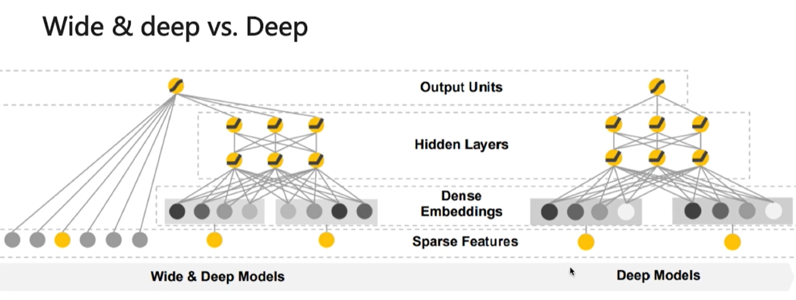
```
Wide Models
	输入都是稀疏特征，也是 One-hot 编码表达，One-hot 表达的每一个分量都直接连接到输出单元上。
Wide & Deep Models
	左半部分是 Wide Models，右半部分是 Deep Models，对于输入的数据先把它表示成一个密集的向量表达。
	Sparse Features: 稀疏特征
	Dense Embedding: 密集特征
	Hidden Layers: 隐藏层
	Output Units: 输出单元
Deep Models
	和 Wide & Deep Models 层次是一样的，只不过 Deep Models 上缺少 Wide Models 的机制。
```
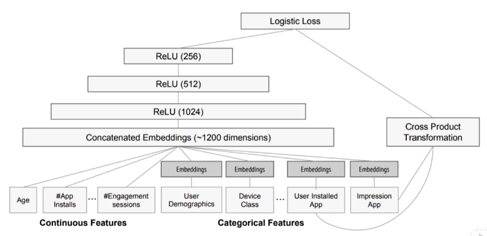
```
模型图
```


>**超参数搜索**

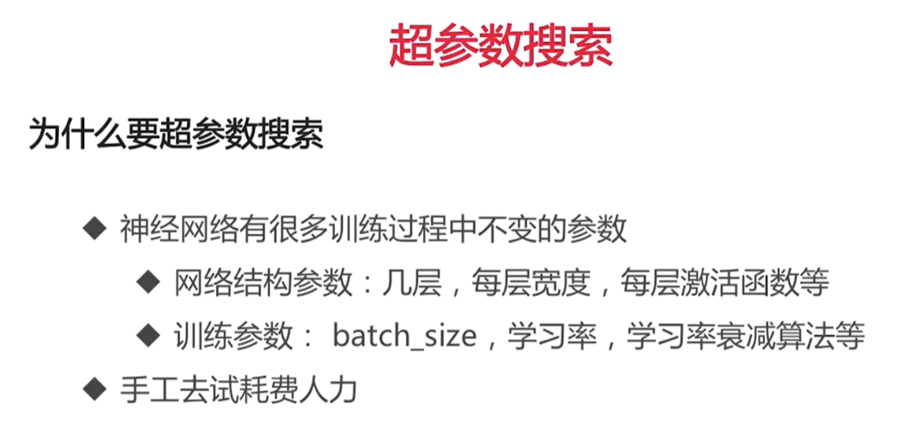


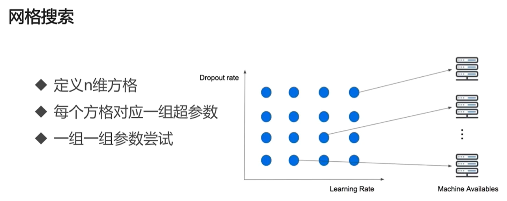
```
网格搜索：把各种超参数离散成几个值，把这几个值一一组合起来。
```
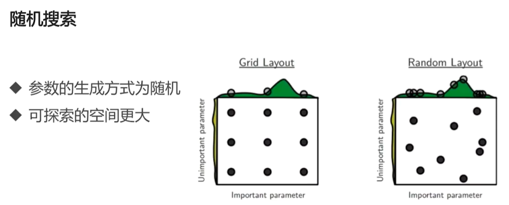
```
随机搜索：网格搜索只能取固定的值，有很多不在固定点的值取不到。随机去生成参数组合。
缺点：随机搜索的点数要比网格搜索的点数多。
```
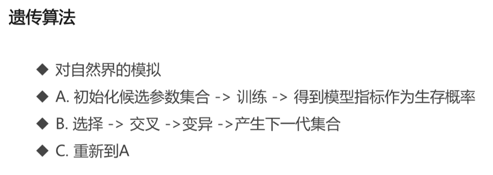
```
遗传算法搜索：和生物学中的 DNA 遗传类似。
```
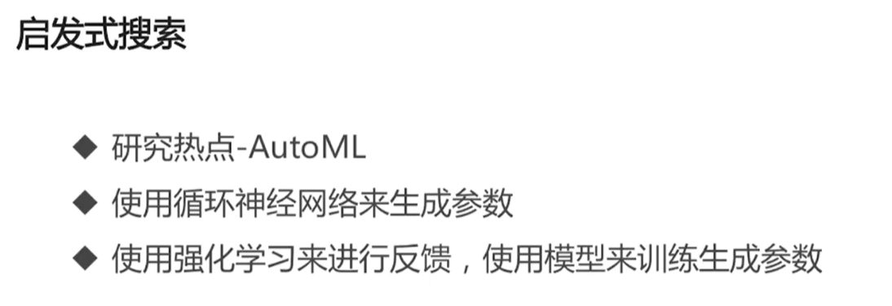
```
启发式搜索：
```


>**tf.data API**

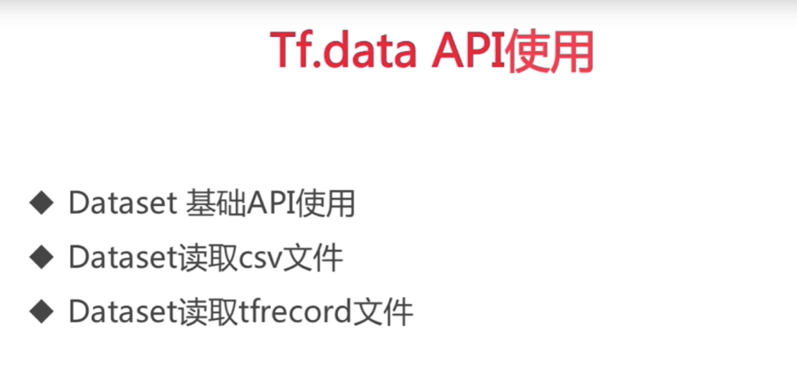

>**API 列表**

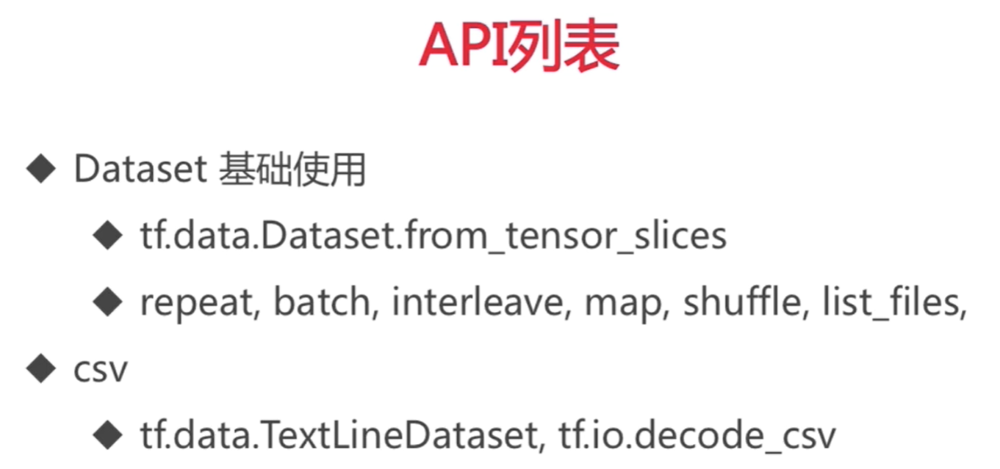
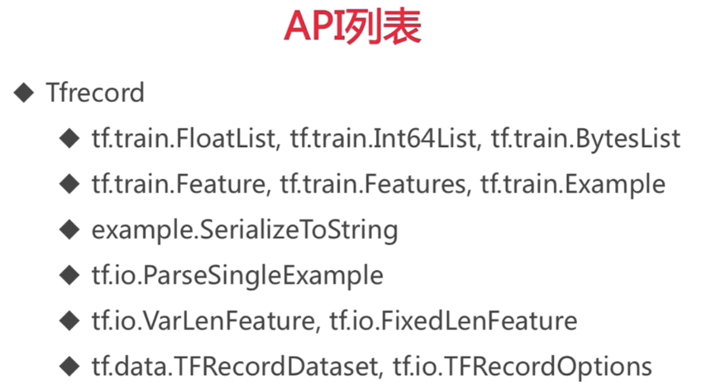

>**总结**

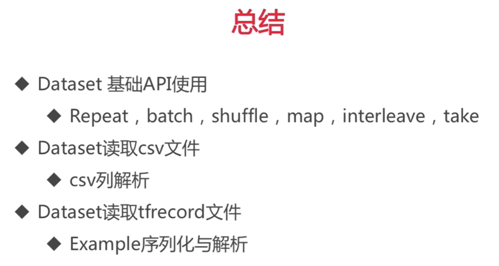