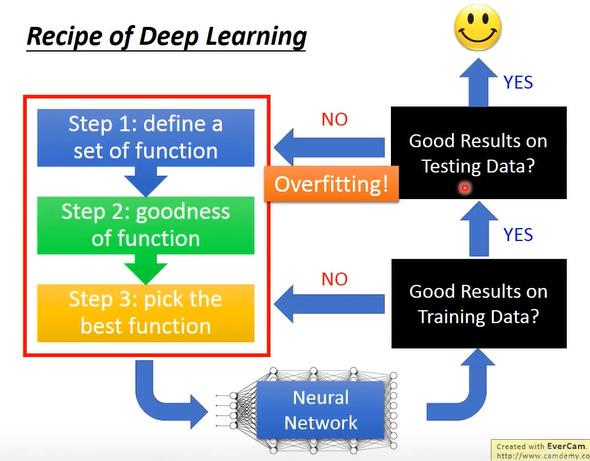
```
在 Training Data 上得到好的结果，但在 Testing Data 上没有得到好的结果，这个时候才叫做 Overfitting。
```

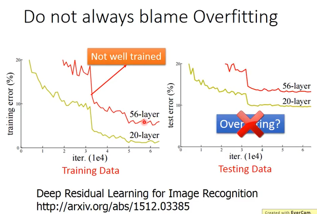
```
在得到的结果是 Overfitting 之前，先检查 Training Data 上的结果，对于 不用检查，但对于 Neural Network 是需要检查的。
```

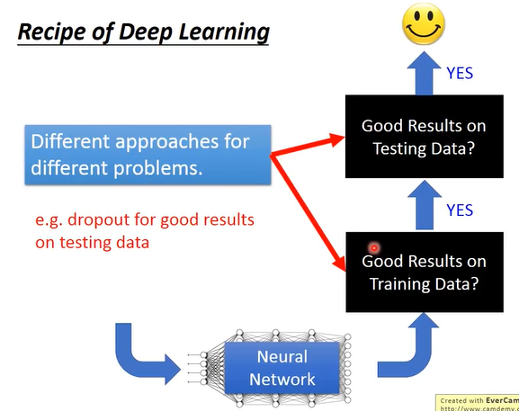
```
对于 Training Data 和 Testing Data 有不同方法来使得 Loss Function 更小。
```

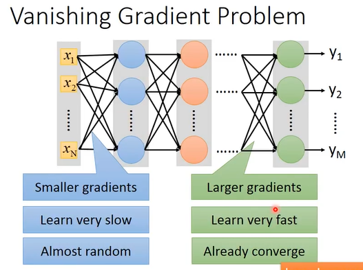
```
当把 Network 叠的很深的时候，在最靠近 input layer 的地方，参数对最后 Loss Function 的微分值会是很小的，比较靠近 Output 的地方微分值会是很大的。
当设定同样的 Learning rate 的时候，靠近 input layer 的地方，参数 update 的是很慢的，靠近 Output 的地方，参数 update 的是很快的。
靠近 input layer 的地方，参数还是 random 的时候，靠近 Output 的地方，就已经根据 random 的结果找到了一个 Local minima，然后就 converge 了。
```

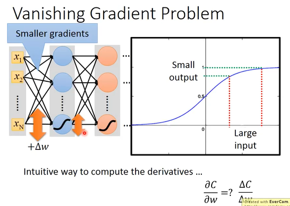
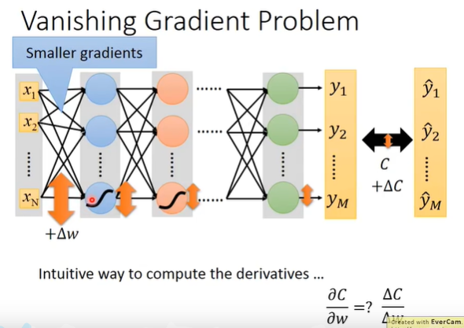
```
某一个参数 w 对 total Cross 的偏微分，意思是说，当对某一个参数 w 做一个小小的变化的时候，它对 Cross 的影响是怎么样，以此来决定说这个参数 w 它的 Gradient 的值有多大。
在第一个 layer 中的某一个参数加上 Δw，看看 Neural Network 的 Output 对 Target 的 loss 有什么样的影响。
如果加上的 Δw 很大，通过 sigmod function 的时候，这个 output 的值增大的趋势是会变小的，也就是说改变了一个参数的 weight，对某一个 neuron 的 output 的值有影响，但是影响是会衰减的，比如用的是 sigmod function，sigmod function 会把(-∞, +∞)的值硬压到(0, 1)之间。
如果有很大的 input 变化，通过 sigmod function 之后，它的 output 变化会是很小的，每通过一次 sigmod function，output 就衰减一次，所以当 network 越深，它的衰减次数就越多，直到最后它对 output 的影响是很小的，因此最后对 Cross 的影响是很小的，因此就造成靠近 input 的那些 weight，它的 gradient 的值是小的。
```

### New activation function

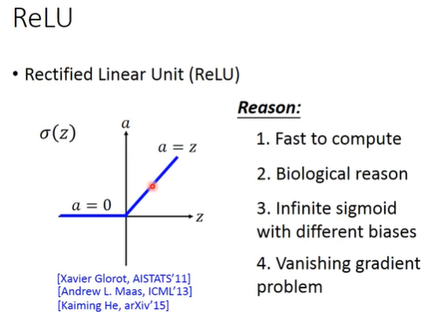
```
a: activation function 的 input
z: activation function 的 output

Reason:
	1、快，要比 sigmod 快
	2、生物上的理由
	3、无穷的 sigmod function 叠加的结果
	4、handle 梯度消失的问题
```

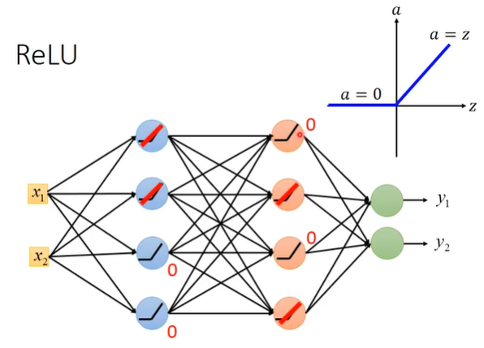

```
当input > 0 时，output = input
当input < 0 时，output = 0
activation function 作用在两个不同的 region，一个 output 是 0，另一个是  output = input，当 output = input 时，它是 linear 的。
对 output 是 0 的 neuron 来说，它对整个 network 没有一点影响，就可以把它从 network 中拿掉。
剩下的 neuron 都是 output = input 的 linear 时，整个 network 就是 A Thinner linear network。
就不会有 Vanishing Gradient Problem。
```

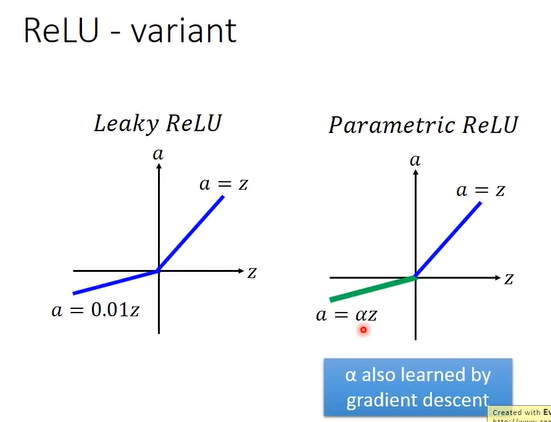
>**Leaky ReLU**

```
如果是原来的 ReLU 的时候，在 input < 0 的时候，微分值是 0，就没有办法 update 参数了，所以想在 input < 0 的时候，output 还是有一点值，a = 0.0.1z。
```

>**Parametric ReLU**

```
a = αz，α 是一个 network 参数，可以通过 Training Data 学出来。甚至每个 neuron 都可以有不同的 α 值。
```

### Maxout

```
在 Maxout 里面，让 network 自动去学它的 activation function，因为 activation function 是自动学出来的，所以 ReLU 是 Maxout 的一个 special case。也可以是其他的 activation function，用 Training Data 来决定 activation function 的样子。
```

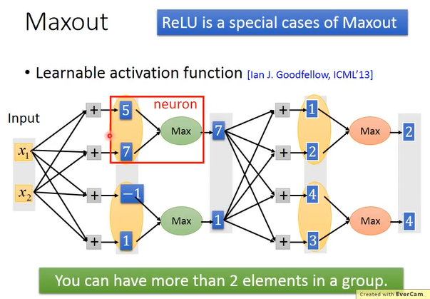
```
假设有 two dimension，分别和不同的 weight 相乘得到不同的 value，没有经过 activation function，然后将 2 个 elements 为一组（可以自定义几个 elements 为一个 group），取最大的一个值，之后以相同的方法做下去。
```

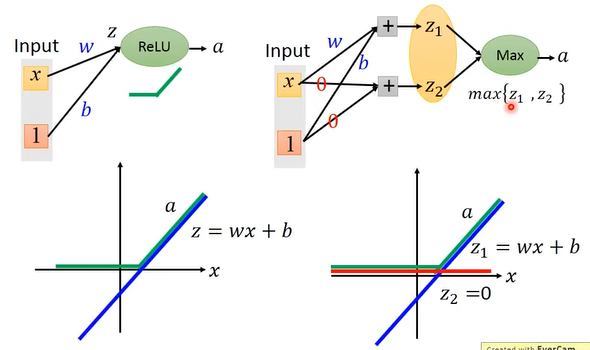
```
Maxout 可以做到 ReLU
通过上图可知，当 x 通过 z = wx + b 再经过 ReLU function 后，当 z < 0 时，a = 0，当 z > 0 时，a = z。
当 x 做 Maxout 时，得到的 value 为 z1 和 z2，然后在这两个数中取最大值。由坐标图可知，当 z1 < 0、z2 = 0 时，a = z2，当 z1 > 0，z2 = 0 时，a = z1。
```

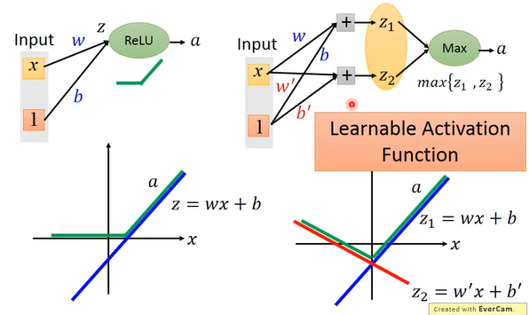
```

```

>**Piecewise linear convex function**

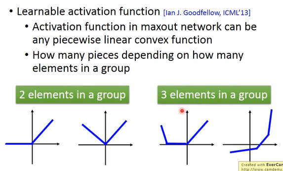

```
分段 function，根据 element 的个数不同，以此来决定 function 的 piecewise。
```

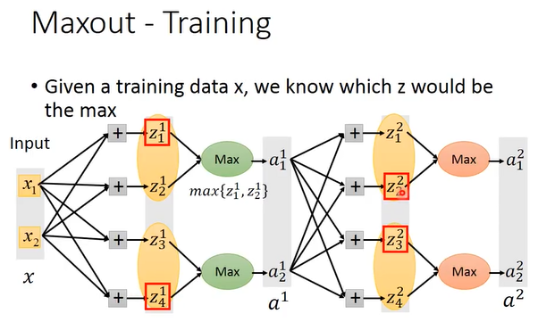
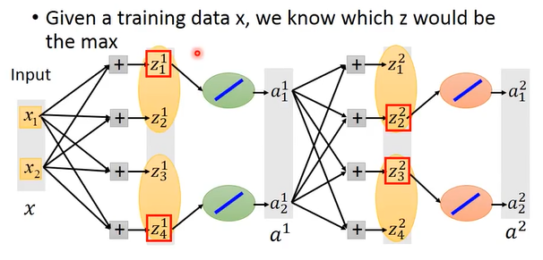
```
如何 Training？
最大的值就等于 Max Operation，Max Operation 就是 Linear Opeartion，
```

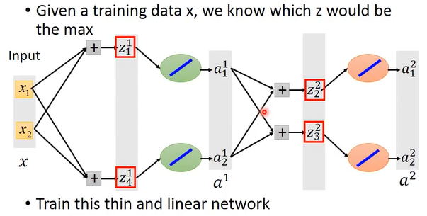
```
所以就可以把没有接到的 element 拿掉，其实当我们做 Maxout 的时候，给它一个 input 的时候，其实也是得到一个细长的 Linear network。
train 的时候就是 train 连到 network 里面的参数。
每一次都会有不同的 input，network structure 都是不一样的。因为会有很多 Training Data，最后每一个 weight 在实际上都会被 train 到。

Maxout 和 MaxPooling 是一样的做法，只是换了一个不同的说法。
```

### Adaptive Learning Rate

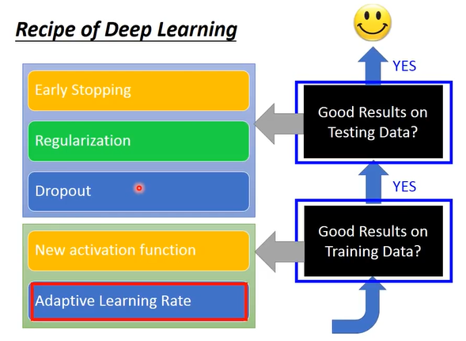

>**Adagrad**

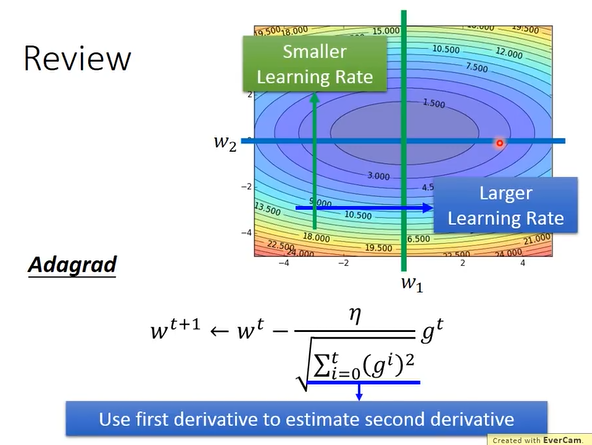

>**RMSProp**

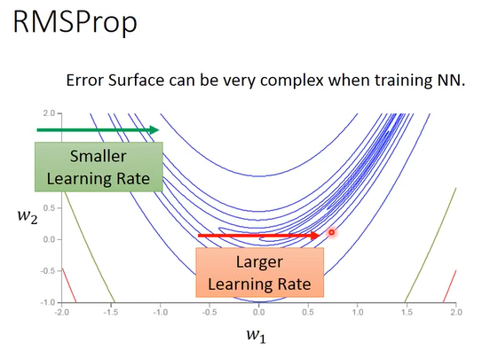
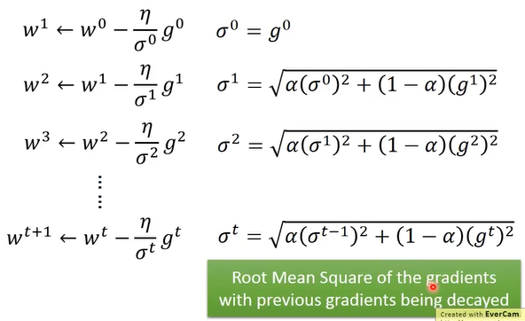
```
第一个点: σ0 = g0
第二个点: σ1 = α(σ0)^ + (1-α)(g1)^ 开根号
第三个点: σ2 = α(σ1)^ + (1-α)(g2)^ 开根号
...

学习率的大小和这个 weight 先前所有的梯度更新的比例和
```

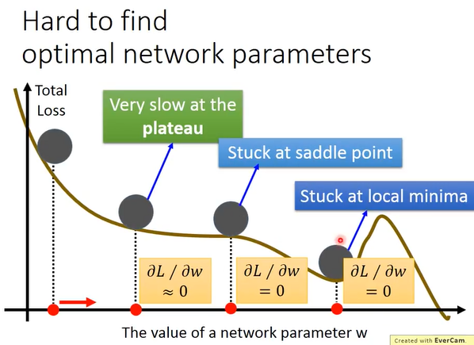
```
在做 Deep Learning 的时候，会卡在 Local Minima 的地方
不只会卡在 Local Minima，还有可能卡在 saddle point、plateau。
不用太担心这个问题。
```

### Momentum

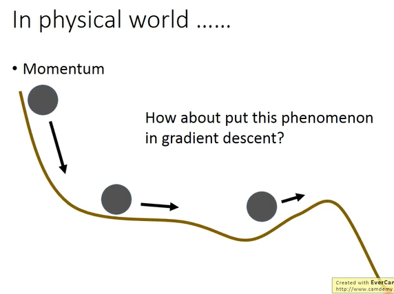
```
如果一个球从上面滚下来，如果下方的坡不太陡了话，是可以通过惯性管滚下去的。
```

>**一般的 Gradient Descent**

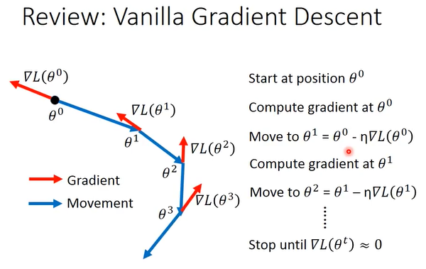
```
当 gradient 趋近于 0 的时候，停止
```

>**Momentum**

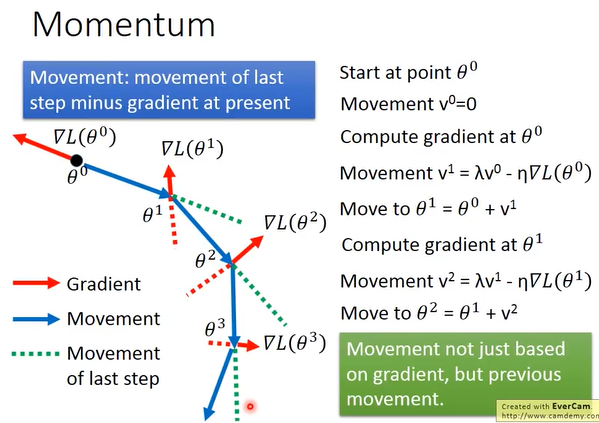
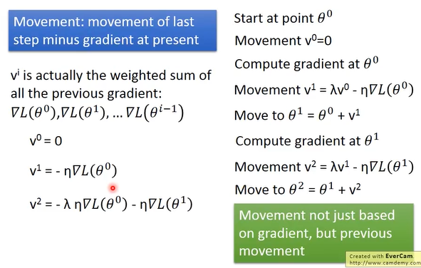
```

```

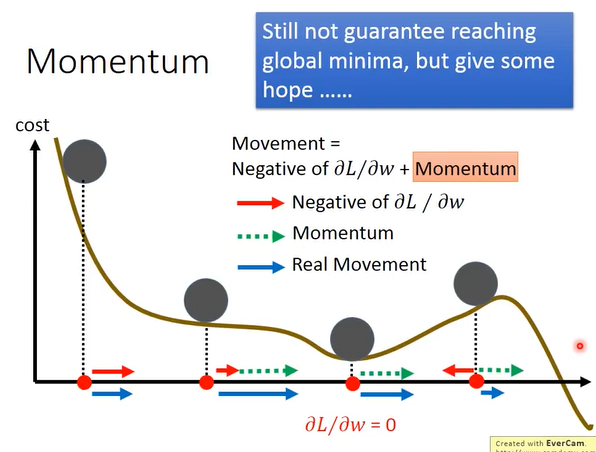
```

```

### Adam

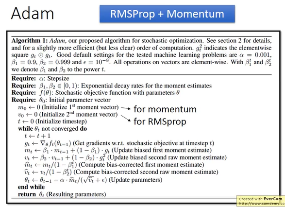

------------------------

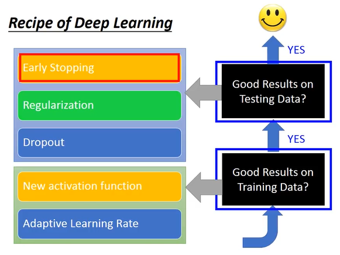
```
在 Testing Data 得到不好的结果，可以用 Early Stoping、Regulaization、Dropout。
```

### Early Stopping

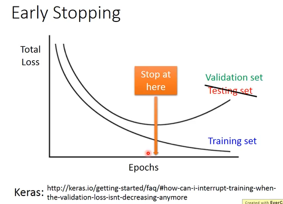
```
随着 training，如果 learning rate 调的对的话，total loss 会变小，有可能在 training set 的 loss 减小的时候，Testing set 的 loss 会增大，所以假如知道 Testing set 的 loss 的变化，应该停在是 Testing set 的 loss 的最小的地方，而不是 training set 的 loss 最小的地方。
但是我们不知道什么时候 Testing set 的 loss 的值最小，所以用 Validation set 来 varify 这个事情。
```


### Regularization

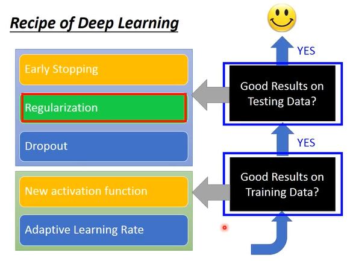

>**L2 Regularization**


```
重新定义了要去 minimized 的 loss function。
原来是 miniminze the square error or cross entropy。
在做 Regularization 的时候，加上了 Regularization term，因为现在是使用 θ 的 L2 know 做 Regularization，所以又叫做 L2 Regularization。
通常不考虑 bias 这一项，因为加 Regularization 的目的是让 function 更 smooth，而 bias 和 function 的 smooth 程度通常没有关系的。
```

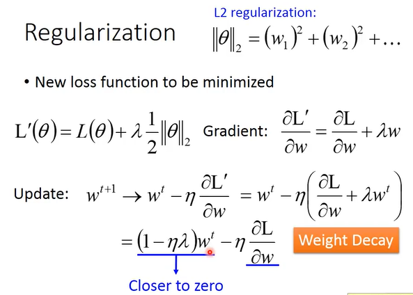
```
正则化就是更新参数的时候惩罚值比较大的 weight
```

>**L1 Regularization**

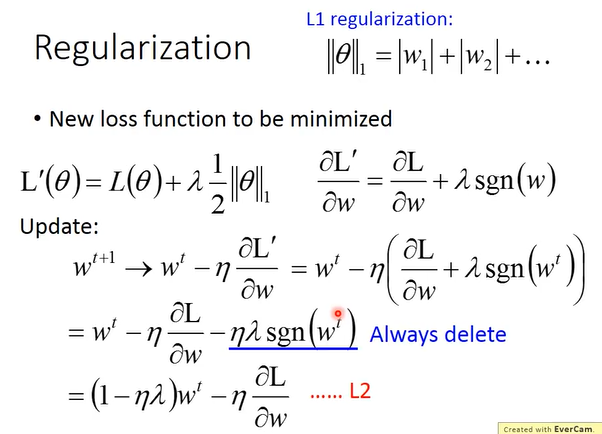
```
取绝对值，input 或者 output 就是坐标是 V 的形状，是可以微分的。
这个正则化的思路是：削弱特征特别强的权重以减少过拟合。
正则化的目的是为了减弱权重差异，来削弱某些突出特征的显著程度，进而减小模型复杂性。
```
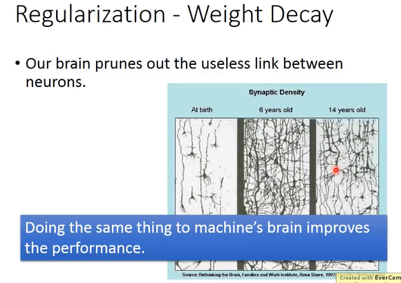

### Dropout

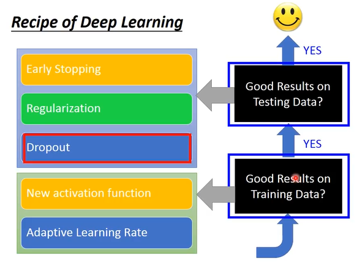

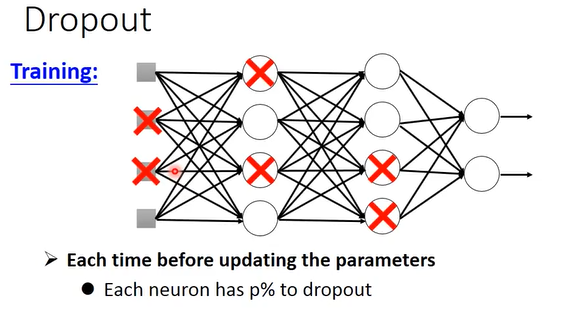
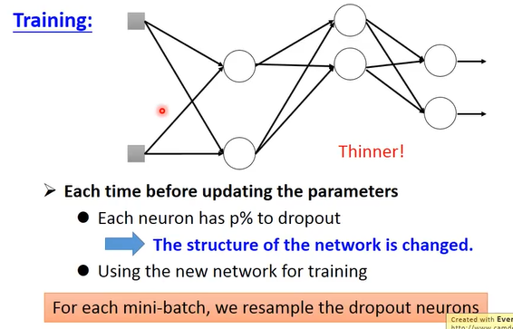
```
在 training 的时候，每一次要 update 之前，都对每一个 neuron(也包括 input layer 每一个 element)做 sampling，这个 sampling 要决定说这个 neuron 有 p% 要不要被丢掉。
这个 neuron 被丢掉了，跟它相连的 weight 也失去作用。
在 train 这个 thinner 的 network 的时候，这个 sampling 是在每一次 update 参数之前都要做一次，所以每一次 update 参数的时候，拿来 training 的 network structure 都会不一样。得到的结果就会不一样。
在 Training 的时候使用 dropout 的时候，performance 会变差的。
```


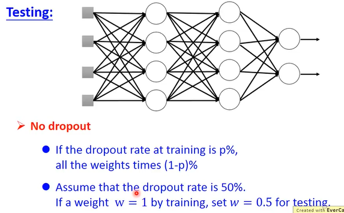
```
1、在 Testing 的时候，不做 dropout。
2、
```

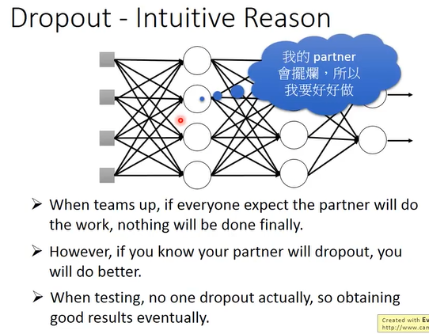
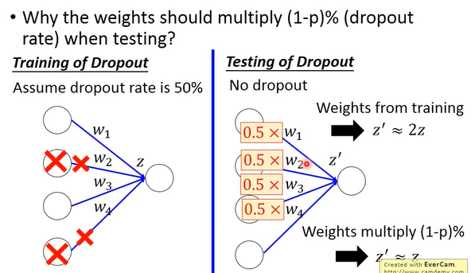
```
在 Training 的时候使用 dropout，会有一半被丢弃，所以在 Testing 的时候，需要减去一半的 percent。
```

### Ensemble

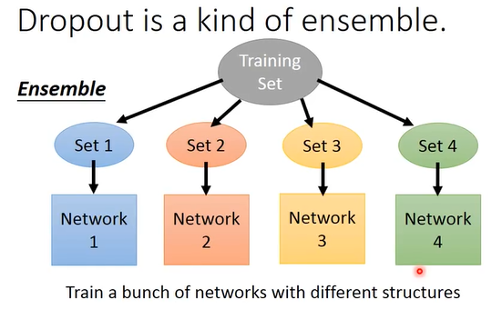
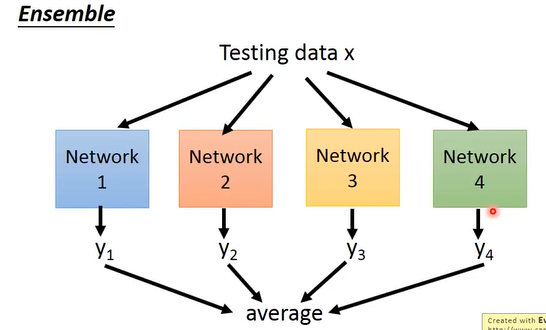

>**Training**

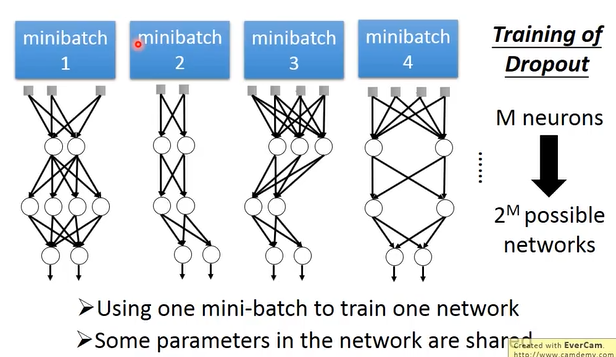

>**Testing**

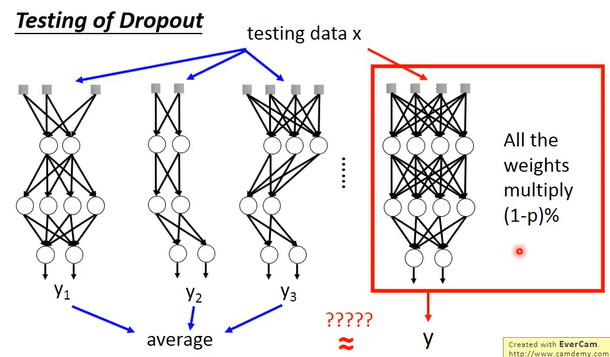

>**Example**

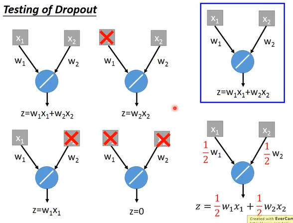