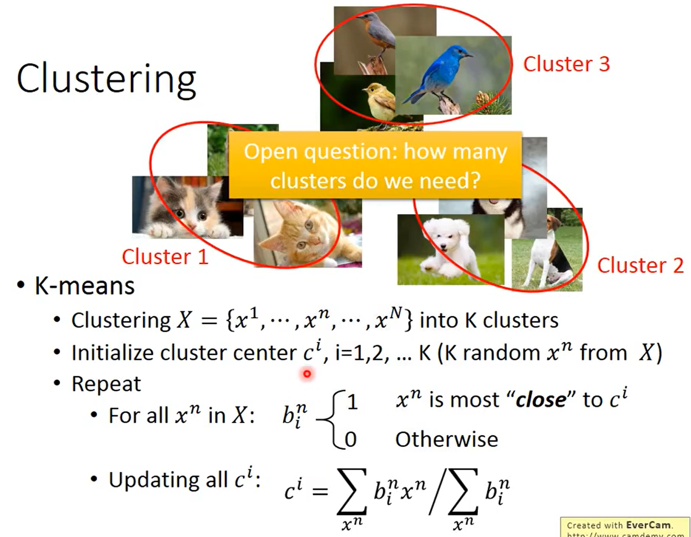
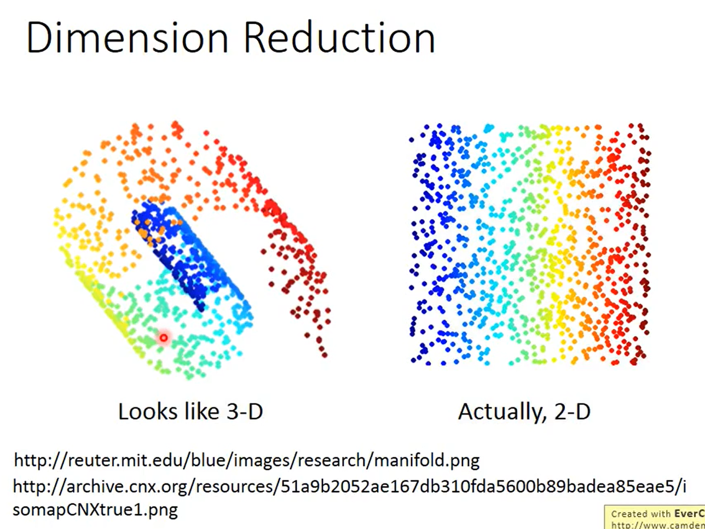

```
化繁为简：假如有很多种 input，找一个 function，把像树的 image，output 抽象的树。本来比较复杂的 input，变成简单的 output。
无中生有：找一个 function，随机给一个 input，
```

### Clustering


```
有一大堆的 image，将 image 分成一类一类的。本来有些不同的 image，都用同一个 class 来表示，做到了化繁为简。
K-means：有一大堆的 data，都是 unlabell，{x1....,xn...xN}，每一个 image x 都代表着一张 image，把它做成 K 个 clusters。
怎么做呢？
先找 cluster 的 center，假设每一个 object 都要 vector 表示。长度是一样的，有 K 个 clusters，就有 K 个 center。
初始的 cluster 从哪儿来？
从 training data 里面 random K 个 object 出来。就是 K 个 center。

对所有在 training data 里面的 x，决定说现在的每一个 object 属于 1~K 的哪一个 cluster。
```
>**Hierarchical Agglomerative Clustering(HAC)**


```
step 1: 先建一个 tree

假设现在有 5 个 example，先做一个 tree structure，把这 5 个 example 两两算相似度，然后挑最相似的 pair 出来，然后把他们 merge 起来，平均起来，得到一个新的 vector，这个 vector 同时代表第一个和第二个 example。

step 2: pick a threshold

根据切割位置不同，相似度的个数也不同。
```

### Distributed Representation


```
光只做 cluster，是非常卡的，在做 cluster 的时候，就是以偏概全，因为每一个 object 都必须要属于某一个 cluster。应该用一个 vector 表示 object。这个 vector 里每一个 dimension 就代表了某一种特质。某一种 attribute。这件事情就叫做 Distributed Representation。
如果原来的 object 是一个 high dimensional 的东西，现在用 attribute 来描述，它就从比较高维的空间变成比较低维的空间。这件事情就叫做 Dimension Reduction。
一样的事情，不一样的称呼。
```

### Dimension Reduction


```
在 2D 的空间就可以描述 3D 的 information，简化了问题。
```

```
In MNIST,a digit is 28×28 dims.
Most 28×28 dim vectors are not digits
根据角度变化知到 3 在 28x28 dims 的样子。
```

```
怎么做 Dimension Reduction？
找到一个 function，input x，output z，
The dimension of z would be smaller than x。
在 Dimension Reduction 里面的方法
方法 1：Feature selection
	把 data 的分布放在二维平面上，根据集中的 x2 的 dimension 位置。select x2，不见得总是有用。
方法 2：Principle component analysis(PCA)
	function 是一个简单的 linear function，input x 和 output z 之间的关系就是 linear transform，z = Wx，(W 是 matrix)，根据一大堆的 x 把 W 找出来。
```

### PCA


