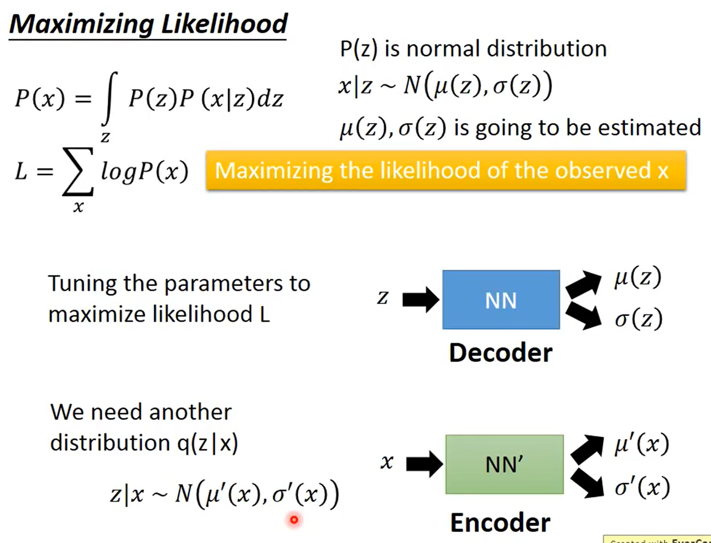

### Creation


```
pass
```

### Creation - Image Processing


```
对 machine 来说，machine 在影像处理上可以做到 classify，可以鉴别 猫和狗的不同，但或许 machine 并不真的了解猫和狗。
在未来 machine 可以画出一个猫之后，就会有不同的概念了。
```

## Generative Models


```
可以分为三个方法。
```

### PixelRNN


```
让 machine 自己画一张 3x3=9 个 pixel 的 image，怎么画呢？
假设先随机 random 给 image 涂一个红色 pixel，接下里 learn 一个 NN，input 是已经涂上红色的 pixel，它的 output 就是接下来要吐出什么颜色的 pixel。
怎么描述一个 pixel？
一个 pixel 就是 rgb 三种颜色构成的，一个 pixel 就是一个三维的 vector。
三维的 vector(红色) -> NN -> 另外的三维的 vector(蓝色)
三维的 vector(红色，蓝色) -> NN -> 另外的三维的 vector(浅蓝色)

这个一个 unsupervised 的，不需要任何的 label。
```

```
遮住班长图片，让 machine 画出。
```

```
给定前面的声音讯号，predict 下一个 sample 的结果。
硬 train 下去，就可以合出一段声音。
也可以在影像的应用，比如 input 一个 video，predict 接下来的剧情。
```

>**Example - Pokemon Creation**


```
要让 machine 看过这些小图之后，自己产生新的宝可梦出来。
```

```
一个 pixel 应该用三维的 vector，三个数字来描述它们。
```

```
每一个 row 就代表了一张 image，每一个数字就代表了一个颜色。
```

```
覆盖的面积不同，产生的结果也不同。
很难被 evaluate。
这是给了开头，让 machine 画下去。
```


```
这是什么都不给，让 machine 从头开始画下去。
每次的结果都不一样。
```

### Variational Autoencoder(VAE)


```
原来 image -> encoder -> code -> decoder -> 新的 image
希望新的 image 和 原来 image 越接近越好。
把 decoder 拿出来，给 decoder 一个 random 的 vector as code。希望 output 就是一张 image。
```

```
Auto-encoder: 这么做的话，得到的 performance 不一定很好。
VAE: 得到的结果比较好。
原来 image -> encoder -> output 两个 vector(如果 code 是三维的，output 的 vector 也是三维的 [(m1,m2,m3),(σ1,σ2,σ3)])，用 normal distribution 去 generate 一个三维的 vector(e1,e2,e3)，
接下来 ci = exp(σi) * ei + mi。
(c1,c2,c3) 才是 code。
丢到 decoder 里面，希望 decoder minimize reconstruction error。
同时 minimize ∑(1+σi - (mi)2 - exp(σi))。
```

```
VAE 的结果。
```

```

```

```
结果展示
```

>**Writing Poetry**


```
用 VAE 写诗。
sentence -> ecoder -> code -> decoder -> sentence

先 random 学两个 sentence，通过 encoder 把这两个句子在 code sapce 上面找出对应的 code。把这两个点相连，在中间等间隔的取一些点，把等间隔的取一些点丢到 decoder 里面，再还原出句子。
```

### Why VAE?


```
· Auto-encoder
满月、弦月 -> encoder -> code -> decoder -> 满月、弦月
从 满月、弦月中 sample 一个，再把这个点做 decoder，会变成什么样的 image？
Encoder、Decoder 都是 non-linear 的，很难 predict 在 满月、弦月 发生么。
· VAE
将 满月、弦月 变成 code 的时候，会在 code 上面加上 noise，希望加上 noise 之后，这个 code reconstructe 之后，还是一张 满月、弦月。

原来的 Auto-encoder 只有一个点需要被 reconstructe 回 满月、弦月 的 image。
但是对 VAE 来说，加上 noise，在这个范围之内的 code reconstructe 之后，都应该是 满月、弦月 的image。
```

```
会有在同一个点，拥有同一个 code，既希望 reconstructe 成 满月 image，又希望 reconstructe 回 弦月 image。
但只能 reconstructe 一张 image，需 VAE training 的时候 minimize mean square error。所以这个位置产生的 image 会是一张介于 满月和弦月 中间的图。
```

```
mi: 原来的 code
ci: 加上 noise 之后的 code
σi: 代表了 noise 的 variance，代表了 noise 要有多大，因为 variance 是正的，会取一个 expectation，因为 NN 的 output(如果没有用 activation function 控制) 可正可负。取 expectation，确保它一定是正的。可以被当作 variance 看待。
ei: 从 normal distribution sample 出来的值。variance 固定。
ci = exp(σi) * ei + mi 就等于把原来 code 加上了 noise。乘上了不同的 σ 以后，variance 大小就有所改变，所以 variance 决定了 noise 的大小。
这个 variance 是从 encoder 中产生的，machine 在 training 的时候会自动 learn 这个 variance 应该有多大。
```

```
这样是不够的，因为 variance 是 machine learn 出来的，如果 variance=0，VAE 就是 Auto-encoder。
需要在 variance 做一些限制，让 variance 不可以太小。
minimize ∑(exp(σi) - (1+σi) + (mi)2) 就是对 variance 做的限制。
exp(σi): 画在图上是蓝色的线
(1+σi): 画在图上是红色的线
蓝线 - 红线 = 绿线，绿线的最低点是落在 σ=0 的地方，σ=0，exp(σ) = 1，意味着 variance=1，σ=0 的时候，loss 最低，意味着说 variance=1 的时候，loss 最低。
(mi)2: 加上的 L2 regularization，这样比较不会 overfiting。 
```

```
paper 上比较常见的说法。
假设要让 machine 做到事情是 generate 宝可梦 image，每一张宝可梦的 image 都可以想像成高维空间中的一个点，现在要做的事情就是 estimate 高维空间的几率分布 P(x) (x 是一个 vector)，假设可以 estimate P(x) 的样子，就可以根据 P(x) 去 sample 出一张图，找出来的图就会是宝可梦的样子。
```

>**Gaussian Mixture Model**


```
怎么 estimate the probability distribution？
是很多个 Gaussian 用不同的 weight 叠合起来的结果。
如果从 P(x) sample 出一个东西，先决定从哪一个 Gaussian sample。
假设有一堆 Gaussian，每个 Gaussian 都有自己的 weight，接下来根据每一个 Gaussian 的 weight 去决定从哪一个 Gaussian sample data。然后再从选择的 Gaussian sample data。
假设有一个 multinomial distribution，从 multinomial distribution 决定从哪一个 Gaussian sample data，每一个 Gaussian 有自己的 (μm, ∑m)，有了 m 以后，就可以根据 (μm, ∑m) 就可以 sample x 出来。

P(x) = ∑P(m)P(x|m): summation over all Gaussian
P(m): weight
P(x|m): 有了那个 Gaussian 以后，从哪个 Gaussian sample 出 x 的几率。

现在每一个 x 都是从 mixture sample 出来的，就像个在做 classification 一样，每一个 x 都是来自于某一个分类。
把 data 做 classification 这是不够的，更好的表示方式是用 distribution representation，每一个 x 并不属于某一个 class、cluster，而是由一个 vector 来描述它的各个不同的面相 attribute。
```

>**VAE**


```
VAE 就是 Gaussian Mixture Model 的 distribution representation 版本。
首先从 normal distribution sample 出一个 vector z，z 的每一个 dimension 就代表了某种 attribute，代表要 sample 那个东西的某种特质。
假设 z 是一个一维 Gaussian，根据 z 可决定(μ, ∑)，可以决定 Gaussian 的 mean 和 variance。

在 Gaussian Mixture Model 里面，假设有 10 个 mixture，就有 10 个 mean 和 variance。在这里 z 有无穷多个可能，mean 和 variance 也有无穷多个可能。
怎么根据给一个 z，找到 mean 和 variance 呢？
假设 mean 和 variance 都是来自于一个 function，
μ(z): attribute 是 z 的时候，在 x space 的上面 mean 是多少 
σ(z): 从 latent space 上面得到 attribute 是 z 的时候，在 x space 的上面 variance 是多少 。

在 z 这个 space 上面，每一个点都有可能被 sample 到，最中间的点被 sample 的几率比较大。当在 z space 上面 sample 出一个 point 以后，那个 point 会对应一个 Gaussian。至于某一个点对应什么样的 Gaussian(mean 和 variance 是多少)，是由某一个 function 决定的。
当 Gaussian 是从 normal distribution 所产生的，等于有 Infinite Gaussian。
怎么知道每一个 z 应该对应什么样的 mean 和 variance 呢？function 怎么找？
NN 就是一个 function，可以 learn 一个 NN
z -> NN -> (μ(z),σ(z))
```

>**Maximizing Likelihood**


```
怎么知道每一个 z 应该对应什么样的 mean 和 variance 呢？function 怎么找？
L = ∑logP(x)
现在已有一笔 data，找到一个 μ(z),σ(z) 的 function 可以现在已经观察到的 data x(image) 的 L = ∑logP(x) 是可以 maximize 的。
要做的事是调 NN 里面的参数，调每一个 neuron 的 weight 和 bias，使得这个 Likelihood 可以被 maximize。
q(x|z)：Given x 决定在 z space 上面的 mean 和 variance。
```


>**Connection with Network**


### Problems of VAE


```
VAE 无法产生新的 image，
```

## GAN


### The evolution of generation


```
首先有第一代的 generator，是 random 的，generate digit
第一代的 discriminator，根据 real images 跟 generator 产生的 images 去调整里面的参数，去鉴别一张 image 是 real image 还是 generate 产生的 image。
第二代
带三代
...
generator 从来没有看过 real images，generator 可以产生出来那些 images 是 database 里面从来都没有的。
```

### GAN - Discriminator


```
Discriminator 是一个 NN，input 是一个 image，output 是一个 scalar。
Generator 相当于 VAE 的 Decoder，也是一个 NN，input 是从某个 distribution sample 出来的 vector，output 就是一个 image。不同的 vector，产生不同的 image。
Discriminator 给 real image 高分，给 Generator output image 低分。
```
### GAN - Generator


```
调 Generator 的参数，让 Discriminator 会认为说 Generator generate 出来的 image 是真的。
fix 住 Discriminator 的参数，只调 Generator 的参数。
```

### GAN - Toy Example


