### Maniford Learning

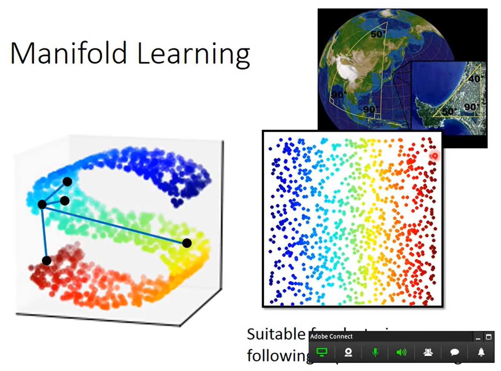
```
非线性的降维
data point 可能是在高维空间里面的 manifold。
Maniford Learning 要做的事情是把 S 形的曲面展开。
把塞在高位空间中的低维空间摊平，摊平的好处是，现在把低维空间摊平以后，然后做降维，就可以在 manifold 上面用 equipment distance 来计算点跟点之间的距离。对 supervised learning 有帮助。
```

#### Locally Linear Embedding(LLE)

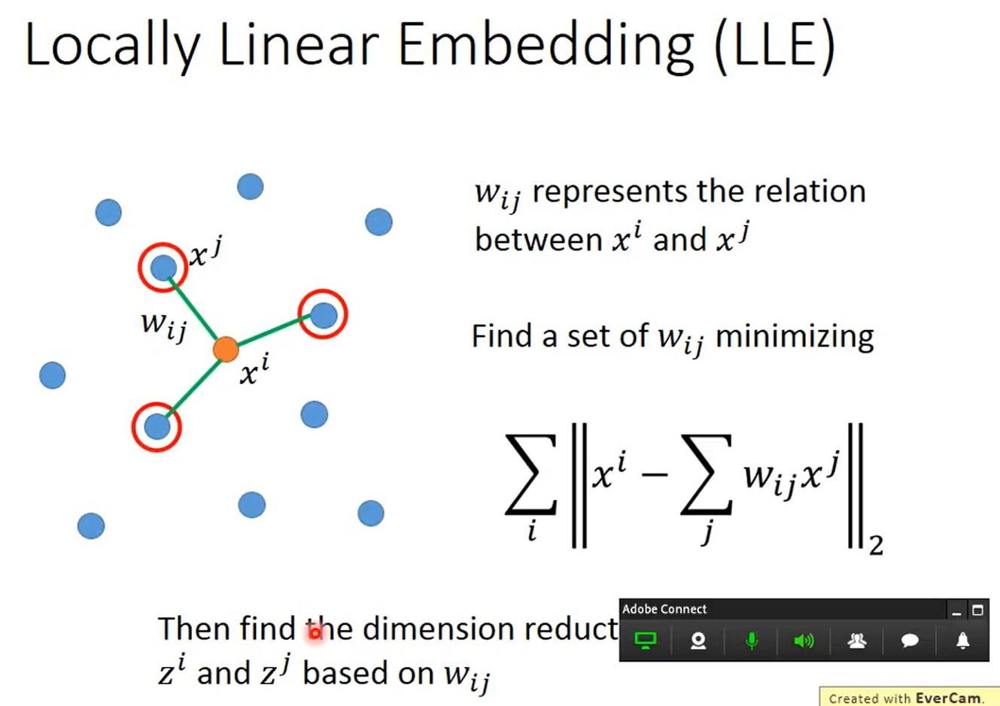
```
在原来的空间里面，点的分布如图所示，某一个点是 xi，先选出 xi 的neighbor xj，接下来找 xi 和 xj 的关系，写作 wij。
wij 是怎么找出来的呢？
假设说每一个 xi 都可以用它的 neighbor 做 linear convolution 以后组合而成。wij 就是 xj 组合 xi 的时候的  linear convolution 的 weight。
找一组 wij，这组 wij 对 xi 所有 neighbor xj 做 weight-sun 的时候，跟 xi 越接近越好。
然后就做 dimension reduction。把原来所有的 xi 和 xj 转成 zi 和 zj。中间的关系 wij 是不变的。
```
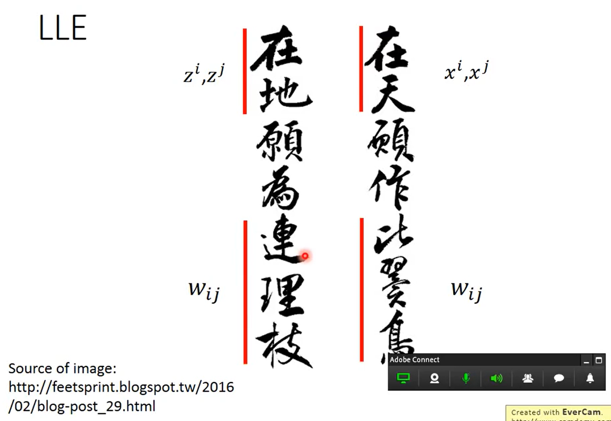
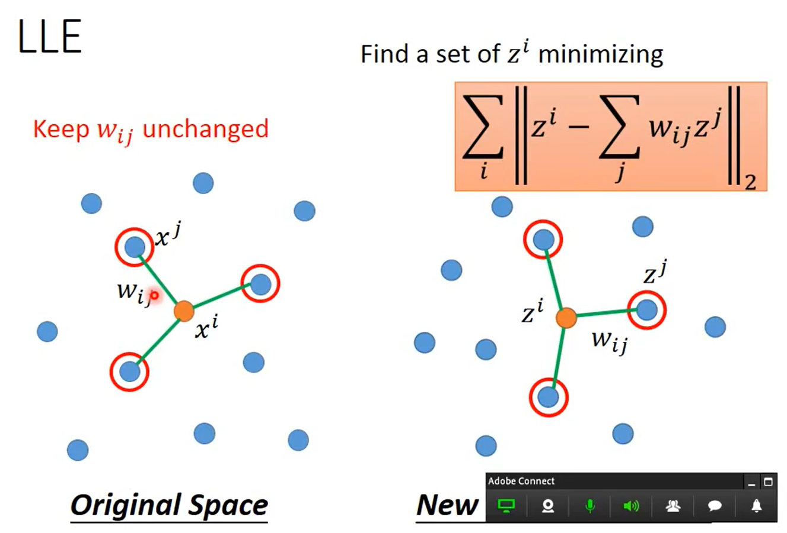
```
wij 在原来的 space 上面找完之后就不再改变了。
接下来为每一个 xi,xj 找另外一个 vector，因为要做 dimension reduction，新的 vector 要比原来的 dimension 还要小。
zi,zj 是另外的 vector。
wij 是已知的，找一组 z，让 zj 透过 wij 做 weight-sun 以后，可以和 zi 越接近越好。
```
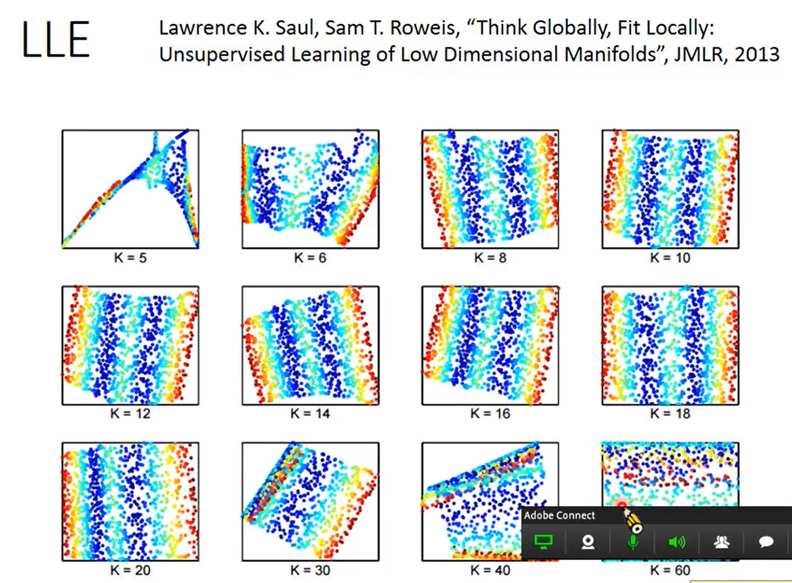
```
K 太小，结果不太好
K 太大，结果不太好
```

#### Laplacian Eigenmaps

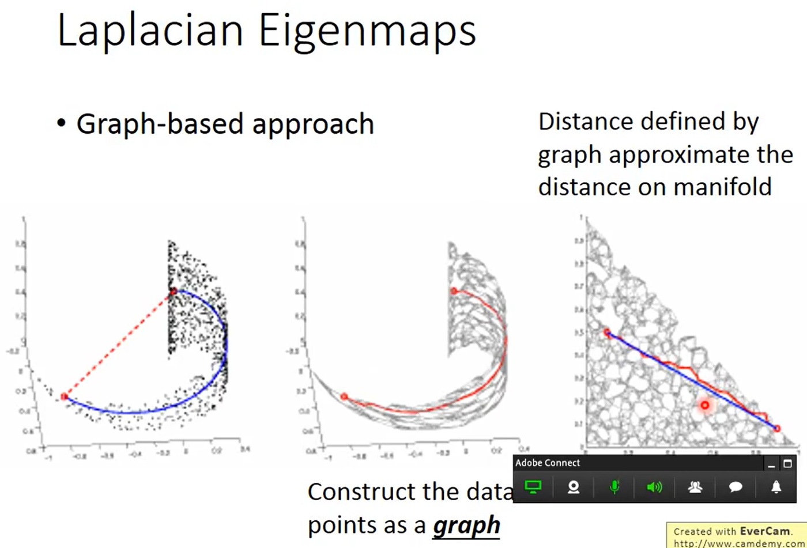
```
想要比较两个点的距离，算之间的 equipment distance 是不够的，要看的是在这个 high density region 之间的 distance。如果两个点之间有 high density 的 collection，那才是真正的接近。可以用 graph 描述这个事情。
可以把 data point construct 一个 graph，计算 data point 两两之间的相似度。
```
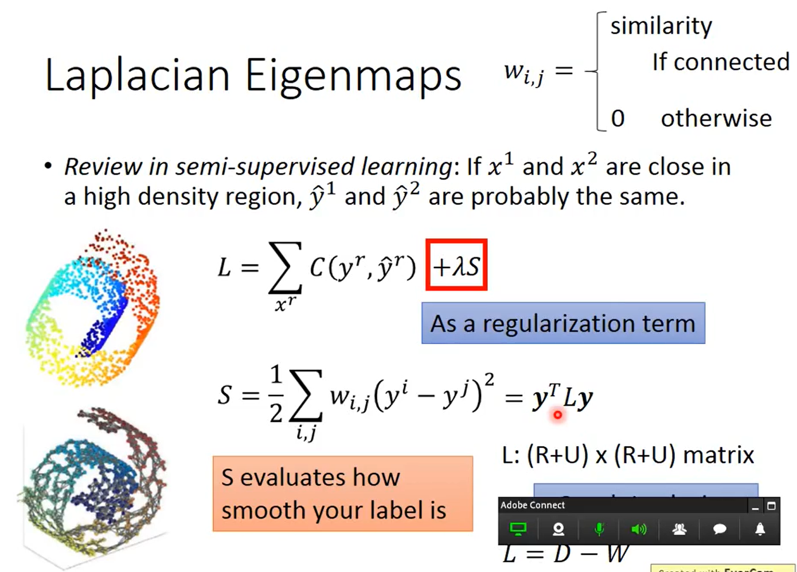
```
wij：两个 dat point xi,xj 在图上是相连的，那 wij 就是 xi,xj 的相似程度，如果不相连，wij = 0。
```
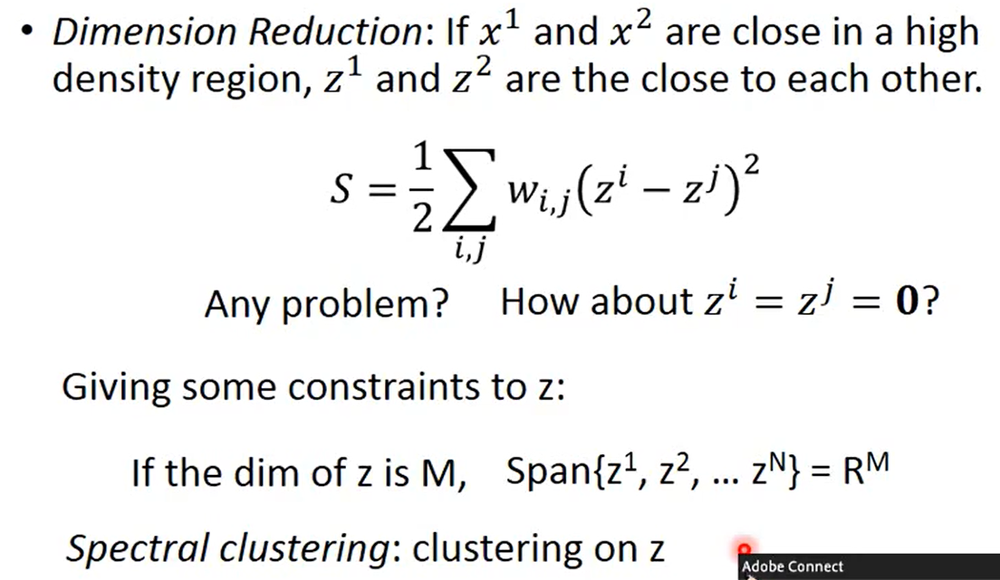
```
可以 apply 在 unsupervised task 上面。
```
### T-distributed Stochastic Neighbor Embedding(t-SNE)

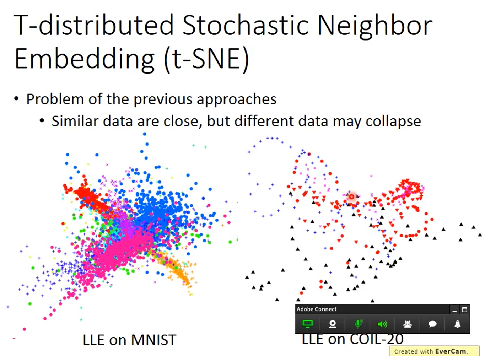
```
前面的问题是假设相近的点应该要是接近的，但没有假设说不相近的点没有要接近。没有假设说不相近的点要分开。
```
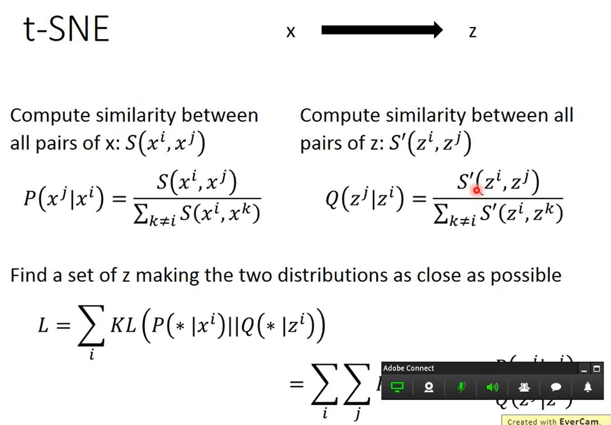
```
把原来 data point x 变成 low dimension vector z。
在原来的 x space 上面，会计算所有的点的 pair (xi,xj) 之间的 similarity，写成 S(xi,xj)。接下来会做 normalization。
会计算一个 P(xj|xi)，分子是 S(xi,xj)，分母是 summation 所有的除 xi 以外所有其他的点的 S(xi,xk)。
假设已经找到了 low dimension representation z。把 x 变成 z 的话，也可以计算 (zi,zj) 的 similarity。
做 normalization 是有必要的，因为不知道在高维空间中算出来的距离 S(xi.xj) 和 S'(zi,zj) 的 skill 是不是一样。如果有做 normalization，最后就可以把 P(xj|xi) 和 Q(zj|zi) 变成几率，这个时候它们的值就会介于(0,1)之间，skill 就会一样。

接下来要做的事情就是现在还不知道 (zi,zj) 的值是多少，希望找一组 (zi,zj)，可以让 distribution P(xj|xi) 和 Q(zj|zi) 越接近越好。
怎么衡量两个 distribution 的 similarity 呢？
KL divergence。
要做的事情就是找一组 z，它可以做到 xi 对其他 point 的 distribution 和 zi 对其他 point 的 distribution 之间的 KL divergence 越小越好。
```

#### t-SNE — Similarity Measure

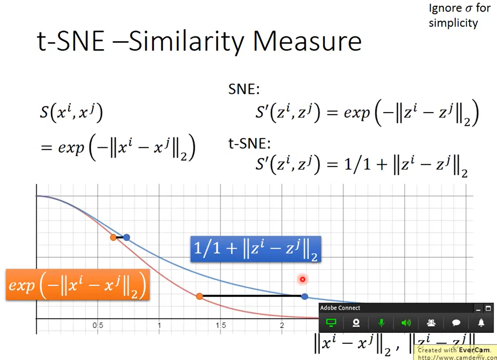
```
在原来的 data point 上面，similarity 的选择是 exp(-||xi - xj||2)，evaluate similarity 的方式是计算 xi,xj 的 equipment distance，取负号，在取 expectation，因为它可以确保说非常相近的点，只要距离一拉开，similarity 就会变的很小。
在 t-SNE 之前，有一个 function 叫做 SNE。
在 data point 里面 space 上面 evaluatation 的 manager，在新的 space 上面用同样的 manager 就可以了。
t-SNE 在 dimension reduction 以后的 space，选的 manager 是不一样的。

假设橙色线上的点是原来的点，做 dimension reduction 以后，要怎么维持原来的 space 呢？
变成在同水平的蓝色线上的两个点。
如果要维持原来的几率的话，就把它们变成图片所示。
如果本来距离比较近，它们的影响是比较小的，如果本来就有一段距离，从原来的 distribution 变成 t distribution 以后，会被拉的很远。
```
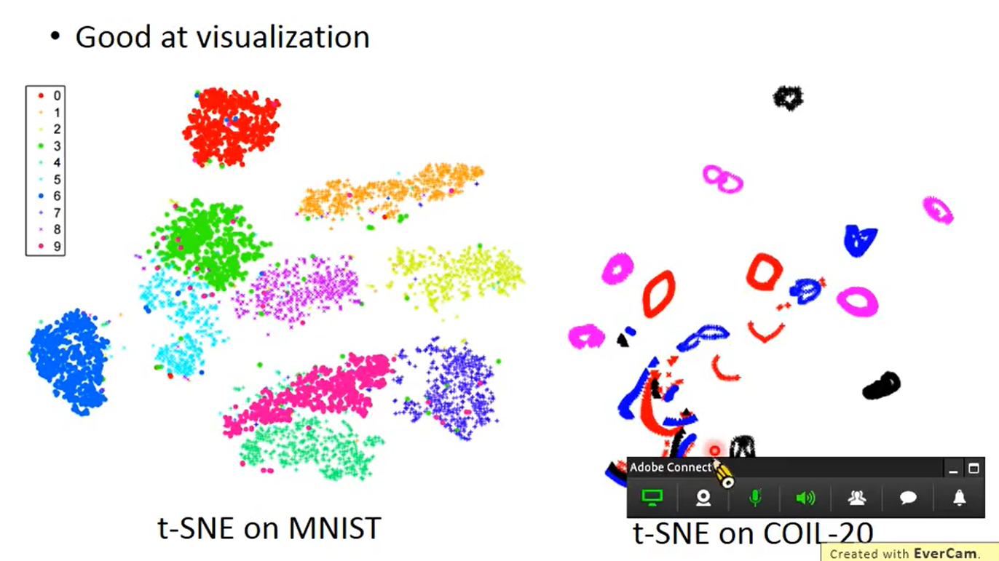
```
会把 data point 聚集成一群一群的，如果 data point 本来只要有一个 gap，做完 t-SNE 以后，就会把那个 gap 强化，gap 就会变的特别明显。 
```