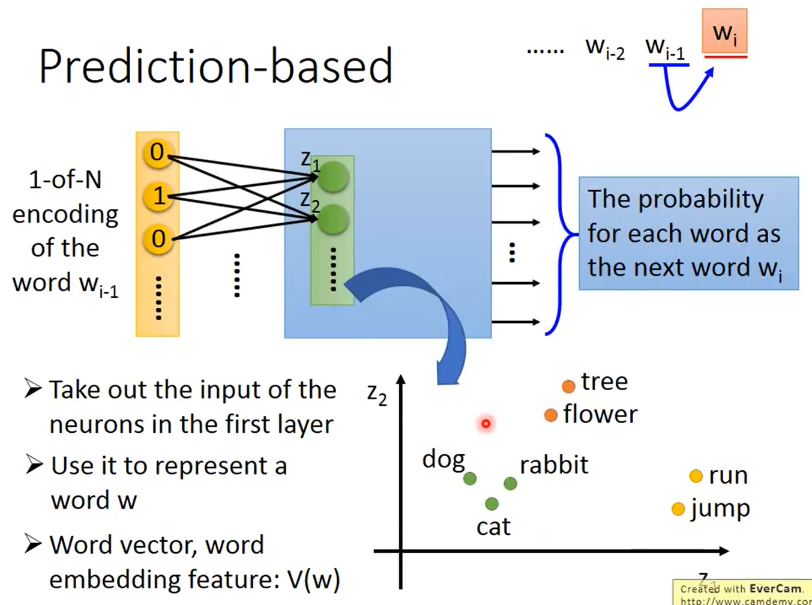
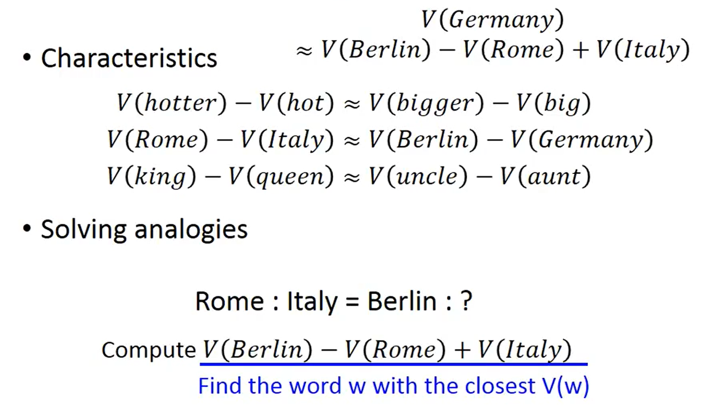
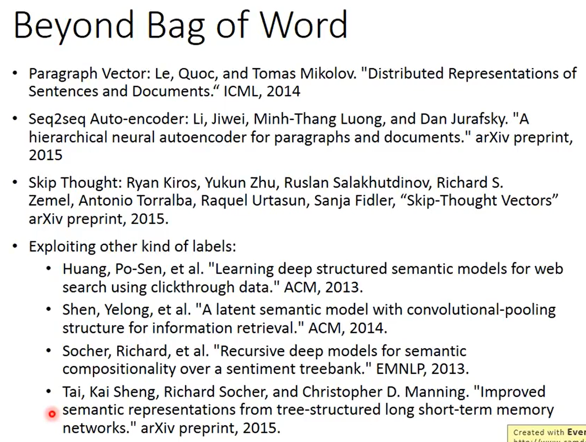

```
Word Embedding 是 Dimension Reduction 中的非常好的应用
```

```
1-of-N Encoding 是最 difficult 的做法表示一个 word。
这个 vector 的 dimension 就是 word 可能有的数目。
建一个 word class，把不同的 words 有同样的性质的 words class 成一群一群的。然后就用那个 class 所属的 word 表示这个 words。
需要一个 word embedding，把每一个 word 都 project 到 high dimensional  space 上面，
```

### Word Embedding


```
怎么做 Word Embedding 呢？
Word Embedding 是 unsupervised problem。
怎么让 machine 知道每一个词汇的含义呢？
让 machine 阅读大量的文章。
```

```
learn 一个 NN，找一个 function，input 一个词汇(比如：apple)，output 是那个词汇对应的 word embedding。
现在只有 input，没有 output，不知道 word embedding 的样子。只有单向。
不能用 auto-encoder。
```

```
根据 context (上下文)。
```

#### How to exploit the context?


```
有两个方法
· Count based
如果有两个词汇 Wi,Wj 常常在同一篇文章内出现，它们的 word vector 用 V(Wi),V(Wj) 表示，如果 Wi,Wj 常常一起出现的话，V(Wi),V(Wj) 会比较接近。
假设已知 V(Wi),V(Wj)，计算 V(Wi),V(Wj) 的 inner product。
假设 Nij 是 Wi,Wj 在 same document 出现的次数。
V(Wi),V(Wj) 和 Nij 越接近越好。
```

#### Prediction based


```
learn 一个 NN，做的事情是 prediction
假设有一个 sentence，Given 前一个 word，predict 下一个可能出现的 word。
input 是 1-of-N Encoding 的 vector，output 是下一个 word wi 是某一个 word 的几率。
把第一个 hidden layer 的 input z 拿出来，input 不同的 1-of-N Encoding，z 就会不一样。z 来代表词汇。
```

```
这两个不同的词汇必须把它们 project 到(必须要通过参数 weight 转换以后)同样的空间，这样在 output 的时候才可能有同样的几率。
所以当 learn 一个 prediction model 的时候，考虑 word 的 context 这件事情，就自动的被考虑在 prediction model 里面，所以把 prediction model 的 hidden layer 拿出来，就可以得到我们想要找的这种 word embedding 的特性。
```

#### Prediction-based — Sharing Paramters


```
如果只用 wi-1 去 predict wi，有点弱，比较难。
可以拓展这个问题，可以拓展 N 个词汇在 predict 之前。
wi-1 和 wi 的第一个 dimension 和 第一个 hidden layer 的 neuron 使用的 weight 是同样的。为什么这样做呢？
1、如果不这么做，如果把同一个 word 放在不同的位置，通过 transform 之后，得到的 embedding 就会不一样。
2、减少了参数的使用量。
```

```
用 formulation 表示
xi-1 和 x-2 的 length 都是 |V|
z 的 length 是 |Z|
z = W1*xi-2 + W2*xi-1
W1 和 W2 的 weight matrix 都是 |Z|*|V| 的
强制让 W1 = W1 = W，等于一摸一样的 matrix。
要得到一个 word vector 的时候，就把一个 1-of-N Encoding 乘以 W，就可以的那个 word 的 word embedding。
```

```
怎么让 weight 的参数一样呢？
需要 Given wi and wj the same initialization，一样的初始值。
做偏微分，减去同样的 wi 和 wj 的偏微分
```

#### Prediction-based — Training


```
这个 NN training 完全是 unsupervised，collect 一堆文字 data。
希望 output 跟 '就' 的 1-of-N Encoding 的 cross-entropy 越小越好。
```

#### Prediction-based — Various Architectures


```
· Continuous bag of word(CBOW) model
拿 wi-1 和 wi+1 来 predict wi。
· Skip-gram
拿 wi 来 predict wi-1 和 wi+1。
这个 NN 不是 Deep 的，其实是一个 linear hidden layer。
```

```
word vector 有一些有趣的特性，如果把同样类型的 word vector 摆在一起，会有种固定的关系。
```

```
如果某一个东西属于另外一个东西的话，把它们的 word vector 相减，它们的结果会是很类似的。
```

```
用 word vector 可以做一些简单的推论
· Characteristics
· Solving analogies
```
#### Multi-lingual Embedding


```
可以把不同语言的 word vector 拉在一起。
```

>**Multi-domain Embedding**


```
可以对 image 做 embedding，先找到了一组 word vector，接下来 learn 一个 model，input 一张 image，output 是跟 word vector 一样 dimension 的 vector。
```

#### Document Embedding


>**Semantic Embedding**


```
怎么把 document 变成一个 vector？
把一个 document 变成 Bag-of-word，用 auto-encoding learn 出这个 document 的 Semantic Embedding。
只用 Bag-of-word 描述一篇 document 是不够的。
```

>**Beyond Bag of Word**


```
只用 Bag-of-word 描述一篇 document 是不够的。
因为词汇的顺序代表了很重要的含义。

1.white blood cells destroying an infection
2.an infection destroying white blood cells
它们的 Bag-of-word 是一样的，但顺序不一样，语义就不一样了。
```
