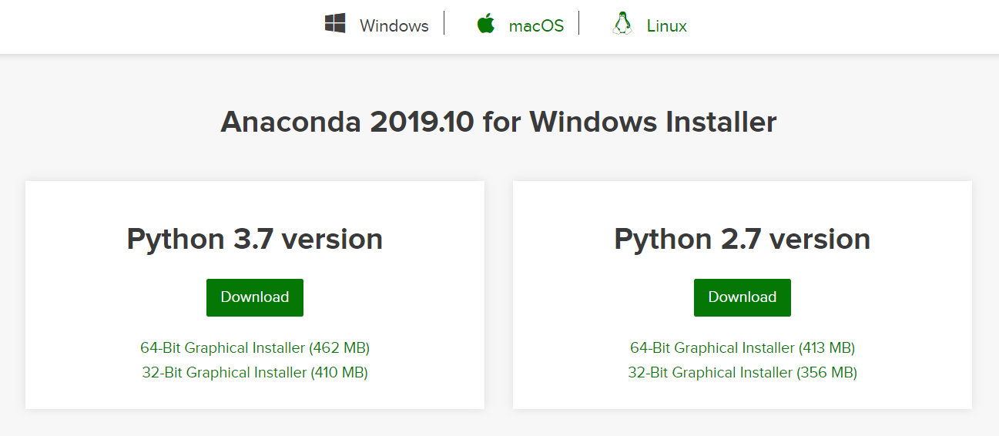
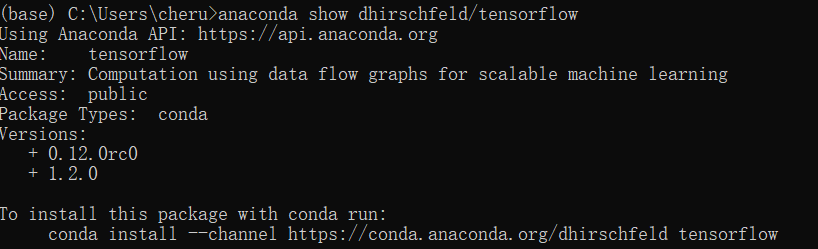
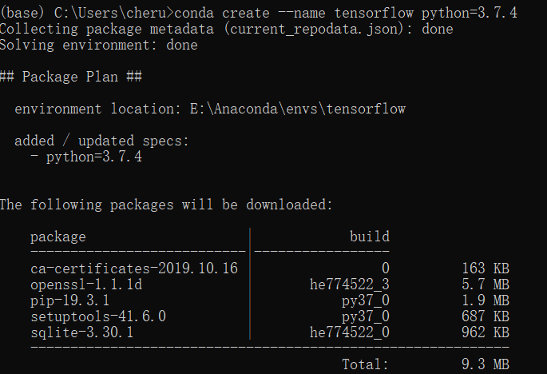
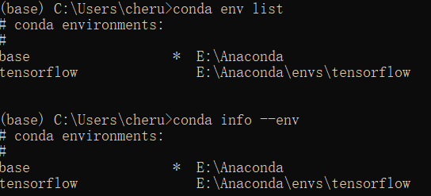
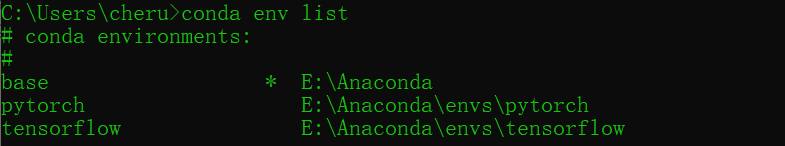
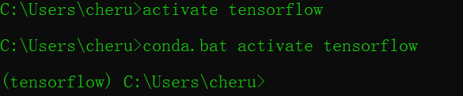
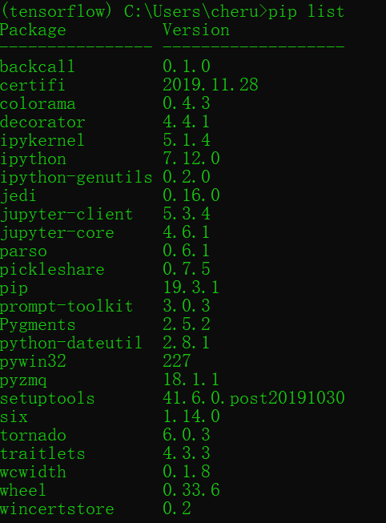
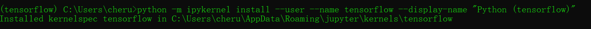
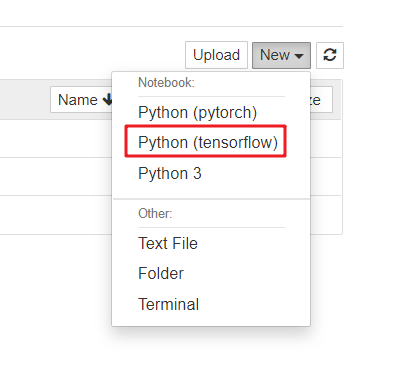

### 一、Anaconda 下载
[**anacoda 官方下载**](https://www.anaconda.com/distribution/#download-section)


### 二、命令

>**conda list**
>查看已经安装的第三方依赖

>**anaconda search -t conda tensorflow**
>查看需要安装的版本

>**anaconda show dhirschfeld/tensorflow**
>让anaconda告诉我们我们想要安装的通过什么样的命令安装



>**conda install --channel https://conda.anaconda.org/dhirschfeld tensorflow**
>通过这条命令安装我们所需要的

>**conda create --name tensorflow python=3.7.4**
>创建 python 虚拟环境
>conda create --name env_name python=edition



>**conda env list**
>**conda info --env**
>查看当前存在哪些 python 虚拟环境



>**activate tensorflow**
>激活(或activate切换不同python版本)的虚拟环境。
>activate env_name

>**conda remove --name base  tesorflow**
>conda remove --name env_name  package_name
>删除环境中的某个包

-------------------
-------------------

### 三、添加环境到 jupyter 中

```
1、查看下虚拟环境	-	conda env list
2、激活你要添加的环境	-	activate tensorflow
3、安装 ipykernel	-	conda install ipykernel
4、将环境写入notebook的kernel中	-	
python -m ipykernel install --user --name tensorflow --display-name "Python (tensorflow)"
5、打开 jupyter
```

>**查看下虚拟环境**



>**激活你要添加的环境**



>**安装 ipykernel**



>**将环境写入 notebook 的 kernel 中**



>**打开 jupyter**

